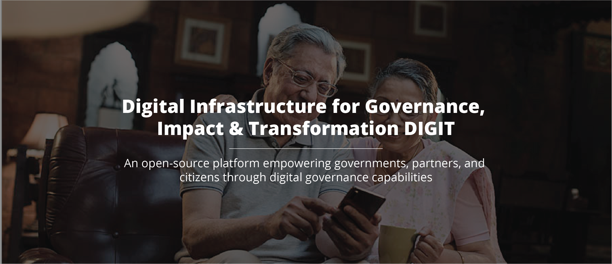
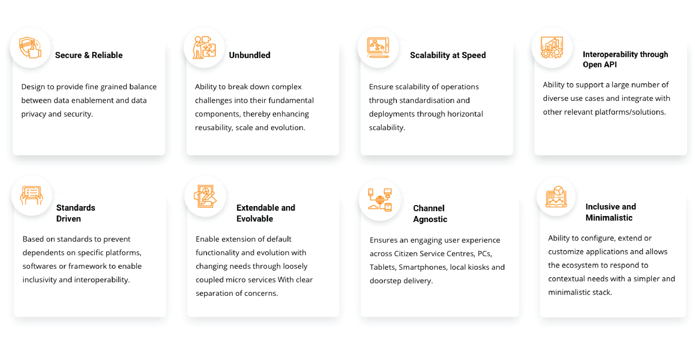
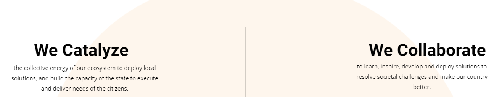

# DIGIT

DIGIT Urban Stack is a set of Open APIs, services, and reference implementations, setup as a public good, to allow government entities, businesses, startups, and civil society to use a unique digital Infrastructure and build solutions for urban India at a large scale. It provides a set of open standards, specifications and documentation to create a level playing field and enable ecosystem players to innovate on the stack. As a public good, the platform is provided without profit or restriction to all members of society.

* **Open Source** - DIGIT is Open Source and has been built using the best in class Open Source technology stacks powering the most advanced companies in the world. DIGIT is able to provide the lowest total cost of ownership and helps ensure that governments retain strategic control of their systems and data. 
* **Mobile-Enabled** - DIGIT has adopted a mobile-first approach, with robust mobile applications enabling citizens to easily access government services through their phones. Government officials and field workers are also empowered with mobile applications that enable them to deliver 24×7 governance with ease.
* **Real-time Dashboards** - DIGIT’s real-time dashboards provide governments with actionable insights on demand. Administrators and department heads are empowered with verified data that enables them to manage their work and budgets better. Field level employee reports enable effective performance management and ensure efficient usage of government resources.

### Our Core Principles

DIGIT focuses on inclusion and is designed on the principle of enhancing both platform openness and choice for citizens.  The platform uses open APIs and standards, creating a powerful framework to drive convergence across the multiple systems currently in use and to lower the barrier to entry for locally-developed solutions. Keeping in mind that most Indians use the internet through their phones, we follow and advocate a “mobile-first” approach, while supporting multi-channel access to accommodate diverse needs and preferences.

[Know more about our Ecosystem](https://egov.org.in/innovation-ecosystem/) or [Contact Us](https://egov.org.in/contact-us/) for more details.

