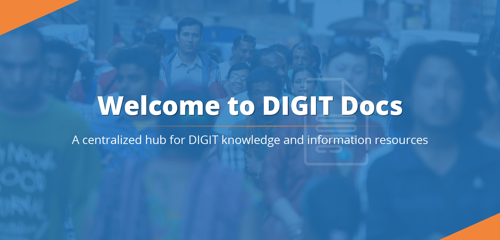

# DIGIT Docs

DIGIT is an open-source and open API powered platform for developers, enterprises and citizens to build new applications and solutions. The platform facilitates local governments to achieve quicker implementation time-frames, process improvements, accountability and transparency at various levels of administration.

















