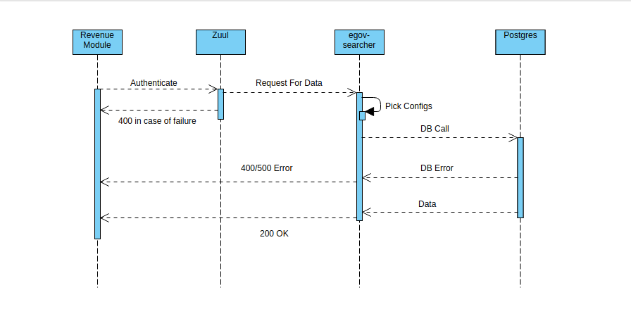

# Searcher Service

## Overview 

The objective of egov-searcher service is listed below.

1. To provide a one-stop framework for searching data from multiple data-source based on configuration (Postgres, Elasticsearch etc).
2. To create provision for implementing features based on ad-hoc requirements which directly or indirectly require a search functionality.

## Pre-requisites 

1. Prior Knowledge of Java/J2EE.
2. Prior Knowledge of SpringBoot.
3. Prior Knowledge of PostgresSQL.
4. Prior Knowledge of REST APIs and related concepts like path parameters, headers, JSON etc.
5. Prior Knowledge of JSONQuery in Postgres. (Similar to PostgresSQL with a few aggregate functions.)&#x20;

## Setup And Key Functionalities 

**Setup**

1. Step 1: Write configuration as per your requirement. The structure of the config file is explained later in the same doc.
2. Step 2: Check-in the config file to a remote location preferably github, currently we check the files into this folder - [https://github.com/egovernments/configs/tree/DEV/egov-searcher](https://github.com/egovernments/configs/tree/DEV/egov-searcher)  for DEV and QA and this folder - [https://github.com/egovernments/configs/tree/UAT/egov-searcher](https://github.com/egovernments/configs/tree/UAT/egov-searcher)  for UAT.
3. Step 3: Provide the absolute path of the checked-in file to DevOps, to add it to the file-read path of egov-searcher. The file will be added to egov-searcher's environment manifest file for it to be read at the start-up of the application.
4. Step 4: Run the egov-searcher app, use the module name and definition name parameters from the configuration as path parameters in the URL of the search API to fetch the required data.

**Definitions**

1. Config file - A YAML (xyz.yml) file which contains configuration for search requirements.
2. API - A REST endpoint to fetch data based on the configuration.

**Functionality**

1.  Uses Postgres JSONQuery instead of SQL Queries to fetch data from the Postgres DB.

    JSONQuery:\
    JSONQuery is one of the exclusive features of Postgres, It provides a way of fetching data from the DB as JSON instead of ResultSet format. This saves the time spent is mapping ResultSet into the required JSON format on the functionality side.\
    JSONQueries are similar to SQL queries with certain functions to internally map the ResultSet to JSON. SQL queries (SELECT queries to be precise) are passed as parameters to these functions, the SQL Query returns the ResultSet which is transformed to the JSON by these functions.\
    Some of the functions extensively used are:\
    _1) row\_to\_json_:  This function takes a query as a parameter and converts the result into JSON. However, the query must return only one row in the response. Note that, JSONQuery functions operate on aliases, So, the query must be mapped to an alias and the alias is passed to the function as a parameter.\
    Eg: \
    `{"name": "egov", "age": "20"`}\
    2\) _array\_agg_: This function takes the output of _row\_to\_json_ and aggregates it into an array of JSON. This is required when the query is returning multiple rows in the response. The query will be passed to _row\_to\_json_ through an alias, this is further wrapped within _array\_agg_ to ensure all the rows returned by the query as converted to a JSONArray.\
    Eg: \
    `[{"name": "egov", "age": "20"},{"name": "egov", "age": "20"},{"name": "egov", "age": "20"}]`\
    3\) _array\_to\_json_: This transforms the result of _array\_agg_ into a single JSON and returns it. This way, the response of a JSONQuery will always be a single JSON with the JSONArray of results attached to a key. This function is more for the final transformation of the result. The result so obtained can be easily cast to any other format or operated on using the PGObject instance exposed by Postgres.\
    Eg: \
    `{"alias": [{"name": "egov", "age": "20"},{"name": "egov", "age": "20"},{"name": "egov", "age": "20"}]}`

    For more details about JSONQuery, please check: [JSON Functions and Operators](https://www.postgresql.org/docs/9.4/functions-json.html)
2. Provides an easy way to set up search APIs on the fly just by adding configurations without any coding effort.
3. Provides flexibility to build where clause as per requirement, with config keys for operators, conditional blocks and other query clauses.
4. Designed to use a specific URI for every search request thereby making it easy for role-based access control.
5. Fetches data in the form of JSON the format of which can be configured. This saves considerable effort in writing row mappers for every search result.

## Interaction Diagram 

## Deployment Details 

1. Add configs for different modules required for Searcher Service.
2. Deploy the latest version of Searcher Service.
3. Add Role-Action mapping for APIs.

## Integration 

### Integration Scope 

The searcher service is used to search for data present in databases by running PSQL queries in the background.

### Integration Benefits 

* Can perform service-specific business logic without impacting the other module.
* In the future, if we want to expose the application to citizens then it can be done easily.

### Steps to Integration 

1. To integrate, a host of searcher-service modules should be overwritten in the helm chart.
2. `searcher/{moduleName}/{searchName}/_get` should be added as the search endpoint for the config added.

## API Details 

**URI**: The format of the search API to be used to fetch data using egov-searcher is as follows:  `/egov-searcher/{moduleName}/{searchName}/_get`

Every search call is identified by a combination of moduleName and searchName. Here, 'moduleName' is the name of the module as mentioned in the configuration file and 'searchName' is the name of the definition within the same module that needs to be used for our search requirement.

For instance, If I want to search all complaints of PGR I will use the URI -  \
`/egov-searcher/rainmaker-pgr-V2/serviceSearchWithDetails/_get`

**Body**: The Body consists of 2 parts: RequestInfo and searchCriteria. searchCriteria is where the search params are provided as key-value pairs. The keys given here are the ones to be mentioned in the 'jsonPath' configuration within the 'searchParams' key of the config file.

For instance, If I want to search complaints of PGR where serviceRequestId is 'ABC1234' and tenantId is 'pb.amritsar' the API body will be:\
`"RequestInfo":{"apiId":"emp","ver":"1.0","ts":1234,"action":"create","did":"1","key":"abcdkey","msgId":"20170310130900","authToken":"57e2c455-934b-45f6-b85d-413fe0950870","correlationId":"fdc1523d-9d9c-4b89-b1c0-6a58345ab26d"},"searchCriteria":{"serviceRequestId":"ABC1234","tenantId":"pb.amritsar"}}`

> [_​_](http://creativecommons.org/licenses/by/4.0/)_All content on this page by_ [_eGov Foundation_](https://egov.org.in/) _is licensed under a_ [_Creative Commons Attribution 4.0 International License_](http://creativecommons.org/licenses/by/4.0/)_._
