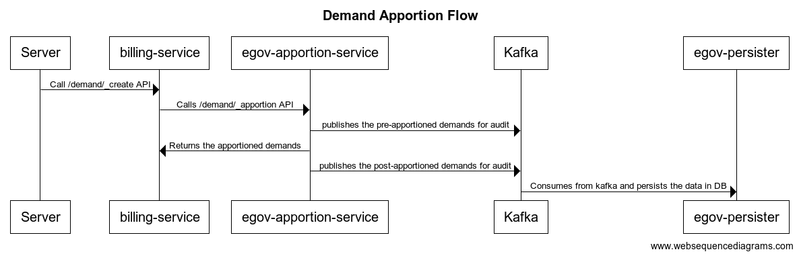

# Appropriation Service

## Overview

Apportion service is used to apportion the amount paid against a bill among the different tax heads based on the implemented algorithm. The default algorithm uses order of the tax head to apportion, the tax head with lowest order is apportioned off first while the highest order tax head is apportioned last.

## Pre-requisites

Before you proceed with the documentation, make sure the following pre-requisites are met -

* _Java 8_
* Kafka server is up and running
* egov-persister service is running and has apportion persister config path added in it
* PSQL server is running and database is created to store apportion audit data

## Key Functionalities

* Apportion payment in tax heads of bill
* Apportion advance amount in tax heads of demand during demand creation

|                                      |                                                                                           |
| ------------------------------------ | ----------------------------------------------------------------------------------------- |
| **Environment Variables**            | **Description**                                                                           |
| `egov.apportion.default.value.order` | If set to true will apportion of the negative amount first irrespective of tax head order |

## Deployment Details

1. Deploy the latest version of egov-apportion-service service
2. Add apportion persister yaml path in persister configuration

## Configuration Details

There is no separate configuration required. The TaxHead master that is configured in the billing service is only used

## Integration Details

### Integration Scope

Any payment service which wants to divide the paid amount into different tax head buckets can integrate with apportion service.

### Integration Benefits

* Apportions amount in tax heads

### Steps to Integration

1. To integrate, the host of egov-apportion-service should be overwritten in helm chart
2. /apportion-service/v2/bill/\_apportion should be called to apportion the bill
3. /apportion-service/v2/demand/\_apportion should be called to apportion advance amount in demands

## Interaction Diagram

## Reference Docs

#### Doc Links 

|                           |                                                                                                                    |
| ------------------------- | ------------------------------------------------------------------------------------------------------------------ |
| **Title**                 | **Link**                                                                                                           |
| Collection Service        | [Collection Service V2](https://digit-discuss.atlassian.net/wiki/spaces/DD/pages/1620574288/Collection+Service+V2) |
| Billing Service           | [Billing Service](https://digit-discuss.atlassian.net/wiki/spaces/DD/pages/1620672528/Billing+Service)             |
| API Swagger Documentation |                                                                                                                    |

#### API List 

|                                            |                                                                                                                            |
| ------------------------------------------ | -------------------------------------------------------------------------------------------------------------------------- |
| Title                                      | **Link**                                                                                                                   |
| _/apportion-service/v2/bill/\_apportion_   | [https://www.getpostman.com/collections/142983a40e95da157b45](https://www.getpostman.com/collections/142983a40e95da157b45) |
| _/apportion-service/v2/demand/\_apportion_ | [https://www.getpostman.com/collections/142983a40e95da157b45](https://www.getpostman.com/collections/142983a40e95da157b45) |

_(Note: All the API’s are in the same postman collection therefore the same link is added in each row)_

\_\_

[_​_](http://creativecommons.org/licenses/by/4.0/)_All content on this page by_ [_eGov Foundation_](https://egov.org.in/) _is licensed under a_ [_Creative Commons Attribution 4.0 International License_](http://creativecommons.org/licenses/by/4.0/)_._
