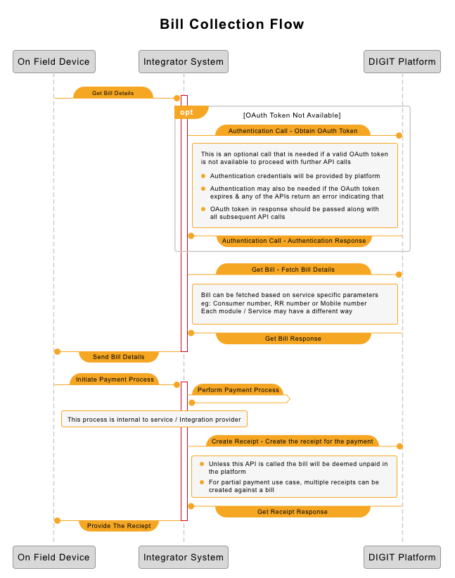

# Billing Collection Integration



## Introduction <a href="#introduction" id="introduction"></a>

DIGIT is India's largest open-source platform for Urban Governance. It provides API based access to government functions enabling the government to provide facilities via integration with relevant service players.\
This document is aimed at System Integrators looking to provide bill collection facilities to their government customers using DIGIT as their governance platform. It outlines the integration approach with Billing and Collections services to enable fetching bill dues to Citizens and recording their payments into the system.

## High-Level Approach <a href="#high-level-approach" id="high-level-approach"></a>

DIGIT is completely API driven and allows for data exchange with disparate systems using REST API calls. Most functional API are protected resources that can be accessed after proper authentication with the platform. The platform also checks for the right level of access for the given credentials.\
A bill collection flow consists of the following steps -

1. Authentication with DIGIT
2. Get Bill for the citizen using a service-specific query
3. Record the payment details against the bill
4. Optional - Get Payment API to fetch the details of the receipt

As the in-field team of the system integrator would already be making these calls to the integrator's own system (or a standard system like BBPS), integration with DIGIT is a server to server integration where the backend system of the integrator will make these calls to the DIGIT platform as per the need. The following diagram depicts the high-level flow of calls between On Field devices like PoS (On Field Device) to Backend of the Integrator (Integrator System) and from Backend of the Integrator to DIGIT (DIGIT Platform).


Note: The process of calling payment API results in a receipt creation.


## Integration Details <a href="#integration-details" id="integration-details"></a>

DIGIT uses Swagger 2.0 as its API standard and all its APIs are documented in Swagger. Wherever needed this document will provide a link to our API documentation online. An example of typical request/response snippets necessary for integration is provided below in the respective sections.\
Please note that DIGIT being a multi-tenanted system, all APIs in DIGIT expect tenantid passed either in the query param or RequestBody (Please refer to detailed API documentation as indicated in sections below). The tenantid represents the modular operating unit for the operation of an API, e.g. in a municipal governance use case, a tenantid will represent one ULB. Your platform contact will help you access the configured list for your use case.\
Authentication API also expects tenantid (Your platform contact will help you with which one to use), however, based on the role as an integrator the OAUTH token in response can be used for unit/ULB level tenants in subsequent API calls (meaning you may not need one authentication per unit/ULB level tenant).

1. **Authentication**

To ensure data privacy and security, transactional APIs in DIGIT are protected under authentication. System integrators are requested to contact the respective state authority to get the necessary OAUTH tokens that can be used to access these APIs. Kindly note that apart from userid/password system may enforce IP based access control in which case integrator may be required to share IP or range of IPs from which the request will originate.\
To generate the access token based on the credentials provided, please use the following API -\
Given below is the example of the request and response, OAuth token to be used from the response is highlighted in Bold.

**Request Snippet**

```
curl -X POST \
    https://egov-micro-dev.egovernments.org/user/oauth/token \
    -H 'Authorization: Basic {Authorization Token}' \
    -H 'Content-Type: application/x-www-form-urlencoded' \
    -H 'Postman-Token: 81c87b4c-f69d-464a-8c9a-990e698391ec' \
    -H 'cache-control: no-cache' \
    -d 'grant_type=password&scope=read&username={username}&password={Password}&tenantId={TenantId}&userType=Employee'
```

**Response Snippet**

```
{
"access_token": "6cf92021-8433-4da3-9a1e-8bc511983b2f",
"token_type": "bearer",
"refresh_token": "1f3097f3-39ab-4fd1-91a9-2ce48ac5b6bc",
"expires_in": 604799,
"scope": "read"
}
```

**2. Fetching Bill**

DIGIT allows the integrators to fetch the bills for citizens using the Consumer number of the respective service (e.g. Water charges, Property Service, Trade License). Please note that different services may have different notions of consumer number, e.g. for Water Charges consumer number will signify the "Connection number" while for Property it will be "Property Id".\
For some services, DIGIT also provides the facility to fetch bill by mobile number, please note that a bill search by mobile number may return multiple bills across services and may not return bills from services that do not support mobile-number based search.\
To support partial payment use case each bill in the response of the fetch bill API will indicate whether it is allowed to be partially paid and any minimum amount if partial payment is allowed.\
To fetch a bill from DIGIT, please ensure that OAuth token is generated as per the Authentication section above. Post that you can use the following API to fetch the bill -

* [https://www.getpostman.com/collections/900d99a85d083fb2d377](https://www.getpostman.com/collections/900d99a85d083fb2d377)
* [https://raw.githubusercontent.com/egovernments/business-services/master/Docs/billingservice/V-2.0.yml](https://raw.githubusercontent.com/egovernments/business-services/master/Docs/billingservice/V-2.0.yml)
* Choose Billing Service from the dropdown
* Go to the Bill section of BillingService
* Go to the Bill tab

**3. Make Payment**

Once the bill is fetched from the DIGIT system, the system integrator is expected to relay it back to the Field Device. Integrator is expected to Initiate and collect the payment based on government preference indicated in the bill (can it be partially paid and if so the minimum amount etc.) and Citizen's preference of payment instrument etc.\
Once the payment is successfully done in the integrator's system, the integrator is expected to register the payment in DIGIT using the Payment Create API. Please note that a bill is considered unpaid/partially paid by DIGIT till appropriate receipts are created using this API - which means that a subsequent fetch of the bill, till this API is called, will return the original bill.\
DIGIT expects a Receipt (The result of calling payment API) to be created against the bill number returned in the fetch bill API, please note that a receipt needs to be created for each bill. Therefore, if a total payment represents multiple bills - One receipt creation per bill is expected (DIGIT supports multiple receipt creation in a single call).\
To create a receipt in DIGIT, please ensure that OAuth token is generated as per the Authentication section above. Post that you can use the following API to create the receipt -

* [https://www.getpostman.com/collections/824d6b50b728bccd86d4](https://www.getpostman.com/collections/824d6b50b728bccd86d4)
* [https://raw.githubusercontent.com/egovernments/business-services/master/Docs/collection-services/V-2-0.yml](https://raw.githubusercontent.com/egovernments/business-services/master/Docs/collection-services/V-2-0.yml)
* Choose Collection Service from the dropdown
* Go to payment
* Go to the make payment

> [\_\_](http://creativecommons.org/licenses/by/4.0/)_All content on this page by_ [_eGov Foundation_ ](https://egov.org.in/)_is licensed under a_ [_Creative Commons Attribution 4.0 International License_](http://creativecommons.org/licenses/by/4.0/)_._
