# DSS Dashboard - Technical Document for UI

## **Description**

A decision support system (DSS) is a composite tool that collects, organizes and analyzes business data to facilitate quality decision-making for management, operations and planning. A well-designed DSS aids decision makers in compiling a variety of data from many sources: raw data, documents, personal knowledge from employees, management, executives and business models. DSS analysis helps organizations to identify and solve problems, and make decisions.

Code Git Repos: [https://github.com/egovernments/frontend/tree/master/web/dss-dashboard](https://github.com/egovernments/frontend/tree/master/web/dss-dashboard)

## **Type of users**

1. State-Level Admin
2. Commissioner
3. Domain-Level Employee

## **Dashboard List**

There are three types of dashboards -&#x20;

1. Home page (**refer figure 1**).
2. Overview page (**refer figure 2**).
3. Module level dashboard (**refer figure 3**).

### **1. Home page**

The home page contains multiple cards, each card is clickable.

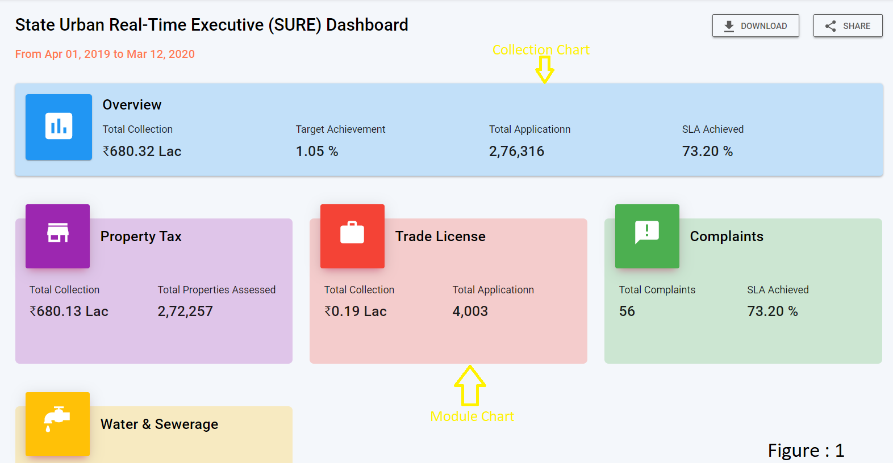

There are two types of cards, i.e, Overview card and module-level card.

Overview and Module level card is differentiated by vizType,

1. Overview card: On click of overview card, it will navigate to overview page. vizType for Overview is collection.
2. Module Level card: On Click of Module level card, it will navigate to Module level dahsboard. vizType is module (i.e Property Tax, Trade License etc).

**Request Payload for dashboardConfig:**

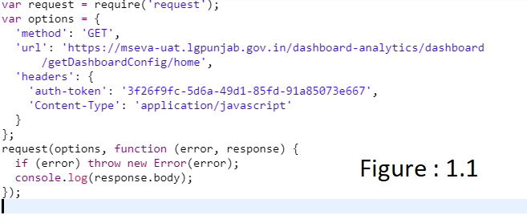

**auth-token** : which is for authenticate the request and it will fetch from a local storage key called **“Employee.token”**

**DashboardConfig API Response**

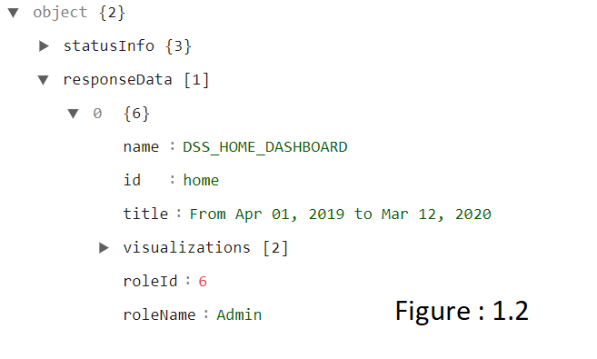

roleName: Which type of user.

Visualizations: Key contains all configuration for displaying the visualization like rows with charts etc please refer to **figure  1.3**.

In Figure 1.3, **vizType** key will define the module UI like

Collection Chart & Module Chart **refer the figure 1**

### **2. Overview Dashboard**

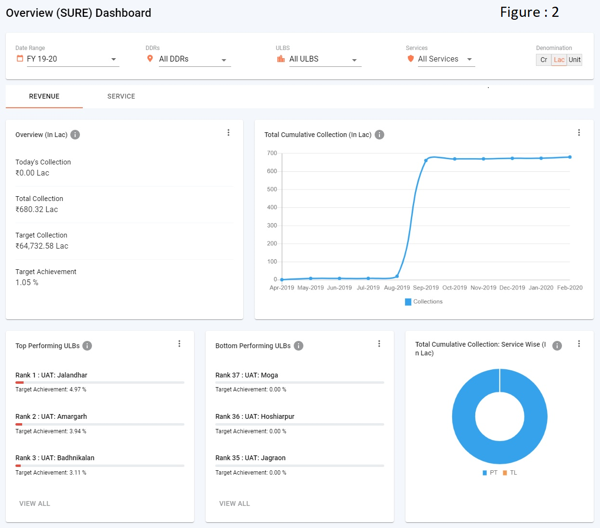

****

### **3. Module Level Dashboard**

**Visualizations List**

In dashboardConfig response **visualizations** key contains all rows & charts details(refer **figure 1.3**).

1.Each row contains the visual details like name,vizType,noUnit,isCollapsible,charts etc **** (refer **figure 1.3**).

1. name - Name of visualization.
2. vizType - type of visualization like COLLECTION,MODULE,METRIC-COLLECTION, PERFORMING-METRIC, CHART.
   1. COLLECTION - In home page, contains the collection data (refer **figure 1**).
   2. MODULE - In home page, contains the module level data (refer **figure 1**).
   3. METRIC-COLLECTION - In Overview/Module Level Page, contains the collection data (refer **figure 2.1**).
   4. PERFORMING-METRIC -In Overview/Module Level Page, contains the top/bottom performing data (refer **figure 2.2).**
   5. CHART - In Overview/Module Level Page, contains the below visualizations (refer **figure 2.3 to figure 2.7).**
      1. PIE CHART (refer **figure 2.3**)
      2. LINE CHART (refer **figure 2.4**)
      3. BAR CHART (refer **figure 2.5**)
      4. HORIZONTAL BAR CHART (refer **figure 2.6**)
      5. TABLE CHART (refer **figure 2.7**)

### **List of visualizations**

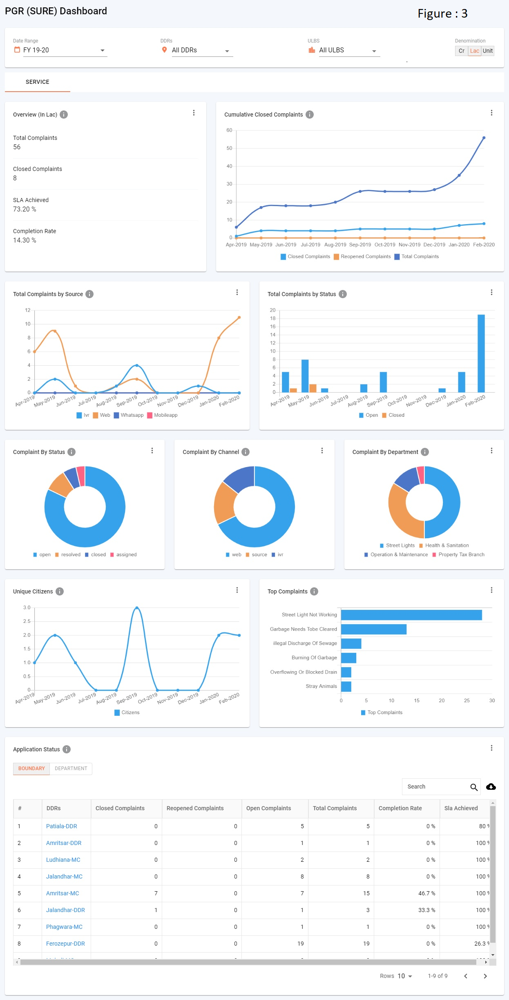

**Figure : 2.1 - Metric-collection.**

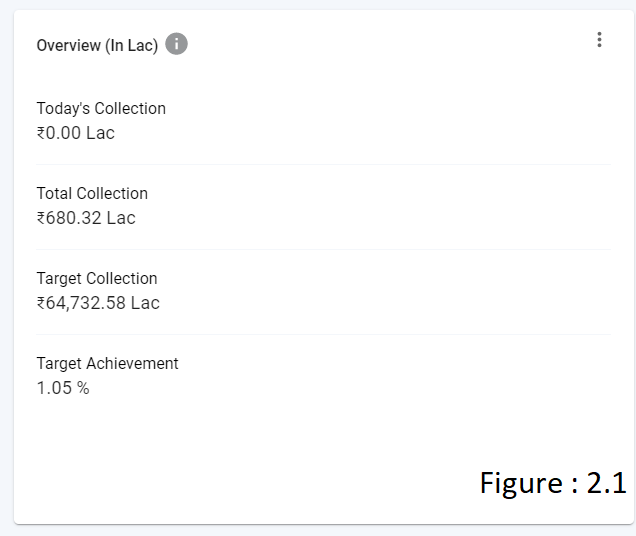

**Figure : 2.2 - PERFORMING-METRIC**

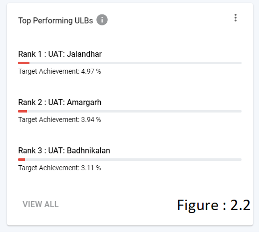

**Figure : 2.3 - CHART - PIE**

**Figure : 2.4 - Chart - LINE**

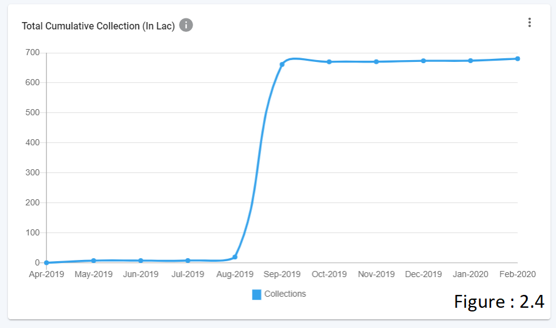

**Figure : 2.5 - Chart - BAR**

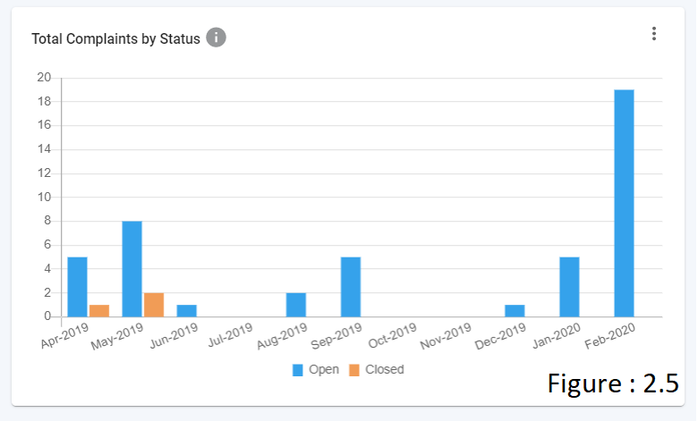

**Figure: 2.6 - Chart - HORIZONTAL BAR**

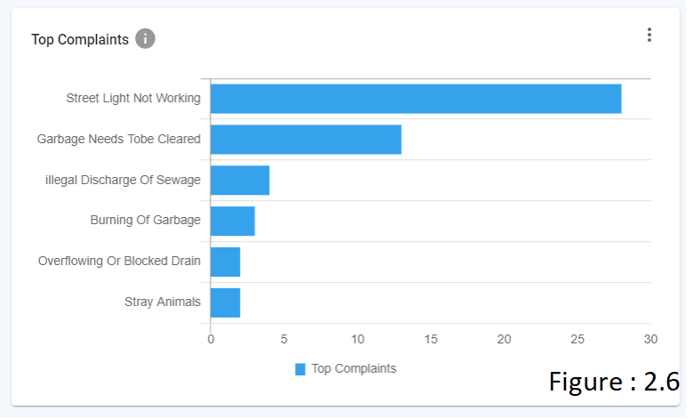

**Figure: 2.7 - Chart - TABLE**

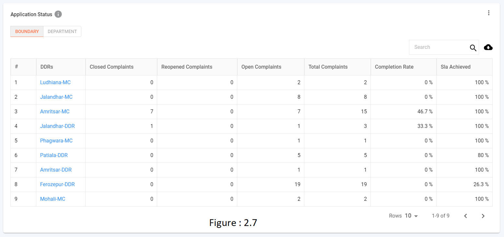

**Figure: 2.8 - GLOBAL FILTERS**

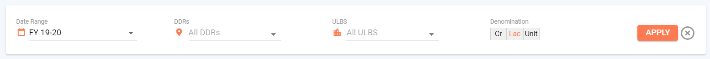

**Figure: 2.9 - DOWNLOAD & SHARE BUTTON**

**ULB Dashboard**

ULB Dashboard is having different filters, i.e ULB’s and Wards/Blocks. The data to the filters are loaded from below MDMS API -&#x20;

[https://dev.digit.org/egov-mdms-service/v1/\_search](https://dev.digit.org/egov-mdms-service/v1/\_search)

1. Each ULB dashboard, overview Dashboard and module-level pages contain different filters and are identified by roleName in configs API.
2. The Wards/Blocks filter is a dependable filter, which gets loaded on ULB selection.
3. In the ULB dashboard, the On-page ULB filter will be applied across all the charts and for the Performance chart, the default ULB filter will not be applied.
4. Overview and all module level page is having a ULB dashboard.

**GLOBAL Filters (refer to figure 2.8)**

Filters will be loaded from MDMS API.

[https://dev.digit.org/egov-mdms-service/v1/\_search](https://dev.digit.org/egov-mdms-service/v1/\_search)

Filters will be loaded on the basis of roleName,

Admin role: For the Module level page, Date, DDR and ULB filter will be loaded

For Overview level page, Date, DDR, ULB and Service filter will be loaded

Commissioner role: For the Module level page, Date, ULB and Wards/Blocks filters will be loaded.

For the Overview page, Date, ULB and Service filters will be loaded.

3.Denomination filter:

Denomination filter having three option to display amount and number in a particular format.

1. Crore
2. Lack
3. Unit

Denomination filter will not be applied to the percentage and text (refer to **figure 2.10**). The type of data is identified by a symbol in the plots of charts API.

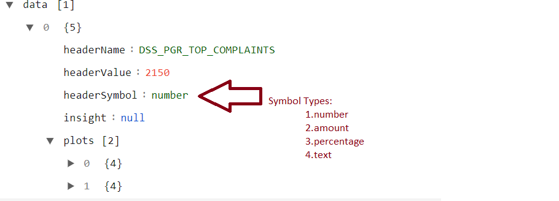

**Figure 2.10**

**Custom Date Filter**

&#x20;If duration < 15 days, it will display data day-wise.

If duration <= 30 days, it will display data week-wise.

If duration >30, it will display data monthly-wise.

**Tabs**

Currently, the dashboard is having two types of tabs,

1. Revenue (**refer figure: 4.1**).
2. Service (**refer figure: 4.1**).

Tabs are identified by name in visualizations of config API.

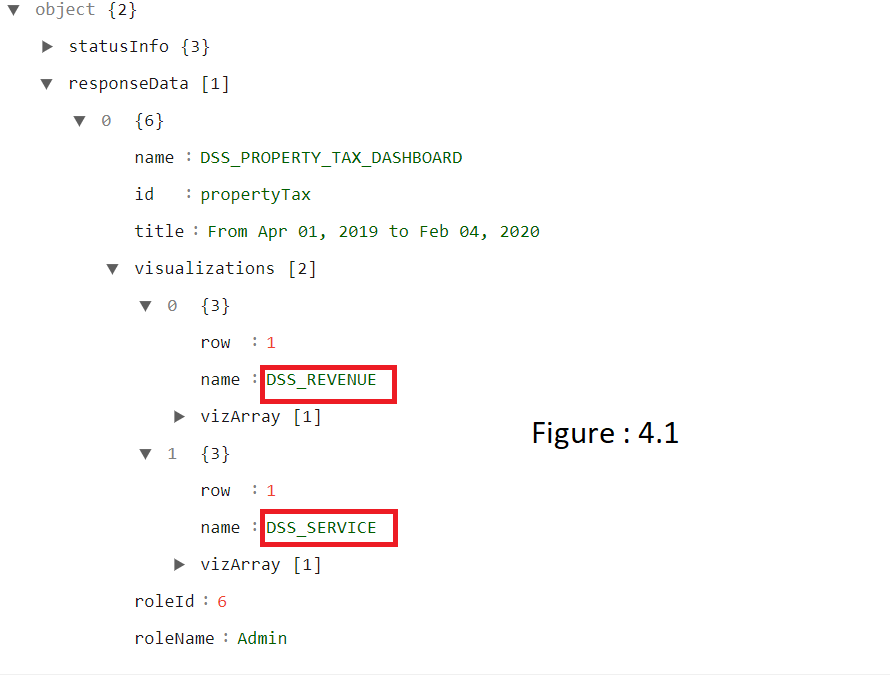

**Table Chart with drill-down**

Table chart visualization is having normal material UI data table features like search, sort etc.

In table response, filter key & drillDownChartId is having value means its Drill down table.

**Cards**

1. Each card header is localized and having an info icon with a tooltip option that displays the header and can display a description.
2. The number of cards in a row and in a page is driven by the backend. Backend provides the row number to each card where it should be displayed.
3. Card containing option icon which contains Image download and Image share option.
4. Image download and share user id from vizArray in order to differentiate each card in a page.

**Download and Share (refer to figure 2.9)**&#x20;

1.Download having two option to download data, i.e, Image and PDF

Share:

Share creates the Image/PDF and uploads it S3 using below API and returns file id,

[https://mseva-uat.lgpunjab.gov.in/filestore/v1/files](https://mseva-uat.lgpunjab.gov.in/filestore/v1/files)

Using file Id file will be fetched using below API

[https://mseva-uat.lgpunjab.gov.in/filestore/v1/files/url](https://mseva-uat.lgpunjab.gov.in/filestore/v1/files/url)

Each S3 image will be shortened using below API

[https://mseva-uat.lgpunjab.gov.in/egov-url-shortening/shortener](https://mseva-uat.lgpunjab.gov.in/egov-url-shortening/shortener)

**5. Configurations**

Github link for config: [https://github.com/egovernments/frontend/blob/master/web/dss-dashboard/src/config/configs.js](https://github.com/egovernments/frontend/blob/master/web/dss-dashboard/src/config/configs.js)

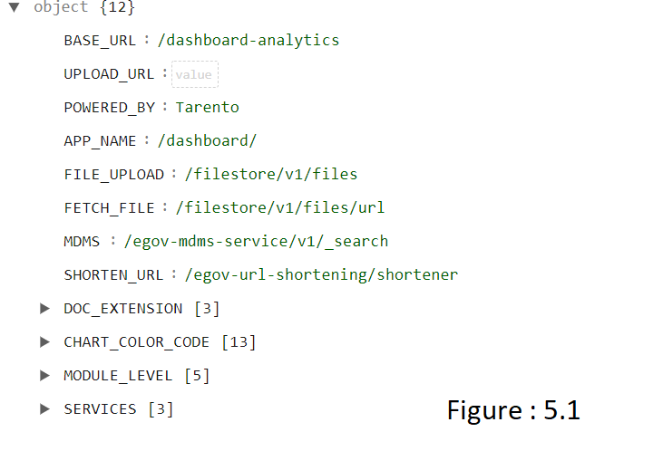

**BASE URL**: End point of REST API for dashboard.

**FILE Upload**: End point of REST API for file upload.

**FETCH FILE**: End point of REST API for file fetch.

**MDMS**: End point of REST API for fetch MDMS Data.

**SHORTEN URL**: End point of REST API for Shorten URL, which is used for share via Email / What's app.

**CHART COLOR CODE**: Color code object for all charts.

**MODULE LEVEL**: for global filters, which contains services name & filter key.

**SERVICES**: for global filter, service filter.

**6. Upload Localization keys:**

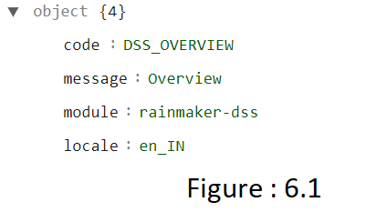

**code:** pre-defined key for back-end.

**message:** message contains the value for the key.

**module:** rainmaker-dss

**locale:** contains locale data

for more details eGov team to be documented

Module name: rainmaker-dss


DSS Localization


**NPM Module Used**

****[https://docs.google.com/spreadsheets/d/1AdwSGxUZoSmVcSc3PtujGMRCKpNaAEYgAn\_8XNTF2vM/edit?usp=sharing](https://docs.google.com/spreadsheets/d/1AdwSGxUZoSmVcSc3PtujGMRCKpNaAEYgAn\_8XNTF2vM/edit?usp=sharing)

**Steps to setup DSS in Local**\
\
Step 1: Run as independent, switch to dss-dashboard folder\
\
Step 2: We have to get the below details from the environment website and update the localstorage in the browser.

Employee.tenant-id\
Employee.user-info\
Employee.token\
Employee.module\
Employee.locale\
localization\_en\_IN\
locale

Step 3: Run Yarn install and yarn start to start working on dss in local setup.

DSS Features Enhancements V2:

[DSS Features Enhancements V2 Technical Document for UI](https://digit-discuss.atlassian.net/wiki/spaces/DD/pages/1633321002/DSS+Features+Enhancements+V2+Technical+Document+for+UI)

> [__](http://creativecommons.org/licenses/by/4.0/)_All content on this page by_ [_eGov Foundation_ ](https://egov.org.in)_is licensed under a_ [_Creative Commons Attribution 4.0 International License_](http://creativecommons.org/licenses/by/4.0/)_._
