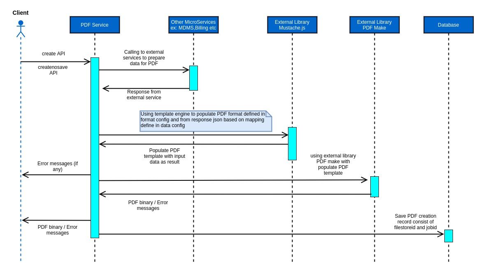

# PDF Generation Service

### Overview 

The objective of PDF generation service is to bulk generate pdf as per requirement.

### Pre-requisites 

Before you proceed with the documentation, make sure the following pre-requisites are met -

* Install _npm._
* Kafka server is up and running.
* egov-persister service is running and has pdf generation persister config path added in it.
* PSQL server is running and the database is created to store filestore id and job id of generated pdf.

### Key Functionalities 

* Provide a common framework to generate PDF.
* Provide flexibility to customise the PDF as per the requirement.
* Provide functionality to add an image, Qr Code in PDF.
* Provide functionality to generate pdf in bulk.
* Provide functionality to specify a maximum number of records to be written in one PDF.

|                               |                                                                                    |
| ----------------------------- | ---------------------------------------------------------------------------------- |
| **Environment Variables**     | **Description**                                                                    |
| MAX\_NUMBER\_PAGES            | Maximum number of records to be written in one PDF                                 |
| DATE\_TIMEZONE                | Date timezone which will be used to convert epoch timestamp into date (DD/MM/YYYY) |
| DEFAULT\_LOCALISATION\_LOCALE | Default value of localisation locale                                               |
| DEFAULT\_LOCALISATION\_TENANT | Default value of localisation tenant                                               |
| DATA\_CONFIG\_URLS            | File path/URL'S of data config                                                     |
| FORMAT\_CONFIG\_URLS          | File path/URL'S of format config                                                   |

#### External Libraries used : 

* **PDFMake: (**[https://github.com/bpampuch/pdfmake - Connect to preview](https://github.com/bpampuch/pdfmake) **):-** for generating PDFs
* **Mustache.js: (**[https://github.com/janl/mustache.js/](https://github.com/janl/mustache.js/) **):-** as templating engine to populate format as defined in format config, from request json based on mappings defined in data config

### Interaction Diagram 

### Deployment Details 

1. Create data config and format config for a PDF according to product requirement.
2. Add data config and format config files in PDF configuration
3. Add the file path of data and format config in the environment yml file
4. Deploy the latest version of pdf-service in a particular environment.

### Configuration Details 

For Configuration details please refer to [**Customizing PDF Receipts & Certificates.**](../../configuring-digit-services/customizing-pdf-notices-and-certificates/customizing-pdf-receipts-and-certificates.md)

### Integration 

#### Integration Scope 

The PDF configuration can be used by any module which needs to show particular information in PDF format that can be print/downloaded by the user.

#### Integration Benefits 

* Functionality to generate PDFs in bulk.
* Avoid regeneration.
* Support QR codes and Images.
* Functionality to specify the maximum number of records to be written in one PDF.
* Uploading generated PDF to filestore and return filestore id for easy access.

#### Steps to Integration 

1. To download and print the required PDF \_create API has to be called with the required key (For Integration with UI, please refer to the links in Reference Docs)

### Reference Docs 

#### Doc Links 

|                                                               |                                                                                                                                                                                         |
| ------------------------------------------------------------- | --------------------------------------------------------------------------------------------------------------------------------------------------------------------------------------- |
| **Title**                                                     | **Link**                                                                                                                                                                                |
| Customizing PDF Receipts & Certificates                       | [Customizing PDF Receipts & Certificates](../../configuring-digit-services/customizing-pdf-notices-and-certificates/customizing-pdf-receipts-and-certificates.md)                       |
| Steps for Integration of PDF in UI for download and print PDF | [Integration of PDF in UI for download and print PDF](../../configuring-digit-services/customizing-pdf-notices-and-certificates/integration-of-pdf-in-ui-for-download-and-print-pdf.md) |
| API Swagger Documentation                                     | [Swagger Documentation](https://app.swaggerhub.com/apis/eGovernment/pdf-service\_ap\_is/1.1.0)                                                                                          |

#### API List 

|                                 |                                                                                                                            |
| ------------------------------- | -------------------------------------------------------------------------------------------------------------------------- |
|                                 | **Link**                                                                                                                   |
| _pdf-service/v1/\_create_       | [https://www.getpostman.com/collections/5a9bfd6fd03f9f2a6fad](https://www.getpostman.com/collections/5a9bfd6fd03f9f2a6fad) |
| _pdf-service/v1/\_createnosave_ | [https://www.getpostman.com/collections/5a9bfd6fd03f9f2a6fad](https://www.getpostman.com/collections/5a9bfd6fd03f9f2a6fad) |
| _pdf-service/v1/\_search_       | [https://www.getpostman.com/collections/5a9bfd6fd03f9f2a6fad](https://www.getpostman.com/collections/5a9bfd6fd03f9f2a6fad) |

_(Note: All the API’s are in the same postman collection, therefore, the same link is added in each row)_

All content on this page by [eGov Foundation ](https://egov.org.in/)is licensed under a [Creative Commons Attribution 4.0 International License](http://creativecommons.org/licenses/by/4.0/).
