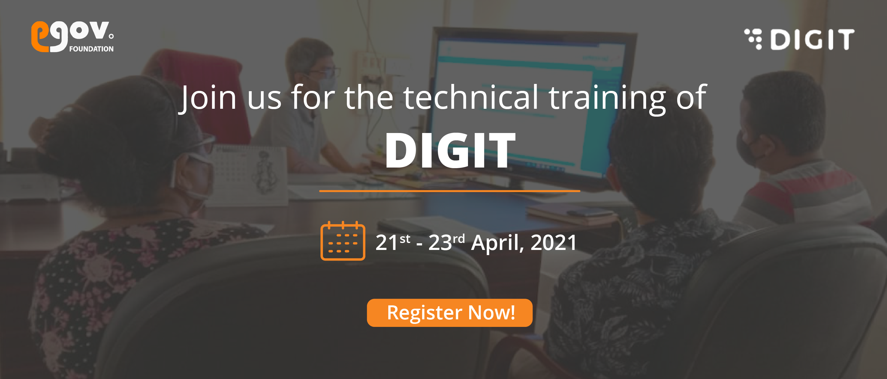

# Training Event

Join the virtual DIGIT Technical Training sessions to learn in-depth about the DIGIT platform architecture, key capabilities, and applications. These sessions will help understand DIGIT products, platform configurations, customizations and extension possibilities.

**Event registration links** and session details are provided below. Click on the Register button to enrol for the sessions.

<table>
  <thead>
    <tr>
      <th style="text-align:left"><b>Date / Time</b>
      </th>
      <th style="text-align:left"><b>Session Plan</b>
      </th>
      <th style="text-align:left"><b>Topics Covered</b>
      </th>
      <th style="text-align:left"><b>Target Audience</b>
      </th>
      <th style="text-align:left"><b>Registration Link</b>
      </th>
    </tr>
  </thead>
  <tbody>
    <tr>
      <td style="text-align:left">
        

        
21st April 2021

        
(11.45 am to 1.30 pm)

      </td>
      <td style="text-align:left"><b>Overview of DIGIT Implementation</b>
      </td>
      <td style="text-align:left">
        

        <ul>
          <li><a href="./">eGov &amp; DIGIT Overview </a>
          </li>
          <li><a href="./">Program Governance </a>
          </li>
          <li><a href="devops/setup-digit/tech-enablement-training-essential-skills-and-pre-requisites.md">People Pre-requisites</a> 
          </li>
          <li><a href="devops/setup-digit/cluster-requirements.md">Infra Pre-requisites </a>
          </li>
        </ul>
      </td>
      <td style="text-align:left">
        

        
Leadership/ Program and Tech Management

      </td>
      <td style="text-align:left"><a href="https://us02web.zoom.us/webinar/register/WN_fLPBIfwlSIWLlgrjHR3uDg">Register</a>
      </td>
    </tr>
    <tr>
      <td style="text-align:left">
        
21st April 2021

        
(2.30 pm to 3.30 pm)

      </td>
      <td style="text-align:left">
        
<b>DIGIT Platform Overview</b>
        

        
<b>Session 1 </b>
        

      </td>
      <td style="text-align:left">
        

        <ul>
          <li><a href="architecture.md">DIGIT Architecture</a>
          </li>
          <li><a href="architecture.md">Microservices</a>
          </li>
          <li><a href="devops/understanding-erp-stack/erp-coexistence-architecture.md">Coexistence</a>
          </li>
        </ul>
      </td>
      <td style="text-align:left">
        

        
Architects / Tech Leads

      </td>
      <td style="text-align:left"><a href="https://us02web.zoom.us/webinar/register/WN_3vdqSW0_TGSmQbTWYExutA">Register</a>
      </td>
    </tr>
    <tr>
      <td style="text-align:left">
        
21st April 2021

        
(4.00 pm to 5.30 pm)

      </td>
      <td style="text-align:left">
        
<b>DIGIT Platform Overview</b>
        

        
<b>Session 2</b>
        

      </td>
      <td style="text-align:left">
        

        <ul>
          <li><a href="configure-digit/setting-up-digit/">Overview</a>
          </li>
          <li><a href="devops/digit-deployment-on-aws/deployment-architecture.md">Deployment</a>
          </li>
          <li><a href>Infra Sizing</a>
          </li>
          <li><a href="https://devops.digit.org/digit-devops/14.-observability">Monitoring</a>
          </li>
        </ul>
      </td>
      <td style="text-align:left">
        

        
DevOps / Architects / Tech Leads

        

      </td>
      <td style="text-align:left"><a href="https://us02web.zoom.us/webinar/register/WN_Un8AaGLETgaB2oeRJkPvaQ">Register</a>
      </td>
    </tr>
    <tr>
      <td style="text-align:left">
        
22nd April 2021

        
(11.00 am to 1.00 pm)

      </td>
      <td style="text-align:left">
        
<b>Product Demos</b>
        

        
<b>Session 1</b>
        

      </td>
      <td style="text-align:left">
        

        <ul>
          <li><a href="modules/mcollect-mcs/">MCS + eChallans</a>
          </li>
          <li><a href="modules/finance/finance-user-manual/">Finance</a>
          </li>
        </ul>
      </td>
      <td style="text-align:left">Leadership / Business Analysts / Domain Experts</td>
      <td style="text-align:left"><a href="https://us02web.zoom.us/webinar/register/WN_tbT7LrNsSFG4GQ2xd02rQA">Register</a>
      </td>
    </tr>
    <tr>
      <td style="text-align:left">
        
22nd April 2021

        
(2.00 pm to 4.00 pm)

      </td>
      <td style="text-align:left">
        
<b>Product Demos</b>
        

        
<b>Session 2</b>
        

      </td>
      <td style="text-align:left">
        

        <ul>
          <li><a href="modules/online-building-plan-approval-system-obpas/">OBPAS</a>
          </li>
          <li><a href="modules/property-tax/pt-user-manual/">PT</a>
          </li>
        </ul>
      </td>
      <td style="text-align:left">Leadership / Business Analysts / Domain Experts</td>
      <td style="text-align:left"><a href="https://us02web.zoom.us/webinar/register/WN_TS-kdS8wT8Cm0v6f4OYgmw">Register</a>
      </td>
    </tr>
    <tr>
      <td style="text-align:left">
        
23rd April 2021

        
(11.00 am to 1.00 pm)

      </td>
      <td style="text-align:left">
        

        
<b>DIGIT Extension / Customisation Session 1</b>
        

      </td>
      <td style="text-align:left">
        

        <ul>
          <li><a href="customizing-digit/">Customization</a> &amp; <a href="configure-digit/">Configuration</a>
          </li>
        </ul>
      </td>
      <td style="text-align:left">
        

        
Tech Leads / Senior Developers

      </td>
      <td style="text-align:left"><a href="https://us02web.zoom.us/webinar/register/WN_zC211mGWQVq082P1CLynyg">Register</a>
      </td>
    </tr>
    <tr>
      <td style="text-align:left">
        
23rd April 2021

        
(2.00 pm to 4.00 pm)

      </td>
      <td style="text-align:left"><b>DIGIT Extension / Customisation Session 2</b>
      </td>
      <td style="text-align:left">
        <ul>
          <li>Extension case study</li>
        </ul>
      </td>
      <td style="text-align:left">
        

        
Architects / Tech Leads / Senior Developers

      </td>
      <td style="text-align:left"><a href="https://us02web.zoom.us/webinar/register/WN_rCkfVXd_Q5uxDEerJi6YXA">Register</a>
      </td>
    </tr>
  </tbody>
</table>

