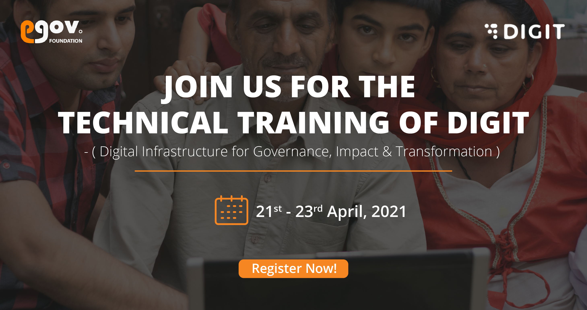

# Training Event

Join the virtual DIGIT Technical Training sessions to learn in-depth about the platform architecture, key capabilities, and contextual applications. The insights from these sessions will help in clarifying any questions you might have in context to DIGIT products, platform configurations, customizations and integration possibilities. 


**Training Plan**  

* **21st April 2021: Overview of DIGIT Implementation** 
  * **Time - 11.45 pm to 1.30 pm**

    _Target Audience - Leadership/ Program and Tech Management_

    Topic - [**Overview of DIGIT Implementation**](https://us02web.zoom.us/webinar/register/WN_fLPBIfwlSIWLlgrjHR3uDg)\*\*\*\*
* **21st April 2021: DIGIT Platform Overview**  
  * _**Session 1: Time - 2.30 pm to 3.30 pm**_ 

    _Target Audience - Architects / Tech Leads_

    Topic - Session 1: [**DIGIT Architecture / Microservices / Coexistence**](https://us02web.zoom.us/webinar/register/WN_3vdqSW0_TGSmQbTWYExutA)\*\*\*\*

  * _**Session 2: Time - 4.00 pm to 5.30 pm**_ 

    _Target Audience - DevOps / Architects / Tech Leads_

    Topic - [**Overview / Deployment / Infra Sizing / Monitoring**](https://us02web.zoom.us/webinar/register/WN_Un8AaGLETgaB2oeRJkPvaQ)\*\*\*\*
* **22nd April 2021: Product Demos**  
  * _**Session 1: Time - 11.00 am to 1.00 pm**_ 

    _Target Audience - Leadership / Business Analysts / Domain Experts_

    Topic - Session 1: [**MCS + eChallans & Finance**](https://us02web.zoom.us/webinar/register/WN_tbT7LrNsSFG4GQ2xd02rQA) 

  * _**Session 2: Time - 2.00 pm to 4.00 pm**_ 

    _Target Audience - Leadership / Business Analysts / Domain Experts_

    Topic - [**OBPAS & PT**](https://us02web.zoom.us/webinar/register/WN_TS-kdS8wT8Cm0v6f4OYgmw)\*\*\*\*
* **23 rd April 2021: DIGIT Extension / Customisation possibilities**  
  * _**Session 1: Time - 11.00 am to 1.00 pm**_ 

    _Target Audience - Tech Leads / Senior Developers_

    Topic - Session 1: [**DIGIT Customization & Configuration possibilities** ](https://us02web.zoom.us/webinar/register/WN_zC211mGWQVq082P1CLynyg)\*\*\*\*

  * _**Session 2: Time - 2.00 pm to 4.00 pm**_ 

    _Target Audience - Architects / Tech Leads / Senior Developers_

    Topic - [**Extension \(eChallan case study\)**](https://us02web.zoom.us/webinar/register/WN_rCkfVXd_Q5uxDEerJi6YXA)\*\*\*\*

_Click on the respective topic links to register for the session._


**Individual event registration links** and session details are provided below. Click on the Register button to enrol for the sessions now.

<table>
  <thead>
    <tr>
      <th style="text-align:left">Session Plan</th>
      <th style="text-align:left"><em><b>Topics Covered</b></em>
      </th>
      <th style="text-align:left"><em><b>Owner (Team)</b></em>
      </th>
      <th style="text-align:left"><em><b>Trainers</b></em>
      </th>
      <th style="text-align:left">Registration Link</th>
    </tr>
  </thead>
  <tbody>
    <tr>
      <td style="text-align:left"><b>Overview of DIGIT Implementation</b>
      </td>
      <td style="text-align:left">
        

        <ul>
          <li><a href="./">eGov &amp; DIGIT Overview </a>
          </li>
          <li><a href="./">Program Governance </a>
          </li>
          <li><a href="devops/setup-digit/tech-enablement-training-essential-skills-and-pre-requisites.md">People Pre-requisites</a> 
          </li>
          <li><a href="devops/setup-digit/cluster-requirements.md">Infra Pre-requisites </a>
          </li>
        </ul>
      </td>
      <td style="text-align:left">Partnerships / Delivery / Tech Delivery</td>
      <td style="text-align:left">Ajay / Aayush / Omkar / Elzan / Sravan</td>
      <td style="text-align:left"><a href="https://us02web.zoom.us/webinar/register/WN_fLPBIfwlSIWLlgrjHR3uDg">Register</a>
      </td>
    </tr>
    <tr>
      <td style="text-align:left">
        
<b>DIGIT Platform Overview</b>
        

        
<b>Session 1 </b>
        

      </td>
      <td style="text-align:left">
        

        <ul>
          <li><a href="architecture.md">DIGIT Architecture</a>
          </li>
          <li><a href="architecture.md">Microservices</a>
          </li>
          <li><a href="devops/understanding-erp-stack/erp-coexistence-architecture.md">Coexistence</a>
          </li>
        </ul>
      </td>
      <td style="text-align:left">Platform</td>
      <td style="text-align:left">Tarun / Ghanshyam</td>
      <td style="text-align:left"><a href="https://us02web.zoom.us/webinar/register/WN_3vdqSW0_TGSmQbTWYExutA">Register</a>
      </td>
    </tr>
    <tr>
      <td style="text-align:left">
        
<b>DIGIT Platform Overview</b>
        

        
<b>Session 2</b>
        

      </td>
      <td style="text-align:left">
        

        <ul>
          <li><a href="configure-digit/setting-up-digit/">Overview</a>
          </li>
          <li><a href="devops/digit-deployment-on-aws/deployment-architecture.md">Deployment</a>
          </li>
          <li><a href="devops/setup-digit/estimating-infra.md">Infra Sizing</a>
          </li>
          <li><a href="https://devops.digit.org/digit-devops/14.-observability">Monitoring</a>
          </li>
        </ul>
      </td>
      <td style="text-align:left">DevOps</td>
      <td style="text-align:left">Gajendran</td>
      <td style="text-align:left"><a href="https://us02web.zoom.us/webinar/register/WN_Un8AaGLETgaB2oeRJkPvaQ">Register</a>
      </td>
    </tr>
    <tr>
      <td style="text-align:left">
        
<b>Product Demos</b>
        

        
<b>Session 1</b>
        

      </td>
      <td style="text-align:left">
        

        <ul>
          <li><a href="modules/mcollect-mcs/">MCS + eChallans</a>
          </li>
          <li><a href="modules/finance/finance-user-manual/">Finance</a>
          </li>
        </ul>
      </td>
      <td style="text-align:left">Product</td>
      <td style="text-align:left">Ajit / Satish N</td>
      <td style="text-align:left"><a href="https://us02web.zoom.us/webinar/register/WN_tbT7LrNsSFG4GQ2xd02rQA">Register</a>
      </td>
    </tr>
    <tr>
      <td style="text-align:left">
        
<b>Product Demos</b>
        

        
<b>Session 2</b>
        

      </td>
      <td style="text-align:left">
        

        <ul>
          <li><a href="modules/online-building-plan-approval-system-obpas/">OBPAS</a>
          </li>
          <li><a href="modules/property-tax/pt-user-manual/">PT</a>
          </li>
        </ul>
      </td>
      <td style="text-align:left">Product</td>
      <td style="text-align:left">Sankar / Ajit</td>
      <td style="text-align:left"><a href="https://us02web.zoom.us/webinar/register/WN_TS-kdS8wT8Cm0v6f4OYgmw">Register</a>
      </td>
    </tr>
    <tr>
      <td style="text-align:left">
        

        
<b>DIGIT Extension / Customisation possibilities Session 1</b>
        

      </td>
      <td style="text-align:left">
        

        <ul>
          <li><a href="customizing-digit/">Customization</a> &amp; <a href="configure-digit/">Configuration</a>
          </li>
        </ul>
      </td>
      <td style="text-align:left">Tech Delivery</td>
      <td style="text-align:left">Pradeep / Ramki</td>
      <td style="text-align:left"><a href="https://us02web.zoom.us/webinar/register/WN_zC211mGWQVq082P1CLynyg">Register</a>
      </td>
    </tr>
    <tr>
      <td style="text-align:left"><b>DIGIT Extension / Customisation possibilities Session 2</b>
      </td>
      <td style="text-align:left">
        <ul>
          <li>Extension (eChallan case study)</li>
        </ul>
      </td>
      <td style="text-align:left">Engineering</td>
      <td style="text-align:left">Satish P/ Ghanshyam</td>
      <td style="text-align:left"><a href="https://us02web.zoom.us/webinar/register/WN_rCkfVXd_Q5uxDEerJi6YXA">Register</a>
      </td>
    </tr>
  </tbody>
</table>

