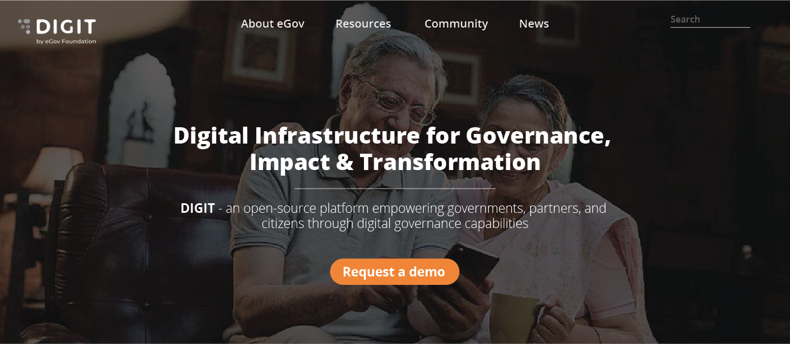
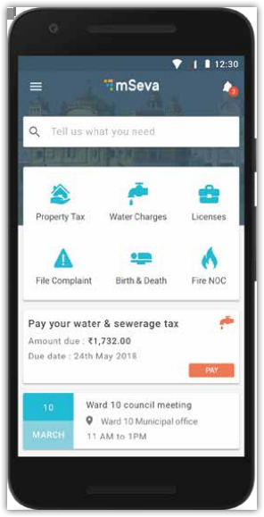
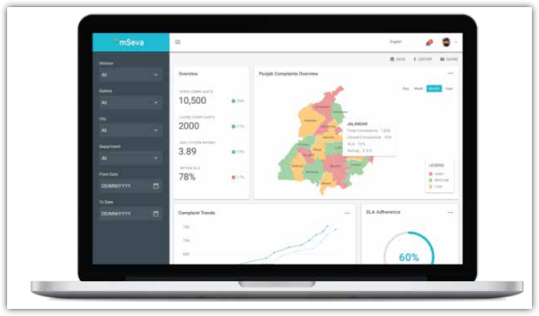

# Draft 2

* **Open Source** - DIGIT is Open Source and has been built using the best in class Open Source technology stacks powering the most advanced companies in the world. DIGIT is able to provide the lowest total cost of ownership and helps ensure that governments retain strategic control of their systems and data. 

* **Mobile-Enabled** - DIGIT has adopted a mobile-first approach, with robust mobile applications enabling citizens to easily access government services through their phones. Government officials and field workers are also empowered with mobile applications that enable them to deliver 24×7 governance with ease.

* **Real-time Dashboards** - DIGIT’s real-time dashboards provide governments with actionable insights on demand. Administrators and department heads are empowered with verified data that enables them to manage their work and budgets better. Field level employee reports enable effective performance management and ensure efficient usage of government resources.

**Citizen**

* Access governments easily using your mobile phones
* Your requests automatically reach the appropriate person
* Stay up-to-date with inbuilt notifications

