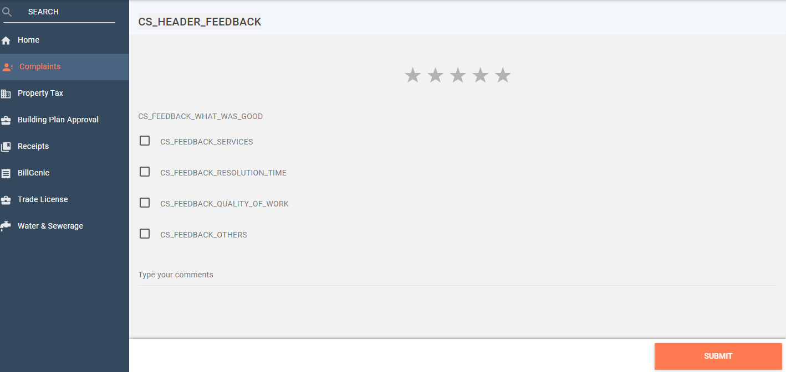

# Citizen User Manual

Citizens represent individuals or communities who are the system end-users. The PGR module provides the citizens with the scope to file their complaints or grievances to initiate necessary action.

The Citizen role can -

* [File complaints](https://app.gitbook.com/@egov-digit/s/external/understand-digit/product-user-guides/public-grievance/citizen-guide#file-complaints)
* [Track complaints](https://app.gitbook.com/@egov-digit/s/external/understand-digit/product-user-guides/public-grievance/citizen-guide#my-complaints)
* [Rate complaints](https://app.gitbook.com/@egov-digit/s/external/understand-digit/product-user-guides/public-grievance/citizen-guide#rate-complaints)
* [Reopen complaints](https://app.gitbook.com/@egov-digit/s/external/understand-digit/product-user-guides/public-grievance/citizen-guide#reopen-complaints)

### File Complaints

The File Complaints option allows citizens to register their complaints.   
To file complaints

1. Navigate to **Complaints** Home page. 
2. Click on the **File Complaints** tab on the screen. This will open the complaint form page.
3. Select the relevant **Complaint Type** and the subtype from the drop-down list of options. 
4. Refer to the list of complaint types available in PGR.  
5. Enter any additional information in the **Complaint Additional Details** field.
6. Click on the map   icon to pinpoint the **Complaint Location**.
7. The **City** field will display the city specified in your profile by default. You can change the city if required.
8. Choose the applicable **Locality/Mohalla** from the drop-down list.
9. Enter the **House No.** and **Street Name**.
10. Enter any **Landmark** to identify the exact location for the listed complaint. 
11. Click on the camera   icon to upload any photos for the complaint.
12. Click on the **Submit Complaint** button once you have finished filling in all the details.  
13. The system will display the Complaint Registered Successfully message along with the **Complaint No**.
14. Click on the **Continue** button. Your complaint details are available on the dashboard.  
15. The bell icon on the top right corner of the complaint tab will display any notifications received for the complaint.
16. Click on the bell  icon to view the complaint details.

### My Complaints

My Complaints tab enables citizens to track the status of their complaints.   
To view or track complaints

1. Click on **My Complaints** tab.
2. The system will display all complaints filed by you or from your account and the corresponding status.
3. Click on the **Open** button corresponding to any complaint to view the complaint details.  
4. The complaint summary view contains the **Complaint Details**, **Complaint Timeline**, and **Comments** text box. The complaint timeline indicates the action taken on the complaint and the current or pending action status of the complaint.  
5. Enter any additional information about the complaint in the **Comments** section.

### Rate Complaints

The PGR module enables the citizens to give their feedback on resolved complaints.   
To rate resolved complaints

1. Navigate to the **Complaints** menu option in the sidebar.
2. Click on the **My Complaints** tab.
3. Scroll down to the complaint you want to rate. 
4. You can rate only complaints marked as Closed.
5. Scroll down to the **Complaint Timeline** section.  
6. Click on the **Rate** button on the timeline.  
7. Click on the number of stars on the screen to rate the work on the complaint on five.
8. Click on the most appropriate feedback statement to rate the work.
9. Add any additional information in the **Comments** section.
10. Click on the **Submit** button.
11. The system displays an acknowledgement for your ratings.
12. Click on the **Go To Home** button to navigate back to the home page.

### Reopen Complaints

To reopen the complaint

1. Navigate to **Complaints &gt; My Complaints** menu option in the sidebar.
2. Click on the closed complaint that you want to reopen.
3. Scroll down to the **Complaint Timeline** section.  
4. Click on the **Re-Open** button on the timeline.

The Re-Open button will be available only for 5 days after the complaint is resolved and closed by the department employee. The number of days can vary depending on the State or ULBs. The citizen or CSR will not be able to reopen complaints once this period is over.  

1. Select the appropriate reason for reopening the complaint.
2. Click on the camera icon to upload any photos related to the complaint.
3. Enter any additional information in the **Comments** section.
4. Click on the **Continue** button once done.
5. The system displays an acknowledgement message stating the complaint is reopened.
6. Click on the **Go To Home** button to navigate back to the home page.

