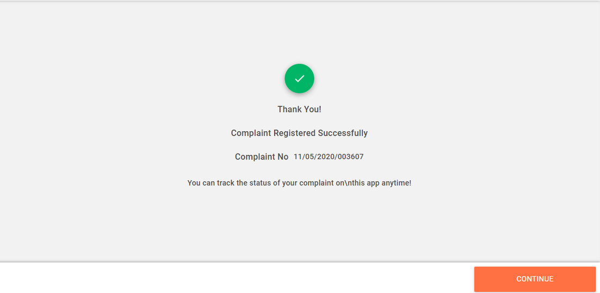
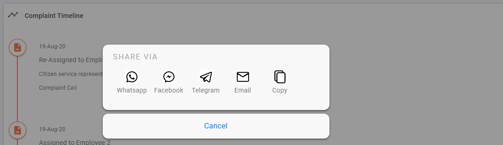

# Employee User Manual

### CSR

Complaints can also be registered by ULB counter employees on behalf of the citizen. 

The CSR or counter employees can perform the following actions on PGR -

1. [File Complaints](employee-guide.md#file-complaints)
2. [Search or Track Complaints](employee-guide.md#search-complaints)
3. [Reopen Complaints](employee-guide.md#reopen-complaints)

### File Complaints

To file complaints on behalf of the citizen

1. Navigate to the Home page and click on the **Complaints** card.
2. Else, click on the **Complaints** menu option in the sidebar.
3. Click on the **File Complaint** tab on the screen. This will open the complaint form page.  
4. Enter the **Citizen Name**.  
5. Enter **Citizen Mobile No.**
6. Select the relevant **Complaint Type** and the subtype from the drop-down list of options. Refer to the list of complaint types available in PGR.
7. Enter any additional information in the **Complaint Additional Details** field.
8. The **City** field will display the city specified in your profile by default. You can change the city if required.
9. Choose the applicable **Locality/Mohalla** from the drop-down list.
10. Enter the **House No.** and **Street Name**.
11. Enter any **Landmark** to identify the exact location for the listed complaint. 
12. Click on **File Complaint** button once you have finished filling in all the details.
13. The system will display the Complaint Registered Successfully message along with the Complaint No.  
14. Click on the **Continue** button. Your complaint details are available on the dashboard.
15. Click on the complaint to view the complaint details.

### Search Complaints

Employees can search for specific complaints using the registered mobile number of citizens or by entering the last few digits of the complaint number.  
To search complaints

1. Navigate to Complaints Home page.
2. Enter **Citizen Mobile No.**
3. Or, enter the last 6 digits of the Complaint No.  
4. Click on the **Search** button.
5. The system will retrieve and display the matching records.
6. Click on the **Clear Search** button to initiate a fresh search.  

### Reopen Complaints

To reopen the complaint

1. Navigate to **Complaints &gt; My Complaints** menu option in the sidebar.
2. Click on the closed complaint that you want to reopen.
3. Scroll down to the **Complaint Timeline** section.
4. Click on the **Re-Open** button on the timeline.  
5. The Re-Open button will be available only for 5 days after the complaint is resolved and closed by the department employee. The number of days can vary depending on the State or ULBs. The citizen or CSR will not be able to reopen complaints once this period is over.   
6. Select the appropriate reason for reopening the complaint.
7. Click on the camera icon to upload any photos related to the complaint.
8. Enter any additional information in the **Comments** section.
9. Click on the **Continue** button once done.
10. The system displays an acknowledgement message stating the complaint is reopened.
11. Click on the **Go To Home** button to navigate back to the home page.

### GRO

The Grievance Routing Officer or GRO manages the complaints queue. The role ensures the complaints are routed to the appropriate employees for prompt action.  

GROs can 

1. [Assign complaints](employee-guide.md#assign-complaints)
2. [Re-Assign complaints](employee-guide.md#re-assign-complaints)
3. [Share complaints](employee-guide.md#share-complaints)
4. [Reject complaints](employee-guide.md#reject-complaints)
5. Call citizens
6. Comment on complaints

### Assign Complaints

Grievances filed by citizens are assigned to specific employees who are responsible for acting on and resolving the complaints.   
To assign complaints

1. Navigate to the Home page and click on the Complaints card.
2. Or, navigate to **Complaints &gt; Open Complaints.** 
3. The GRO Complaint page contains two tabs - **Unassigned** and **Assigned** complaints.  
4. Click on the **Unassigned** tab. The list of unassigned complaints is available on the screen.
5. Click on the **Complaint** you want to assign. This will open the **Complaint Summary** page.  
6. Click on the **Assign** button available in the bottom right corner of the screen. This will display the list of employees.
7. Select an employee.  
8. Click on the **Assign** button. 

The complaint is assigned to the selected employee.

### Re-Assign Complaints

Assigned complaints can be re-assigned by the GRO depending on the situation and requirements.  
To re-assign complaints

1. Navigate to the Home page and click on the **Complaints** card.
2. Click on the **Assigned** tab.
3. Click on the complaint you want to re-assign.
4. Click on the **Re-Assign** button available on the bottom right corner of the screen.
5. Select the employee to whom the complaint should be assigned.
6. Click on the **Assign** button.  
7. The Complaint is re-assigned to the selected employee.

### Share Complaints

GROs can share complaints with other department users based on the requirements.

To share complaints

1. Click on the complaint you want to share.  
2. Click on the share icon in blue on the top right corner of the screen.  
3. Select the appropriate channel.
4. The system will redirect you to the selected channel interface.
5. Select the person or list of people for sharing.
6. Click on the **Send** button.

The complaint is shared with the selected recipients.

### Reject Complaints

In certain cases, the GRO might reject registered complaints. This usually happens when the complaint is beyond the operational scope of the department or the complaint is invalid.  
To reject complaints

1. Navigate to the Home page and click on the **Complaints** card.
2. Click on the relevant **Complaint**. This will open the **Complaint Summary** page.
3. Click on the **Reject** button available in the bottom right corner of the screen.
4. Select the appropriate **Reason to Reject**.  
5. Add any additional information in the **Comments** space.
6. Click on the **Submit** button.
7. The complaint is rejected.

### **FME**

First Mile Employees or FMEs are responsible for acting on citizen complaints. 

FMEs can -

1. [Request Re-Assign](employee-guide.md#request-re-assign)
2. [Mark Resolved](employee-guide.md#resolve-complaints)
3. Call citizens
4. Comment on complaints
5. [Search complaints](employee-guide.md#search-complaints)
6. [Share complaints](employee-guide.md#share-complaints)

### 

### **Request Re-Assign**

FMEs work on the assigned complaints. In some cases, the FMEs may request complaints to be reassigned to some other employee. 

To request reassign

1. Navigate to the Complaints menu option in the sidebar.
2. Click on Open Complaints.
3. Search for a specific complaint using the Citizen Mobile No. or inputting the last 6 digits of the Complaint No.

1. Else, click on the relevant complaint from the list of open complaints.
2. Click on the Request Re-Assign button available in the bottom right corner of the screen.

1. Select a specific reason for requesting a re-assign.

1. Enter any additional information in the Comments section.
2. Click on the Request Re-Assign button.

### Resolve Complaints

Once the complaints are actioned on the FME marks the issue resolved. The complaint is closed subsequently.

To mark the complaint resolved

1. Navigate to the **Complaints** menu option in the sidebar.
2. Click on **Open Complaints**.
3. Search for a specific complaint using the **Citizen Mobile No.** or inputting the last 6 digits of the **Complaint No.**  
4. Else, click on the relevant complaint from the list of open complaints.
5. Click on the **Mark Resolved** button available in the bottom right corner of the screen.  
6. Click on the camera icon to upload photos as evidence that the issue has been resolved.  
7. Enter any additional information related to the issue resolution in the **Comments** section.
8. Click on the **Mark Resolved** button.  
9. The system will display an acknowledgement message.
10. Click on the **Go To Home** button to navigate back to the home page.

