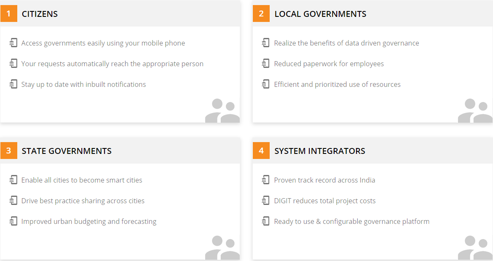

# Products & Modules

DIGIT offers several modules. Each module is designed to automate the manual workflows for various governance units.

## Key Benefits

DIGIT enables ULBs to be more effective and accountable—and to make better, data-driven decisions. The platform ensures both interoperability among ULBs and rapid development of new modules by a wide array of software partners.

> [\_\_](http://creativecommons.org/licenses/by/4.0/)_All content on this page by_ [_eGov Foundation_ ](https://egov.org.in/)_is licensed under a_ [_Creative Commons Attribution 4.0 International License_](http://creativecommons.org/licenses/by/4.0/)_._

