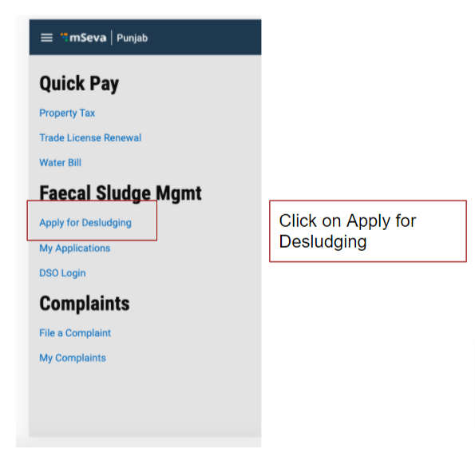

# Citizen User Manual

Citizens represent individuals or communities who are the system end-users. The FSM module provides the citizens with the scope to apply for desludging services and make the payment for the applied services.

The citizens can -

* Apply for desludging services
* Check application status
* Download application acknowledgement
* Make payment for applied services
* Rate the services provided by the Urban Local Bodies \(ULBs\)

## Apply for Desludging Services

## Check Application Status & Make Payment

