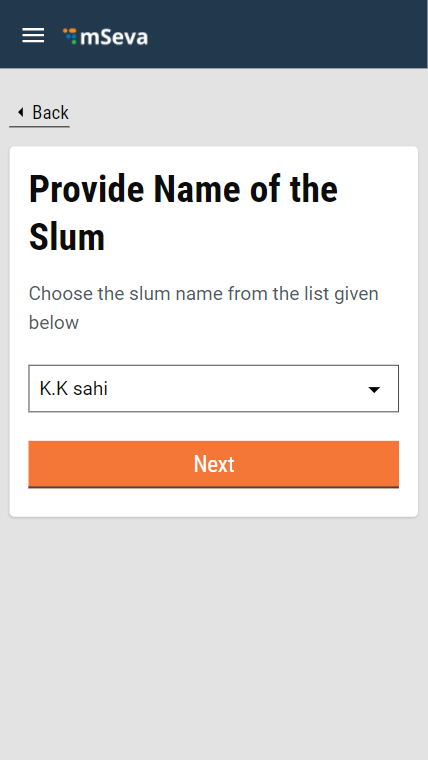

# Citizen User Manual

Citizens represent individuals or communities who are the system end-users. The FSM module provides the citizens with the scope to apply for desludging services and make the payment for the applied services.

The citizens can -

* Apply for desludging services
* Check application status
* Download application acknowledgement
* Make payment for applied services
* Rate the services provided by the Urban Local Bodies \(ULBs\)

## Apply for Desludging Services

Enter **Mobile Number**, **Name**, and **City** details. Click on **Continue** button.

Enter the **OTP** received on the given mobile number. Click on **Continue**. The system validates the details and allows the user to log in to the system with the registered mobile number.

Enter your registered mobile number and the OTP received on the mobile to log in. Click on **Continue with Whatsapp** button to register your service request using the whatsapp channel.

Click on **Continue** button.

Click on **Apply for Emptying of Septic Tank/Pit** option on the home page.

Select the relevant **Property Type**. 

The system provides cost estimate details based on the selected property type. Click on the **Next** button.

Select the applicable **Property Sub Type.**

Enable the **Location** Finder to allow GPS to track current location. Or, move the pin to the location manually. Alternatively, you can also enter the location in the Search bar. 

Click on **Skip and Continue** button in case you are unable to provide a GPS location.

The **Pincode** field gets auto-populated if the location is selected on the map. Else, enter the **Pincode** of the location details manually. Click on **Skip and Continue** in case you are unable to provide the Pincode details.

**City** and **Locality/Mohalla** fields are auto-populated once the **Pincode** is entered. Else, select the **City** and applicable **Locality/Mohalla** from the drop down list.

Select **Yes** if your property is located in a notified slum area. Else, select **No**. Click on the **Next** button to move to the next screen.

Select and enter the **Slum Name** from the available drop down list. 

Enter the **Street Name** and **Door No.** details.

Provide a **Landmark** to enable the service providers to find the location easily.

Select the applicable **Sanitation Type** from the listed options. Click on **Skip and Continue** button if you are not sure about the sanitation type.

Enter the dimensions of length, breadth, and depth in meters to indicate the **Pit/Septic Tank Size**. Enter the diameter and depth in meters in case the sanitation type is a soak pit.

Click on the **Next** button to move to the Summary page.

Cross verify the filled in details on the **Summary** page. Click on the **Change** button available for the field that requires any edits. Scroll down the page to review the application details.

Click on the **Submit** button once the review is complete and the details are satisfactory.

The system displays the **Application Submitted** message. The **Application No.** is generated.

Click on the **Download** button on the screen to generate a pdf copy of the application.

The system triggers a notification along with the **Application No.** and details to the registered mobile number. Any subsequent updates and action on the application also trigger a notification to the applicant.

## Check Application Status & Make Payment

Click on **My Applications** in the citizen home page. Click on the **View** button for the application pending for payment.

Scroll down the application and click on the **Make Payment** button.

Select the applicable **Payment Method** and then click on the **Pay** button.

The system displays a payment acknowledgement message along with the **Payment Receipt No.** Click on the **Print Receipt** button to get a printed receipt.

## Rate Services

Applicants can rate the services given and provide their detailed feedback on their applications. 

Go to **My Applications** and click on the **View** button for the application having the status **Pending for Citizen Feedback**.

Scroll down the application to the **Application Timeline** section. Click on the **Rate Us** button.

Enter your ratings by clicking on the number of stars. Answer the questions on the feedback form. 

Enter any additional insights in the **Comments** box. Click on the **Submit** button.

The feedback is submitted.

