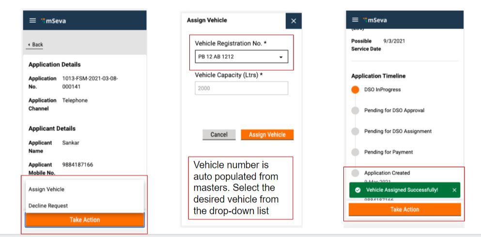
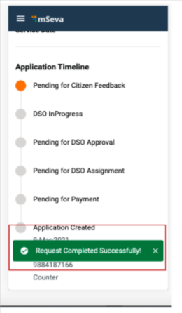

# DSO User Manual

The Desludging Operators or DSOs are responsible for initiating and completing action on the citizen requests for desludging services. The requests are routed to the respective DSOs by the ULB officials. The DSOs update the application status once the services are delivered and payments collected.

DSOs can -

* Assign vehicles for desludging services
* Decline service requests
* Complete service requests

## Manage Service Requests

