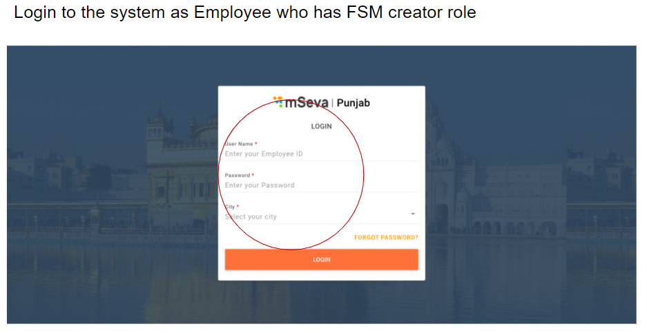
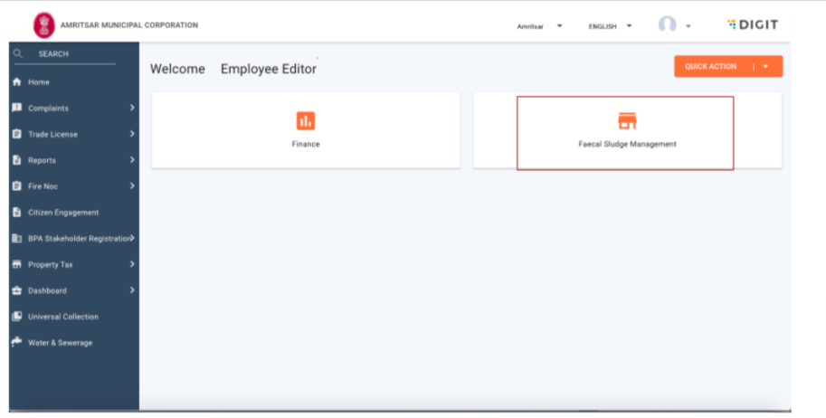
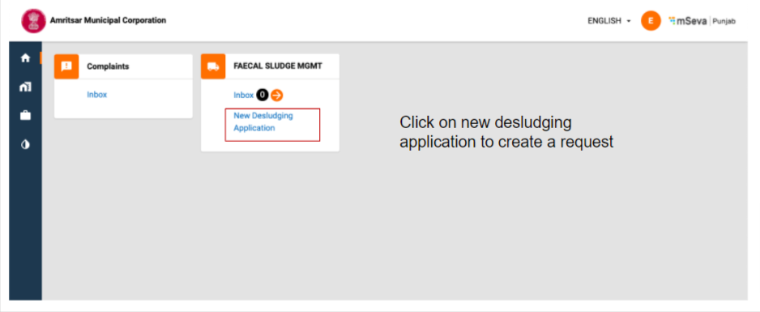
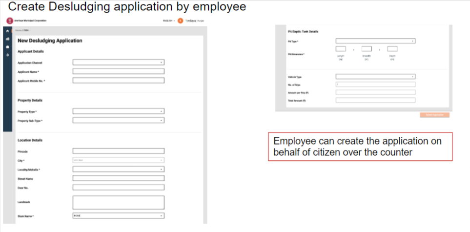
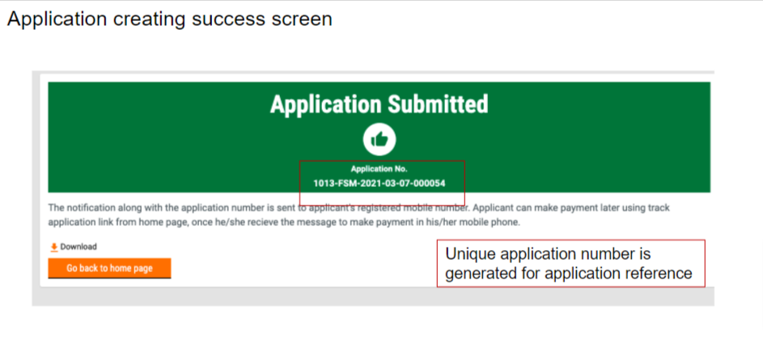

# Employee User Manual

ULB officials or employees receive the service requests and are responsible for routing these requests to specific DSOs.

Employees can -

1. Create Desludging application
2. Make payment
3. Update application / Generate Demand
4. Assign DSO to an application
5. Re-assign DSO to an application
6. Cancel the application
7. Reject the application

### Create Desludging Application

### Make Payment

### Assign Requests to DSO

