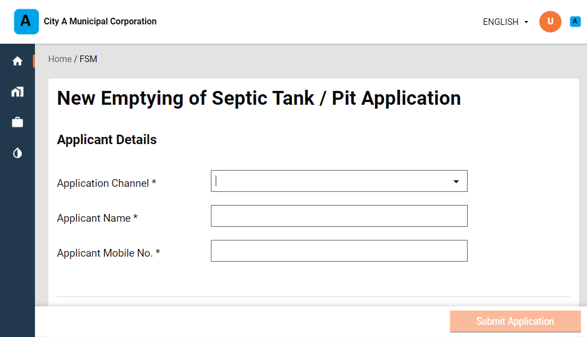
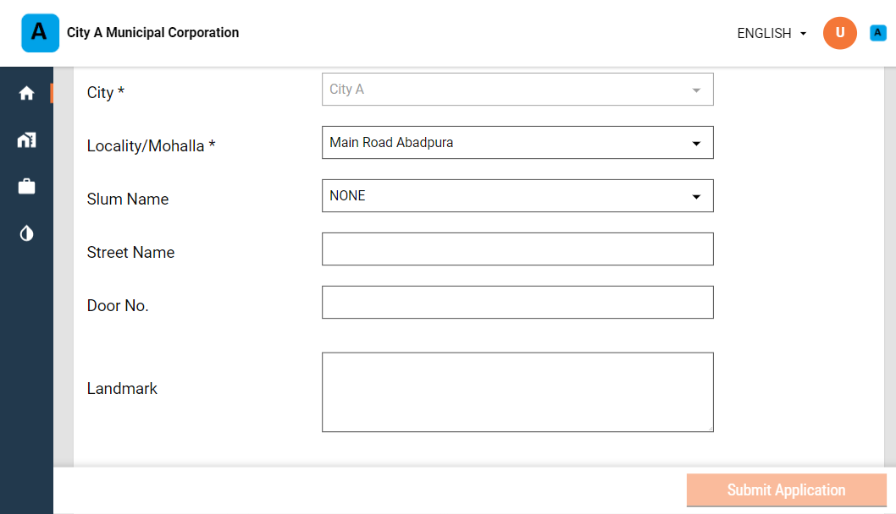

# Employee User Manual

ULB officials or employees receive the service requests and are responsible for routing these requests to specific DSOs.

Employees can -

1. Create Desludging application
2. Make payment
3. Update application / Generate Demand
4. Assign DSO to an application
5. Re-assign DSO to an application
6. Cancel the application
7. Reject the application

### Create Desludging Application

Log in as employee FSM Creator role.

Click on the **Inbox** to view the list of applications created by the signed in user.

Click on **New Emptying of Septic Tank / Pit Application** option.

Select the relevant **Application Channel** to indicate the channel that the employee is using to create a new service request. The applicant may use the telephone to raise requests or the local office counter. 

Enter the **Applicant Name** and **Applicant Mobile No.**

Select the relevant **Property Type** and **Property Sub Type**.

Enter the **Pincode**, **City**, **Locality/Mohalla**, **Slum Name**, **Street Name**, **Door No.** and **Landmark** details in the **Location** panel.

Select the applicable **Onsite Sanitation Type** from the drop down list. Enter the **Pit Dimension** or dimensions in meters for the selected sanitation type.

Select the **Vehicle Type** that will be required to fulfil this request. Enter the required **No. of Trips** and **Amount per Trip** details to calculate the **Total Amount** payable for the service request.

Click on the **Submit Application** button.

The application is submitted and an **Application No.** is generated. Click on the **Download** button on the screen to generate a pdf copy of the application for future reference.

The system will trigger notifications to the applicant mobile number with the application number and status updates.

### Make Payment

### Assign Requests to DSO

