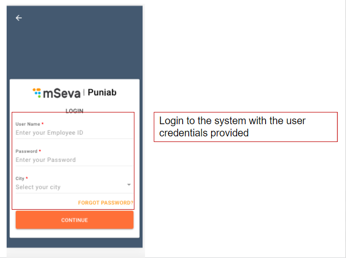
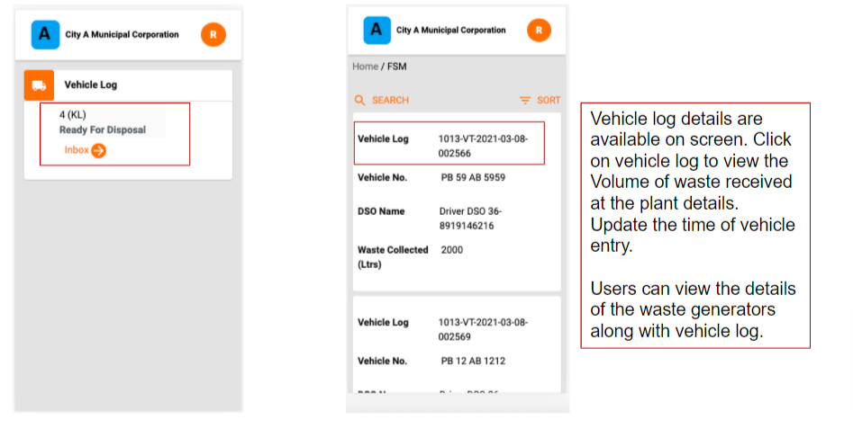
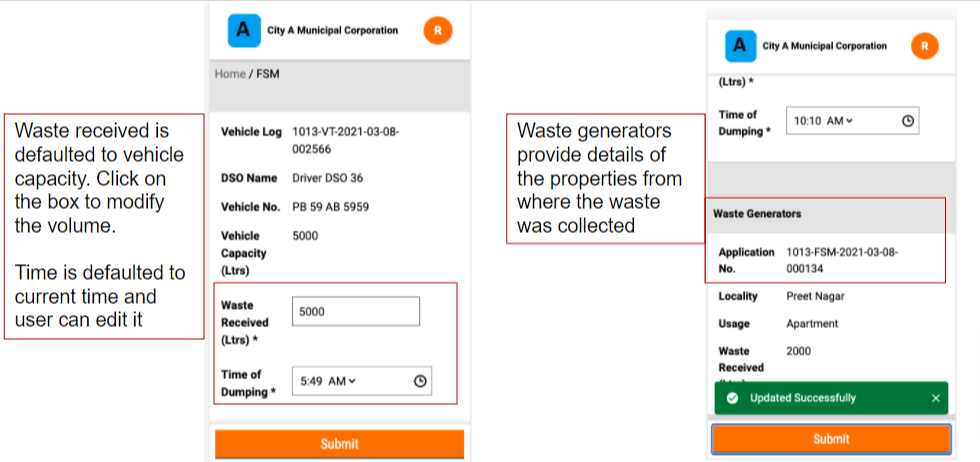

# Septage Treatment Plant Operator User Manual

The Septage Treatment Plant Operator \(SeTPO\) receives the list of planned desludging requests available in the system and updates the vehicle log entering the FSTP/STP every day.

SeTPO can

* Update desludging vehicle log

### Update Vehicle Log

