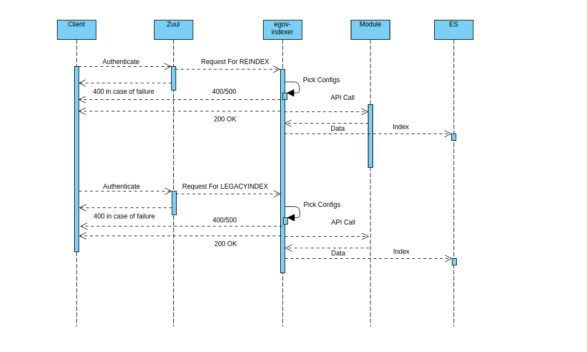

# Indexer Service

### Overview 

Indexer service runs as a separate service. This service is designed to perform all the indexing tasks of the digit platform. The service reads records posted on specific kafka topics and picks the corresponding index configuration from the yaml file provided by the respective module. Objective of Indexer service are listed as below.

* To provide a one stop framework for indexing the data to elasticsearch.
* To create provision for indexing live data, reindexing from one index to the other and indexing legacy data from the datastore.

### Pre-requisites 

Before you proceed with the configuration, make sure the following pre-requisites are met -

1. Prior Knowledge of Java/J2EE
2. Prior Knowledge of SpringBoot
3. Prior Knowledge of Elasticsearch
4. Prior Knowledge of REST APIs and related concepts like path parameters, headers, JSON etc.
5. Prior Knowledge of Kafka and related concepts like Producer, Consumer, Topic etc.

### Key Functionalities 

* Performs three major tasks namely: LiveIndex, Reindex and LegacyIndex.
* LiveIndex: Task of indexing the live transaction data on the platform. This keeps the es data in sync with the db. 
* Reindex: Task of indexing data from one index to the other. ES already provides this feature, indexer does the same but with data transformation.
* LegacyIndex: Task of indexing legacy data from the tables to ES. 
* Provides flexibility to index the entire object, a part of the object or an entirely different custom object all using one input json from modules.
* Provides features for customizing index json by field mapping, field masking, data enrichment through external APIs and data denormalization using MDMS.
* One stop shop for all the es index requirements with easy-to-write and easy-to-maintain configuration files.
* Designed as a consumer to save API overhead. The consumer configs are written from scratch to have complete control over the consumer behaviour. 

### Deployment Details 

* Step 1: Write configuration as per your requirement. Structure of the config file is explained later in the same doc.
* Step 2: Check-in the config file to a remote location preferably github, currently we check the files into this folder [https://github.com/egovernments/configs/tree/DEV/egov-indexer](https://github.com/egovernments/configs/tree/DEV/egov-indexer) -for dev
* Step 3: Provide the absolute path of the checked-in file to DevOps, to add it to the file-read path of egov-indexer. The file will be added to egov-indexer's environment manifest file for it to be read at start-up of the application.
* Step 4: Run the egov-indexer app, Since it is a consumer, it starts listening to the configured topics and indexes the data.

### Interaction Diagram 

### Configuration Details 

For Indexer Configuration, please refer to the document in Reference Docs table given below.

### API Details 

a\) POST /{key}/\_index

Receive data and index. There should be a mapping with topic as {key} in index config files.

b\) POST /\_reindex

This is used to migrate data from one index to another index

c\) POST /\_legacyindex

This is to run LegacyIndex job to index data from DB. In the request body the URL of the service which would be called by indexer service to pick data, must be mentioned.


In legacy indexing and for collection-service record LiveIndex kafka-connect is used to do part of pushing record to elastic search. For more details please refer to document mentioned in document list.


### Reference Docs 

#### Doc Links 





[Swagger Documentation](https://editor.swagger.io/?url=https://raw.githubusercontent.com/egovernments/core-services/master/docs/indexer-contract.yml#!/)

