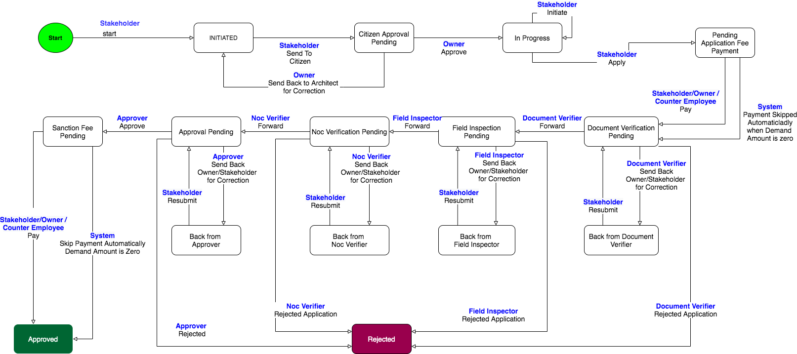
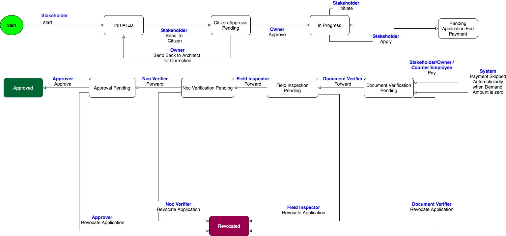

# BPA Service

### Description 

Construction or renovation of buildings is regulated by Municipal Body in India. One must get permission from the ULB prior to construction. This process involves submitting the building plan to ULB along with other documents, ULB verifies the plan with other documents and approves the construction. The document which authorizes the construction is called “**Permit Order**” One must have this permit order with him till the completion of construction. ULB officials will inspect various stages of construction and make sure it is compliance with the plan. When construction completed, after inspection Secretary provides “**Completion certificate**” and finally will provide “**Occupancy Certificate**”.  This entire process is known as “Building Plan Approval”.

### Functionality

This section covers the high-level details of the functionalities available in the Building Plan Application system.

* Centralized login page for citizen, official and stakeholders
* Citizen functionalities
* Online application submission - New construction
* Occupancy certificate request
* FieldInspection Report Capture
* Pay fee online and generate permit order online
* Inspection of applications and online status
* Configurable workflow
* Auto fee calculation
* Online and offline payment collection
* Rejection process
* Revocation process
* Configurable functionalities

### **System Requirements**

* Knowledge of Java/J2EE\(preferably Java 8 version\)
* Knowledge of Spring Boot and spring-boot microservices
* Knowledge of Git or any version control system
* Knowledge of RESTful Web services
* Knowledge of the Lombok library will helpful
* knowledge of eGov-mdms service, eGov-persister, eGov-idgen, eGov-sms, eGov-email,eGov-user, eGov-localization, eGov-workflow-service,dcr, land-services, bpa-calculator will be helpful

### **Setup and usage** <a id="Setup-and-usage:"></a>

The [**Application**](https://github.com/egovernments/municipal-services/tree/master) is present among the _**municipal services**_ group of applications available in the eGov-services git repository with the folder name **bpa-services**.  The spring boot application needs the **Lombok\*** extension added in your IDE to load it. Once the application is up and running API requests can be posted to the URL and ids can be generated. 

* in case of IntelliJ, the plugin can be installed directly, for eclipse the Lombok jar location has to be added in eclipse.ini file in this format  javaagent:lombok.jar

### _**API Information**_  <a id="API-Information-:"></a>

* Please refer to Swagger API for YAML file details. Link - [API Specs](https://github.com/egovernments/municipal-services/blob/master/docs/bpa/bpa-service.yaml).

### _**Application.properties File Information**_ <a id="Application.properties-File-Information:"></a>

Here we are listing the configs apart from dependent service host, URLs, DB and Flyway configs.

* kafka topics persister configs for eGov persister to save and update BPA Data
  * `persister.save.buildingplan.topic=save-bpa-buildingplan`
  * `persister.update.buildingplan.topic=update-bpa-buildingplan`
  * `persister.update.buildingplan.workflow.topic=update-bpa-workflow`
  * `persister.update.buildingplan.adhoc.topic=update-bpa-adhoc-buildingplan`
* Receipt kafka topics where BPA application listens to move the application Status after payment completion
  * `kafka.topics.receipt.create=egov.collection.payment-create`
* Config for Demand Business service codes for different fees to be paid for BPA
  * **egov.receipt.businessservice**=
    * BPA.NC\_APP\_FEE := Building Plan Approval Application Fee
    * BPA.NC\_SAN\_FEE := Building Plan Approval Sanction Fee
    * BPA.LOW\_RISK\_PERMIT\_FEE := Building Plan Approval Low Risk Permit Fee
    * BPA.NC\_OC\_APP\_FEE := Building Plan Approval Occupancy Certificate Application Fee
    * BPA.NC\_OC\_SAN\_FEE := Building Plan Approval Occupancy Certificate Sanction Fee
* Application and Permit Number Formats
  * `egov.idgen.bpa.applicationNum.format=PB-BP-[cy:yyyy-MM-dd]-[SEQ_EG_BP_APN]`
  * `egov.idgen.bpa.permitNum.format=PB-BP-[cy:yyyy-MM-dd]-[SEQ_EG_BP_PN]`
* SMS Notification Topic to push the SMS and Notification’s to be sent by BPA module
  * `kafka.topics.notification.sms=egov.core.notification.sms`
* Payment Notification Config
  * `egov.ui.app.host=https://egov-micro-dev.egovernments.org`
  * `egov.usr.events.create.topic=persist-user-events-async`
  * `egov.usr.events.pay.link=citizen/otpLogin?mobileNo=$mobile&redirectTo=egov-common/pay?consumerCode=$applicationNo&tenantId=$tenantId&businessService=$businessService`
  * `egov.usr.events.pay.code=PAY`
* List of Application Statuses on which payment notification to be sent
  * `egov.usr.events.pay.triggers=PENDING_SANC_FEE_PAYMENT,PENDING_APPL_FEE,PENDING_FEE`
* Validity of the permit order generated in no of months
  * `egov.bpa.validity.date.in.months=36`
* Workflow code for the combination of applicationType , ServiceType
  * `appSrvTypeBussSrvCode={"BUILDING_PLAN_SCRUTINY":{"NEW_CONSTRUCTION":"BPA,BPA_LOW"},"BUILDING_OC_PLAN_SCRUTINY":{"NEW_CONSTRUCTION":"BPA_OC"}}`
* Application Status on which SKIP\_PAYMENT action to be considered
  * `egov.bpa.skippayment.status=PENDING_APPL_FEE,PENDING_SANC_FEE_PAYMENT,PENDING_FEE`
* Business Service Code for WorkflowCode and Application Status
  * `workflowStatusFeeBusinessSrvMap={"BPA":{"PENDING_APPL_FEE":"BPA.NC_APP_FEE","PENDING_SANC_FEE_PAYMENT":"BPA.NC_SAN_FEE"},"BPA_LOW":{"PENDING_FEE":"BPA.LOW_RISK_PERMIT_FEE"},"BPA_OC":{"PENDING_APPL_FEE":"BPA.NC_OC_APP_FEE","PENDING_SANC_FEE_PAYMENT":"BPA.NC_OC_SAN_FEE"}}`
* NOC application Integration configs
  * Config to validate the status of applicable noc’s status to allow application to move forward from NOC\_VERIFICATION\_PENDING Workflow State
    * `validate.required.nocs.statuses=APPROVED,AUTO_APPROVED,REJECTED,VOIDED`
  * NOC workflow initiate action code to initiate the workflow of the NOC when appliation reachers the respective nocTrigerState
    * `egov.noc.initiate.action=INITIATE`
  * NOC workflow void action code to void the applicable NOC’s, when the application moved to REJECTED State
    * `egov.noc.void.action=VOID`
  * NOC workflow action goes for AutoAprove to auto-approve offline NOC , while moving from NOC\_VERIFICATION\_PENDING to next state
    * `egov.noc.autoapprove.action=AUTO_APPROVE`

### **External API References**

* **egov-user** - \(Manage user\)
* **tl-services** - Stakeholder Registration \(Registration process of Stakeholder is handled by this service\)
* **egov-user-event** \(What’s New and Events\)
* **egov-filestore** \(To store the documents uploaded by the user\)
* **egov-idgen** \(To generate the application No, Permit No\)
* **egov-indexer** \(To index the BPA data\)
* **egov-localization** \(To use the localized messages\)
* **egov-location** \(To store the address locality\)
* **egov-mdms** \(Configurations/master data used in the application is served by MDMS\)
* **egov-notification-sms** \(Service to send SMS to the users involved in the application\)
* **egov-persister** \(Helps to persist the data\)
* **egov-searcher** \(Search query used to simplify the search\)
* **egov-workflow-v2** \(Workflow configuration for different BPA application is configured\)
* **pdf-service** \(Receipt’s, permit order etc.. and prepared\)
* **billing-service** \(Create demands and bills for the fees to be collected\)
* **collection-services** \(Create a receipt for the payment received for the bills\)
* **bpa-calculator** \(Calculates the fees to be collected at different stages\)
* **land-services** \(land information related to BPA application is stored\)
* **dcr-services** \(get and validate EDCR data\)
* **noc-services** \(NOC application\)

### **Configuration** <a id="Configuration:"></a>

#### _**BPA Specific Mdms configuration**_ <a id="BPA-Specific-Mdms-configuration:"></a>

[MDMS Github Repo](https://github.com/egovernments/egov-mdms-data/tree/master)

Under the data/&lt;state code&gt; folder you can find the **BPA** which has all the MDMS JSON’s

master-config.json for BPA

```text
"BPA": {
    "ServiceType": {
      "masterName": "ServiceType",
      "isStateLevel": true,
      "uniqueKeys": [
        "$.code"
      ]
    },
    "ApplicationType": {
      "masterName": "ApplicationType",
      "isStateLevel": true,
      "uniqueKeys": [
        "$.code"
      ]
    },
    "DocTypeMapping": {
      "masterName": "DocTypeMapping",
      "isStateLevel": true,
      "uniqueKeys": [
        "$.code"
      ]
    },
    "CalculationType": {
      "masterName": "CalculationType",
      "isStateLevel": true,
      "uniqueKeys": []
    },
    "RiskTypeComputation": {
      "masterName": "RiskTypeComputation",
      "isStateLevel": true,
      "uniqueKeys": []
    },
    "OccupancyType": {
      "masterName": "OccupancyType",
      "isStateLevel": true,
      "uniqueKeys": [
        "$.code"
      ]
    },
    "SubOccupancyType": {
      "masterName": "SubOccupancyType",
      "isStateLevel": true,
      "uniqueKeys": [
        "$.code"
      ]
    },
    "CheckList": {
      "masterName": "CheckList",
      "isStateLevel": true,
      "uniqueKeys": [
        "$.question"
      ]
    }
  }
```

####  MDMS Details <a id="MDMS-Details"></a>

<table>
  <thead>
    <tr>
      <th style="text-align:left"><b>MDMS Name</b>
      </th>
      <th style="text-align:left"><b>MDMS Path</b>
      </th>
      <th style="text-align:left"><b>Description</b>
      </th>
      <th style="text-align:left"><b>Example</b>
      </th>
    </tr>
  </thead>
  <tbody>
    <tr>
      <td style="text-align:left"><b>ServiceType</b>
      </td>
      <td style="text-align:left"><a href="https://github.com/egovernments/egov-mdms-data/blob/master/data/pb/BPA/ServiceType.json">ServiceType</a>
      </td>
      <td style="text-align:left">Values for ServiceType Dropdown</td>
      <td style="text-align:left">NA</td>
    </tr>
    <tr>
      <td style="text-align:left"><b>Application Type</b>
      </td>
      <td style="text-align:left"><a href="https://github.com/egovernments/egov-mdms-data/blob/master/data/pb/BPA/ApplicationType.json">ApplicationType</a>
      </td>
      <td style="text-align:left">Values for Application Type Dropdown</td>
      <td style="text-align:left">NA</td>
    </tr>
    <tr>
      <td style="text-align:left"><b>Occupancy Type</b>
      </td>
      <td style="text-align:left"><a href="https://github.com/egovernments/egov-mdms-data/blob/master/data/pb/BPA/OccupancyType.json">OccupancyType</a>
      </td>
      <td style="text-align:left">Values for Occupancy Type Dropdown</td>
      <td style="text-align:left">NA</td>
    </tr>
    <tr>
      <td style="text-align:left"><b>SubOccupancy Type</b>
      </td>
      <td style="text-align:left"><a href="https://github.com/egovernments/egov-mdms-data/blob/master/data/pb/BPA/SubOccupancyType.json">SubOccupancyType</a>
      </td>
      <td style="text-align:left">Values for SubOccupancy Type Dropdown</td>
      <td style="text-align:left">NA</td>
    </tr>
    <tr>
      <td style="text-align:left"><b>DocumentTypeMapping</b>
      </td>
      <td style="text-align:left"><a href="https://github.com/egovernments/egov-mdms-data/blob/master/data/pb/BPA/DocTypeMapping.json">DocumentTypeMapping</a>
      </td>
      <td style="text-align:left">
        <p>List&#x2019;s out the documents required at the given stage of the application
          for Given ApplicationType, ServiceType, RiskType and WorklowState.</p>
        <p>In the docTypes we have</p>
        <ul>
          <li>Order - Indicates the sequence of the document</li>
          <li>Code - Refers to the DocumentType parentGroup from <a href="https://github.com/egovernments/egov-mdms-data/blob/master/data/pb/common-masters/DocumentType.json">DocumentTypes</a> from
            common masters MDMS</li>
          <li>allow - Indicates allow to edit</li>
          <li>required - Mandatory at given stage</li>
        </ul>
      </td>
      <td style="text-align:left">
        <p> <code>{ &quot;applicationType&quot;: &quot;BUILDING_PLAN_SCRUTINY&quot;, &quot;ServiceType&quot;: &quot;NEW_CONSTRUCTION&quot;, &quot;RiskType&quot;: &quot;LOW&quot;, &quot;WFState&quot;: &quot;INPROGRESS&quot;, &quot;docTypes&quot;: [ { &quot;code&quot;: &quot;APPL.IDENTITYPROOF&quot;, &quot;required&quot;: false, &quot;allow&quot;: &quot;false&quot;, &quot;order&quot;: 1 }, { &quot;code&quot;: &quot;APPL.ADDRESSPROOF&quot;, &quot;required&quot;: true, &quot;allow&quot;: &quot;true&quot;, &quot;order&quot;: 2 } ]}</code>
        </p>
        <p>Above example indicates Documents from the common-master documentTypes
          starting with code(s) in the above example should be displayed in BPA Application
          UI when the Application of <b>ApplicationType</b> -BUILDINGPLAN_SCRUTINY
          <br
          /><b>ServiceType-</b> NEW_CONSTRUCTION
          <br /><b>RiskType-</b> LOW
          <br /><b>Workflow State -</b> INPROGRESS
          <br />
          <br />Out of this,
          <br />IDENTITY documentType is not allowed to upload in this stage and not mandatory.
          <br
          />ADDRESSPROOF documentType is allowed to upload in this stage and mandatory
          to move forward from this stage.</p>
      </td>
    </tr>
    <tr>
      <td style="text-align:left"><b>CalculationType</b>
      </td>
      <td style="text-align:left"><a href="https://github.com/egovernments/egov-mdms-data/blob/master/data/pb/BPA/CalculationType.json">CalculationType</a>
      </td>
      <td style="text-align:left">Used by bpa-calculator Service which Defines the Fee to be collected for
        Given ApplicationType, ServiceType, RiskType and feeType</td>
      <td style="text-align:left">
        <p> <code>{ &quot;applicationType&quot;: &quot;BUILDING_PLAN_SCRUTINY&quot;, &quot;serviceType&quot;: &quot;ALL&quot;, &quot;riskType&quot;: &quot;LOW&quot;, &quot;feeType&quot;: &quot;SanctionFee&quot;, &quot;amount&quot;: 500 }, { &quot;applicationType&quot;: &quot;BUILDING_PLAN_SCRUTINY&quot;, &quot;serviceType&quot;: &quot;NEW_CONSTRUCTION&quot;, &quot;riskType&quot;: &quot;ALL&quot;, &quot;feeType&quot;: &quot;ApplicationFee&quot;, &quot;amount&quot;: 120 }, { &quot;applicationType&quot;: &quot;BUILDING_PLAN_SCRUTINY&quot;, &quot;serviceType&quot;: &quot;NEW_CONSTRUCTION&quot;, &quot;riskType&quot;: &quot;LOW&quot;, &quot;feeType&quot;: &quot;Low_ApplicationFee&quot;, &quot;amount&quot;: 100 },</code>
        </p>
        <p>From the above example
          <br />
          <br />
        </p>
        <ol>
          <li>indicates SanctionFee is Rs 500 for applicationType=BuildingPlanScrutiny,
            RiskType=LOW and any ServiceType</li>
          <li>indicates applicationFee is Rs 120 for applicationType=BuildingPlanScrutiny,
            ServiceType=NEW_CONSTRUCTION and any RiskType
            <ol>
              <li>indicates applicationFee is Rs 100 for applicationType=BuildingPlanScrutiny,
                ServiceType=NEW_CONSTRUCTION and RiskType=LOW</li>
            </ol>
          </li>
        </ol>
      </td>
    </tr>
    <tr>
      <td style="text-align:left"><b>RiskTypeComputation</b>
      </td>
      <td style="text-align:left"><a href="https://github.com/egovernments/egov-mdms-data/blob/master/data/pb/BPA/RiskTypeComputation.json">RiskTypeComputation</a>
      </td>
      <td style="text-align:left">Helps to Defines the RiskType of the Application based on the building
        Height and plotArea received from the EDCR System</td>
      <td style="text-align:left"> <code>{&quot;fromPlotArea&quot;: 500, &quot;toPlotArea&quot;: 9999999999, &quot;fromBuildingHeight&quot;: 15, &quot;toBuildingHeight&quot;:9999999999, &quot;riskType&quot;: &quot;HIGH&quot;, &quot;note&quot;: &quot;(Heigh 15 Mt or More) or ( Plot area &gt;=800 sq.Mt)&quot; }</code>
      </td>
    </tr>
    <tr>
      <td style="text-align:left"><b>CheckList</b>
      </td>
      <td style="text-align:left"><a href="https://github.com/egovernments/egov-mdms-data/blob/master/data/pb/BPA/CheckList.json">CheckList</a>
      </td>
      <td style="text-align:left">
        <ol>
          <li>Used to Define the List of Questions and Documents to be attached on Field
            Inspection Pending Stage by Field Inspector.</li>
        </ol>
        <p>The Example indicates</p>
        <p>Four Questions with fieldType &#x201C;YES/NO/NA&#x201C; ( Which indicates
          that field of type dropdown with Yes, NO and NA options) should be asked.</p>
        <p>Readable question will be available in</p>
        <p>2. Used to configure the conditions for Approval Stage</p>
        <p>Condition checkboxes to be shown before approve which can be considered
          as Conditions for Approval</p>
      </td>
      <td style="text-align:left">
        <ol>
          <li>Field Inspection Questions &amp; Documents <code>{ &quot;applicationType&quot;: &quot;BUILDING_PLAN_SCRUTINY&quot;, &quot;ServiceType&quot;: &quot;NEW_CONSTRUCTION&quot;, &quot;RiskType&quot;: &quot;LOW&quot;, &quot;WFState&quot;: &quot;FIELDINSPECTION_PENDING&quot;, &quot;questions&quot;: [ { &quot;question&quot;: &quot;RIVER_EXISTS_ON_SITE&quot;, &quot;fieldType&quot;: &quot;YES/NO/NA&quot;, &quot;active&quot;: true }, { &quot;question&quot;: &quot;TREE_EXISTS_ON_SITE&quot;, &quot;fieldType&quot;: &quot;YES/NO/NA&quot;, &quot;active&quot;: true }, { &quot;question&quot;: &quot;PLAN_AS_PER_THE_SITE&quot;, &quot;fieldType&quot;: &quot;YES/NO/NA&quot;, &quot;active&quot;: true }, { &quot;question&quot;: &quot;ROADWIDTH_AS_PER_THE_PLAN&quot;, &quot;fieldType&quot;: &quot;YES/NO/NA&quot;, &quot;active&quot;: true } ], &quot;docTypes&quot;: [ { &quot;code&quot;: &quot;FI.FIR&quot;, &quot;required&quot;: true }, { &quot;code&quot;: &quot;FI.SINS&quot;, &quot;required&quot;: true }, { &quot;code&quot;: &quot;FI.SISS&quot;, &quot;required&quot;: true }, { &quot;code&quot;: &quot;FI.SIES&quot;, &quot;required&quot;: true }, { &quot;code&quot;: &quot;FI.SIWS&quot;, &quot;required&quot;: true } ] }</code>
          </li>
        </ol>
        <p>2. Conditions for Approval Stage <code>{ &quot;applicationType&quot;: &quot;BUILDING_PLAN_SCRUTINY&quot;, &quot;ServiceType&quot;: &quot;NEW_CONSTRUCTION&quot;, &quot;RiskType&quot;: &quot;HIGH&quot;, &quot;WFState&quot;: &quot;PENDINGAPPROVAL&quot;, &quot;conditions&quot;: [ &quot;The development shall be undertaken strictly according to plans enclosed with necessary permission endorsement.&quot;, &quot;The land in question must be in lawful ownership and peaceful possession of the applicant.&quot;, &quot;The permission is valid for period of X(this is the validity period in years) years with effect from the date of issue.&quot;, &quot;Permission accorded under the provision cannot be construed as evidence in respect of right title interest of the plot over which the plan is approved.&quot;, &quot;Any dispute arising out of land record or in respect of right/ title/ interest after this approval the plan shall be treated automatically cancelled during the period of dispute.&quot;, &quot;Adequate safety precaution shall be provided at all stages of construction for safe guarding the life of workers and any public hazard.&quot;, &quot;The land/ Building shall be used exclusively for the above occupancy for which you applied and the uses shall not be changed to any other use without prior approval of this Authority.&quot;, &quot;Adequate space mentioned in the approved plan shall be kept open for parking and no part of it will be built upon.&quot;, &quot;The land over which construction is proposed is accessible by an approved means of access with sufficient road width.&quot; ] }</code>
        </p>
      </td>
    </tr>
    <tr>
      <td style="text-align:left">NocTypeMapping</td>
      <td style="text-align:left"><a href="https://github.com/egovernments/egov-mdms-data/blob/master/data/pb/BPA/NocTypeMapping.json">NocTypeMaping</a>
      </td>
      <td style="text-align:left">
        <p>Mapping of the NOC Types applicable for BPA ApplicationType, ServiceType
          and riskType</p>
        <p>From the Example</p>
        <p><b>AIRPORT_AUTHORITY, NOC_FIRE</b> NOC&#x2019;s are applicable for applicationType
          &#x2192; BULDING_PLAN_SCRUTINY</p>
        <p>serviceType-&gt; NEW_CONSTRUCTION</p>
        <p>riskType-&gt; ALL ( Any )</p>
        <p>NocTypes-&gt; list out the NOC Type object</p>
        <p>and NOC Applications get created when BPA is created by the NOC&#x2019;s
          Workflow would be initiated when the BPA application Status is equl to
          the nocTriggerState configured. ( According to this example, when the application
          status changes to Citizen Approval Pending, all the NOc&#x2019;s workflow
          would be initiated)</p>
      </td>
      <td style="text-align:left"> <code>{ &quot;applicationType&quot;: &quot;BUILDING_PLAN_SCRUTINY&quot;, &quot;serviceType&quot;: &quot;NEW_CONSTRUCTION&quot;, &quot;riskType&quot;: &quot;ALL&quot;, &quot;nocTriggerState&quot;: &quot;CITIZEN_APPROVAL_INPROCESS&quot;, &quot;nocTypes&quot;: [ { &quot;type&quot;: &quot;AIRPORT_AUTHORITY&quot;, &quot;required&quot;: true }, { &quot;type&quot;: &quot;FIRE_NOC&quot;, &quot;required&quot;: false } ] }</code>
      </td>
    </tr>
  </tbody>
</table>

#### Access MDMS Config <a id="Access-MDMS-Config"></a>

**Action Test : URL Actions adding**

[action-test.json](https://github.com/egovernments/egov-mdms-data/blob/master/data/pb/ACCESSCONTROL-ACTIONS-TEST/actions-test.json)\`\`

```text
  {
      "id": 1971,
      "name": "BPA-PermitOrderEDCR Report",
      "url": "/bpa-services/v1/bpa/_permitorderedcr",
      "displayName": "Apply",
      "orderNumber": 0,
      "enabled": false,
      "serviceCode": "BPA",
      "code": "null",
      "path": ""
    }, {
      "id": 1975,
      "name": "Locality searcher endpoint for BPA",
      "url": "/egov-searcher/locality/bpa-services/_get",
      "displayName": "BPA locality searcher",
      "orderNumber": 0,
      "enabled": false,
      "serviceCode": "egov-searcher",
      "code": "null",
      "path": ""
    },{
      "id": 1924,
      "name": "BPA-Applyforservice",
      "url": "/bpa-services/v1/bpa/_create",
      "displayName": "Apply",
      "orderNumber": 0,
      "enabled": false,
      "serviceCode": "BPA",
      "code": "null",
      "path": ""
    }, {
      "id": 1930,
      "name": "BPA-applicationsearch",
      "url": "/bpa-services/v1/bpa/_search",
      "displayName": "Search",
      "orderNumber": 0,
      "enabled": false,
      "serviceCode": "BPA",
      "code": "null",
      "path": ""
    },{
      "id": 1931,
      "name": "BPA-updateapplicationservice",
      "url": "/bpa-services/v1/bpa/_update",
      "displayName": "Apply",
      "orderNumber": 0,
      "enabled": false,
      "serviceCode": "BPA",
      "code": "null",
      "path": ""
    },
```

**Access to the Roles for the above Actions**

[roleacton.json](https://github.com/egovernments/egov-mdms-data/blob/master/data/pb/ACCESSCONTROL-ROLEACTIONS/roleactions.json)\`\`

```text
{
      "rolecode": "CEMP",
      "actionid": 1971,
      "actioncode": "",
      "tenantId": "pb"
    },
    {
      "rolecode": "BPA_TOWNPLANNER",
      "actionid": 1971,
      "actioncode": "",
      "tenantId": "pb"
    },
    {
      "rolecode": "BPA_BUILDER",
      "actionid": 1971,
      "actioncode": "",
      "tenantId": "pb"
    },
    {
      "rolecode": "BPA_STRUCTURALENGINEER",
      "actionid": 1971,
      "actioncode": "",
      "tenantId": "pb"
    },
    {
      "rolecode": "BPA_SUPERVISOR",
      "actionid": 1971,
      "actioncode": "",
      "tenantId": "pb"
    },
    {
      "rolecode": "BPA_VERIFIER",
      "actionid": 1971,
      "actioncode": "",
      "tenantId": "pb"
    },
    {
      "rolecode": "BPA_FIELD_INSPECTOR",
      "actionid": 1971,
      "actioncode": "",
      "tenantId": "pb"
    },
    {
      "rolecode": "BPA_NOC_VERIFIER",
      "actionid": 1971,
      "actioncode": "",
      "tenantId": "pb"
    },
    {
      "rolecode": "BPA_APPROVER",
      "actionid": 1971,
      "actioncode": "",
      "tenantId": "pb"
    },
    {
      "rolecode": "BPA_ARCHITECT",
      "actionid": 1971,
      "actioncode": "",
      "tenantId": "pb"
    },
    {
      "rolecode": "CITIZEN",
      "actionid": 1971,
      "actioncode": "",
      "tenantId": "pb"
    },
    {
      "rolecode": "BPA_ENGINEER",
      "actionid": 1971,
      "actioncode": "",
      "tenantId": "pb"
    },
     {
      "rolecode": "BPA_VERIFIER",
      "actionid": 1975,
      "actioncode": "",
      "tenantId": "pb"
    },
    {
      "rolecode": "BPA_FIELD_INSPECTOR",
      "actionid": 1975,
      "actioncode": "",
      "tenantId": "pb"
    },
    {
      "rolecode": "BPA_NOC_VERIFIER",
      "actionid": 1975,
      "actioncode": "",
      "tenantId": "pb"
    },
    {
      "rolecode": "BPA_APPROVER",
      "actionid": 1975,
      "actioncode": "",
      "tenantId": "pb"
    },
     {
      "rolecode": "BPA_ARCHITECT",
      "actionid": 1924,
      "actioncode": "",
      "tenantId": "pb"
    },
    {
      "rolecode": "BPA_ARCHITECT",
      "actionid": 1931,
      "actioncode": "",
      "tenantId": "pb"
    },
    {
      "rolecode": "CITIZEN",
      "actionid": 1931,
      "actioncode": "",
      "tenantId": "pb"
    }, {
      "rolecode": "BPA_VERIFIER",
      "actionid": 1931,
      "actioncode": "",
      "tenantId": "pb"
    }, {
      "rolecode": "BPA_APPROVER",
      "actionid": 1931,
      "actioncode": "",
      "tenantId": "pb"
    },
     {
      "rolecode": "BPA_FIELD_INSPECTOR",
      "actionid": 1931,
      "actioncode": "",
      "tenantId": "pb"
    },
    {
      "rolecode": "BPA_NOC_VERIFIER",
      "actionid": 1931,
      "actioncode": "",
      "tenantId": "pb"
    },{
      "rolecode": "BPA_ARCHITECT",
      "actionid": 1930,
      "actioncode": "",
      "tenantId": "pb"
    },{
      "rolecode": "BPA_VERIFIER",
      "actionid": 1930,
      "actioncode": "",
      "tenantId": "pb"
    },
    {
      "rolecode": "CEMP",
      "actionid": 1930,
      "actioncode": "",
      "tenantId": "pb"
    },
    {
      "rolecode": "BPA_APPROVER",
      "actionid": 1930,
      "actioncode": "",
      "tenantId": "pb"
    },  {
      "rolecode": "CITIZEN",
      "actionid": 1930,
      "actioncode": "",
      "tenantId": "pb"
    }, {
      "rolecode": "BPA_FIELD_INSPECTOR",
      "actionid": 1930,
      "actioncode": "",
      "tenantId": "pb"
    },
    {
      "rolecode": "BPA_NOC_VERIFIER",
      "actionid": 1930,
      "actioncode": "",
      "tenantId": "pb"
    },{
      "rolecode": "AIRPORT_AUTHORITY_APPROVER",
      "actionid": 1930,
      "actioncode": "",
      "tenantId": "pb"
    },
    {
      "rolecode": "FIRE_NOC_APPROVER",
      "actionid": 1930,
      "actioncode": "",
      "tenantId": "pb"
    },
    {
      "rolecode": "NOC_DEPT_APPROVER",
      "actionid": 1930,
      "actioncode": "",
      "tenantId": "pb"
    }
```

#### Billing Service MDMS Config <a id="Billing-Service-MDMS-Config"></a>

[BusinessService.json](https://github.com/egovernments/egov-mdms-data/blob/master/data/pb/BillingService/BusinessService.json)

BusinessService Config for Fee’s to be collected

Application Fee, Sanction Fee BPA High/Medium Risk

```text
 {
      "businessService": "BPA.NEWCONSTRUCTION_APP_FEE",
      "code": "BPA.NC_APP_FEE",
      "collectionModesNotAllowed": [
        "DD"
      ],
      "partPaymentAllowed": false,
      "isAdvanceAllowed": false,
      "isVoucherCreationEnabled": true,
      "isActive": true
    },
    {
      "businessService": "BPA.NEWCONSTRUCTION_SANC_FEE",
      "code": "BPA.NC_SAN_FEE",
      "collectionModesNotAllowed": [
        "DD"
      ],
      "partPaymentAllowed": false,
      "isAdvanceAllowed": false,
      "isVoucherCreationEnabled": true,
      "isActive": true
    },
    
```

Application Fee, Sanction Fee for BPA Low Risk

```text
{
      "businessService": "BPA.NEWCONSTRUCTION_LOW_RISK_PERMIT_FEE",
      "code": "BPA.LOW_RISK_PERMIT_FEE",
      "collectionModesNotAllowed": [
        "DD"
      ],
      "partPaymentAllowed": false,
      "isAdvanceAllowed": false,
      "isVoucherCreationEnabled": true,
      "isActive": true
    },
```

Application Fee, Sanction Fee for BPA OC

```text
{
      "businessService": "BPA.NEWCONSTRUCTION_OC_APP_FEE",
      "code": "BPA.NC_OC_APP_FEE",
      "collectionModesNotAllowed": [
        "DD"
      ],
      "partPaymentAllowed": false,
      "isAdvanceAllowed": false,
      "isVoucherCreationEnabled": true,
      "isActive": true
    },
    {
      "businessService": "BPA.NEWCONSTRUCTION_OC_SANC_FEE",
      "code": "BPA.NC_OC_SAN_FEE",
      "collectionModesNotAllowed": [
        "DD"
      ],
      "partPaymentAllowed": false,
      "isAdvanceAllowed": false,
      "isVoucherCreationEnabled": true,
      "isActive": true
    }
```

#### TaxHead MDMS  <a id="TaxHead-MDMS"></a>

[TaxHeader.json](https://github.com/egovernments/egov-mdms-data/blob/master/data/pb/BillingService/TaxHeadMaster.json)

Tax Head for BPA High/Medium Risk

```text
{
      "category": "FEE",
      "service": "BPA.NC_APP_FEE",
      "name": "BPA Application fees",
      "code": "BPA_APPL_FEES",
      "isDebit": false,
      "isActualDemand": true,
      "order": "1",
      "isRequired": false
    },
    {
      "category": "FEE",
      "service": "BPA.NC_SAN_FEE",
      "name": "BPA Sanction fees",
      "code": "BPA_SANC_FEES",
      "isDebit": false,
      "isActualDemand": true,
      "order": "2",
      "isRequired": false
    },
   
```

TaxHead config for BPA Low Risk

```text
 {
      "category": "FEE",
      "service": "BPA.LOW_RISK_PERMIT_FEE",
      "name": "BPA Low Risk Appllication Fees",
      "code": "BPA_LOW_APPL_FEES",
      "isDebit": false,
      "isActualDemand": true,
      "order": "1",
      "isRequired": false
    },
    {
      "category": "FEE",
      "service": "BPA.LOW_RISK_PERMIT_FEE",
      "name": "BPA Low Risk Permit Fees",
      "code": "BPA_LOW_SANC_FEES",
      "isDebit": false,
      "isActualDemand": true,
      "order": "1",
      "isRequired": false
    },
```

TaxHead config for BPA OC

```text
 {
      "category": "FEE",
      "service": "BPA.NC_OC_APP_FEE",
      "name": "BPA Application fees",
      "code": "BPA_OC_APPL_FEES",
      "isDebit": false,
      "isActualDemand": true,
      "order": "1",
      "isRequired": false
    },
    {
      "category": "FEE",
      "service": "BPA.NC_OC_SAN_FEE",
      "name": "BPA Sanction fees",
      "code": "BPA_OC_SANC_FEES",
      "isDebit": false,
      "isActualDemand": true,
      "order": "2",
      "isRequired": false
    },
```

#### TaxPeriod MDMS Config <a id="TaxPeriod-MDMS-Config"></a>

[TaxPeriod.json](https://github.com/egovernments/egov-mdms-data/blob/master/data/pb/BillingService/TaxPeriod.json)

TaxPeriod MDMS for BPA High/Medium Risk

```text
{
      "fromDate": 1522540801000,
      "toDate": 1838159999000,
      "periodCycle": "FORTENYEARS",
      "service": "BPA.NC_APP_FEE",
      "code": "BPA10YRS2018",
      "financialYear": "2018-28"
    },
    {
      "fromDate": 1522540801000,
      "toDate": 1838159999000,
      "periodCycle": "FORTENYEARS",
      "service": "BPA.NC_SAN_FEE",
      "code": "BPA10YRS2018",
      "financialYear": "2018-28"
    },
```

TaxPeriod MDMS for BPA Low Risk

```text
{
      "fromDate": 1522540801000,
      "toDate": 1838159999000,
      "periodCycle": "FORTENYEARS",
      "service": "BPA.LOW_RISK_PERMIT_FEE",
      "code": "BPA10YRS2018",
      "financialYear": "2018-28"
    },
```

TaxPeriod Config for BPA OC

```text
{
      "fromDate": 1522540801000,
      "toDate": 1838159999000,
      "periodCycle": "FORTENYEARS",
      "service": "BPA.NC_OC_APP_FEE",
      "code": "BPAOCAPP10YRS2018",
      "financialYear": "2018-28"
    },
    {
      "fromDate": 1522540801000,
      "toDate": 1838159999000,
      "periodCycle": "FORTENYEARS",
      "service": "BPA.NC_OC_SAN_FEE",
      "code": "BPAOCSAN10YRS2018",
      "financialYear": "2018-28"
    }
```

#### ID Gen Config for BPA Numbers <a id="ID-Gen-Config-for-BPA-Numbers"></a>

[idFormats.json](https://github.com/egovernments/egov-mdms-data/blob/master/data/pb/common-masters/IdFormat.json)

BPA Application Number format Config

```text
{
      "idname":"egov.idgen.bpa.applicationNum",
      "format":"PB-BP-[cy:yyyy-MM-dd]-[SEQ_EG_BP_APN]"
    },
```

BPA Permit Number format Config

```text
{
      "idname":"egov.idgen.bpa.applicationNum",
      "format":"PB-BP-[cy:yyyy-MM-dd]-[SEQ_EG_BP_PN]"
    },
```

BPA Receipt Number format config

```text
 {
      "format": "BPA/[CITY.CODE]/[fy:yyyy-yy]/[SEQ_EGOV_COMMON]",
      "idname": "bpa.nc_app_fee.receipt.id"
    },
    {
      "format": "BPA/[CITY.CODE]/[fy:yyyy-yy]/[SEQ_EGOV_COMMON]",
      "idname": "bpa.nc_san_fee.receipt.id"
    },
```

BPA OC Receipt Number format config

```text
  {
      "format": "BPA/OC/[CITY.CODE]/[fy:yyyy-yy]/[SEQ_EGOV_COMMON]",
      "idname": "bpa.nc_oc_app_fee.receipt.id"
    },
    {
      "format": "BPA/OC/[CITY.CODE]/[fy:yyyy-yy]/[SEQ_EGOV_COMMON]",
      "idname": "bpa.nc_oc_san_fee.receipt.id"
    },
```

#### _**Persister configuration**_ <a id="Persister-configuration:"></a>

[BPA Persister YAML](https://github.com/egovernments/configs/blob/master/egov-persister/bpa-persist.yml)

#### Indexer Configuration <a id="Indexer-Configuration:"></a>

[BPA Indexer YAML](https://github.com/egovernments/configs/blob/master/egov-indexer/egov-bpa-indexer.yml)

#### Locality Search Configuration <a id="Locality-Search-Configuration:"></a>

Setup the locality Search query in the [localitySearcher.yml](https://github.com/egovernments/configs/blob/master/egov-searcher/localitySearcher.yml) as ****a ****new entry. Add RoleAction Test and Role Action for the URL **`“`**`/egov-searcher/locality/bpa-services/_get`**`“`**

```text
  - name: bpa-services
    query:
      baseQuery: |
        Select row_to_json(result) from
        (
          select applicationNo as referenceNumber,locality from eg_bpa_buildingplan bpa
          INNER JOIN eg_land_Address ad ON ad.landInfoId = bpa.landid
        ) result  $where
      groupBy:
      orderBy:
    searchParams:
      condition: AND
      params:
      - name: result.referenceNumber
        isMandatory: true
        jsonPath: $.searchCriteria.referenceNumber
        operator: 

    output:
      jsonFormat: {"ResponseInfo": {}}
      outJsonPath: $.Localities
      responseInfoPath: $.ResponseInfo
```

#### Database Schema <a id="Database-Schema"></a>


### Postman Links <a id="Postman-Links"></a>

[Postman Collection](https://www.getpostman.com/collections/667f52a25918f7f5ba25)

### Workflow Configuration <a id="Workflow-Configuration"></a>

[BPA](https://github.com/egovernments/municipal-services/blob/master/bpa-services/src/main/resources/workflow-config.json) - Building Plan Approval Apply High/Medium Risk

[BPA Low](https://github.com/egovernments/municipal-services/blob/master/bpa-services/src/main/resources/Lowrisk_Workflow.json) – Building Plan Approval Apply Low Risk

[BPA OC](https://github.com/egovernments/municipal-services/blob/master/bpa-services/src/main/resources/OC_WorkflowConfig.json) - Building Plan Approval Occupancy Certificate Apply

**BPA and BPA OC Workflow Stages**

BPA workflow configuration is for Building Plan Approval Apply High and Medium Risk Types.

BPA OC workflow configuration is for Building Plan Approval Occupancy Certificate irrespective of RiskTypes

Both the workflow flows as depicted below



In the above Flow Chart

* Rectangle Indicates the Workflow State
* Line connecting two states indicates the action
  * Action name is in black colour text
  * User Role who can take action is in Blue colour Text

**Specific Configurations and How To’s**

* System allows configuring the Documents that can be visible, allowed to upload and Mandatory to move from the current state in **DocumentTypeMapping** **MDMS** as described in MDMS Details Table DocumentTypeMapping Row
* **Application Creation Sage**
  * Process
    * DCR system is integrated to get the applicationType, serviceType and riskType based on the EDCR Number populated by the architect.
    * DCR system is integrated to validate the status of the EDCRNumber populated
    * New BPA or BPAOC application cannot be created if there is existing **un ended**\( application status other than approved or rejected is considered as unended\) application with the same EDCR
  * How To add new Document
    * Should add new documentType group in **DocumentTypeMapping** MDMS with the applicable applicationType, serviceType, riskType, wfState \(refer existing sample for understanding\)
    * Can configure allow, required as well as the order for each documentType
    * Make sure the new documentType added exists in documentType of [common-masters](https://github.com/egovernments/egov-mdms-data/blob/master/data/pb/common-masters/DocumentType.json)
* **Initiated Stage**
  * Process
    * NOC’s from the **NocTypeMapping** MDMS matching to the application data will get created
  * How To add new NocType
    * Should add new NOCType in **NocTypeMapping** MDMS
    * New NocType should add in noc-services application as well
* **Citizen Approval Pending Stage**
  * Process
    * According to the example in the **NocTypeMapping** Data in the **MDMS Details** Table, Once BPA or BPA OC reaches this Staus all the Applicable Noc’s workflow would be initiated.
  * How to change NOC workflow initiation step
    * Should change the nocTriggerState in **NocTypeMapping** to the desired application status.
* **InProgress Stage**
  * Process
    * Application fee Demand gets generated by the bpa-calculator
    * Notification to the Stakeholder and owner will be sent regarding the fee payment
  * How To change the Fee Amount
    * Will be discussed in bpa-calculator service
* **Document Verification Pending Stage**
  * Process
    * Nothing Specific
  * How To
    * NA
* **FieldInspection Pending Stage**
  * Process
    * At this stage, FieldInspector should answer the checklist questions and attached the documents which will be configured in **checklist** MDMS, as described in MDMS Details Table CheckList Row
    * Field Inspector can create multiple FieldInspection Reports
  * How to add new questions and documents
    * Should add/modify the questions for the desired combination of applicationType, serviceType, risktype
    * with the localization code for question text
    * specify the fieldType \( ass of now only YES/NO/NA only supported \)
    * Should add/modify documents for the desired combination of applicationType, serviceType, risktype
* **Noc Verification Pending State**
  * Process
    * NOC verifier can upload the Documents to the NOC application’s if available.
    * Offline Noc’s would get auto-approved while NOC verifier is forwarding the BPA or BPAOC application from the current state
    * BPA or BPAOC application cannot be forwarded if any NOC is not in matching the status configured for validate.required.nocs.statuses in application.properties
  * How to change the NOC application status to be verified to move forward
    * should update the validate.required.nocs.statuses property in value in application.properties with the list of status to be considered to move forward
* **Approval Pending Stage**
  * Process
    * Approver can select the predefined conditions for approval updated in **CheckList** MDMS, as described in MDMS Details Table checkList Row
    * Approver can add new conditions as well for approval
    * Sanction fee Demand gets generated by the bpa-calculator
    * Notification to the Stakeholder and owner will be sent regarding the fee payment
  * How to add/remove/modify conditions
    * Should add/modify the conditions array for the desired combination of applicationType, serviceType, riskType
* **Approved Stage**
  * Process
    * System generates PermitOrder for the application
    * System Stamps the validate date for the permit Order by adding the no of months configured for the property egov.bpa.validity.date.in.months in application.properties
  * How to change the validity period of the permit order which will generate from now
    * Change the value of the property egov.bpa.validity.date.in.months in application.properties file to the desired no of months
  * How to change Permit Order
    * Can be changed by changing the data and format configs of the permit order, please refer PDF’s section of Permit Order
* **Rejected Stage**
  * Process
    * NA

**BPA LOW Workflow**

BPA with riskType low has a separate workflow, which is almost same as the BPA workflow as depicted below



In the above Flow Chart

* Rectangle Indicates the Workflow State
* Line connecting two states indicates the action
  * Action name is in black colour text
  * User Role who can take action is in Blue colour Text

**Specific Configurations and How To’s which are not common to BPA Workflow**

* **InProgress Stage**
  * Process
    * Application and Sanction Fee together gets calculated and Demand gets generated by the bpa-calculator
    * Notification to the Stakeholder and owner will be sent regarding the fee payment
  * How To change the Fee Amount
    * Will be discussed in bpa-calculator service
* **Document Verification Pending Stage**
  * Process
    * System generates PermitOrder for the application
    * System Stamps the validate date for the permit Order by adding the no of months configured for the property egov.bpa.validity.date.in.months in application.properties
  * How to change the validity period of the permit order which will generate from now
    * Change the value of the property egov.bpa.validity.date.in.months in application.properties file to the desired no of months
* **Approved Stage**
  * Process
    * NA
* **Revocated Stage**
  * Process
    * System generates Revocation letter
  * How to change Revocation Letter format
    * Can be changed by changing the data and format configs of the revocation letter, please refer PDF’s section of Revocation letter

### Validations included <a id="Validations-included"></a>

* On Workflow action of Every Stage, System verifies the Documents Configured for the given stage of the workflow from the **DocumentTypeMapping** MDMS and validates the required Documents attached to move forward
* DropDown values to be validated against the MDMS values, Value in those fields should be one of the MDMS value.

### Notifications <a id="Notifications"></a>

Notifications Message codes for SMS and User Events are prepared as follows

ApplicationType\_ServiceType\_WorkflowAction\_ApplicationStatus.

Example BPA Apply Application \(i.e applicationType is **BUILDING\_PLAN\_SCRUTINY**\) with ServiceType **NEW\_CONSTRUCTION** and the current application status is **DOCUMENT\_VERIFICATION\_PENDING** and workflow Action of the request is **FORWARD** then the localized message for this notification will be looked for the code: **BUILDING\_PLAN\_SCRUTINY**\_**NEW\_CONSTRUCTION**\_**FORWARD**\_**DOCUMENT\_VERIFICATION\_PENDING**

The message text for the above code is sent through SMS and Notification filling the owner, serviceType, application Number and other values.

### PDFS used <a id="PDFS-used"></a>

BPA supports below PDF’s

<table>
  <thead>
    <tr>
      <th style="text-align:left"><b>PDF Name</b>
      </th>
      <th style="text-align:left"><b>Description</b>
      </th>
      <th style="text-align:left"> <b>Config&#x2019;s</b>
      </th>
    </tr>
  </thead>
  <tbody>
    <tr>
      <td style="text-align:left">BPA Permit Order</td>
      <td style="text-align:left">PDF Generated for the Permit Order on approval of the BPA HIGH and MEDIUM
        RISK Applications</td>
      <td style="text-align:left">
        <p><a href="https://github.com/egovernments/configs/blob/master/pdf-service/data-config/buildingpermit.json">Data Config</a>
        </p>
        <p><a href="https://github.com/egovernments/configs/blob/master/pdf-service/format-config/buildingpermit.json">Format Config</a>
        </p>
      </td>
    </tr>
    <tr>
      <td style="text-align:left">BPA LOW Permit Order</td>
      <td style="text-align:left">PDF Generated for the Permit Order on approval of the BPA LOW RISK Applications</td>
      <td
      style="text-align:left">
        <p><a href="https://github.com/egovernments/configs/blob/master/pdf-service/data-config/buildingpermit-low.json">Data Config</a>
        </p>
        <p><a href="https://github.com/egovernments/configs/blob/master/pdf-service/format-config/buildingpermit-low.json">Format Config</a>
        </p>
        </td>
    </tr>
    <tr>
      <td style="text-align:left">Revocation Letter</td>
      <td style="text-align:left">PDF of the Revocation Letter Generated when the LOW RISK BPA Application
        is Rejected</td>
      <td style="text-align:left">
        <p><a href="https://github.com/egovernments/configs/blob/master/pdf-service/data-config/bpa-revocation.json">Data Config</a>
        </p>
        <p><a href="https://github.com/egovernments/configs/blob/master/pdf-service/format-config/bpa-revocation.json">Format Config</a>
        </p>
      </td>
    </tr>
    <tr>
      <td style="text-align:left">Occupancy Certificate</td>
      <td style="text-align:left">PDF Germinated for the Occupancy Certificate on Approval of the Occupancy
        Certificate Application</td>
      <td style="text-align:left">
        <p><a href="https://github.com/egovernments/configs/blob/master/pdf-service/data-config/occupancy-certificate.json">Data Config</a>
        </p>
        <p><a href="https://github.com/egovernments/configs/blob/master/pdf-service/format-config/occupancy-certificate.json">Format Config</a>
        </p>
      </td>
    </tr>
  </tbody>
</table>

