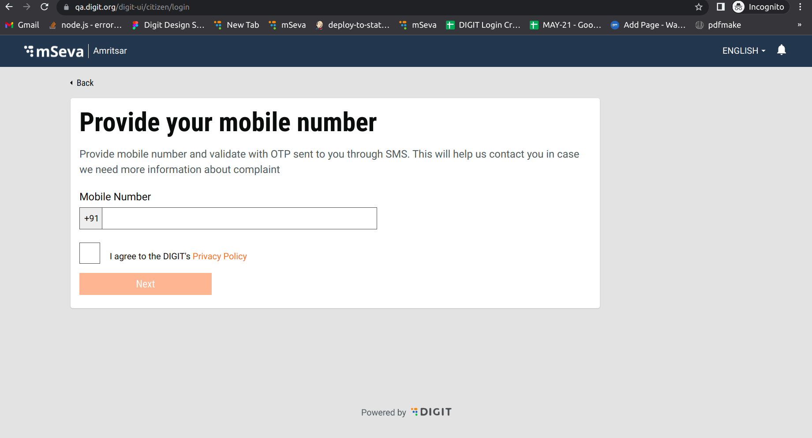
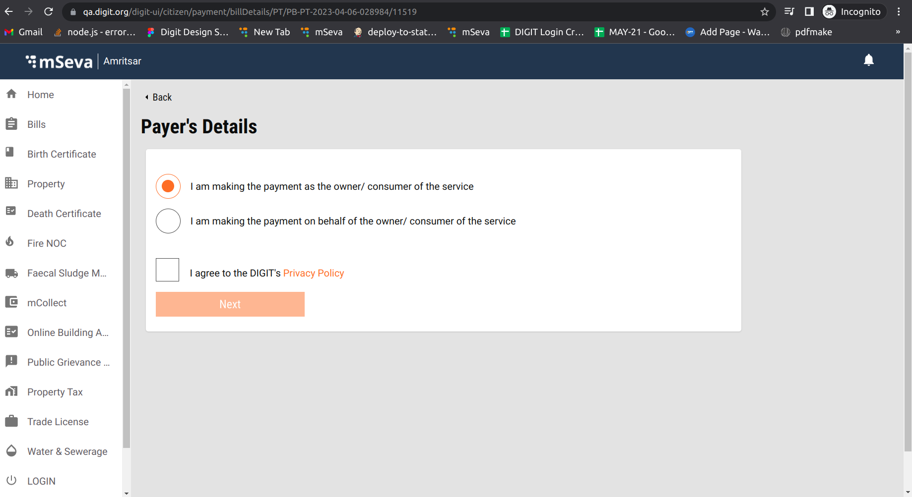
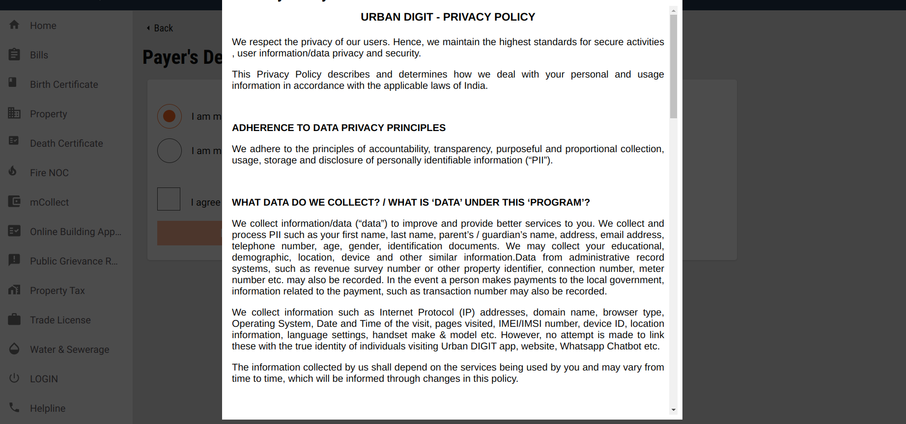

# Citizen Consent Form UI

**Objective:** This feature allows users to get consent from the citizen during the citizen login. This is needed only on the citizen/architect side of the login. This feature is present on the citizen login page where the user is allowed to make payments without login.

## Workflow Details

<figure><figcaption></figcaption></figure>

Citizen users must enter their mobile number and tick the check box. Clicking on the Next button enables users to log in.

The next screen is visible as below:

<figure><figcaption></figcaption></figure>

Enter mandatory fields and tick the check box. Clicking on the Next button enables users to proceed to the next step.

Clicking on Privacy Policy opens a popup with the policy content.

<figure><figcaption></figcaption></figure>

## **Technical Implementation**

### **Enabling The Feature**

Using the MDMS, we can enable or disable the feature by setting the param `isCitizenConsentFormEnabled`: true or false in the MDMS file ([CitizenConsentForm.json](https://github.com/egovernments/egov-mdms-data/blob/QA/data/pb/common-masters/CitizenConsentForm.json)).\
Setting it to true indicates the feature is enabled. Setting it to false indicates the feature is disabled (old logic will work as it is).

### **Citizen Login Page**

The first step is to enable the feature in MDMS and add the check box labels  `checkBoxLabels` in the MDMS file [CitizenConsentForm.json](https://github.com/egovernments/egov-mdms-data/blob/QA/data/pb/common-masters/CitizenConsentForm.json).

File Path: [SelectMobileNumber.js](https://github.com/egovernments/DIGIT-Dev/blob/develop/frontend/micro-ui/web/micro-ui-internals/packages/modules/core/src/pages/citizen/Login/SelectMobileNumber.js)\
Component: `CitizenConsentForm` (File path: [CitizenConsentForm.js](https://github.com/egovernments/DIGIT-Dev/blob/develop/frontend/micro-ui/web/micro-ui-internals/packages/react-components/src/atoms/CitizenConsentForm.js) )

### **Make Payments Without Login**

The first step is to enable the feature in MDMS and add the check box labels `checkBoxLabels` in the MDMS file [CitizenConsentForm.json](https://github.com/egovernments/egov-mdms-data/blob/QA/data/pb/common-masters/CitizenConsentForm.json)\
\
File Path: [index.js](https://github.com/egovernments/DIGIT-Dev/blob/develop/frontend/micro-ui/web/micro-ui-internals/packages/modules/common/src/payments/citizen/payers-details/index.js)\
Component: `CitizenConsentForm` (File path: [CitizenConsentForm.js](https://github.com/egovernments/DIGIT-Dev/blob/develop/frontend/micro-ui/web/micro-ui-internals/packages/react-components/src/atoms/CitizenConsentForm.js) )

### **Configure Consent Form Data - Steps**

1. Write the documentation then convert it into HTML. (There are multiple conversion tools online like [Convert Word and PDF files to HTML | Free online HTML editor](https://wordtohtml.net/)). Use anyone to convert the document to HTML. Before converting make sure to format the document using the above link.
2. Share the HTML file with the DevOps team with the bucket name, they will provide the s3 link for html file.&#x20;
3. Take that link and update it in the MDMS file where we configured before [CitizenConsentForm.json](https://github.com/egovernments/egov-mdms-data/blob/QA/data/pb/common-masters/CitizenConsentForm.json). For each instance, we need to create a separate s3 link.\
   \
   Here, use the language as the key and the URL as the param.\
   \
   **Example:** for English, the language key is `en_IN` and value is `https://qa.digit.org/egov-qa-assets/ProductPrivacypolicy.html`

MDMS file: [CitizenConsentForm.json](https://github.com/egovernments/egov-mdms-data/blob/QA/data/pb/common-masters/CitizenConsentForm.json)


```
{
  "tenantId": "pb",
  "moduleName": "common-masters",
  "CitizenConsentForm": [
    {
      "isCitizenConsentFormEnabled": true,
      "checkBoxLabels": [
        {
          "linkPrefix": "CCF_I_AGREE_THE_DIGITS",
          "link": "CCF_PRIVACY_POLICY",
          "linkId": "PrivacyPolicy",
          "linkPostfix": "",
          "en_IN": "https://qa.digit.org/egov-qa-assets/ProductPrivacypolicy.html"
        }
      ]
    }
  ]
}
```


Here,\
1\. **isCitizenConsentFormEnabled** is used to enable the citizen consent form.\
2\. **checkBoxLabels** is used to display labels along with the link.\
3\. **link** is used to display the link.\
4\. **linkId** is used to pass the id to the header to display the header dynamically.\
5\. **en\_IN** is the language code and is also used to display the content using the s3 link.\
6\. **linkPrefix** is used to display the link pre-content.\
7\. **linkPostfix** is used to display the link post content.\
8\. **CitizenConsentForm** is the mdms config.

### **Citizen Consent Form Old UI Login**

**MDMS:** The same file is used in OLD UI also i.e. ( [CitizenConsentForm.json](https://github.com/egovernments/egov-mdms-data/blob/QA/data/pb/common-masters/CitizenConsentForm.json) )\
**File Path:** Added one more object in the login form config. ([login.js](https://github.com/egovernments/DIGIT-Dev/blob/develop/frontend/mono-ui/web/rainmaker/packages/citizen/src/config/forms/specs/login.js) )\
The logic of the Citizen Consent Form is in the below files.

1. [index.js](https://github.com/egovernments/DIGIT-Dev/blob/develop/frontend/mono-ui/web/rainmaker/packages/citizen/src/modules/citizen/User/Login/components/LoginForm/index.js)
2. [index.js](https://github.com/egovernments/DIGIT-Dev/blob/develop/frontend/mono-ui/web/rainmaker/packages/citizen/src/modules/citizen/User/Login/index.js)

## **Localisation**

Localisation keys are added under the ‘_rainmaker-common_’ locale module.\
