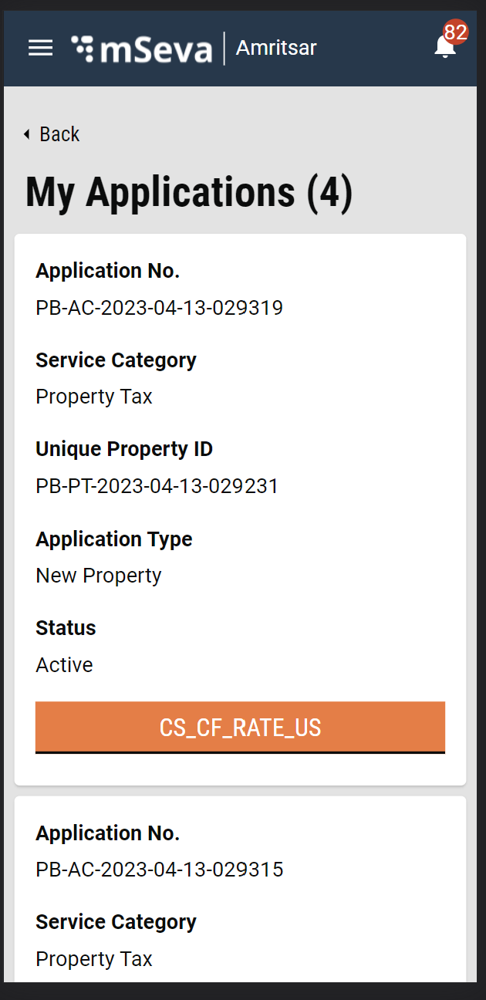
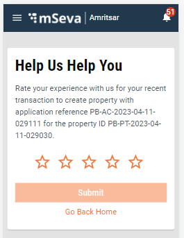
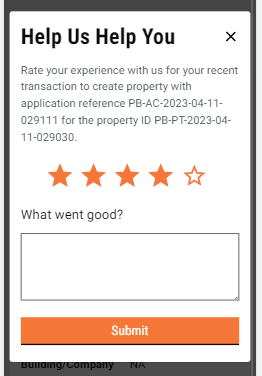

# Citizen Feedback UI

**Objective:** To provide the user facility to submit feedback/ratings at the end of the service.

## **Citizen Feedback Flow**

Users can provide feedback for the following at the end of the flows for create, mutate, update and payment for property tax. If the review is skipped, users can provide their reviews once the property is active on my application details page. The user will receive a pop-up for the feedback.

In the My Application screen, the service search API is called with tenantId and referenceIds (an array of acknowledgement numbers retrieved from property search) in order to get the data of the submitted feedback. The following labels are displayed on the action button:

* If the review is done and active: View.
* If the review is not done and active: Rate Us.
* If the application is in progress: Track.

#### API Curl


```
curl 'https://qa.digit.org/service-request/service/v1/_search?_=1681472244925' \
  -H 'authority: qa.digit.org' \
  -H 'accept: application/json, text/plain, */*' \
  -H 'accept-language: en-US,en;q=0.9' \
  -H 'content-type: application/json;charset=UTF-8' \
  -H 'origin: https://qa.digit.org' \
  -H 'referer: https://qa.digit.org/digit-ui/citizen/pt/property/my-applications' \
  -H 'sec-ch-ua: "Chromium";v="112", "Google Chrome";v="112", "Not:A-Brand";v="99"' \
  -H 'sec-ch-ua-mobile: ?1' \
  -H 'sec-ch-ua-platform: "Android"' \
  -H 'sec-fetch-dest: empty' \
  -H 'sec-fetch-mode: cors' \
  -H 'sec-fetch-site: same-origin' \
  -H 'user-agent: Mozilla/5.0 (Linux; Android 8.0.0; SM-G955U Build/R16NW) AppleWebKit/537.36 (KHTML, like Gecko) Chrome/87.0.4280.141 Mobile Safari/537.36' \
  --data-raw '{"ServiceCriteria":{"tenantId":"pb.amritsar","referenceIds":["PB-AC-2023-04-13-029319","PB-AC-2023-04-13-029315","PB-AC-2023-04-13-029314","PB-AC-2023-04-11-029112"]},"RequestInfo":{"apiId":"Rainmaker","authToken":"47980bef-b2bb-44d3-80e6-a36354690735","userInfo":{"id":16490,"uuid":"7d82122e-1e91-4f34-893f-d16963af217a","userName":"7979797979","name":"Debasish","mobileNumber":"7979797979","emailId":"gubbi678@gmail.com","locale":null,"type":"CITIZEN","roles":[{"name":"Citizen","code":"CITIZEN","tenantId":"pb"}],"active":true,"tenantId":"pb","permanentCity":null},"msgId":"1681472244925|en_IN","plainAccessRequest":{}}}' \
  --compressed
  
```


<div align="left">

<figure><figcaption></figcaption></figure>

</div>

Inside the Application details page also service search is also called in order to check whether the feedback has been done or not, if it has been done for that particular application popup is not visible otherwise pop-up displays once the application details page opens up.

#### Citizen Feedback Screen

On this screen, the user is able to give a rating by clicking on the stars (out of 5). Once the stars are clicked, according to the value, “What went wrong?” or “What went good?” comment box is visible, which is a non-mandatory field where the user can add their comment for the review/rating.

<div align="left">

<figure><figcaption></figcaption></figure>

</div>

<div align="left">

<figure><figcaption></figcaption></figure>

</div>

#### Citizen Feedback Acknowledgement

Once the user submits the rating, the Search API is called in order to retrieve the service definition for the particular business service, and with that ID the Create API is called for the submission of the review. Based on the success or failure of the call, the screen displays the acknowledgement page. Once the review is submitted, a toast message is displayed providing the status of the submission as a popup.

#### Search definition API Curl


```
curl 'https://qa.digit.org/service-request/service/definition/v1/_search?_=1681191005369' \
  -H 'authority: qa.digit.org' \
  -H 'accept: application/json, text/plain, */*' \
  -H 'accept-language: en-US,en;q=0.9' \
  -H 'content-type: application/json;charset=UTF-8' \
  -H 'cookie: _ga=GA1.2.2133756512.1676450222; __cuid=7b0fe5a8761f49f6bff7ede48649b0dc; amp_fef1e8=248239ce-459d-4f23-8e85-6eaecb3b54d0R...1gpckta4o.1gpckta4s.2.0.2' \
  -H 'origin: https://qa.digit.org' \
  -H 'referer: https://qa.digit.org/digit-ui/citizen/feedback?redirectedFrom=/digit-ui/citizen/pt/property/new-application/acknowledgement&propertyId=PB-PT-2023-04-11-029030&acknowldgementNumber=PB-AC-2023-04-11-029111&creationReason=CREATE&tenantId=pb.amritsar' \
  -H 'sec-ch-ua: "Google Chrome";v="111", "Not(A:Brand";v="8", "Chromium";v="111"' \
  -H 'sec-ch-ua-mobile: ?1' \
  -H 'sec-ch-ua-platform: "Android"' \
  -H 'sec-fetch-dest: empty' \
  -H 'sec-fetch-mode: cors' \
  -H 'sec-fetch-site: same-origin' \
  -H 'user-agent: Mozilla/5.0 (Linux; Android 8.0.0; SM-G955U Build/R16NW) AppleWebKit/537.36 (KHTML, like Gecko) Chrome/87.0.4280.141 Mobile Safari/537.36' \
  --data-raw '{"ServiceDefinitionCriteria":{"tenantId":"pb.amritsar","code":["PT_CREATE"],"module":["PT"]},"RequestInfo":{"apiId":"Rainmaker","authToken":"810eb623-32e8-43d3-bf9f-cd1152faf856","userInfo":{"id":16490,"uuid":"7d82122e-1e91-4f34-893f-d16963af217a","userName":"7979797979","name":"Debasish","mobileNumber":"7979797979","emailId":"gubbi678@gmail.com","locale":null,"type":"CITIZEN","roles":[{"name":"Citizen","code":"CITIZEN","tenantId":"pb"}],"active":true,"tenantId":"pb","permanentCity":null},"msgId":"1681191005368|en_IN","plainAccessRequest":{}}}' \
  --compressed
```


For Service Create following request object is needed :


```json
{
    "tenantId": "pb.amritsar",
    "serviceDefId": "aa85214f-8c8c-4f26-a064-6e324479e6bb",
    "isActive": true,
    "attributes": [
        {
            "attributeCode": "consumerCode",
            "value": "PB-PT-2023-04-13-029231",
            "additionalDetails": {}
        },
        {
            "attributeCode": "rating",
            "value": 3,
            "additionalDetails": {}
        },
        {
            "attributeCode": "comments",
            "value": "12345678901234567890123456789012345678901234567890",
            "additionalDetails": {}
        },
        {
            "attributeCode": "channel",
            "value": "Online",
            "additionalDetails": {}
        }
    ],
    "additionalDetails": {
        "locality": "SUN02"
    },
    "accountId": "7d82122e-1e91-4f34-893f-d16963af217a",
    "referenceId": "PB-AC-2023-04-13-029319"
}
```


Service Create API curl :


```
curl 'https://qa.digit.org/service-request/service/v1/_create' \
  -H 'authority: qa.digit.org' \
  -H 'accept: application/json, text/plain, */*' \
  -H 'accept-language: en-US,en;q=0.9' \
  -H 'content-type: application/json;charset=UTF-8' \
  -H 'origin: https://qa.digit.org' \
  -H 'referer: https://qa.digit.org/digit-ui/citizen/pt/property/application/PB-AC-2023-04-13-029319/pb.amritsar' \
  -H 'sec-ch-ua: "Chromium";v="112", "Google Chrome";v="112", "Not:A-Brand";v="99"' \
  -H 'sec-ch-ua-mobile: ?1' \
  -H 'sec-ch-ua-platform: "Android"' \
  -H 'sec-fetch-dest: empty' \
  -H 'sec-fetch-mode: cors' \
  -H 'sec-fetch-site: same-origin' \
  -H 'user-agent: Mozilla/5.0 (Linux; Android 8.0.0; SM-G955U Build/R16NW) AppleWebKit/537.36 (KHTML, like Gecko) Chrome/87.0.4280.141 Mobile Safari/537.36' \
  --data-raw '{"Service":{"tenantId":"pb.amritsar","serviceDefId":"aa85214f-8c8c-4f26-a064-6e324479e6bb","isActive":true,"attributes":[{"attributeCode":"consumerCode","value":"PB-PT-2023-04-13-029231","additionalDetails":{}},{"attributeCode":"rating","value":3,"additionalDetails":{}},{"attributeCode":"comments","value":"12345678901234567890123456789012345678901234567890","additionalDetails":{}},{"attributeCode":"channel","value":"Online","additionalDetails":{}}],"additionalDetails":{"locality":"SUN02"},"accountId":"7d82122e-1e91-4f34-893f-d16963af217a","referenceId":"PB-AC-2023-04-13-029319"},"RequestInfo":{"apiId":"Rainmaker","authToken":"47980bef-b2bb-44d3-80e6-a36354690735","userInfo":{"id":16490,"uuid":"7d82122e-1e91-4f34-893f-d16963af217a","userName":"7979797979","name":"Debasish","mobileNumber":"7979797979","emailId":"gubbi678@gmail.com","locale":null,"type":"CITIZEN","roles":[{"name":"Citizen","code":"CITIZEN","tenantId":"pb"}],"active":true,"tenantId":"pb","permanentCity":null},"msgId":"1681472454112|en_IN","plainAccessRequest":{}}}' \
  --compressed
```


<div align="left">

<figure><figcaption></figcaption></figure>

</div>

## Technical Implementation

The citizen feedback screen and acknowledgement screen can be found inside the core module, path for the same respectively are :





In the Citizen feedback component, the card header, card text and the rating value are fetched from the MDMS file. This is configurable in nature and the following hook is being used to get the MDMS data.

```javascript
  const { data: RatingAndFeedBack, isLoading: RatingAndFeedBackLoading } = Digit.Hooks.pt.useRatingAndFeedbackMDMS.RatingAndFeedBack(stateId);
```

## MDMS Data

[RatingAndFeedback.json](https://github.com/egovernments/egov-mdms-data/blob/QA/data/pb/common-masters/RatingAndFeedback.json)


```json
{
    "tenantId": "pb",
    "moduleName": "common-masters",
    "RatingAndFeedback": [
        {
            "type" : "isCitizenRatingEnabled",
            "value" : true
        },
        {
            "type" : "headerByRating",
            "value" : [
                {
                    "minvalue" : 1,
                    "maxvalue" : 3,
                    "code" : "CS_WHAT_WENT_WRONG"
                },
                {
                    "minvalue" : 4,
                    "maxvalue" : 5,
                    "code" : "CS_WHAT_WENT_GOOD"
                }
            ]
        },
        {
            "type" : "enabledScreensList",
            "value" : [
                {
                    "module" : "PT",
                    "bussinessService" : "PT_CREATE",
                    "screenfrom" : "pt/property/new-application/acknowledgement",
                    "cardHeader" : "PT_RATE_HELP_TEXT_CREATE",
                    "cardText" : "PT_RATE_CARD_TEXT_CREATE"
                },
                {
                    "module" : "PT",
                    "bussinessService" : "PT_MUTATION",
                    "screenfrom" : "pt/property/property-mutation/acknowledgement",
                    "cardHeader" : "PT_RATE_HELP_TEXT_MUTATE",
                    "cardText" : "PT_RATE_CARD_TEXT_MUTATE"
                },
                {
                    "module" : "PT",
                    "bussinessService" : "PT_UPDATE",
                    "screenfrom" : "pt/property/edit-application/acknowledgement",
                    "cardHeader" : "PT_RATE_HELP_TEXT_UPDATE",
                    "cardText" : "PT_RATE_CARD_TEXT_UPDATE"
                },
                {
                    "module" : "PT",
                    "bussinessService" : "PT",
                    "screenfrom" : "digit-ui/citizen/payment/success",
                    "cardHeader" : "PT_RATE_HELP_TEXT_PAY",
                    "cardText" : "PT_RATE_CARD_TEXT_PAY"
                 }
            ]
        }
    ]
}
```


## Localisation

Localization keys are added under the ‘_rainmaker-common_’ locale module. In future, if any new labels are implemented in the Citizen Feedback (Citizen) they should also be pushed in the locale DB under the _rainmaker-common_ locale module.

## API Role Action Mapping

<table><thead><tr><th width="346.3333333333333">API</th><th width="139">Action Id</th><th>Role</th></tr></thead><tbody><tr><td>/access/v1/actions/mdms/_get</td><td>870</td><td>CITIZEN</td></tr><tr><td>/egov-mdms-service/v1/_search</td><td>954</td><td>CITIZEN</td></tr><tr><td>/localization/messages/v1/_search</td><td>1531</td><td>CITIZEN</td></tr><tr><td>/service-request/service/definition/v1/_search</td><td></td><td>CITIZEN</td></tr><tr><td>/service-request/service/v1/_create</td><td></td><td>CITIZEN</td></tr><tr><td>/service-request/service/v1/_search</td><td></td><td>CITIZEN</td></tr></tbody></table>

