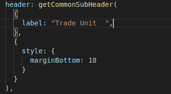
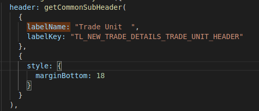

# Setup Base Product Localization

### Overview 

The main reason to Setup Base Product Localization is because Digit system supports multiple languages. By setting-up Localization, we can have multiple language support to the UI. So, that user can easily understand the Digit Operations

### Pre-requisites 

Before you proceed with the configuration, make sure the following pre-requisites are met -

* Before Starting the Localization setup one should have knowledge on React and eGov FrameWork.
* Before setting-up Localization, make sure that all the Keys are pushed to the Create API and also get prepared with the Values that need to be added to the Localization key specific to particular languages that are being added in the product.
* Make sure where to add the Localization in the Code.

### Key Functionalities 

Once the Localization is done, the user can view the Digit Screens in their own language to complete the whole application process easier as digit gives the user to select the language of their choice.

### Deployment Details 

* Once The key is added to the code as per requirement, Deployment can be done in the same way, how the code is being deployed.

### Configuration Details 

* Select a label which is needed to be localized from the Product code. Here is the example code for a header before setting-up Localization.

* As we see the above which supports only the English language, To setup Localization to that header we need to the code in the following manner.

* we can see below code is added when we compare with code before Localization setup.

{

labelName: "Trade Unit ",

labelKey: "TL\_NEW\_TRADE\_DETAILS\_TRADE\_UNIT\_HEADER"

},

* Here the Values to the Key can be added by two methods either by using the localization Screen which is Developed Recently or by updating the values to the keys to create API using the postman application.

### Reference Docs 

#### Doc Links 

|                                                                                                           |                                                                      |
| --------------------------------------------------------------------------------------------------------- | -------------------------------------------------------------------- |
| **Title**                                                                                                 | **Link**                                                             |
| Adding New Language to Digit System. You can refer the link provided for how languages are added in DIGIT | [Adding New Language](../setting-up-a-language/adding-a-language.md) |

[​](http://creativecommons.org/licenses/by/4.0/)All content on this page by [eGov Foundation](https://egov.org.in/) is licensed under a [Creative Commons Attribution 4.0 International License](http://creativecommons.org/licenses/by/4.0/).
