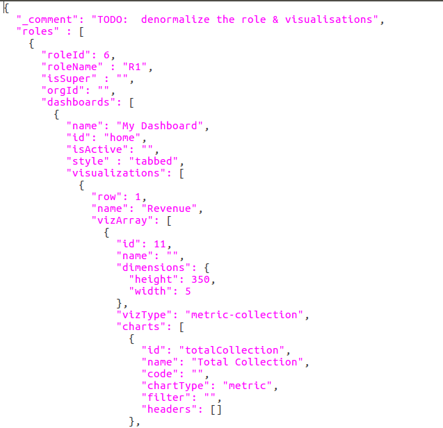
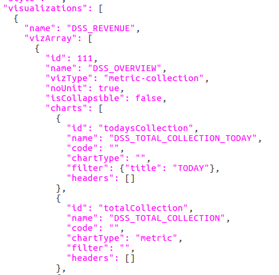
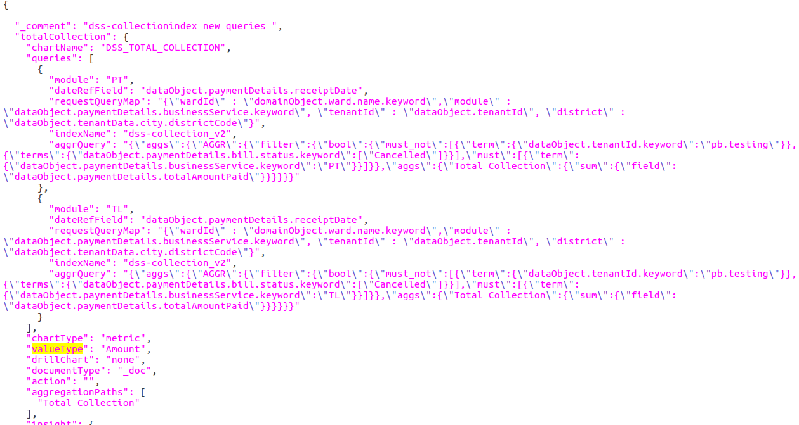

# Building New Dashboards

## Overview 

This documentation talks about building a new dashboard in the DSS and also it defines the configurations required for the analytics service. Analytics microservice which is responsible for building, fetching, aggregating, and computing the data on ElasticSearch to a consumable data response. Which shall be later used for visualizations and graphical representations.

## Pre-requisites 

Before you proceed with the configuration, make sure the following pre-requisites are met -

* Prior Knowledge of JSON
* Prior Knowledge of Elasticsearch Query Language
* Prior Knowledge of Kibana
* DSS setup

## Key Functionalities

1. Adding new roles for dashboards
2. Adding a new dashboard
3. Adding new visualizations in the existing dashboard
4. Adding new charts for visualizations

## Configuration Details

#### **1. Adding Roles and Dashboards**

* To add a new role, make changes in the RoleDashboardMappingsConf.json (**roles** node) configuration file as below. In the roles array, every JSON object is unique based on the id. The name of the role is defined in the roleName attribute.
* If we want to assign any dashboard to a particular role, add the id and name of the dashboard in the dashboard array. This dashboard id is unique and it’s referred to as the MasterDashboardConfig.json file configuration.


Any number of roles & dashboards can be added


Below is a sample to add a new role object

**2. Adding a new Dashboard**

* To add a new dashboard, make changes in the MasterDashboardConfig.json (**dashboards** node) as below.
* Add the new JSON object in the dashboards array. Add the dashboard name in the name attribute, Id should be unique, which is used for assigning a role for the dashboard. We will talk about visualizations below.


Dashboards array add a new dashboard as given below


#### **3. Adding new visualizations in the existing dashboard**

* To add new visualizations, make changes again in the MasterDashboardConfig.json (**vizArray** node) as below. Add the visualization name to the name attribute. We will add all the visualizations in the vizArray array. vizArray will contain the name of the visualization, vizType as visual type, noUnit, and charts.
* charts array contains chart API configuration query details. The id is referred to as the chartapiconfig.json file’s key to fetch the required data from elastic search’s index. And the name attribute is referred to as the name of the chart in localization.


vizArray is to hold multiple visualizations


#### 4. Adding charts for visualizations

* To add a new chart, chartApiConf.json has to be modified as shown below. A new chartid (key of the JSON) has to be added to the chart node object. The chartid JSON contains the chart name, chart type, valueType, documentType, aggregationPaths and queries attribute.
* Types of the chart: **Metric**, **Pie**, **Line**, **Table,** and **xtable**
* AggregationPaths: Query result will take from this path.
* valueType: Based on the value type result will be shown in the UI. Different types of valueType are **Amount, percentage,** and **number.**
* queries array will contain the information of the module, requestQueryMap (request param of the API), dateRefField (Based on this field date data will be filtered), indexName, and aggrQuery. We can add multiple module queries in a single chart.


For more information please refer to the reference documents listed below.


## Reference Docs 

#### Doc Links 

| Description                               | Link                                                                                                                                                                                                                           |
| ----------------------------------------- | ------------------------------------------------------------------------------------------------------------------------------------------------------------------------------------------------------------------------------ |
| DSS Backend Configuration Manual          | [DSS Backend Configuration Manual](https://digit-discuss.atlassian.net/wiki/spaces/EPE/pages/117244081/DSS+Backend+Configuration+Manual)                                                                                       |
| DSS Dashboard - Technical Document for UI | [https://digit-discuss.atlassian.net/wiki/spaces/EPE/pages/283017217/DSS+Dashboard+-+Technical+Document+for+UI](https://digit-discuss.atlassian.net/wiki/spaces/EPE/pages/283017217/DSS+Dashboard+-+Technical+Document+for+UI) |
| DSS Technical Documentation               | [DSS Technical Documentation](https://digit-discuss.atlassian.net/wiki/spaces/EPE/pages/118521886/DSS+Technical+Documentation)                                                                                                 |

####

[​](http://creativecommons.org/licenses/by/4.0/)All content on this page by [eGov Foundation](https://egov.org.in/) is licensed under a [Creative Commons Attribution 4.0 International License](http://creativecommons.org/licenses/by/4.0/).
