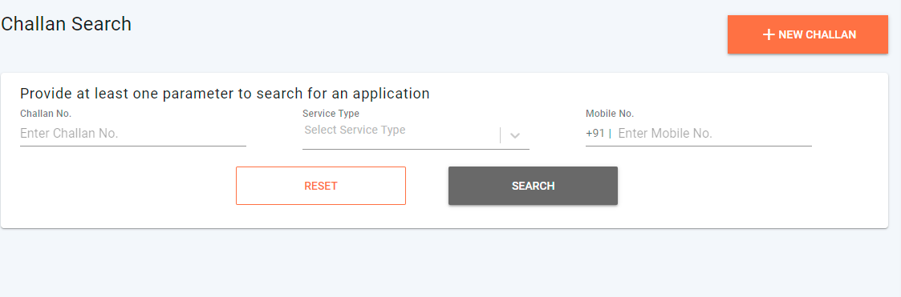

# Search and Pay Challan

## Overview

This page offers the UI details for the search and pays challan feature. Once a challan is created, in order to pay the challan or update the challan, we have to find the relevant challan.

## **Search and Pay**

**A citizen** can only search for the challan, download the challan, and pay for the challan.

In order to make any payment for challans, both _**Citizen and Employee**_ roles, use the **Bill genie** screens to get the bill and can proceed with payment.

[BillGenie](../current-bill-cancellation-ui-flow/)

To enable the service category to search we have to configure `billGineiURL` in MDMS as follow.

```
{
  "businessService": "Taxes.No Dues Certificate",
  "code": "TX.No_Dues_Certificate",
  "collectionModesNotAllowed": [
    "DD"
  ],
  "partPaymentAllowed": false,
  "isAdvanceAllowed": false,
  "demandUpdateTime": 86400000,
  "isVoucherCreationEnabled": true,
  "type": "Adhoc",
  "billGineiURL": "egov-searcher/bill-genie/mcollectbills/_get"
}
```

Once `billGineiURL` is configured for a service, we get an option in bill genie to search for it.

Once the challan is created to Update or cancel challan we use Challan Search.



Click here to find the [Search Challan file](https://github.com/egovernments/frontend/blob/39ffbeb4f5446bbb08729e9ce6cf0d519f2f748c/web/rainmaker/dev-packages/egov-uc-dev/src/ui-config/screens/specs/uc/search.js) and the [Search Results file](https://github.com/egovernments/frontend/blob/39ffbeb4f5446bbb08729e9ce6cf0d519f2f748c/web/rainmaker/dev-packages/egov-uc-dev/src/ui-config/screens/specs/uc/universalCollectionResources/searchChallanResults.js).

## **Localisation Module**

`rainmaker-uc`

**API Used**

1. `egov-mdms-service/v1/_search`
2. `echallan-services/eChallan/v1/_search`

## **Role Action Mapping**

| API                                     | Roles   | Action ID |
| --------------------------------------- | ------- | --------- |
| `egov-mdms-service/v1/_search`          |         | 954       |
| `echallan-services/eChallan/v1/_search` | UC\_EMP | 2114      |

## **Documents and Resource Links**

| Related Title                  | Documentation                                      |
| ------------------------------ | -------------------------------------------------- |
| MCollect Create Challan        | [eChallan - Technical Documentation](./)           |
| MCollect Pay Challan           | [BillGenie](../current-bill-cancellation-ui-flow/) |
| MCollect Edit / Update Challan | [Edit/Cancel Challan](edit-cancel-challan.md)      |

[​](http://creativecommons.org/licenses/by/4.0/)All content on this page by [eGov Foundation](https://egov.org.in/) is licensed under a [Creative Commons Attribution 4.0 International License](http://creativecommons.org/licenses/by/4.0/).
