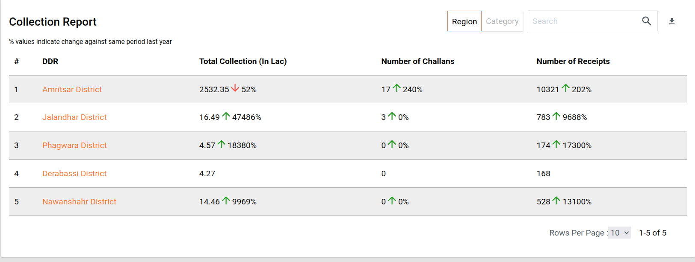

# State DSS - mCollect

## **Overview**

\
DSS has two sides to it. One is the process in which the Data is pooled into ElasticSearch and the other is the way it is fetched, aggregated, computed, transformed and sent across.

As this revolves around a variety of data sets, there is a need for making this configurable. So that, tomorrow, given a new scenario is introduced, it is just a configuration away from getting the newly introduced scenario involved in this flow of the process.&#x20;

This document explains the steps on how to define the configurations for the analytics side of DSS for W\&S.

**What is analytics?**

**Analytics:** Micro Service which is responsible for building, fetching, aggregating and computing the Data on ElasticSearch to a consumable Data Response. Which shall be later used for visualizations and graphical representations. &#x20;

**Analytics Configurations:** Analytics contains multiple configurations. we need to add the changes related to mCollect in this dashboard analytics.

Here is the location : [configs/egov-dss-dashboards/dashboard-analytics at qa · egovernments/configs](https://github.com/egovernments/configs/tree/qa/egov-dss-dashboards/dashboard-analytics)

Below is a list of configurations that need to be changed to run W\&S successfully.

1. Chart API Configuration
2. Master Dashboard Configuration
3. Role Dashboard Mappings Configuration

## Configuration Details <a href="#description" id="description"></a>

**Chart API Configuration**&#x20;

Each visualization has its own properties. Each visualization comes from different data sources (Sometimes it is a combination of different data sources).&#x20;

In order to configure each visualization and its properties, we have a Chart API Configuration Document.

In this, the visualization code, which happens to be the key, will have its properties configured as a part of the configuration and are easily changeable.

Here is the sample ChartApiConfiguration.json data for the mCollect.

```
"mcTodaysCollection": {
    "chartName": "DSS_TOTAL_COLLECTION_TODAY",
    "queries": [
      {
        "module": "COMMON",
        "dateRefField": "",
        "requestQueryMap": "{\"wardId\" : \"domainObject.ward.name.keyword\",\"module\" : \"dataObject.paymentDetails.businessService.keyword\", \"tenantId\" : \"dataObject.tenantId\", \"district\" : \"dataObject.tenantData.city.districtCode\"}",
        "indexName": "dss-collection_v2",
        "aggrQuery": "{\"aggs\":{\"AGGR\":{\"filter\":{\"bool\":{\"must_not\":[{\"terms\":{\"dataObject.tenantId.keyword\":[\"pb.testing\",\"pb\"]}},{\"terms\":{\"dataObject.paymentDetails.bill.status.keyword\":[\"Cancelled\"]}},{\"terms\":{\"dataObject.paymentDetails.businessService.keyword\":[\"TL\",\"PT\"]}}],\"must\":[{\"range\":{\"dataObject.paymentDetails.receiptDate\":{\"gte\":\"now-1d\",\"lte\":\"now\"}}}] }},\"aggs\":{\"Todays Collection\":{\"sum\":{\"field\":\"dataObject.paymentDetails.totalAmountPaid\"}}}}}}"
      }
    ],
    "chartType": "metric",
    "valueType": "Amount",
    "drillChart": "none",
    "documentType": "_doc",
    "action": "",
    "aggregationPaths": [
      "Todays Collection"
    ],
    "insight": {},
    "_comment": " "
  },

  "mcTotalCollection": {
    "chartName": "DSS_TOTAL_COLLECTION",
    "queries": [
      {
        "module": "COMMON",
        "dateRefField": "dataObject.paymentDetails.receiptDate",
        "requestQueryMap": "{\"wardId\" : \"domainObject.ward.name.keyword\",\"module\" : \"dataObject.paymentDetails.businessService.keyword\", \"tenantId\" : \"dataObject.tenantId\", \"district\" : \"dataObject.tenantData.city.districtCode\"}",
        "indexName": "dss-collection_v2",
        "aggrQuery": "{\"aggs\":{\"AGGR\":{\"filter\":{\"bool\":{\"must_not\":[{\"terms\":{\"dataObject.tenantId.keyword\":[\"pb.testing\",\"pb\"]}},{\"terms\":{\"dataObject.paymentDetails.bill.status.keyword\":[\"Cancelled\"]}},{\"terms\":{\"dataObject.paymentDetails.businessService.keyword\":[\"TL\",\"PT\"]}}]}},\"aggs\":{\"Total Collection\":{\"sum\":{\"field\":\"dataObject.paymentDetails.totalAmountPaid\"}}}}}}"
      }
    ],
    "chartType": "metric",
    "valueType": "Amount",
    "drillChart": "none",
    "documentType": "_doc",
    "action": "",
    "aggregationPaths": [
      "Total Collection"
    ],
    "insight": {
      "chartResponseMap" : "mcTotalCollection",
      "action" : "differenceOfNumbers",
      "upwardIndicator" : "positive",
      "downwardIndicator" : "negative",
      "textMessage" : "$indicator$value% than last $insightInterval",
      "colorCode" : "#228B22",
      "insightInterval" : "year"

    },
    "_comment": " "
  },

  "mcCumulativeCollection": {
    "chartName": "DSS_TOTAL_CUMULATIVE_COLLECTION",
    "queries": [
      {
        "module": "COMMON",
        "dateRefField": "dataObject.paymentDetails.receiptDate",
        "requestQueryMap": "{\"wardId\" : \"domainObject.ward.name.keyword\",\r\n  \"module\" : \"dataObject.paymentDetails.businessService.keyword\", \n\"tenantId\" : \"dataObject.tenantId\"}",
        "indexName": "dss-collection_v2",
        "aggrQuery": "{\"aggs\":{\"AGGR\":{\"filter\":{\"bool\":{\"must_not\":[{\"terms\":{\"dataObject.tenantId.keyword\":[\"pb.testing\",\"pb\"]}},{\"terms\":{\"dataObject.bill.status.keyword\":[\"Cancelled\"]}},{\"terms\":{\"dataObject.paymentDetails.businessService.keyword\":[\"TL\",\"PT\"]}}]}},\"aggs\":{\"Collections\":{\"date_histogram\":{\"field\":\"dataObject.paymentDetails.receiptDate\",\"interval\":\"intervalvalue\"},\"aggs\":{\"Sum\":{\"sum\":{\"field\":\"dataObject.paymentDetails.totalAmountPaid\"}}}}}}}}"
      }
    ],
    "chartType": "line",
    "valueType": "amount",
    "action": "",
    "drillChart": "none",
    "documentType": "_doc",
    "aggregationPaths": [
      "Collections"
    ],
    "isCumulative": true,
    "interval": "month",
    "insight": {},
    "_comment": " "
  },
  "mcTargetAchieved": {
    "chartName": "DSS_TARGET_ACHIEVED",
    "queries": [
      {
        "module": "COMMON",
        "requestQueryMap": "{\r\n  \"module\" : \"businessService.keyword\", \n\"tenantId\" : \"tenantIdForMunicipalCorporation\"}",
        "dateRefField": "",
        "indexName": "dss-target_v1",
        "aggrQuery": "{\"aggs\":{\"Actual collection\":{\"sum\":{\"field\":\"budgetProposedForMunicipalCorporation\"}}}}"
      },
      {
        "module": "COMMON",
        "requestQueryMap": "{\"wardId\" : \"domainObject.ward.name.keyword\",\r\n  \"district\" : \"dataObject.tenantData.city.districtCode\", \"module\" : \"dataObject.paymentDetails.businessService.keyword\", \n\"tenantId\" : \"dataObject.tenantId\"}",
        "dateRefField": "dataObject.paymentDetails.receiptDate",
        "indexName": "dss-collection_v2",
        "aggrQuery": "{\"aggs\":{\"AGGR\":{\"filter\":{\"bool\":{\"must_not\":[{\"terms\":{\"dataObject.tenantId.keyword\":[\"pb.testing\",\"pb\"]}},{\"terms\":{\"dataObject.bill.status.keyword\":[\"Cancelled\"]}},{\"terms\":{\"dataObject.paymentDetails.businessService.keyword\":[\"TL\",\"PT\"]}}]}},\"aggs\":{\"Total Collection3\":{\"sum\":{\"field\":\"dataObject.paymentDetails.totalAmountPaid\"}}}}}}"
      }
    ],
    "chartType": "metric",
    "valueType": "percentage",
    "drillChart": "none",
    "documentType": "_doc",
    "action": "percentage",
    "aggregationPaths": [
      "Total Collection3",
      "Actual collection"
    ],
    "insight": {
      "chartResponseMap": "targetAchieved",
      "action": "differenceOfNumbers",
      "upwardIndicator": "positive",
      "downwardIndicator": "negative",
      "textMessage": "$indicator$value% than last $insightInterval",
      "colorCode": "#228B22",
      "insightInterval": "month"
    },
    "_comment": " "
  },
  
  "mcTotalCollectionCategoryWise": {
    "chartName": "DSS_MC_COLLECTION_CATEGORY_WISE",
    "queries": [
      {
        "module": "COMMON",
        "requestQueryMap": "{\"wardId\" : \"domainObject.ward.name.keyword\", \"tenantId\" : \"dataObject.tenantId\", \"district\" : \"dataObject.tenantData.cityDistrictCode\"}",
        "dateRefField": "dataObject.paymentDetails.receiptDate",
        "indexName": "dss-collection_v2",
        "aggrQuery": "{\"aggs\":{\"AGGR\":{\"filter\":{\"bool\":{\"must_not\":[{\"terms\":{\"dataObject.tenantId.keyword\":[\"pb.testing\",\"pb\"]}},{\"terms\":{\"dataObject.bill.status.keyword\":[\"Cancelled\"]}},{\"terms\":{\"dataObject.paymentDetails.businessService.keyword\":[\"PT\",\"TL\"]}}]}},\"aggs\":{\"Business Service\":{\"terms\":{\"field\":\"dataObject.paymentDetails.businessService.keyword\",\"order\":{\"total\":\"desc\"}},\"aggs\":{\"total\":{\"sum\":{\"field\":\"dataObject.paymentDetails.totalAmountPaid\"}}}}}}}}"
      }
    ],
    "chartType": "pie",
    "valueType": "amount",
    "action": "",
    "documentType": "_doc",
    "drillChart": "none",
    "aggregationPaths": [
      "Business Service"
    ],
    "insight": {},
    "_comment": " "
  },

  "mcCollectionByPaymentType": {
    "chartName": "DSS_MC_COLLECTION_BY_PAYMENT_TYPE",
    "queries": [
      {
        "module": "COMMON",
        "requestQueryMap": "{\"module\" : \"dataObject.paymentDetails.businessService.keyword\", \"tenantId\" : \"dataObject.tenantId\"}",
        "dateRefField": "dataObject.paymentDetails.receiptDate",
        "indexName": "dss-collection_v2",
        "aggrQuery": "{\"aggs\":{\"AGGR\":{\"filter\":{\"bool\":{\"must_not\":[{\"terms\":{\"dataObject.tenantId.keyword\":[\"pb.testing\",\"pb\"]}},{\"terms\":{\"dataObject.bill.status.keyword\":[\"Cancelled\"]}},{\"terms\":{\"dataObject.paymentDetails.businessService.keyword\":[\"TL\",\"PT\"]}}]}},\"aggs\":{\"Payment Mode\":{\"terms\":{\"field\":\"dataObject.paymentMode.keyword\"},\"aggs\":{\"Total collection\":{\"sum\":{\"field\":\"dataObject.paymentDetails.totalAmountPaid\"}}}}}}}}"
      }
    ],
    "chartType": "pie",
    "valueType": "amount",
    "action": "",
    "documentType": "_doc",
    "drillChart": "none",
    "aggregationPaths": [
      "Payment Mode"
    ],
    "insight": {},
    "_comment": ""
  },

  "totalmcDDRRevenue": {
    "chartName": "DSS_MC_KEY_FY_INDICATORS",
    "queries": [
      {
        "module": "COMMON",
        "requestQueryMap": "{\"wardId\" : \"domainObject.ward.name.keyword\", \"tenantId\" : \"dataObject.tenantId\", \"district\" : \"dataObject.tenantData.cityDistrictCode\"}",
        "dateRefField": "dataObject.paymentDetails.receiptDate",
        "indexName": "dss-collection_v2",
        "aggrQuery": "{\"aggs\":{\"AGGR\":{\"filter\":{\"bool\":{\"must_not\":[{\"terms\":{\"dataObject.tenantId.keyword\":[\"pb.testing\",\"pb\"]}},{\"terms\":{\"dataObject.paymentDetails.bill.status.keyword\":[\"Cancelled\"]}}]}},\"aggs\":{\"Total Collection\":{\"sum\":{\"field\":\"dataObject.paymentDetails.totalAmountPaid\"}},\"Transactions\":{\"value_count\":{\"field\":\"dataObject.transactionNumber.keyword\"}}}}}}"
      },
      {
        "module": "COMMON",
        "requestQueryMap": "{\"module\" : \"businessService.keyword\", \"tenantId\" : \"tenantIdForMunicipalCorporation.keyword\"}",
        "dateRefField": "",
        "indexName": "dss-target_v1",
        "aggrQuery": "{\"aggs\":{\"Target Collection\":{\"sum\":{\"field\":\"budgetProposedForMunicipalCorporation\"}}}}}}"
      }
    ],
    "isMdmsEnabled": true,
    "filterKeys": [
      {
        "key": "Business Service",
        "column": "Business Service"
      }
    ],
    "isPostResponseHandler": true,
    "postAggregationTheory": "repsonseToDifferenceOfDates",
    "chartType": "table",
    "valueType": "number",
    "drillChart": "totalmcBoundaryRevenue",
    "documentType": "_doc",
    "action": "",
    "plotLabel": "Business Service",
    "aggregationPaths": [
      "Total Collection",
      "Transactions",
      "Target Collection"
    ],
    "pathDataTypeMapping": [
      {
        "Total Collection": "amount"
      },
      {
        "Transactions": "number"
      },
      {
        "Target Collection": "amount"
      }
    ],
    "insight": {},
    "_comment": ""
  },

  "totalmcBoundaryRevenue": {
    "chartName": "DSS_MC_DEMAND_COLLECTION_BOUNDARY",
    "queries": [
      {
        "module": "COMMON",
        "requestQueryMap": "{\"wardId\" : \"domainObject.ward.name.keyword\", \"tenantId\" : \"dataObject.tenantId\", \"district\" : \"dataObject.tenantData.cityDistrictCode\"}",
        "dateRefField": "dataObject.paymentDetails.receiptDate",
        "indexName": "dss-collection_v2",
        "aggrQuery": "{\"aggs\":{\"AGGR\":{\"filter\":{\"bool\":{\"must_not\":[{\"terms\":{\"dataObject.tenantId.keyword\":[\"pb.testing\",\"pb\"]}},{\"terms\":{\"dataObject.paymentDetails.bill.status.keyword\":[\"Cancelled\"]}}]}},\"aggs\":{\"Business Service \":{\"terms\":{\"field\":\"dataObject.paymentDetails.businessService.keyword\",\"size\":2000,\"order\":{\"total\":\"asc\"}},\"aggs\":{\"Total Collection\":{\"sum\":{\"field\":\"dataObject.paymentDetails.totalAmountPaid\"}},\"Transactions\":{\"value_count\":{\"field\":\"dataObject.transactionNumber.keyword\"}}}}}}}}"
      },
      {
        "module": "COMMON",
        "requestQueryMap": "{\"module\" : \"businessService.keyword\", \"tenantId\" : \"tenantIdForMunicipalCorporation.keyword\"}",
        "dateRefField": "",
        "indexName": "dss-target_v1",
        "aggrQuery": "{\"aggs\":{\"Business Service \":{\"terms\":{\"field\":\"tenantIdForMunicipalCorporation.keyword\",\"size\":1000},\"aggs\":{\"Target Collection\":{\"sum\":{\"field\":\"budgetProposedForMunicipalCorporation\"}}}}}}"
      }
    ],
    "filterKeys": [
      {
        "key": "Business Service",
        "column": "Business Service"
      }
    ],
    "postAggregationTheory": "repsonseToDifferenceOfDates",
    "chartType": "table",
    "valueType": "number",
    "drillChart": "totalmcBoundaryDrillDown",
    "documentType": "_doc",
    "action": "",
    "plotLabel": "Business Service",
    "aggregationPaths": [
      "Total Collection",
      "Transactions",
      "Target Collection"
    ],
    "pathDataTypeMapping": [
      {
        "Total Collection": "amount"
      },
      {
        "Transactions": "number"
      },
      {
        "Target Collection": "amount"
      }
    ],
    "insight": {},
    "_comment": ""
  },

  "totalmcBoundaryDrillDown": {
    "chartName": "DSS_MC_DEMAND_COLLECTION_BOUNDARYDDR",
    "queries": [
      {
        "module": "MC",
        "requestQueryMap": "{\"wardId\" : \"domainObject.ward.name.keyword\", \"tenantId\" : \"dataObject.tenantId\", \"district\" : \"dataObject.tenantData.cityDistrictCode\"}",
        "dateRefField": "dataObject.paymentDetails.receiptDate",
        "indexName": "dss-collection_v2",
        "aggrQuery": "{\"aggs\":{\"AGGR\":{\"filter\":{\"bool\":{\"must_not\":[{\"terms\":{\"dataObject.tenantId.keyword\":[\"pb.testing\",\"pb\"]}},{\"terms\":{\"dataObject.paymentDetails.bill.status.keyword\":[\"Cancelled\"]}},{\"terms\":{\"dataObject.paymentDetails.businessService.keyword\":[\"TL\",\"PT\"]}}]}},\"aggs\":{\"Business Service \":{\"terms\":{\"field\":\"dataObject.paymentDetails.businessService.keyword\",\"size\":200,\"order\":{\"Total Collection\":\"desc\"}},\"aggs\":{\"Total Collection\":{\"sum\":{\"field\":\"dataObject.paymentDetails.totalAmountPaid\"}},\"Transactions\":{\"value_count\":{\"field\":\"dataObject.transactionNumber.keyword\"}}}}}}}}"
      }
    ],
    "postAggregationTheory": "repsonseToDifferenceOfDates",
     "filterKeys": [
      {"key": "businessService", "column": "Business Service"}
    ],
    "chartType": "xtable",
    "valueType": "number",
    "drillChart": "none",
    "documentType": "_doc",
    "plotLabel": "Boundary",
    "action": "",

    "aggregationPaths": [
      "Total Collection",
      "Transactions"
    ],
    "pathDataTypeMapping": [
      {
        "Total Collection": "amount"
      },
      {
        "Transactions": "number"
      }
    ],
    "insight": {},
    "_comment": ""
  },
  "mcCollectionByStatus":{
    "chartName": "DSS_MC_COLLECTION_BY_STATUS",
    "queries": [
      {
        "module": "COMMON",
        "requestQueryMap": "{\"module\" : \"dataObject.paymentDetails.businessService.keyword\", \"tenantId\" : \"dataObject.tenantId\"}",
        "dateRefField": "dataObject.paymentDetails.receiptDate",
        "indexName": "dss-collection_v2",
        "aggrQuery": "{\"aggs\":{\"AGGR\":{\"filter\":{\"bool\":{\"must_not\":[{\"terms\":{\"dataObject.tenantId.keyword\":[\"pb.testing\",\"pb\"]}},{\"terms\":{\"dataObject.bill.status.keyword\":[\"Cancelled\"]}},{\"terms\":{\"dataObject.paymentDetails.businessService.keyword\":[\"TL\",\"PT\"]}}]}},\"aggs\":{\"Payment Status\":{\"terms\":{\"field\":\"dataObject.paymentStatus.keyword\"},\"aggs\":{\"Total Collection\":{\"sum\":{\"field\":\"dataObject.paymentDetails.totalAmountPaid\"}}}}}}}}"
      }
    ],
    "chartType": "pie",
    "valueType": "amount",
    "action": "",
    "documentType": "_doc",
    "drillChart": "none",
    "aggregationPaths": [
      "Payment Status"
    ],
    "insight": {
    },
    "_comment": " collection/amount by status"
  },

  "mcReceiptsByStatus":{
    "chartName": "DSS_MC_RECEIPTS_BY_STATUS",
    "queries": [
      {
        "module": "COMMON",
        "requestQueryMap": "{\"module\" : \"dataObject.paymentDetails.businessService.keyword\", \"tenantId\" : \"dataObject.tenantId\"}",
        "dateRefField": "dataObject.paymentDetails.receiptDate",
        "indexName": "dss-collection_v2",
        "aggrQuery": "{\"aggs\":{\"AGGR\":{\"filter\":{\"bool\":{\"must_not\":[{\"terms\":{\"dataObject.tenantId.keyword\":[\"pb.testing\",\"pb\"]}},{\"terms\":{\"dataObject.bill.status.keyword\":[\"Cancelled\"]}},{\"terms\":{\"dataObject.paymentDetails.businessService.keyword\":[\"TL\",\"PT\"]}}]}},\"aggs\":{\"Payment Status\":{\"terms\":{\"field\":\"dataObject.paymentStatus.keyword\"},\"aggs\":{\"Total Receipts\":{\"cardinality\":{\"field\":\"dataObject.paymentDetails.receiptNumber.keyword\"}}}}}}}}"
      }
    ],
    "chartType": "pie",
    "valueType": "number",
    "action": "",
    "documentType": "_doc",
    "drillChart": "none",
    "aggregationPaths": [
      "Payment Status"
    ],
    "insight": {
    },
    "_comment": " Receipts count by status"
  },

  "mcReceiptsByPaymentMode":{
    "chartName": "DSS_MC_RECEIPTS_BY_PAYMENTMODE",
    "queries": [
      {
        "module": "COMMON",
        "requestQueryMap": "{\"module\" : \"dataObject.paymentDetails.businessService.keyword\", \"tenantId\" : \"dataObject.tenantId\"}",
        "dateRefField": "dataObject.paymentDetails.receiptDate",
        "indexName": "dss-collection_v2",
        "aggrQuery": "{\"aggs\":{\"AGGR\":{\"filter\":{\"bool\":{\"must_not\":[{\"terms\":{\"dataObject.tenantId.keyword\":[\"pb.testing\",\"pb\"]}},{\"terms\":{\"dataObject.bill.status.keyword\":[\"Cancelled\"]}},{\"terms\":{\"dataObject.paymentDetails.businessService.keyword\":[\"TL\",\"PT\"]}}]}},\"aggs\":{\"Payment Mode\":{\"terms\":{\"field\":\"dataObject.paymentMode.keyword\"},\"aggs\":{\"Total Receipts\":{\"cardinality\":{\"field\":\"dataObject.paymentDetails.receiptNumber.keyword\"}}}}}}}}"
      }
    ],
    "chartType": "pie",
    "valueType": "number",
    "action": "",
    "documentType": "_doc",
    "drillChart": "none",
    "aggregationPaths": [
      "Payment Mode"
    ],
    "insight": {
    },
    "_comment": " Receipts count by payment mode"
  },

  "mcMonthlyCollectionReport": {
    "chartName": "DSS_MC_MONTHLY_REPORT",
    "queries": [
      {
        "module": "COMMON",
        "dateRefField": "dataObject.paymentDetails.receiptDate",
        "requestQueryMap": "{\"wardId\" : \"domainObject.ward.name.keyword\",\"module\" : \"dataObject.Bill.billDetails.businessService.keyword\", \"tenantId\" : \"dataObject.tenantId\", \"district\" : \"dataObject.tenantData.cityDistrictCode\" }",
        "indexName": "dss-collection_v2",
        "aggrQuery": "{\"aggs\":{\"AGGR\":{\"filter\":{\"bool\":{\"must_not\":[{\"terms\":{\"dataObject.tenantId.keyword\":[\"pb.testing\",\"pb\"]}},{\"terms\":{\"dataObject.paymentDetails.bill.status.keyword\":[\"Cancelled\"]}},{\"terms\":{\"dataObject.paymentDetails.businessService.keyword\":[\"TL\",\"PT\"]}}]}},\"aggs\":{\"Collections\":{\"date_histogram\":{\"field\":\"dataObject.paymentDetails.receiptDate\",\"interval\":\"month\"},\"aggs\":{\"Sum\":{\"sum\":{\"field\":\"dataObject.paymentDetails.totalAmountPaid\"}}}},\"Receipts\":{\"date_histogram\":{\"field\":\"dataObject.paymentDetails.receiptDate\",\"interval\":\"month\"},\"aggs\":{\"Total Receipts\":{\"cardinality\":{\"field\":\"dataObject.paymentDetails.receiptNumber.keyword\"}}}} }}}}"
      }
    ],
    "chartType": "line",
    "valueType": "amount",
    "action": "",
    "drillChart": "none",
    "documentType": "_doc",
    "aggregationPaths": [
      "Collections",
      "Receipts"
    ],
    "pathDataTypeMapping": [
      {
        "Collections": "amount"
      },
      {
        "Receipts": "number"
      }
    ],
    "isCumulative": false,
    "interval": "month",
    "insight": {
    },
    "_comment": " "
  },

  "mcChallanCountByStatus": {
    "chartName": "DSS_MC_CHALLAN_COUNT_BY_STATUS",
    "queries": [
      {
        "module": "CHALLAN",
        "dateRefField": "Data.taxPeriodFrom",
        "requestQueryMap": "{\"module\" : \"Data.businessService\", \"tenantId\" : \"Data.tenantId\"}",
        "indexName": "echallan-services",
        "aggrQuery": "{\"aggs\":{\"AGGR\":{\"filter\":{\"bool\":{\"must_not\":[{\"term\":{\"Data.tenantId.keyword\":\"pb.testing\"}}]}},\"aggs\":{\"Status\":{\"terms\":{\"field\":\"Data.applicationStatus.keyword\"},\"aggs\":{\"Challan Count\":{\"cardinality\":{\"field\":\"Data.challanNo.keyword\"}}}}}}}}"
      }
    ],
    "chartType": "pie",
    "valueType": "number",
    "action": "",
    "drillChart": "none",
    "documentType": "_doc",
    "aggregationPaths": [
      "Status"
    ],
    "insight": {
    },
    "_comment": " "
  },

  "mcTotalChallans": {
    "chartName": "DSS_MC_TOTAL_CHALLANS",
    "queries": [
      {
        "module": "CHALLAN",
        "dateRefField": "Data.taxPeriodFrom",
        "requestQueryMap": "{\"module\" : \"Data.businessService\", \"tenantId\" : \"Data.tenantId\"}",
        "indexName": "echallan-services",
        "aggrQuery": "{\"aggs\":{\"AGGR\":{\"filter\":{\"bool\":{\"must_not\":[{\"term\":{\"Data.tenantId.keyword\":\"pb.testing\"}}]}},\"aggs\":{\"Total Challans\":{\"value_count\":{\"field\":\"Data.challanNo.keyword\"}}}}}}"
      }
    ],
    "chartType": "metric",
    "valueType": "number",
    "drillChart": "none",
    "documentType": "_doc",
    "action": "",
    "aggregationPaths": [
      "Total Challans"
    ],
    "insight": {
      "chartResponseMap" : "mcTotalChallans",
      "action" : "differenceOfNumbers",
      "upwardIndicator" : "positive",
      "downwardIndicator" : "negative",
      "textMessage" : "$indicator$value% than last $insightInterval",
      "colorCode" : "#228B22",
      "insightInterval" : "year"
    },
    "_comment": " "
  },

  "mcTotalReceipts": {
    "chartName": "DSS_MC_TOTAL_RECEIPTS",
    "queries": [
      {
        "module": "COMMON",
        "dateRefField": "dataObject.paymentDetails.receiptDate",
        "requestQueryMap": "{\"wardId\" : \"domainObject.ward.name.keyword\",\"module\" : \"dataObject.Bill.billDetails.businessService.keyword\", \"tenantId\" : \"dataObject.tenantId\", \"district\" : \"dataObject.tenantData.cityDistrictCode\"}",
        "indexName": "dss-collection_v2",
        "aggrQuery": "{\"aggs\":{\"AGGR\":{\"filter\":{\"bool\":{\"must_not\":[{\"terms\":{\"dataObject.tenantId.keyword\":[\"pb.testing\",\"pb\"]}}]}},\"aggs\":{\"Total Receipts\":{\"value_count\":{\"field\":\"dataObject.paymentDetails.receiptNumber.keyword\"}}}}}}"
      }
    ],
    "chartType": "metric",
    "valueType": "number",
    "drillChart": "none",
    "documentType": "_doc",
    "action": "",
    "aggregationPaths": [
      "Total Receipts"
    ],
    "insight": {
      "chartResponseMap" : "mcTotalReceipts",
      "action" : "differenceOfNumbers",
      "upwardIndicator" : "positive",
      "downwardIndicator" : "negative",
      "textMessage" : "$indicator$value% than last $insightInterval",
      "colorCode" : "#228B22",
      "insightInterval" : "year"
    },
    "_comment": " "
  },

  "mcTotalCategories": {
    "chartName": "DSS_MC_TOTAL_CATEGORIES",
    "queries": [
      {
        "module": "COMMON",
        "dateRefField": "dataObject.paymentDetails.receiptDate",
        "requestQueryMap": "{\"wardId\" : \"domainObject.ward.name.keyword\",\"module\" : \"dataObject.Bill.billDetails.businessService.keyword\", \"tenantId\" : \"dataObject.tenantId\", \"district\" : \"dataObject.tenantData.cityDistrictCode\"}",
        "indexName": "dss-collection_v2",
        "aggrQuery": "{\"aggs\":{\"AGGR\":{\"filter\":{\"bool\":{\"must_not\":[{\"terms\":{\"dataObject.tenantId.keyword\":[\"pb.testing\",\"pb\"]}},{\"terms\":{\"dataObject.bill.status.keyword\":[\"Cancelled\"]}},{\"terms\":{\"dataObject.paymentDetails.businessService.keyword\":[\"TL\",\"PT\"]}}]}},\"aggs\":{\"Total Categories\":{\"cardinality\":{\"field\":\"dataObject.paymentDetails.businessService.keyword\"}}}}}}"
      }
    ],
    "chartType": "metric",
    "valueType": "number",
    "drillChart": "none",
    "documentType": "_doc",
    "action": "",
    "aggregationPaths": [
      "Total Categories"
    ],
    "insight": {
      
    },
    "_comment": " "
  },
  "mcReportByDDRv2": {
    "chartName": "DSS_MC_REPORT_BY_TENANT",
    "queries": [
      {
        "module": "COMMON",
        "requestQueryMap": "{\"tenantId\" : \"dataObject.tenantId.keyword\"}",
        "dateRefField": "dataObject.paymentDetails.receiptDate",
        "indexName": "dss-collection_v2",
        "aggrQuery": "{\"aggs\":{\"AGGR\":{\"filter\":{\"bool\":{\"must_not\":[{\"terms\":{\"dataObject.tenantId.keyword\":[\"pb.testing\",\"pb\"]}},{\"terms\":{\"dataObject.paymentDetails.bill.status.keyword\":[\"Cancelled\"]}},{\"terms\":{\"dataObject.paymentDetails.businessService.keyword\":[\"TL\",\"PT\"]}}]}},\"aggs\":{\"Total_Receipts\":{\"value_count\":{\"field\":\"dataObject.paymentDetails.receiptNumber.keyword\"}},\"MC_TOTAL_COLLECTION\":{\"sum\":{\"field\":\"dataObject.paymentDetails.totalAmountPaid\"}}}}}}"
      },

      {
        "module": "CHALLAN",
        "requestQueryMap": "{\"tenantId\" : \"Data.tenantId.keyword\"}",
        "dateRefField": "Data.taxPeriodFrom",
        "indexName": "echallan-services",
        "aggrQuery": "{\"aggs\":{\"AGGR\":{\"filter\":{\"bool\":{\"must_not\":[{\"term\":{\"Data.tenantId.keyword\":\"pb.testing\"}},{\"terms\":{\"Data.businessService.keyword\":[\"TL\",\"PT\"]}}]}},\"aggs\":{\"Total_Challans\":{\"value_count\":{\"field\":\"Data.challanNo.keyword\"}}}}}}"
      }
    ],
    "isMdmsEnabled": true,
    "filterKeys": [
      {"key": "tenantId", "column": "DDRs"}
    ],
    "chartType": "xtable",
    "drillChart": "mcReportByTenant",
    "plotLabel": "DDRs",
    "aggregationPaths": [
      "MC_TOTAL_COLLECTION",
      "Total_Challans",
      "Total_Receipts"
    ],
    "pathDataTypeMapping": [
      {
        "MC_TOTAL_COLLECTION": "amount"
      },
      {
        "Total_Challans": "number"
      },
      {
        "Total_Receipts": "number"
      }
    ],

    "insight": {
    },
    "_comment": ""
  },

  "mcReportByTenant": {
    "chartName": "DSS_MC_REPORT_BY_TENANT",
    "queries": [
      {
        "module": "COMMON",
        "requestQueryMap": "{\"tenantId\" : \"dataObject.tenantId.keyword\"}",
        "dateRefField": "dataObject.paymentDetails.receiptDate",
        "indexName": "dss-collection_v2",
        "aggrQuery": "{\"aggs\":{\"AGGR\":{\"filter\":{\"bool\":{\"must_not\":[{\"terms\":{\"dataObject.tenantId.keyword\":[\"pb.testing\",\"pb\"]}},{\"terms\":{\"dataObject.paymentDetails.bill.status.keyword\":[\"Cancelled\"]}},{\"terms\":{\"dataObject.paymentDetails.businessService.keyword\":[\"TL\",\"PT\"]}}]}},\"aggs\":{\"ULBs\":{\"terms\":{\"field\":\"dataObject.tenantId.keyword\",\"size\":1000},  \"aggs\":{\"Total_Receipts\":{\"value_count\":{\"field\":\"dataObject.paymentDetails.receiptNumber.keyword\"}},\"MC_TOTAL_COLLECTION\":{\"sum\":{\"field\":\"dataObject.paymentDetails.totalAmountPaid\"}}}}}}}}"
      },

      {
        "module": "CHALLAN",
        "requestQueryMap": "{\"tenantId\" : \"Data.tenantId.keyword\"}",
        "dateRefField": "Data.taxPeriodFrom",
        "indexName": "echallan-services",
        "aggrQuery": "{\"aggs\":{\"AGGR\":{\"filter\":{\"bool\":{\"must_not\":[{\"term\":{\"Data.tenantId.keyword\":\"pb.testing\"}},{\"terms\":{\"Data.businessService.keyword\":[\"TL\",\"PT\"]}}]}},\"aggs\":{\"ULBs\":{\"terms\":{\"field\":\"Data.tenantId.keyword\",\"size\":1000},\"aggs\":{\"Total_Challans\":{\"value_count\":{\"field\":\"Data.challanNo.keyword\"}}}}}}}}"
      }
    ],
    "filterKeys": [
      {"key": "tenantId", "column": "ULB"}
    ],
    "chartType": "xtable",
    "drillChart": "mcReportByWard",
    "plotLabel": "ULB",
    "aggregationPaths": [
      "MC_TOTAL_COLLECTION",
      "Total_Challans",
      "Total_Receipts"
    ],
    "pathDataTypeMapping": [
      {
        "MC_TOTAL_COLLECTION": "amount"
      },
      {
        "Total_Challans": "number"
      },
      {
        "Total_Receipts": "number"
      }
    ],

    "insight": {
    },
    "_comment": ""
  },

  "mcReportByWard": {
    "chartName": "DSS_MC_REPORT_BY_WARD",
    "queries": [
      {
        "module": "COMMON",
        "requestQueryMap": "{\"tenantId\" : \"dataObject.tenantId.keyword\" , \"ward\" : \"domainObject.ward.name.keyword\" }",
        "dateRefField": "dataObject.paymentDetails.receiptDate",
        "indexName": "dss-collection_v2",
        "aggrQuery": "{\"aggs\":{\"AGGR\":{\"filter\":{\"bool\":{\"must_not\":[{\"term\":{\"dataObject.tenantId.keyword\":\"pb.testing\"}},{\"terms\":{\"dataObject.paymentDetails.bill.status.keyword\":[\"Cancelled\"]}},{\"terms\":{\"dataObject.paymentDetails.businessService.keyword\":[\"TL\",\"PT\"]}}]}},\"aggs\":{\"Wards\":{\"terms\":{\"field\":\"domainObject.ward.name.keyword\",\"size\":1000},  \"aggs\":{\"Total_Receipts\":{\"value_count\":{\"field\":\"dataObject.paymentDetails.receiptNumber.keyword\"}},\"MC_TOTAL_COLLECTION\":{\"sum\":{\"field\":\"dataObject.paymentDetails.totalAmountPaid\"}}}}}}}}"
      },

      {
        "module": "CHALLAN",
        "requestQueryMap": "{\"tenantId\" : \"Data.tenantId.keyword\", \"ward\" : \"Data.ward.name.keyword\"  }",
        "dateRefField": "Data.taxPeriodFrom",
        "indexName": "echallan-services",
        "aggrQuery": "{\"aggs\":{\"AGGR\":{\"filter\":{\"bool\":{\"must_not\":[{\"term\":{\"Data.tenantId.keyword\":\"pb.testing\"}},{\"terms\":{\"Data.businessService.keyword\":[\"TL\",\"PT\"]}}]}},\"aggs\":{\"Wards\":{\"terms\":{\"field\":\"Data.ward.name.keyword\",\"size\":1000},\"aggs\":{\"Total_Challans\":{\"value_count\":{\"field\":\"Data.challanNo.keyword\"}}}}}}}}"
      }
    ],
    "filterKeys": [
      {"key": "ward", "column": "Wards"}
    ],
    "chartType": "table",
    "drillChart": "none",
    "plotLabel": "Wards",
    "aggregationPaths": [
      "MC_TOTAL_COLLECTION",
      "Total_Challans",
      "Total_Receipts"
    ],
    "pathDataTypeMapping": [
      {
        "MC_TOTAL_COLLECTION": "amount"
      },
      {
        "Total_Challans": "number"
      },
      {
        "Total_Receipts": "number"
      }
    ],

    "insight": {
    },
    "_comment": ""
  },


  "mcReportByCategoryv2": {
    "chartName": "DSS_PGR_STATUS_BY_CATEGORY",
    "queries": [
      {
        "module": "COMMON",
        "requestQueryMap": "{\"departmentId\" : \"dataObject.paymentDetails.businessService.keyword\", \"tenantId\" : \"dataObject.tenantId.keyword\" , \"ward\" : \"domainObject.ward.name.keyword\" , \"region\" : \"dataObject.tenantData.city.ddrName.keyword\"  }",
        "dateRefField": "dataObject.paymentDetails.receiptDate",
        "indexName": "dss-collection_v2",
        "aggrQuery": "{\"aggs\":{\"AGGR\":{\"filter\":{\"bool\":{\"must_not\":[{\"terms\":{\"dataObject.tenantId.keyword\":[\"pb.testing\",\"pb\"]}},{\"terms\":{\"dataObject.paymentDetails.bill.status.keyword\":[\"Cancelled\"]}},{\"terms\":{\"dataObject.paymentDetails.businessService.keyword\":[\"TL\",\"PT\"]}}]}},\"aggs\":{\"Department\":{\"terms\":{\"field\":\"dataObject.paymentDetails.businessService.keyword\",\"size\":1000},  \"aggs\":{\"Total_Receipts\":{\"value_count\":{\"field\":\"dataObject.paymentDetails.receiptNumber.keyword\"}},\"MC_TOTAL_COLLECTION\":{\"sum\":{\"field\":\"dataObject.paymentDetails.totalAmountPaid\"}}}}}}}}"
      },
      {
        "module": "CHALLAN",
        "requestQueryMap": "{\"departmentId\" : \"Data.businessService.keyword\", \"tenantId\" : \"Data.tenantId.keyword\", \"ward\" : \"Data.ward.name.keyword\"  }",
        "dateRefField": "Data.taxPeriodFrom",
        "indexName": "echallan-services",
        "aggrQuery": "{\"aggs\":{\"AGGR\":{\"filter\":{\"bool\":{\"must_not\":[{\"term\":{\"Data.tenantId.keyword\":\"pb.testing\"}},{\"terms\":{\"Data.businessService.keyword\":[\"TL\",\"PT\"]}}]}}, \"aggs\":{\"Department\":{\"terms\":{\"field\":\"Data.businessService.keyword\",\"size\":1000}, \"aggs\":{\"Total_Challans\":{\"value_count\":{\"field\":\"Data.challanNo.keyword\"}}}}}}}}"
      }

    ],
    "filterKeys": [
      {"key": "departmentId", "column": "Department"}
    ],
    "chartType": "xtable",
    "drillChart": "none",

    "documentType": "_doc",
    "action": "",
    "plotLabel": "Department",
    "aggregationPaths": [
      "MC_TOTAL_COLLECTION",
      "Total_Challans",
      "Total_Receipts"
    ],
    "pathDataTypeMapping": [
      {
        "MC_TOTAL_COLLECTION": "amount"
      },
      {
        "Total_Challans": "number"
      },
      {
        "Total_Receipts": "number"
      }
    ],
    "insight": {
    },
    "_comment":""
  },
```

[Click here for the complete configuration](https://github.com/egovernments/configs/blob/qa/egov-dss-dashboards/dashboard-analytics/ChartApiConfig.json)

### **Master Dashboard Configuration**

The master dashboard configuration is the main configuration which defines the Dashboards to be painted on screen. It includes all the visualizations, their groups, the charts which comes within them and even their dimensions as what should be their height and width.

```
{
      "name": "DSS_M_COLLECT_DASHBOARD",
      "id": "mCollect",
      "isActive": "",
      "style": "linear",
      "visualizations": [
        {
          "row": 1,
          "name": "DSS_REVENUE",
          "vizArray": [
            {
              "id": 311,
              "name": "DSS_OVERVIEW",
              "dimensions": {
                "height": 350,
                "width": 5
              },
              "vizType": "metric-collection",
              "label": "DSS_OVERVIEW",
              "noUnit": true,
              "isCollapsible": false,
              "charts": [
                {
                  "id": "mcTodaysCollection",
                  "name": "DSS_TOTAL_COLLECTION_TODAY",
                  "code": "",
                  "chartType": "metric",
                  "filter": {
                    "title": "TODAY"
                  },
                  "headers": []
                },
                {
                  "id": "mcTotalCollection",
                  "name": "DSS_TOTAL_COLLECTION",
                  "code": "",
                  "chartType": "metric",
                  "filter": "",
                  "headers": []
                },
                {
                  "id": "mcTotalChallans",
                  "name": "DSS_MC_TOTAL_CHALLANS",
                  "code": "",
                  "chartType": "metric",
                  "filter": "",
                  "headers": []
                },
                {
                  "id": "mcTotalReceipts",
                  "name": "DSS_MC_TOTAL_RECEIPTS",
                  "code": "",
                  "chartType": "metric",
                  "filter": "",
                  "headers": []
                },
                {
                  "id": "mcTotalCategories",
                  "name": "DSS_MC_TOTAL_CATEGORIES",
                  "code": "",
                  "chartType": "metric",
                  "filter": "",
                  "headers": []
                }
              ]
            },
            {
              "id": 312,
              "name": "Total Cumulative Collection",
              "dimensions": {
                "height": 350,
                "width": 7
              },
              "vizType": "chart",
              "label": "",
              "noUnit": true,
              "isCollapsible": false,
              "charts": [
                {
                  "id": "mcCumulativeCollection",
                  "name": "Monthly",
                  "code": "",
                  "chartType": "line",
                  "filter": "",
                  "headers": []
                }
              ]
            }
          ]
        },
        {
          "row": 2,
          "name": "DSS_REVENUE",
          "vizArray": [
            
            {
              "id": 234,
              "name": "DSS_MC_RECEIPTS_BY_PAYMENTMODE",
              "dimensions": {
                "height": 250,
                "width": 4
              },
              "vizType": "chart",
              "noUnit": false,
              "isCollapsible": false,
              "charts": [
                {
                  "id": "mcReceiptsByPaymentMode",
                  "name": "DSS_MC_RECEIPTS_BY_PAYMENTMODE",
                  "code": "",
                  "chartType": "donut",
                  "filter": "",
                  "headers": []
                }
              ]
            },
            {
              "id": 323,
              "name": "DSS_MC_COLLECTION_BY_PAYMENT_TYPE",
              "dimensions": {
                "height": 250,
                "width": 4
              },
              "vizType": "chart",
              "label": "",
              "noUnit": false,
              "isCollapsible": false,
              "charts": [
                {
                  "id": "mcCollectionByPaymentType",
                  "name": "DSS_MC_COLLECTION_BY_PAYMENT_TYPE",
                  "code": "",
                  "chartType": "donut",
                  "filter": "",
                  "headers": []
                }
              ]
            }
          ]
        },
        {
          "row": 3,
          "name": "DSS_REVENUE",
          "vizArray": [
            
            {
              "id": 235,
              "name": "DSS_MC_CHALLAN_COUNT_BY_STATUS",
              "dimensions": {
                "height": 250,
                "width": 4
              },
              "vizType": "chart",
              "noUnit": false,
              "isCollapsible": false,
              "charts": [
                {
                  "id": "mcChallanCountByStatus",
                  "name": "DSS_MC_CHALLAN_COUNT_BY_STATUS",
                  "code": "",
                  "chartType": "donut",
                  "filter": "",
                  "headers": []
                }
              ]
            },
            {
              "id": 233,
              "name": "DSS_MC_RECEIPTS_BY_STATUS",
              "dimensions": {
                "height": 250,
                "width": 4
              },
              "vizType": "chart",
              "noUnit": false,
              "isCollapsible": false,
              "charts": [
                {
                  "id": "mcReceiptsByStatus",
                  "name": "DSS_MC_RECEIPTS_BY_STATUS",
                  "code": "",
                  "chartType": "donut",
                  "filter": "",
                  "headers": []
                }
              ]
            },
            {
              "id": 232,
              "name": "DSS_MC_COLLECTION_BY_STATUS",
              "dimensions": {
                "height": 250,
                "width": 4
              },
              "vizType": "chart",
              "noUnit": false,
              "isCollapsible": false,
              "charts": [
                {
                  "id": "mcCollectionByStatus",
                  "name": "DSS_MC_COLLECTION_BY_STATUS",
                  "code": "",
                  "chartType": "donut",
                  "filter": "",
                  "headers": []
                }
              ]
            }
          ]
        },
        
        {
          "row": 4,
          "name": "DSS_REVENUE",
          "vizArray": [
            
            {
              "id": 123,
              "name": "DSS_MC_COLLECTION_CATEGORY_WISE",
              "dimensions": {
                "height": 250,
                "width": 4
              },
              "vizType": "chart",
              "noUnit": false,
              "isCollapsible": false,
              "charts": [
                {
                  "id": "mcTotalCollectionCategoryWise",
                  "name": "DSS_MC_COLLECTION_CATEGORY_WISE",
                  "code": "",
                  "chartType": "horizontalBar",
                  "filter": "",
                  "headers": []
                }
              ]
            },
            {
              "id": 124,
              "name": "DSS_MC_MONTHLY_REPORT",
              "dimensions": {
                "height": 250,
                "width": 4
              },
              "vizType": "chart",
              "noUnit": false,
              "isCollapsible": false,
              "charts": [
                {
                  "id": "mcMonthlyCollectionReport",
                  "name": "DSS_MC_MONTHLY_REPORT",
                  "code": "",
                  "chartType": "bar",
                  "filter": "",
                  "headers": []
                }
              ]
            }
          ]
        },
        {
          "row": 5,
          "name": "DSS_REVENUE",
          "vizArray": [
            
            {
              "id": 236,
              "name": "DSS_MC_REPORT_BY_TENANT",
              "dimensions": {
                "height": 250,
                "width": 4
              },
              "vizType": "chart",
              "noUnit": false,
              "isCollapsible": false,
              "charts": [
                {
                  "id": "mcReportByDDRv2",
                  "name": "DSS_MC_REPORT_BY_TENANT",
                  "code": "",
                  "chartType": "table",
                  "filter": "",
                  "headers": [],
                  "tabName": "Region"
                },
                {
                  "id": "mcReportByCategoryv2",
                  "name": "DSS_MC_REPORT_BY_CATEGORY",
                  "code": "",
                  "chartType": "table",
                  "filter": "",
                  "headers": [],
                  "tabName": "Category"
                }
              ]
            }
          ]
        }
      ]
    }
```

[Click here for the complete configuration](https://github.com/egovernments/configs/blob/qa/egov-dss-dashboards/dashboard-analytics/MasterDashboardConfig.json)

### **Role Dashboard Mappings Configuration**

The master dashboard configuration explained earlier holds the list of dashboards which are available. Given the instance where Role Action Mapping is not maintained in the Application Service, this configuration will act as a role-dashboard mapping configuration.

In this, each role is mapped against the dashboard which they are authorised to see. This was used earlier when the role action mapping of eGov was not integrated. Later, when the role action mapping started controlling the dashboards to be seen on the client side, this configuration was just used to enable the dashboards for viewing.&#x20;

```
{
  "_comment": "Holds mapping for each role with and its associated dashboards",
  "roles" : [
    {
      "_comment":"This role is super role which can access all the available dashboards: [other/new roles are suppose to be added]",
      "roleId": 6,
      "roleName" : "Admin",
      "isSuper" : "",
      "orgId": "",
      "dashboards": [
        
        {
          "name": "Misc Collect",
          "id": "mCollect"
        }
      ]
    },
    {
      "_comment":"This role is super role which can access all the available dashboards: [other/new roles are suppose to be added]",
      "roleId": 7,
      "roleName" : "Commissioner",
      "isSuper" : "",
      "orgId": "",
      "dashboards": [
        
        {
          "id": "ulb-mCollect"
        }
      ]
    }

  ]
}
```

[Click here for the complete configuration](https://github.com/egovernments/configs/blob/qa/egov-dss-dashboards/dashboard-analytics/RoleDashboardMappingsConf.json)

### **MDMS Configuration To Be Added**

_common-masters/uiCommonConstants.json_

```
"ws": {
          "routePath": "/dashboard/ws",
          "isOrigin": true
      },
"ulb-ws": {
           "routePath": "/dashboard/ulb-ws",
           "isOrigin": true
          }
```

[Click here for the complete configuration](https://github.com/egovernments/egov-mdms-data/blob/QA/data/pb/common-masters/uiCommonConstants.json)

roleaction.json

```
{
      "rolecode": "STADMIN",
      "actionid": {{PlaceHolder1}},
      "actioncode": "",
      "tenantId": "pb"
    }
    
    
    {
      "rolecode": "STADMIN",
      "actionid": {{PlaceHolder2}},
      "actioncode": "",
      "tenantId": "pb"
    },
     {
      "rolecode": "EMPLOYEE",
      "actionid": {{PlaceHolder2}},
      "actioncode": "",
      "tenantId": "pb"
    },  
     {
      "rolecode": "UC_EMP",
      "actionid": {{PlaceHolder2}},
      "actioncode": "",
      "tenantId": "pb"
    },
```

[Click here for the complete configuration](https://github.com/egovernments/egov-mdms-data/blob/QA/data/pb/ACCESSCONTROL-ROLEACTIONS/roleactions.json)

Action test.json

```
{
      "id": {{PlaceHolder1}},
      "name": "Dashboard mCollect",
      "url": "/dashboard-analytics/dashboard/getDashboardConfig/mCollect",
      "parentModule": "",
      "displayName": "DSS",
      "orderNumber": 0,
      "enabled": false,
      "serviceCode": "DSS",
      "code": "null",
      "path": ""
},
{
      "id": {{PlaceHolder2}},
      "name": "Dashboard mCollect",
      "url": "url",
      "displayName": "mCollect",
      "orderNumber": 11,
      "parentModule": "dss-dashboard",
      "enabled": true,
      "serviceCode": "DSS",
      "code": "null",
      "path": "Dashboard.Mcollect",
      "navigationURL": "/digit-ui/employee/dss/dashboard/mCollect",
      "leftIcon": "places:business-center",
      "rightIcon": ""
},
{
      "id": {{PlaceHolder3}},
      "name": "DSS Dashboard Charts",
      "url": "/dashboard-analytics/dashboard/getChartV2",
      "parentModule": "",
      "displayName": "DSS",
      "orderNumber": 0,
      "enabled": false,
      "serviceCode": "DSS",
      "code": "null",
      "path": ""
} 
```

[Click here for complete configurations](https://github.com/egovernments/egov-mdms-data/blob/QA/data/pb/ACCESSCONTROL-ACTIONS-TEST/actions-test.json)

## Chart Details

mCollect-DSS consists of multiple graphs which represent the data of W\&S. Each graph has its own configuration which will describe the chart and its type.

DSS consists of the following charts in mCollect:

* Overview
* Total Cumulative Collection
* Receipts by Payment Mode
* Collection By Payment Mode
* Challan Count by Status
* Receipts Count By Status
* Collection By Status
* Top Categories Collections
* Monthly Collections
* Collection Report

**Overview:** The Overview graph contains multiple data information as below in the selected time period.

* **Today’s Collection:** This represents today’s collection amount for mCollect
* &#x20;**Total Collection:** This represents the total collection amount for mCollect
* **Total Challans**: This represents the total number of challans created.
* **Total Receipts**: This represents the total number of receipts.
* **Total Categories**: Number of categories against which miscellaneous collections have been made.

.png>)

**Total Cumulative Collection:** This Graph contains the mCollect collection amount information on a monthly base as a cumulative line graph. This will change as per the denomination amount filter selection.

.png>)

**line** - this graph/chart is data representation on date histograms or date groupings.

**Receipts by Payment Mode:** This graph represents the number of receipts according to the payment mode used.

.png>)

**Collection by Payment Mode:** This graph represents the total collection according to the payment mode used.

.png>)

**Challan Count By Status:** This graph shows the total number of challans according to status

.png>)

**Receipts Count by Status:** This graph shows the total number of receipts according to status

.png>)

**Collection by Status:** This graph shows the total collection according to status

.png>)

**Top Categories Collection:** This graph shows the category-wise collection for all the categories in descending order.

<figure><figcaption></figcaption></figure>

**Monthly Collections:** This shows the monthly break-up of total collections and the total number of receipts.

<figure><figcaption></figcaption></figure>

**Collection Report:** This tabular chart representation graph shows multiple mCollect information like Total Challans, Total Collection and the total number of receipts. This table also shows the data at the district level and the drill-down chart for each district to ULB and from ULBs to ward level data for the same.

_**xtable**_ type allows the addition of multiple computed fields with the aggregated fields dynamically added.

To add multiple computed columns,  **computedFields** \[]  where actionName (IComputedField\<T> interface), fields \[] names as in exist in query key, newField as name to appear for computation must be defined.

<figure><figcaption></figcaption></figure>

Clicking on any district name drills down charts to provide the data specific to the listed District.

<figure><figcaption></figcaption></figure>

Clicking on the ULB navigates to the wards for the specified ULB and displays the ward-specific data.

<figure><figcaption></figcaption></figure>

## Common Properties Available <a href="#common-properties-available" id="common-properties-available"></a>

**Key(eg: fsmTotalrequest):** This is the Visualization Code. This key will be referred to in further visualization configurations. This is the key which will be used by the client application to indicate which visualization is needed for display.

**chartName:** The name of the Chart which has to be used as a label on the Dashboard. The name of the Chart will be a detailed name.

In this configuration, the Name of the Chart will be the code of Localization which will be used by the Client Side.

**queries:** Some visualizations are derived from a specific data source. While some others are derived from different data sources and are combined together to get a meaningful representation.

The queries of aggregation which are to be used to fetch the right data in the right aggregated format are configured here.

**queries.module:** The module/domain level, on which the query should be applied on.

**queries.indexName:** The name of the index upon which the query has to be executed is configured here.

**queries.aggrQuery:** The aggregation query in itself is added here. Based on the Module and the Index name specified, this query is attached to the filter part of the complete search request and then executed against that index

**queries.requestQueryMap:** Client Request would carry certain fields which are to be filtered. The parameters specified in the Client Request are different from the parameters in each of these indexed documents.

In order to map the parameters of the request to the parameters of the ElasticSearch Document, this mapping is maintained.

**queries.dateRefField:** Each of these modules have separate indexes. And all of them have their own date fields.&#x20;

When there is a date filter applied against these visualizations, each of them has to apply it against their own date reference fields.

In order to maintain what is the date field in which index, we have this configured in this configuration parameter.

**chartType:** As there are different types of visualizations, this field defines what is the type of chart/visualization that this data should be used to represent.&#x20;

## **Chart Types Available**

**metric** - this represents the aggregated amount/value for records filtered by the aggregate es query&#x20;

**pie** - this represents the aggregated data on grouping. This is can be used to represent any line graph, bar graph, pie chart or donuts

**line** - this graph/chart is data representation on date histograms or date groupings

**perform** - this chart represents groping data performance-wise.

**table** - represents a form of plots and values with headers as grouped on and a list of its key, values pairs.&#x20;

**xtable -** represents an advanced feature of the table - it has the capabilities for dynamically adding header values.

**valueType:** In any instance of data, the values which are sent for plotting, might be a percentage, sometimes an amount and sometimes it is just a count.

In order to represent them and differentiate the numbers from the amount from the percentage, this field is used to indicate the type of value that this Visualization will be sending.&#x20;

**action:** Some of the visualizations are not just aggregations of data sources. There might be some cases where we have to do a post-aggregation computation.

**documentType:** The type of document upon which the query has to be executed is defined here.&#x20;

**drillChart:** If there is a drill down on the visualization, then the code of the Drill Down Visualization is added here. This will be used by Client Service to manage drill-downs.

**aggregationPaths:** All the queries will be having Aggregation names in them. In order to fetch the value out of each Aggregation Responses, the name of the aggregation in the query will be an easy bet. These aggregation paths will have the names of Aggregation in them.

**insights:** It is to show the data with the comparison of last year with arrow symbols, it will show the data in how much % is increased or decreased.&#x20;

**\_comment:** In order to display information on the “i” symbol of each visualization, Visualization Information is maintained in this field.&#x20;

