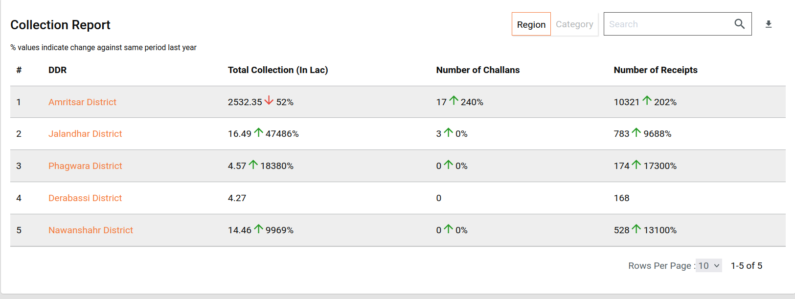

# National Urban Realtime Dashboard

## **Overview**

DSS has two sides to it. One is the process in which the data is pooled into ElasticSearch and the other is the way it is fetched, aggregated, computed, transformed and sent across.

As this revolves around various data sets, there is a need to make this configurable. This ensures that the process can be configured easily in case a new scenario is introduced.  This document explains the steps on how to define the configurations for the analytics side of DSS for W\&S.

## **Technical Details**

**Analytics:** Microservice responsible for building, fetching, aggregating and computing the data on ElasticSearch into a consumable data response. This is later used for visualizations and graphical representations.&#x20;

**Analytics Configurations:** Analytics contains multiple configurations. we need to add the changes related to FSM in this dashboard-analytics.\
Configuration file link: [configs/egov-dss-dashboards/dashboard-analytics at qa · egovernments/configs](https://github.com/egovernments/configs/tree/qa/egov-dss-dashboards/dashboard-analytics)\
Below is a list of configurations that need to be changed to run FSM successfully.

1. Chart API Configuration
2. Master Dashboard Configuration
3. Role Dashboard Mappings Configuration

**Chart API Configuration:** Each Visualization has its own properties. Each Visualization comes from different data sources (Sometimes it is a combination of different data sources). In order to configure each visualization and its properties, we have a Chart API Configuration Document.

In this, Visualization Code, which happens to be the key, will be having its properties configured as a part of the configuration and are easily changeable.

ChartApiConfiguration.json sample data for the W\&S is given below:


```
 "nurtProjectStatus": {
    "chartName": "NURT_PROJECT_STAUS",
    "queries": [
            {
        "module": "COMMON",
        "requestQueryMap": "{\"state\" : \"state.keyword\",\"ulb\" : \"ulb.keyword\"}",
        "dateRefField": "date",
        "indexName": "common-national-dashboard",
        "aggrQuery": "{\"size\":0,\"query\":{\"bool\":{\"adjust_pure_negative\":true,\"boost\":1}},\"aggs\":{\"states\":{\"terms\":{\"field\":\"state.keyword\"},\"aggs\":{\"latest\":{\"terms\":{\"field\":\"date\",\"order\":{\"_term\":\"desc\"},\"size\":1},\"aggs\":{\"Status\":{\"terms\":{\"field\":\"status.keyword\"}},\"totalUlbs\":{\"avg\":{\"field\":\"totalUlbCount\"}},\"liveUlbs\":{\"avg\":{\"field\":\"totalLiveUlbsCount\"}}}}}}}}"
      }
    ],
    "isMdmsEnabled": false,
    "isPostResponseHandler": true,
    "chartType": "table",
    "valueType": "number",    
    "drillChart": "nurtProjectStatusModule",
    "drillFields": [
      "states"
    ],
    "documentType": "_doc",
    "action": "",
    "aggregationPaths": [
      "states",
      "Status",
      "totalUlbs",
      "liveUlbs"
    ],
    "plotLabel": "states",
    "pathDataTypeMapping": [
      {
        "states": "string"
      },
      {
        "Status": "string"
      },
      {
        "totalUlbs": "number"
      },
      {
        "liveUlbs": "number"
      }
    ],
    "insight": {
    },
    "_comment": ""
  },
  "nurtProjectStatusModule": {
    "chartName": "NURT_PROJECT_STAUS",
    "queries": [
            {
        "module": "COMMON",
        "requestQueryMap": "{\"state\" : \"state.keyword\",\"ulb\" : \"ulb.keyword\"}",
        "dateRefField": "date",
        "indexName": "common-national-dashboard",
        "aggrQuery": "{\"size\":0,\"aggs\":{\"AGGR\":{\"filter\":{\"bool\":{\"must\":[{\"term\":{\"status.keyword\":\"Live\"}},{\"range\":{\"liveUlbsCountForServiceModuleCode\":{\"gte\":1}}}]}},\"aggs\":{\"module\":{\"terms\":{\"field\":\"serviceModuleCode.keyword\"},\"aggs\":{\"latest\":{\"terms\":{\"field\":\"date\",\"order\":{\"_term\":\"desc\"},\"size\":1},\"aggs\":{\"liveUlbPerModule\":{\"avg\":{\"field\":\"liveUlbsCountForServiceModuleCode\"}}}}}},\"totalLiveUlbCount\":{\"avg\":{\"field\":\"totalLiveUlbsCount\"}}}}}}"
      }
    ],
    "isMdmsEnabled": false,
    "isPostResponseHandler": true,
    "chartType": "table",
    "valueType": "number",
    "drillChart": "none",
    "documentType": "_doc",
    "action": "",
    "aggregationPaths": [
      "module",
      "liveUlbPerModule"
    ],
    "plotLabel": "module",
    "pathDataTypeMapping": [
      {
        "module": "string"
      },
      {
        "liveUlbPerModule": "number"
      }
    ],
    "insight": {
    },
    "_comment": ""
  },
  "nurtliveOnboardedUlbs": {
    "chartName": "NURT_LIVE_ACTIVE_ULBS",
    "queries": [
      {
        "module": "COMMON",
        "requestQueryMap": "{\"state\" : \"state.keyword\",\"ulb\" : \"ulb.keyword\"}",
        "dateRefField": "date",
        "indexName": "common-national-dashboard",
        "aggrQuery": "{\"size\":0,\"query\":{\"bool\":{\"adjust_pure_negative\":true,\"boost\":1}},\"aggs\":{\"AGGR\":{\"filter\":{\"bool\":{}},\"aggs\":{\"onBoardeUlbsCount\":{\"date_histogram\":{\"field\":\"date\",\"interval\":\"intervalvalue\"},\"aggs\":{\"latest\":{\"terms\":{\"field\":\"date\",\"order\":{\"_term\":\"desc\"},\"size\":1},\"aggs\":{\"onBoardeUlbsCount\":{\"avg\":{\"field\":\"onboardedUlbsCount\"}}}},\"onBoardeUlbsCount\":{\"sum_bucket\":{\"buckets_path\":\"latest.onBoardeUlbsCount\"}}}},\"liveUlbsCount\":{\"filter\":{\"bool\":{\"must\":[{\"term\":{\"status.keyword\":\"Live\"}},{\"range\":{\"liveUlbsCountForServiceModuleCode\":{\"gte\":1}}}]}},\"aggs\":{\"test\":{\"date_histogram\":{\"field\":\"date\",\"interval\":\"intervalvalue\"},\"aggs\":{\"latest\":{\"terms\":{\"field\":\"date\",\"order\":{\"_term\":\"desc\"},\"size\":1},\"aggs\":{\"LiveUlbCount\":{\"avg\":{\"field\":\"totalLiveUlbsCount\"}}}},\"liveUlbsCount\":{\"sum_bucket\":{\"buckets_path\":\"latest.LiveUlbCount\"}}}}}}}}}}"
      }
    ],
    "chartType": "line",
    "valueType": "number",
    "action": "",
    "drillChart": "none",
    "documentType": "_doc",
    "aggregationPaths": [
      "onBoardeUlbsCount",
      "liveUlbsCount"
    ],
    "isCumulative": false,
    "interval": "month",
    "insight": {},
    "_comment": " "
  },
    "nurtOnboardedStates":{
    "chartName": "NURT_ONBOARDED_STATES",
    "queries": [
      {
        "module": "COMMON",
        "dateRefField": "date",
        "requestQueryMap": "{\"state\" : \"state.keyword\",\"ulb\" : \"ulb.keyword\"}",
        "indexName": "common-national-dashboard",
        "aggrQuery": "{\"aggs\":{\"AGGR\":{\"filter\":{\"match\":{\"status\":\"OnBoarded\"}},\"aggs\":{\"OnBoardedStates\":{\"cardinality\":{\"field\":\"state.keyword\"}}}}}}"
      }
    ],
    "chartType": "metric",
    "valueType": "number",
    "drillChart": "none",
    "documentType": "_doc",
    "action": "",
    "aggregationPaths": [
      "OnBoardedStates"
    ],
    "insight": {
    },
    "_comment": " "
  },
  "nurtUnderImpStates":{
    "chartName": "NURT_UNDERIMPL_STATES",
    "queries": [
      {
        "module": "COMMON",
        "dateRefField": "date",
        "requestQueryMap": "{\"state\" : \"state.keyword\",\"ulb\" : \"ulb.keyword\"}",
        "indexName": "common-national-dashboard",
        "aggrQuery": "{\"aggs\":{\"AGGR\":{\"filter\":{\"match\":{\"status\":\"UnderImplementation\"}},\"aggs\":{\"underImpmStates\":{\"cardinality\":{\"field\":\"state.keyword\"}}}}}}"
      }
    ],
    "chartType": "metric",
    "valueType": "number",
    "drillChart": "none",
    "documentType": "_doc",
    "action": "",
    "aggregationPaths": [
      "underImpmStates"
    ],
    "insight": {
    },
    "_comment": " "
  },
  "nurtLiveStates":{
    "chartName": "NURT_LIVE_STATES",
    "queries": [
      {
        "module": "COMMON",
        "dateRefField": "date",
        "requestQueryMap": "{\"state\" : \"state.keyword\",\"ulb\" : \"ulb.keyword\"}",
        "indexName": "common-national-dashboard",
        "aggrQuery": "{\"aggs\":{\"AGGR\":{\"filter\":{\"match\":{\"status\":\"Live\"}},\"aggs\":{\"liveStates\":{\"cardinality\":{\"field\":\"state.keyword\"}}}}}}"
      }
    ],
    "chartType": "metric",
    "valueType": "number",
    "drillChart": "none",
    "documentType": "_doc",
    "action": "",
    "aggregationPaths": [
      "liveStates"
    ],
    "insight": {
    },
    "_comment": " "
  },
  "nurtLiveUlbs":{
    "chartName": "NURT_LIVE_ULB",
    "queries": [
      {
        "module": "COMMON",
        "dateRefField": "date",
        "requestQueryMap": "{\"state\" : \"state.keyword\",\"ulb\" : \"ulb.keyword\"}",
        "indexName": "common-national-dashboard",
        "aggrQuery": "{\"aggs\":{\"AGGR\":{\"filter\":{\"bool\":{\"must\":[{\"term\":{\"status.keyword\":\"Live\"}},{\"range\":{\"liveUlbsCountForServiceModuleCode\":{\"gte\":1}}}]}},\"aggs\":{\"latest\":{\"terms\":{\"field\":\"date\",\"order\":{\"_term\":\"desc\"},\"size\":1},\"aggs\":{\"modules\":{\"terms\":{\"field\":\"serviceModuleCode.keyword\"},\"aggs\":{\"intermediateAggr\":{\"avg\":{\"field\":\"liveUlbsCountForServiceModuleCode\"}}}},\"LiveUlbCount\":{\"avg\":{\"field\":\"totalLiveUlbsCount\"}}}},\"totalLiveUlbCount\":{\"avg_bucket\":{\"buckets_path\":\"latest.LiveUlbCount\"}}}}}}"
      }
    ],
    "chartType": "metric",
    "valueType": "number",
    "drillChart": "none",
    "documentType": "_doc",
    "action": "",
    "aggregationPaths": [
      "totalLiveUlbCount"
    ],
    "insight": {
    },
    "_comment": " "
  },
  
  "nurtTotalCitzens":{
    "chartName": "NURT_TOTAL_CITIZENS",
    "queries": [
      {
        "module": "COMMON",
        "dateRefField": "date",
        "requestQueryMap": "{\"state\" : \"state.keyword\",\"ulb\" : \"ulb.keyword\"}",
        "indexName": "common-national-dashboard",
        "aggrQuery": "{\"aggs\":{\"AGGR\":{\"filter\":{\"bool\":{\"must\":[{\"term\":{\"status.keyword\":\"Live\"}}]}},\"aggs\":{\"latest\":{\"terms\":{\"field\":\"date\",\"order\":{\"_term\":\"desc\"},\"size\":1},\"aggs\":{\"totalCitizensCount\":{\"avg\":{\"field\":\"totalCitizensCount\"}}}},\"totalCitizensCount\":{\"avg_bucket\":{\"buckets_path\":\"latest.totalCitizensCount\"}}}}}}"
      }
    ],
    "chartType": "metric",
    "valueType": "number",
    "drillChart": "none",
    "documentType": "_doc",
    "action": "",
    "aggregationPaths": [
      "totalCitizensCount"
    ],
    "insight": {
      "chartResponseMap" : "nurtTotalCitzens",
      "action" : "differenceOfNumbers",
      "upwardIndicator" : "positive",
      "downwardIndicator" : "negative",
      "isRoundOff":true,
      "textMessage" : "$indicator$value% than last $insightInterval",
      "colorCode" : "#228B22",
      "insightInterval" : "year"
    },
    "_comment": " "
  },
  "nurtSlaAchieved":{
    "chartName": "NURT_SLA_ACHIEVED",
    "queries": [
      {
        "module": "COMMON",
        "dateRefField": "date",
        "requestQueryMap": "{\"state\" : \"state.keyword\",\"ulb\" : \"ulb.keyword\"}",
        "indexName": "common-national-dashboard",
        "aggrQuery": "{\"aggs\":{\"AGGR\":{\"filter\":{\"bool\":{\"must\":[{\"term\":{\"status.keyword\":\"Live\"}}]}},\"aggs\":{\"latest\":{\"terms\":{\"field\":\"date\",\"order\":{\"_term\":\"desc\"},\"size\":1},\"aggs\":{\"slaAchieve\":{\"avg\":{\"field\":\"slaAchievement\"}}}},\"slaAchievement\":{\"avg_bucket\":{\"buckets_path\":\"latest.slaAchieve\"}}}}}}"
      }
    ],
    "chartType": "metric",
    "valueType": "percentage",
    "drillChart": "none",
    "documentType": "_doc",
    "action": "",
    "isRoundOff": true,
    "aggregationPaths": [
      "slaAchievement"
    ],
    "insight": {
      "chartResponseMap" : "nurtSlaAchieved",
      "action" : "differenceOfNumbers",
      "upwardIndicator" : "positive",
      "downwardIndicator" : "negative",
      "isRoundOff":true,
      "textMessage" : "$indicator$value% than last $insightInterval",
      "colorCode" : "#228B22",
      "insightInterval" : "year",
      "isRoundOff": true 
    },
    "_comment": " "
  },
  
	"totalCollectionOverview": {
    "chartName": "NATIONAL_DSS_TOTAL_COLLECTION",
    "queries": [
      {
        "module": "PT",
        "dateRefField": "date",
        "requestQueryMap": "{\"state\" : \"state.keyword\",\"ulb\" : \"ulb.keyword\"}",
        "indexName": "pt-national-dashboard",
        "aggrQuery": "{\"aggs\":{\"AGGR\":{\"filter\":{\"bool\":{}},\"aggs\":{\"Total Collection\":{\"sum\":{\"field\":\"todaysCollectionForUsageCategory\"}}}}}}"
      },
      {
        "module": "TL",
        "dateRefField": "date",
        "requestQueryMap": "{\"state\" : \"state.keyword\",\"ulb\" : \"ulb.keyword\"}",
        "indexName": "tl-national-dashboard",
        "aggrQuery": "{\"aggs\":{\"AGGR\":{\"filter\":{\"bool\":{}},\"aggs\":{\"Total Collection\":{\"sum\":{\"field\":\"todaysCollectionForTradeType\"}}}}}}"
      },
      {
        "module": "OBPS",
        "dateRefField": "date",
        "requestQueryMap": "{\"state\" : \"state.keyword\",\"ulb\" : \"ulb.keyword\"}",
        "indexName": "obps-national-dashboard",
        "aggrQuery": "{\"aggs\":{\"AGGR\":{\"filter\":{\"bool\":{}},\"aggs\":{\"Total Collection\":{\"sum\":{\"field\":\"todaysCollectionForPaymentMode\"}}}}}}"
      },
      {
        "module": "FIRENOC",
        "dateRefField": "date",
        "requestQueryMap": "{\"state\" : \"state.keyword\",\"ulb\" : \"ulb.keyword\"}",
        "indexName": "firenoc-national-dashboard",
        "aggrQuery": "{\"aggs\":{\"AGGR\":{\"filter\":{\"bool\":{}},\"aggs\":{\"Total Collection\":{\"sum\":{\"field\":\"todaysCollectionForPaymentMode\"}}}}}}"
      },
      {
        "module": "MC",
        "dateRefField": "date",
        "requestQueryMap": "{\"state\" : \"state.keyword\",\"ulb\" : \"ulb.keyword\"}",
        "indexName": "mcollect-national-dashboard",
        "aggrQuery": "{\"aggs\":{\"AGGR\":{\"filter\":{\"bool\":{}},\"aggs\":{\"Total Collection\":{\"sum\":{\"field\":\"todaysCollectionForPaymentMode\"}}}}}}"
      },
      {
        "module": "W&S",
        "dateRefField": "date",
        "requestQueryMap": "{\"ulb\" : \"ulb.keyword\",\"ward\" : \"ward.keyword\"}",
        "indexName": "ws-national-dashboard",
        "aggrQuery": "{\"aggs\":{\"AGGR\":{\"filter\":{\"bool\":{}},\"aggs\":{\"Total Collection\":{\"sum\":{\"field\":\"todaysCollectionForPaymentChannelType\"}}}}}}"
    }
      
    ],
    "chartType": "metric",
    "valueType": "Amount",
    "drillChart": "none",
    "documentType": "_doc",
    "action": "",
    "aggregationPaths": [
      "Total Collection"
    ],
    "insight": {
      "chartResponseMap" : "totalCollectionOverview",
      "action" : "differenceOfNumbers",
      "upwardIndicator" : "positive",
      "downwardIndicator" : "negative",
      "textMessage" : "$indicator$value% than last $insightInterval",
      "colorCode" : "#228B22",
      "insightInterval" : "year",
      "isRoundOff": true
    },
    "_comment": " "
  },
  
  	"targetCollectionvOverview": {
    "chartName": "NATIONAL_DSS_TARGET_COLLECTION",
    "queries": [
      {
        "module": "MASTER",
        "requestQueryMap": "{\"module\" : \"module.keyword\", \"ulb\" : \"ulb.keyword\"}",
        "dateRefField": "date",
        "indexName": "master-national-dashboard",
        "aggrQuery": "{\"aggs\":{\"AGGR\":{\"filter\":{\"bool\":{}},\"aggs\":{\"Target Collection\":{\"sum\":{\"field\":\"budgetProposedForMunicipalCorporation\"}}}}}}"
      }
    ],
    "chartType": "metric",
    "valueType": "amount",
    "action": "",
    "drillChart": "none",
    "documentType": "_doc",
    "aggregationPaths": [
      "Target Collection"
    ],
    "isDayUnit": true,
    "postAggregationTheory" : "repsonseToDifferenceOfDates",
    "insight": {
      "chartResponseMap" : "targetCollectionvOverview",
      "action" : "differenceOfNumbers",
      "upwardIndicator" : "positive",
      "downwardIndicator" : "negative",
      "textMessage" : "$indicator$value% than last $insightInterval",
      "colorCode" : "#228B22",
      "insightInterval" : "year",
      "isRoundOff": true
    },
    "_comment": " "
  },
  	
  	"targetAchievedOverview": {
    "chartName": "NATIONAL_DSS_TARGET_ACHIEVED",
    "queries": [
      {
        "module": "MASTER",
        "requestQueryMap": "{\"state\" : \"state.keyword\", \"module\" : \"module.keyword\", \"ulb\" : \"ulb.keyword\"}",
        "dateRefField": "date",
        "indexName": "master-national-dashboard",
        "aggrQuery": "{\"aggs\":{\"AGGR\":{\"filter\":{\"bool\":{}},\"aggs\":{\"Actual collection\":{\"sum\":{\"field\":\"budgetProposedForMunicipalCorporation\"}}}}}}"
      },
      {
        "module": "PT",
        "dateRefField": "date",
        "requestQueryMap": "{\"state\" : \"state.keyword\",\"ulb\" : \"ulb.keyword\"}",
        "indexName": "pt-national-dashboard",
        "aggrQuery": "{\"aggs\":{\"AGGR\":{\"filter\":{\"bool\":{}},\"aggs\":{\"Total Collection\":{\"sum\":{\"field\":\"todaysCollectionForUsageCategory\"}}}}}}"
      },
      {
        "module": "TL",
        "dateRefField": "date",
        "requestQueryMap": "{\"state\" : \"state.keyword\",\"ulb\" : \"ulb.keyword\"}",
        "indexName": "tl-national-dashboard",
        "aggrQuery": "{\"aggs\":{\"AGGR\":{\"filter\":{\"bool\":{}},\"aggs\":{\"Total Collection\":{\"sum\":{\"field\":\"todaysCollectionForTradeType\"}}}}}}"
      },
      {
        "module": "OBPS",
        "dateRefField": "date",
        "requestQueryMap": "{\"state\" : \"state.keyword\",\"ulb\" : \"ulb.keyword\"}",
        "indexName": "obps-national-dashboard",
        "aggrQuery": "{\"aggs\":{\"AGGR\":{\"filter\":{\"bool\":{}},\"aggs\":{\"Total Collection\":{\"sum\":{\"field\":\"todaysCollectionForPaymentMode\"}}}}}}"
      },
      {
        "module": "FIRENOC",
        "dateRefField": "date",
        "requestQueryMap": "{\"state\" : \"state.keyword\",\"ulb\" : \"ulb.keyword\"}",
        "indexName": "firenoc-national-dashboard",
        "aggrQuery": "{\"aggs\":{\"AGGR\":{\"filter\":{\"bool\":{}},\"aggs\":{\"Total Collection\":{\"sum\":{\"field\":\"todaysCollectionForPaymentMode\"}}}}}}"
      },
      {
        "module": "MC",
        "dateRefField": "date",
        "requestQueryMap": "{\"state\" : \"state.keyword\",\"ulb\" : \"ulb.keyword\"}",
        "indexName": "mcollect-national-dashboard",
        "aggrQuery": "{\"aggs\":{\"AGGR\":{\"filter\":{\"bool\":{}},\"aggs\":{\"Total Collection\":{\"sum\":{\"field\":\"todaysCollectionForPaymentMode\"}}}}}}"
      },
      {
        "module": "W&S",
        "dateRefField": "date",
        "requestQueryMap": "{\"ulb\" : \"ulb.keyword\",\"ward\" : \"ward.keyword\"}",
        "indexName": "ws-national-dashboard",
        "aggrQuery": "{\"aggs\":{\"AGGR\":{\"filter\":{\"bool\":{}},\"aggs\":{\"Total Collection\":{\"sum\":{\"field\":\"todaysCollectionForPaymentChannelType\"}}}}}}"
    }     

    ],
    "chartType": "metric",
    "valueType": "percentage",
    "drillChart": "none",
    "documentType": "_doc",
    "action": "percentage",
    "preActionTheory":{
      "Actual collection":"repsonseToDifferenceOfDates"
    },
    "isRoundOff": true,
    "aggregationPaths": [
      "Total Collection",
      "Actual collection"
    ],
    "insight": {
      "chartResponseMap" : "targetAchievedOverview",
      "action" : "differenceOfNumbers",
      "upwardIndicator" : "positive",
      "downwardIndicator" : "negative",
      "textMessage" : "$indicator$value% than last $insightInterval",
      "colorCode" : "#228B22",
      "insightInterval" : "year",
      "isRoundOff": true
    },
    "_comment": " "
  }
```


[Click here to check the complete configuration](https://github.com/egovernments/configs/blob/qa/egov-dss-dashboards/dashboard-analytics/ChartApiConfig.json)

**Master Dashboard Configuration:** Master dashboard configuration is the main configuration which defines as which are the dashboards which are to be painted on the screen.&#x20;

It includes all the visualizations, their groups, the charts which come within them and even their dimensions as what should be their height and width.


```
{
      "name": "NURT_DASHBOARD",
      "id": "NURT_DASHBOARD",
      "isActive": "",
      "style": "",
      "title": "title",
      "visualizations": [
        {
          "name": "NURT_DASHBOARD",
          "row": 1,
          "vizArray": [
            {
              "id": 1111,
              "name": "NURT_OVERVIEW",
              "vizType": "collection",
              "noUnit": true,
              "isCollapsible": false,
              "ref": {
                "url": "national-overview",
                "logoUrl": "",
                "type": "internal"
              },
              "charts": [
                {
                  "id": "nurtOnboardedStates",
                  "name": "NURT_ONBOARDED_STATES",
                  "code": "",
                  "chartType": "metric",
                  "filter": "",
                  "headers": []
                },
                {
                  "id": "nurtUnderImpStates",
                  "name": "NURT_UNDERIMPL_STATES",
                  "code": "",
                  "chartType": "metric",
                  "filter": "",
                  "headers": []
                },
                {
                  "id": "nurtLiveStates",
                  "name": "NURT_LIVE_STATES",
                  "code": "",
                  "chartType": "metric",
                  "filter": "",
                  "headers": []
                },
                {
                  "id": "nurtLiveUlbs",
                  "name": "NURT_LIVE_ULB",
                  "code": "",
                  "chartType": "metric",
                  "filter": "",
                  "headers": []
                },
                {
                  "id": "totalCollectionOverview",
                  "name": "NATIONAL_DSS_TOTAL_COLLECTION",
                  "code": "",
                  "chartType": "metric",
                  "filter": "",
                  "headers": []
                },
                {
                  "id": "targetAchievedOverview",
                  "name": "NATIONAL_DSS_TARGET_ACHIEVED",
                  "code": "",
                  "chartType": "metric",
                  "filter": "",
                  "headers": []
                },
                {
                  "id": "totalApplicationsOverview",
                  "name": "NATIONAL_DSS_TOTAL_APPLICATIONS",
                  "code": "",
                  "chartType": "metric",
                  "filter": "",
                  "headers": []
                },
                {
                  "id": "nurtTotalCitzens",
                  "name": "NURT_TOTAL_CITIZENS",
                  "code": "",
                  "chartType": "metric",
                  "filter": "",
                  "headers": []
                },
                {
                  "id": "nurtSlaAchieved",
                  "name": "NURT_SLA_ACHIEVED",
                  "code": "",
                  "chartType": "metric",
                  "filter": "",
                  "headers": []
                }
              ]
            }
          ]
        },{
          "name": "NURT_DASHBOARD",
          "row":2,
          "vizArray": [
            {
              "id": 1111,
              "name": "NURT_PROJECT_STAUS",
              "vizType": "collection",
              "noUnit": true,
              "isCollapsible": false,
              "ref": {
                "url": "",
                "logoUrl": "",
                "type": "internal"
              },
              "charts": [
                {
                  "id": "nurtProjectStatus",
                  "name": "NURT_PROJECT_STAUS",
                  "code": "",
                  "chartType": "map",
                  "filter": "",
                  "headers": []
                }
                
              ]
            },{
              "id": 1111,
              "name": "NURT_LIVE_ACTIVE_ULBS",
              "vizType": "collection",
              "noUnit": true,
              "isCollapsible": false,
              "ref": {
                "url": "",
                "logoUrl": "",
                "type": "internal"
              },
              "charts":[{
                "id": "nurtliveOnboardedUlbs",
                "name": "NURT_LIVE_ACTIVE_ULBS",
                "code": "",
                "chartType": "bar",
                "filter": "",
                "headers": []
              }]
            }
          ]
        },
        {
          "row": 3,
          "name": "NURT_DASHBOARD",
          "vizArray": [
            {
              "id": 1211,
              "name": "NURT_PROPERTY_TAX",
              "vizType": "module",
              "moduleLevel": "PT",
              "type": "",
              "noUnit": false,
              "isCollapsible": false,
              "ref": {
                "url": "national-propertytax",
                "logoUrl": "",
                "type": "internal"
              },
              "label": "",
              "charts": [
                {
                  "id": "totalCollectionOverview",
                  "name": "NATIONAL_DSS_PT_TOTAL_COLLECTION",
                  "code": "",
                  "chartType": "metric",
                  "filter": "",
                  "headers": []
                },
                {
                  "id": "totalApplicationsOverview",
                  "name": "NATIONAL_DSS_PROPERTIES_ASSESSED",
                  "code": "",
                  "chartType": "metric",
                  "filter": "",
                  "headers": []
                }
              ]
            },
            {
              "id": 1411,
              "name": "NURT_TRADE_LICENCE",
              "vizType": "module",
              "moduleLevel": "TL",
              "ref": {
                "url": "national-tradelicense",
                "logoUrl": "",
                "type": "internal"
              },
              "label": "",
              "charts": [
                {
                  "id": "totalCollectionOverview",
                  "name": "NATIONAL_DSS_TL_TOTAL_COLLECTION",
                  "code": "",
                  "chartType": "metric",
                  "filter": "",
                  "headers": []
                },
                {
                  "id": "totalApplicationsOverview",
                  "name": "NATIONAL_DSS_TOTAL_TL_APPLICATIONS",
                  "code": "",
                  "chartType": "metric",
                  "filter": "",
                  "headers": []
                }
              ]
            },
            {
              "id": 141,
              "name": "NURT_COMPLAINS",
              "vizType": "module",
              "moduleLevel": "PGR",
              "ref": {
                "url": "national-pgr",
                "logoUrl": "",
                "type": "internal"
              },
              "label": "",
              "charts": [
                {
                  "id": "pgrTotalComplaints",
                  "name": "NATIONAL_DSS_COMPLAINTS",
                  "code": "",
                  "chartType": "metric",
                  "filter": "",
                  "headers": []
                },
                {
                  "id": "pgrSlaAchieved",
                  "name": "NATIONAL_DSS_SLA_ACHIEVED",
                  "code": "",
                  "chartType": "metric",
                  "filter": "",
                  "headers": []
                }
              ]
            },
            {
              "id": 142,
              "name": "NURT_WATER_SEWERAGE",
              "vizType": "module",
              "moduleLevel": "W&S",
              "ref": {
                "url": "national-ws",
                "logoUrl": "",
                "type": "internal"
              },
              "label": "",
              "charts": [
                {
                  "id": "totalCollectionOverview",
                  "name": "NATIONAL_DSS_WS_TOTAL_COLLECTION",
                  "code": "",
                  "chartType": "metric",
                  "filter": "",
                  "headers": []
                },
                {
                  "id": "totalApplicationsOverview",
                  "name": "NATIONAL_DSS_WS_TOTAL_APPLICATIONS",
                  "code": "",
                  "chartType": "metric",
                  "filter": "",
                  "headers": []
                }
              ]
            },            
            {
              "id": 142,
              "name": "DSS_BUILDING_PERMISSION",
              "vizType": "module",
              "moduleLevel": "OBPS",
              "ref": {
                "url": "nss-obps",
                "logoUrl": "",
                "type": "internal"
              },
              "label": "",
              "charts": [
                {
                  "id": "totalCollectionOverview",
                  "name": "NATIONAL_DSS_OBPS_TOTAL_COLLECTION",
                  "code": "",
                  "chartType": "metric",
                  "filter": "",
                  "headers": []
                },
                {
                  "id": "totalApplicationsOverview",
                  "name": "NATIONAL_DSS_OBPS_TOTAL_APPLICATIONS",
                  "code": "",
                  "chartType": "metric",
                  "filter": "",
                  "headers": []
                }
              ]
            },
            {
              "id": 201,
              "name": "NURT_FIRENOC",
              "vizType": "module",
              "moduleLevel": "FIRENOC",
              "ref": {
                "url": "national-firenoc",
                "logoUrl": "",
                "type": "internal"
              },
              "label": "",
              "charts": [
                {
                  "id": "totalCollectionOverview",
                  "name": "NATIONAL_DSS_FIRENOC_TOTAL_COLLECTION",
                  "code": "",
                  "chartType": "metric",
                  "filter": "",
                  "headers": []
                },
                {
                  "id": "totalApplicationsOverview",
                  "name": "NATIONAL_DSS_FIRENOC_TOTAL_APPLICATIONS",
                  "code": "",
                  "chartType": "metric",
                  "filter": "",
                  "headers": []
                }
              ]
            },
            {
              "id": 203,
              "name": "NURT_MCOLLECT",
              "vizType": "module",
              "moduleLevel": "MC",
              "ref": {
                "url": "national-mcollect",
                "logoUrl": "",
                "type": "internal"
              },
              "label": "",
              "charts": [
                {
                  "id": "totalCollectionOverview",
                  "name": "NATIONAL_DSS_MCOLLECT_TOTAL_COLLECTION",
                  "code": "",
                  "chartType": "metric",
                  "filter": "",
                  "headers": []
                },
                {
                  "id": "mCollectTotalReceiptsv2",
                  "name": "NATIONAL_DSS_MCOLLECT_TOTAL_RECEIPTS",
                  "code": "",
                  "chartType": "metric",
                  "filter": "",
                  "headers": []
                }
              ]
            }
       	  ]
      }

      ]
    }
```


[Click here for the complete configuration](https://github.com/egovernments/configs/blob/qa/egov-dss-dashboards/dashboard-analytics/MasterDashboardConfig.json)

**Role Dashboard Mappings Configuration:** The master dashboard configuration which was explained earlier holds the list of dashboards which are available.

Given the instance where role-action mapping is not maintained in the application service, this configuration will act as a role-dashboard mapping configuration. In this, each role is mapped against the dashboard that they are authorized to see. This was used earlier when the role-action mapping of eGov was not integrated.

Later, when the role-action mapping started controlling the dashboards to be seen on the client side, this configuration was just used to enable the dashboards for viewing.&#x20;


```
{
  "_comment": "Holds mapping for each role with and its associated dashboards",
  "roles" : [
    {
      "_comment":"This role is super role which can access all the available dashboards: [other/new roles are suppose to be added]",
      "roleId": 6,
      "roleName" : "Admin",
      "isSuper" : "",
      "orgId": "",
      "dashboards": [
        {
          "name": "National Urban Relatime Dashboard",
          "id": "NURT_DASHBOARD"
        }
      ]
    }

  ]
}


```


[Click here to check the configuration](https://github.com/egovernments/configs/blob/qa/egov-dss-dashboards/dashboard-analytics/RoleDashboardMappingsConf.json)

**MDMS configuration to be added:** _common-masters/uiCommonConstants.json_


```
 "national-ws": {
                  "routePath": "/dashboard/NURT_DASHBOARD",
                  "isOrigin": true
               }
```


[Click here to check the complete configuration](https://github.com/egovernments/egov-mdms-data/blob/QA/data/pb/common-masters/uiCommonConstants.json)

roleaction.json


```
 {
      "rolecode": "STADMIN",
      "actionid": {{PlaceHolder1}},
      "actioncode": "",
      "tenantId": "pb"
    }
    
    
    {
      "rolecode": "STADMIN",
      "actionid": {{PlaceHolder2}},
      "actioncode": "",
      "tenantId": "pb"
    },
     {
      "rolecode": "EMPLOYEE",
      "actionid": {{PlaceHolder2}},
      "actioncode": "",
      "tenantId": "pb"
    },  
     {
      "rolecode": "UC_EMP",
      "actionid": {{PlaceHolder2}},
      "actioncode": "",
      "tenantId": "pb"
    },


```


[Click here to check the complete configuration](https://github.com/egovernments/egov-mdms-data/blob/QA/data/pb/ACCESSCONTROL-ROLEACTIONS/roleactions.json)

Action test.json:


```
{
      "id": {{PlaceHolder1}},
      "name": "National Urban Real-Time Dashboard",
      "url": "/dashboard-analytics/dashboard/getDashboardConfig/NURT_DASHBOARD",
      "parentModule": "",
      "displayName": "NSS",
      "orderNumber": 0,
      "enabled": false,
      "serviceCode": "NSS",
      "code": "null",
      "path": ""
},
{
      "id": {{PlaceHolder2}},
      "name": "National Urban Real-Time Dashboard",
      "url": "url",
      "displayName": "National Urban Real-Time Dashboard",
      "orderNumber": 4,
      "parentModule": "ndss-dashboard",
      "enabled": true,
      "serviceCode": "NDSS",
      "code": "null",
      "path": "NatDashboard.NURT_DASHBOARD",
      "navigationURL": "employee/integration/dss/NURT_DASHBOARD",
      "leftIcon": "places:business-center",
      "rightIcon": ""
}
```


[Click here to check the complete configuration](https://github.com/egovernments/egov-mdms-data/blob/QA/data/pb/ACCESSCONTROL-ACTIONS-TEST/actions-test.json)\
National urban real-time dashboard-national DSS consists of multiple graphs which represent the data of all modules aggregated together. Each graph has its own configuration which will describe the chart and its type.

National DSS consists of the following charts in National Urban Real-time Dashboard:

**Overview Card**

1. Onboarded States
2. Under Implementation
3. Live States
4. Live ULBs
5. Total Collections
6. Target Achi_e_vement
7. Total Applications
8. Total Citizens
9. SLA Achievement
10. Project Status
11. Onboarded ULBs vs Live ULBs
12. Property Tax
    * Total Collection
    * Properties Assessed
13. Trade License
    * Total Collection
    * Total Applications
14. Municipal Grievances
    * Total Grievances
    * SLA Achievement
15. Water & Sewerage
    * Total Collection
    * Total Connections
16. Building Permissions
    * Total Collection
    * Total Permits Issued
17. Fire NOC
    * Total Collection
    * Total Fire NOCs Issued
18. User Charges
    * Total Collection
    *   Total Receipts

        &#x20;

**Overview Card:** The overview graph contains multiple data information as below in the selected time period.

* **Onboarded States:**:thumbsup::thumbsup:This represents the No of states in the nation which are in the status of onboarded for DIGIT.
* &#x20;**Under Implementation:** This represents the No of states in the nation which are in the status of under implementation for DIGIT.
* **Live States:** This represents the number of states across the nation which has DIGIT as Live.
* **Live ULBs:** This represents the Total No of ULBs Live across states within the nation which has DIGIT as Live.
* **Target Achievement:** This represents the target achieved in percentage. This is calculated by the formula - (Total Collection/Target Collection)\*100%, across the modules and States.
* **Total Applications:** This represents the total number of applications across the modules and states.
* **Total Citizens:** This represents the total number of citizens registered across modules and states.
* **SLA Achievement:** This represents the total number of citizens registered across the modules and States.

.png>)

**Project Status:** This Graph Represent the states int he nation with their status of the DIGIT implementation into 4 different states Live, Under Implementation and Onboarded and None

**Onboarded Vs Live ULBs** - This Graph represents the Onboarded ULBs count vs Live ULBs count month wise for a given period.

.png>)

**DrilDown of the Project Status for a given State Ex: Punjab**

Project Status shows the list of the Live ULBs module wise for a given state. Bar chart shows the onboarded vs live ULBs count month wise for a given state.

.png>)

All the modules specific metrics discussed below are queried from the data in their respective National Dashboard Elastic Search index.

**Property Tax**

**Total Collection -** This metric represents the Total Collection for the Property Tax Service across the ULBs and States with in the nation.

**Properties Assessed -** This metric represents the Total No of Properties Assessed by Property Tax Service across the ULBs and States with in the nation.

<div align="left">


</div>

**Trade License**

**Total Collection -** This metric represents the Total Collection for the Trade License Service across the ULBs and States with in the nation.

**Total Applications -** This metric represents the Total No of Trade Licenses processed by Trade License Service across the ULBs and States with in the nation.

<div align="left">


</div>

**Municipal Grievances**

**Total Grievances -** This metric represents the Total No of Grievances created across the ULBs across the states in the Nation

**SLA Achievement -** This metric represents the Percentage of the Grievances Addressed/Solved with in the Grievances created across the ULBs across the states in the Nation.

<div align="left">



</div>

**Water & Sewerage**

**Total Collection -** This metric represents the Total Collection for the Water & Sewerage Service across the ULBs and States with in the nation.

**Total Connections -** This metric represents the Total No of Connections issued across the Water & Sewerage across the ULBs and states with in the Nation.

<div align="left">


</div>

**Building Permissions**

**Total Collection -** This metric represents the Total Collection for the Building Permissions Service across the ULBs and States with in the nation

**Total Permits Issued -** This metric represents the Total No of permission issued across the ULBs and states with in the Nation

<div align="left">


</div>

**Fire NOC**

**Total Collection -** This metric represents the Total Collection for the Fire NOC Service across the ULBs and States with in the nation

**Total Fire NOCs Issued -** This metric represents the Total No of Fire NOCs issued across the ULBs and states with in the Nation

<div align="left">


</div>

**User Charges**

**Total Collection -** This metric represents the Total Collection for the Collection Service across the ULBs and States with in the nation

**Total Receipts -** This metric represents the Total No of Receipts issued across the ULBs and states with in the Nation

<div align="left">


</div>

#### **Newly introduced property:** <a href="#newly-introduced-property" id="newly-introduced-property"></a>

**isRoundOff**: This property is introduced to round off the decimal values. Ex: if the value is 25.43 by using isRoundOff property in configuration we will get it as 25. if value is 22.56 round of value will be 23.\
This can be used for insights configuration as well for overview graph.

#### Common Properties available: <a href="#common-properties-available" id="common-properties-available"></a>

**Key(eg: fsmTotalrequest) :** This is the Visualization Code. This key will be referred to in further visualization configurations.

This is the key which will be used by the client application to indicate which visualization is needed for display.

**chartName :** The name of the Chart which has to be used as a label on the Dashboard. The name of the Chart will be a detailed name.

In this configuration, the Name of the Chart will be the code of Localization which will be used by Client Side.

**queries :** Some visualizations are derived from a specific data source. While some others are derived from different data sources and are combined together to get a meaningful representation.

The queries of aggregation which are to be used to fetch out the right data in the right aggregated format are configured here.

**queries.module :** The module / domain level, on which the query should be applied on. Water and sewerage is W\&S.

**queries.indexName :** The name of the index upon which the query has to be executed is configured here.

**queries.aggrQuery :** The aggregation query in itself is added here. Based on the Module and the Index name specified, this query is attached to the filter part of the complete search request and then executed against that index

**queries.requestQueryMap :** Client Request would carry certain fields which are to be filtered. The parameters specified in the Client Request are different from the parameters in each of these indexed documents.

In order to map the parameters of the request to the parameters of the ElasticSearch Document, this mapping is maintained.

**queries.dateRefField :** Each of these modules have separate indexes. And all of them have their own date fields.&#x20;

When there is a date filter applied against these visualizations, each of them has to apply it against their own date reference fields.

In order to maintain what is the date field in which index, we have this configured in this configuration parameter.

&#x20;

**chartType :** As there are different types of visualizations, this field defines what is the type of chart / visualization that this data should be used to represent.&#x20;

**Chart types available are**:

**metric** - this represents the aggregated amount/value for records filter by the aggregate es query&#x20;

**pie** - this represents the aggregated data on grouping. This is can be used to represent any line graph, bar graph, pie chart or donuts

**line** - this graph/chart is data representation on date histograms or date groupings

**perform** - this chart represents groping data as performance wise.

**table** - represents a form of plots and value with headers as grouped on and list of its key, values pairs.&#x20;

**xtable -** represents a advanced feature of table, it has addition capabilities for dynamic adding header values.

&#x20;

**valueType :** In any case of data, the values which are sent to plot, might be a percentage, sometimes an amount and sometimes it is just a count.

In order to represent them and differentiate the numbers from amount from percentage, this field is used to indicate the type of value that this Visualization will be sending.

&#x20;

**action :** Some of the visualizations are not just aggregation on data source. There might be some cases where we have to do a post aggregation computation.

For Example, in the case of Top 3 Performing ULBs, the Target and Total Collection is obtained and then the percentage is calculated. In these kinds of cases, what is the action that has to be performed on that data obtained is defined in this parameter.&#x20;

**documentType :** The type of document upon which the query has to be executed is defined here.&#x20;

**drillChart :** If there is a drill down on the visualization, then the code of the Drill Down Visualization is added here. This will be used by Client Service to manage drill downs.

**aggregationPaths :** All the queries will be having Aggregation names in it. In order to fetch the value out of each Aggregation Responses, the name of the aggregation in the query will be an easy bet. These aggregation paths will have the names of Aggregation in it.

**insights :** It is to show the data with the comparison of last year with arrow symbols, it will show the data in how much % is increased or decreased.&#x20;

**\_comment :** In order to display information on the “i” symbol of each visualization, Visualization Information is maintained in this field.&#x20;

**Index Mapping of National Urban Relatime Dashboard:**

The index that contains data for National Urban Relatime Dashboard is- _common-national-dashboard_

The mapping for this index is:

```
{
        "properties" : {
          "date" : {
            "type" : "date",
            "format" : "dd-MM-yyyy HH:mm:ss||dd-MM-yyyy||epoch_millis||dd-MM-yyyy'T'HH:mm:ss.SSSZ"
          },
          "liveUlbsCountForServiceModuleCode" : {
            "type" : "long"
          },
          "module" : {
            "type" : "text",
            "fields" : {
              "keyword" : {
                "type" : "keyword",
                "ignore_above" : 256
              }
            }
          },
          "onboardedUlbsCount" : {
            "type" : "long"
          },
          "region" : {
            "type" : "text",
            "fields" : {
              "keyword" : {
                "type" : "keyword",
                "ignore_above" : 256
              }
            }
          },
          "serviceModuleCode" : {
            "type" : "text",
            "fields" : {
              "keyword" : {
                "type" : "keyword",
                "ignore_above" : 256
              }
            }
          },
          "slaAchievement" : {
            "type" : "long"
          },
          "state" : {
            "type" : "text",
            "fields" : {
              "keyword" : {
                "type" : "keyword",
                "ignore_above" : 256
              }
            }
          },
          "status" : {
            "type" : "text",
            "fields" : {
              "keyword" : {
                "type" : "keyword",
                "ignore_above" : 256
              }
            }
          },
          "totalCitizensCount" : {
            "type" : "long"
          },
          "totalLiveUlbsCount" : {
            "type" : "long"
          },
          "totalUlbCount" : {
            "type" : "long"
          },
          "ulb" : {
            "type" : "text",
            "fields" : {
              "keyword" : {
                "type" : "keyword",
                "ignore_above" : 256
              }
            }
          },
          "ward" : {
            "type" : "text",
            "fields" : {
              "keyword" : {
                "type" : "keyword",
                "ignore_above" : 256
              }
            }
          }
        }
      }
```

The following is the table that describes the properties mentioned above:

| **Attributes**     | **Definition**                                                                    | **Breakup**                        |
| ------------------ | --------------------------------------------------------------------------------- | ---------------------------------- |
| ulb                | Can be a dummy value as the common national dashboard data is not at ulb level    | Nil                                |
| state              | The ULB name for which the data is ingested                                       | Nil                                |
| ward               | Can be a dummy value as the common national dashboard data is not at ward level   | Nil                                |
| region             | Can be a dummy value as the common national dashboard data is not at region level | Nil                                |
| status             | The status of the DIGIT implementation like Live/UnderImplementation/OnBoarded    | Nil                                |
| onboardedUlbsCount | The count of onboardeUlbs for a given state till that date                        | Nil                                |
| totalCitizensCount | The count of the citizen registered for a given state till that date              | Nil                                |
| slaAchievement     | The slaAchievment for a given state till that date                                | Nil                                |
| totalLiveUlbsCount | The count of lvieUlbs for a given state till that date                            | Nil                                |
| totalUlbCount      | The count of all Ulbs for a given state till that date                            |                                    |
| liveUlbsCount      | The count of Live Ulbs for a given state till that date                           | Breakdown by the serviceModuleCode |

**Postman collection for National Urban Relatime Dashboard:** [https://www.getpostman.com/collections/d1b0c025e6e8e0c04882](https://www.getpostman.com/collections/d1b0c025e6e8e0c04882)


[](http://creativecommons.org/licenses/by/4.0/)_All content on this page by_ [_eGov Foundation_ ](https://egov.org.in/)_is licensed under a_ [_Creative Commons Attribution 4.0 International License_](http://creativecommons.org/licenses/by/4.0/)_._
