# W\&S - National Dashboard

## Overview

There are two dimensions to DSS. The first refers to the process where the data is pooled to ElasticSearch and the second relates to the way the data is fetched, aggregated, computed, transformed and sent across.

The DSS processes are easily configurable and this enables users to configure new analytics insights using a wide range of data sets.&#x20;

This document defines the configuration steps for fetching analytical insights on the DSS for the Water & Sewerage module.

## Key Concepts

**Analytics:** Micro Service responsible for building, fetching, aggregating and computing the data on ElasticSearch to a consumable data response. This is used for visualizations and graphical representations. &#x20;

**Analytics Configurations:** Analytics contains multiple configurations. Add the changes related to FSM in the dashboard-analytics configuration file.\
File location : [configs/egov-dss-dashboards/dashboard-analytics at qa · egovernments/configs](https://github.com/egovernments/configs/tree/qa/egov-dss-dashboards/dashboard-analytics)\
List of configurations that need to be changed to run FSM successfully.

1. Chart API Configuration
2. Master Dashboard Configuration
3. Role Dashboard Mappings Configuration

## **Configuration Details** <a href="#description" id="description"></a>

### **Chart API Configuration**

Each visualization has its own properties. The visualization is derived from different data sources or a combination of data sources.&#x20;

The Chart API Configuration Document is used to configure each visualization and its properties. The Visualization Code is the key and its properties are easily configurable.

Sample ChartApiConfiguration.json data for the W\&S


```
"_comment": "National Dashboard-WS Revenue Tab configs start here-------------------------------",

   "nssWsTodaysCollection": {
      "chartName": "NSS_WS_TODAYS_COLLECTION",
      "queries": [
        {
          "module": "WS",
          "indexName": "ws-national-dashboard",
          "aggrQuery": "{\"aggs\":{\"AGGR\":{\"filter\":{\"bool\":{}},\"aggs\":{\"todaysDate\":{\"terms\":{\"field\":\"date\",\"order\":{\"_term\":\"desc\"},\"size\":1},\"aggs\":{\"Todays Collection\":{\"sum\":{\"field\":\"todaysCollectionForPaymentChannelType\"}}}},\"lastUpdatedTime\":{\"terms\":{\"field\":\"lastModifiedTime\",\"order\":{\"_term\":\"desc\"},\"size\":1}}}}}}",
          "requestQueryMap": "{\"module\" : \"module.keyword\", \"state\" : \"state.keyword\", \"ulb\" : \"ulb.keyword\"}",
          "dateRefField": ""
        }
      ],
      "chartType": "metric",
      "valueType": "amount",
      "drillChart": "none",
      "documentType": "nss",
      "action": "",
      "TodaysCollection":true,
      "aggregationPaths": [
        "Todays Collection"
      ],
      "insight": {
      },
      "_comment": " NSS W&S today's collections"
    },
    
   "nssWsTotalCollection": {
      "chartName": "NSS_WS_TOTAL_COLLECTION",
      "queries": [
        {
          "module": "WS",
          "requestQueryMap": "{\"module\" : \"module.keyword\", \"ulb\" : \"ulb.keyword\",\"state\" : \"state.keyword\"}",
          "dateRefField": "date",
          "indexName": "ws-national-dashboard",
          "aggrQuery": "{\"aggs\":{\"Total Collection\":{\"sum\":{\"field\":\"todaysCollectionForPaymentChannelType\"}}}}"
        }
      ],
      "translateTenantCode": false,
      "chartType": "metric",
      "valueType": "amount",
      "action": "",
      "drillChart": "none",
      "aggregationPaths": [
        "Total Collection"
      ],
      "insight": {
        "chartResponseMap" : "nssWsTotalCollection",
        "action" : "differenceOfNumbers",
        "upwardIndicator" : "positive",
        "downwardIndicator" : "negative",
        "textMessage" : "$indicator$value% than last $insightInterval",
        "colorCode" : "#228B22",
        "insightInterval" : "year",
        "isRoundOff": true
      },
      "_comment": "W&S total collections "
    }, 
    
    "nssWsTargetCollection": {
      "chartName": "NSS_WS_TARGET_COLLECTION",
      "queries": [
        {
          "module": "WS",
          "requestQueryMap": "{\"state\" : \"state.keyword\",\"ulb\" : \"ulb.keyword\"}",
          "dateRefField": "date",
          "indexName": "master-national-dashboard",
          "aggrQuery": "{\"aggs\":{\"AGGR\":{\"filter\":{\"term\":{\"module.keyword\":\"WS\"}},\"aggs\":{\"Target Collection\":{\"terms\":{\"field\":\"state.keyword\",\"size\":\"200\",\"order\":{\"Sum\":\"desc\"}},\"aggs\":{\"Sum\":{\"sum\":{\"field\":\"budgetProposedForMunicipalCorporation\"}}}}}}}}"
        }
      ],
      "chartType": "metric",
      "valueType": "amount",
      "action": "",
      "drillChart": "none",
      "documentType": "nss",
      "aggregationPaths": [
        "Target Collection"
      ],
      "isDayUnit": true,
      "postAggregationTheory" : "repsonseToDifferenceOfDates",
      "insight":  {
        "chartResponseMap" : "nssWsTargetCollection",
        "action" : "differenceOfNumbers",
        "upwardIndicator" : "positive",
        "downwardIndicator" : "negative",
        "textMessage" : "$indicator$value% than last $insightInterval",
        "colorCode" : "#228B22",
        "insightInterval" : "year",
        "isRoundOff": true
      },
      "_comment": "NSS W&S Target Collection "
    },

    "nssWsTargetAchieved": {
      "chartName": "NSS_WS_TARGET_ACHIEVED",
      "queries": [
        {
          "module": "COMMON",
          "requestQueryMap": "{\"module\" : \"module.keyword\", \"ulb\" : \"ulb.keyword\",\"state\" : \"state.keyword\"}",
          "dateRefField": "date",
          "indexName": "ws-national-dashboard",
          "aggrQuery": "{\"aggs\":{\"Total Collection\":{\"sum\":{\"field\":\"todaysCollectionForPaymentChannelType\"}}}}"
        },
        {
          "module": "WS",
          "requestQueryMap": "{\"state\" : \"state.keyword\",\"ulb\" : \"ulb.keyword\"}",
          "dateRefField": "date",
          "indexName": "master-national-dashboard",
          "aggrQuery": "{\"aggs\":{\"AGGR\":{\"filter\":{\"term\":{\"module.keyword\":\"WS\"}},\"aggs\":{\"Target Collection\":{\"terms\":{\"field\":\"state.keyword\",\"size\":\"200\",\"order\":{\"Sum\":\"desc\"}},\"aggs\":{\"Sum\":{\"sum\":{\"field\":\"budgetProposedForMunicipalCorporation\"}}}}}}}}"
        }
      ],
      "chartType": "metric",
      "valueType": "percentage",
      "drillChart": "none",
      "documentType": "nss",
      "action": "percentage",
      "isRoundOff": true,
      "aggregationPaths": [
        "Total Collection",
        "Target Collection"
      ],
      "preActionTheory":{
        "Target Collection":"repsonseToDifferenceOfDates"
      },
      "insight": {
        "chartResponseMap" : "nssWsTargetAchieved",
        "action" : "differenceOfNumbers",
        "upwardIndicator" : "positive",
        "downwardIndicator" : "negative",
        "textMessage" : "$indicator$value% than last $insightInterval",
        "colorCode" : "#228B22",
        "insightInterval" : "year",
        "isRoundOff": true
      },
      "_comment": " "
    },
    
    "nssWsCumulativeCollections": {
      "chartName": "NSS_WS_TOTAL_CUMULATIVE_COLLECTION",
      "queries": [
        {
          "module": "WS",
          "dateRefField": "date",
          "requestQueryMap": "{\"ulb\" : \"ulb.keyword\",\"ward\" : \"ward.keyword\"}",
          "indexName": "ws-national-dashboard",
          "aggrQuery": "{\"aggs\":{\"Water Collections\":{\"date_histogram\":{\"field\":\"date\",\"interval\":\"intervalvalue\"},\"aggs\":{\"Water\":{\"filter\":{\"bool\":{\"must\":[{\"terms\":{\"connectionType.keyword\":[\"WATER.NONMETERED\",\"WATER.METERED\"]}}]}},\"aggs\":{\"Sum\":{\"sum\":{\"field\":\"todaysCollectionForConnectionType\"}}}}}},\"Sewerage Collections\":{\"date_histogram\":{\"field\":\"date\",\"interval\":\"intervalvalue\"},\"aggs\":{\"Sewerage\":{\"filter\":{\"bool\":{\"must\":[{\"terms\":{\"connectionType.keyword\":[\"SEWERAGE\"]}}]}},\"aggs\":{\"Count\":{\"sum\":{\"field\":\"todaysCollectionForConnectionType\"}}}}}}}}"
      }
      ],
      "translateTenantCode": false,
      "chartType": "line",
      "valueType": "amount",
      "action": "",
      "drillChart": "none",
      "documentType": "_doc",
      "aggregationPaths": [
        "Water Collections",
        "Sewerage Collections"
      ],
      "isCumulative": true,
      "interval": "month",
      "insight": {
      },
      "_comment": " "
    },
    
    "nssWsTopPerformingUlbs": {
      "chartName": "NSS_WS_TOP_3_PERFORMING_STATES",
      "queries": [
        {
          "module": "COMMON",
         "requestQueryMap": "{\"state\" : \"state.keyword\",\"ulb\" : \"ulb.keyword\"}",
          "dateRefField": "date",
          "indexName": "master-national-dashboard",
          "aggrQuery": "{\"aggs\":{\"AGGR\":{\"filter\":{\"term\":{\"module.keyword\":\"WS\"}},\"aggs\":{\"Target Collection\":{\"terms\":{\"field\":\"state.keyword\",\"size\":\"200\"},\"aggs\":{\"Sum\":{\"sum\":{\"field\":\"budgetProposedForMunicipalCorporation\"}}}}}}}}"
        },
        {
          "module": "WS",
          "requestQueryMap": "{\"state\" : \"state.keyword\",\"ulb\" : \"ulb.keyword\"}",
          "dateRefField": "date",
          "indexName": "ws-national-dashboard",
          "aggrQuery": "{\"aggs\":{\"AGGR\":{\"filter\":{\"bool\":{}},\"aggs\":{\"Total Collection\":{\"terms\":{\"field\":\"state.keyword\",\"size\":\"200\"},\"aggs\":{\"Sum\":{\"sum\":{\"field\":\"todaysCollectionForPaymentChannelType\"}}}}}}}}"
        }
      ],
      "isMdmsEnabled": false,
      "isPostResponseHandler": true,
      "chartType": "perform",
      "valueType": "percentage",
      "drillChart": "none",
      "documentType": "_doc",
      "action": "percentage",
      "plotLabel": "NSS_WS_TOP_3_PERFORMING_STATES",
      "order": "desc",
      "limit": 3,
      "isRoundOff": true,
      "aggregationPaths": [
        "Total Collection","Target Collection"
      ],
      "preActionTheory":{
        "Target Collection":"repsonseToDifferenceOfDates"
      },
      "insight": {
      },
      "_comment": " Top Performing Ulbs for target achieved"
    },
    
    "nssWsBottomPerformingUlbs": {
      "chartName": "NSS_WS_BOTTOM_3_PERFORMING_STATES",
      "queries": [
        {
          "module": "COMMON",
          "requestQueryMap": "{\"state\" : \"state.keyword\",\"module\" : \"module.keyword\", \"ulb\" : \"ulb.keyword\"}",
          "dateRefField": "date",
          "indexName": "master-national-dashboard",
          "aggrQuery": "{\"aggs\":{\"AGGR\":{\"filter\":{\"term\":{\"module.keyword\":\"WS\"}},\"aggs\":{\"Target Collection\":{\"terms\":{\"field\":\"state.keyword\",\"size\":\"200\"},\"aggs\":{\"Sum\":{\"sum\":{\"field\":\"budgetProposedForMunicipalCorporation\"}}}}}}}}"
        },
        {
          "module": "WS",
         "requestQueryMap": "{\"state\" : \"state.keyword\",\"ulb\" : \"ulb.keyword\"}",
          "dateRefField": "date",
          "indexName": "ws-national-dashboard",
          "aggrQuery": "{\"aggs\":{\"AGGR\":{\"filter\":{\"bool\":{}},\"aggs\":{\"Total Collection\":{\"terms\":{\"field\":\"state.keyword\",\"size\":\"200\"},\"aggs\":{\"Sum\":{\"sum\":{\"field\":\"todaysCollectionForPaymentChannelType\"}}}}}}}}"
        }
      ],
      "isMdmsEnabled": false,
      "isPostResponseHandler": true,
      "chartType": "perform",
      "valueType": "percentage",
      "drillChart": "none",
      "documentType": "_doc",
      "action": "percentage",
      "plotLabel": "NSS_WS_BOTTOM_3_PERFORMING_STATES",
      "order": "asc",
      "limit": 3,
      "isRoundOff": true,
      "aggregationPaths": [
        "Total Collection", "Target Collection"
      ],
      "preActionTheory":{
        "Target Collection":"repsonseToDifferenceOfDates"
      },
      "insight": {
      },
      "_comment": " Bottom Performing States for target achieved"
    },
    
    "nssWsCollectionByUsage": {
      "chartName": "NSS_WS_COLLECTION_BY_USAGE",
      "queries": [
        {
          "module": "WS",
          "dateRefField": "date",
          "requestQueryMap": "{\"tenantId\" : \"tenantId.keyword\",\"state\" : \"state.keyword\",\"ulb\" : \"ulb.keyword\",\"ward\" : \"ward.keyword\"}",
          "indexName": "ws-national-dashboard",
          "aggrQuery": "{\"aggs\":{\"AGGR\":{\"filter\":{\"bool\":{}},\"aggs\":{\"Collection by Usage Type\":{\"terms\":{\"field\":\"usageType.keyword\",\"size\":200},\"aggs\":{\"Amount Paid\":{\"sum\":{\"field\":\"todaysCollectionForUsageType\"}}}}}}}}"
        }
      ],
      "translateTenantCode": false,
      "chartType": "pie",
      "valueType": "amount",
      "action": "",
      "documentType": "_doc",
      "drillChart": "none",
      "aggregationPaths": [
        "Collection by Usage Type"
      ],
      "insight": {
      },
      "_comment": " "
    },
    
    
    "nssWsCollectionByChannel": {
      "chartName": "NSS_WS_COLLECTION_BY_CHANNEL",
      "queries": [
        {
          "module": "WS",
          "dateRefField": "date",
          "requestQueryMap": "{\"tenantId\" : \"tenantId.keyword\",\"state\" : \"state.keyword\",\"ulb\" : \"ulb.keyword\",\"ward\" : \"ward.keyword\"}",
          "indexName": "ws-national-dashboard",
          "aggrQuery": "{\"aggs\":{\"AGGR\":{\"filter\":{\"bool\":{}},\"aggs\":{\"Collection by Channel Type\":{\"terms\":{\"field\":\"paymentChannelType.keyword\",\"size\":200},\"aggs\":{\"Amount Paid\":{\"sum\":{\"field\":\"todaysCollectionForPaymentChannelType\"}}}}}}}}"
        }
      ],
      "translateTenantCode": false,
      "chartType": "pie",
      "valueType": "amount",
      "action": "",
      "documentType": "_doc",
      "drillChart": "none",
      "aggregationPaths": [
        "Collection by Channel Type"
      ],
      "insight": {
      },
      "_comment": " "
    },
    
    
    "nssWsFinancialIndicatorState": {
      "chartName": "NSS_WS_KEY_FY_INDICATORS",
      "queries": [
        {
          "module": "COMMON",
          "requestQueryMap": "{\"state\" : \"state.keyword\",\"module\" : \"module.keyword\"}",
          "dateRefField": "date",
          "indexName": "master-national-dashboard",
          "aggrQuery": "{\"aggs\":{\"state \":{\"terms\":{\"field\":\"state.keyword\",\"size\":200},\"aggs\":{\"Ws_Target_Collection\":{\"filter\":{\"term\":{\"module.keyword\":\"WS\"}},\"aggs\":{\"sum\":{\"sum\":{\"field\":\"budgetProposedForMunicipalCorporation\"}}}}}}}}"
        },
        {
          "module": "WS",
          "dateRefField": "date",
          "requestQueryMap": "{\"state\" : \"state.keyword\",\"ward\" : \"ward.keyword\"}",
          "indexName": "ws-national-dashboard",
          "aggrQuery": "{\"aggs\":{\"AGGR\":{\"filter\":{\"bool\":{}},\"aggs\":{\"state\":{\"terms\":{\"field\":\"state.keyword\"},\"aggs\":{\"intermediateAggrULB\":{\"terms\":{\"field\":\"ulb.keyword\"},\"aggs\":{\"intermediateAggrWard\":{\"terms\":{\"field\":\"ward.keyword\"},\"aggs\":{\"days\":{\"terms\":{\"field\":\"date\"},\"aggs\":{\"Transactions\":{\"avg\":{\"field\":\"transactions\"}}}},\"wardTransactions\":{\"sum_bucket\":{\"buckets_path\":\"days.Transactions\"}}}},\"ulbTransactions\":{\"sum_bucket\":{\"buckets_path\":\"intermediateAggrWard.wardTransactions\"}}}},\"Total_Transactions\":{\"sum_bucket\":{\"buckets_path\":\"intermediateAggrULB.ulbTransactions\"}},\"Total_Connections\":{\"sum\":{\"field\":\"connectionsCreatedForConnectionType\"}},\"Ws_Total_Collection\":{\"sum\":{\"field\":\"todaysCollectionForPaymentChannelType\"}}}}}}}}"
        }
      ],
      "filterKeys": [
        {
          "key": "state","column": "State"
        }
      ],
      "isPostResponseHandler": false,
      "postAggregationTheory": "repsonseToDifferenceOfDates",
      "chartType": "xtable",
      "valueType": "number",
      "drillChart": "nssWsFinancialIndicatorTenant",
      "documentType": "_doc",
      "action": "",
      "plotLabel": "State",
      "aggregationPaths": [
        "Ws_Target_Collection",
        "Total_Connections",
        "Total_Transactions",
        "Ws_Total_Collection"  
      ],
      "computedFields": [
        {
          "postAggregationTheory" : "repsonseToDifferenceOfDates",
          "actionName": "AdditiveComputedField",
          "fields" : ["Ws_Target_Collection"],
          "newField" : "Target_Collection",
          "_comments": "fields are field names picked from its aggregation query to use post aggregation newField value with given new field name  "
        },
        {
           "postAggregationTheory" : "",
           "actionName": "PercentageComputedField",
           "fields" : ["Ws_Total_Collection","Target_Collection"],
           "newField" : "Target_Achieved",
           "_comments": "fields are field names picked from its aggregation query to use post aggregation newField value with given new field name  "
         }
       ],
       "excludedColumns":["Ws_Target_Collection"],
       "pathDataTypeMapping": [
        {
          "Ws_Target_Collection": "amount"
        },
        {
          "Total_Connections": "number"
        },
        {
          "Total_Transactions": "number"
        },
        {
          "Ws_Total_Collection": "amount"
        },
        {
          "Target_Collection": "amount"
        },
        {
          "Target_Achieved": "percentage"
        }
      ],
      "insight": {
      },
      "_comment": " "
    },
  
    "nssWsFinancialIndicatorTenant": {
      "chartName": "NSS_WS_DEMAND_COLLECTION_BOUNDARY",
      "queries": [
        {
          "module": "COMMON",
          "requestQueryMap": "{\"state\" : \"state.keyword\",\"ulb\" : \"ulb.keyword\",\"module\" : \"module.keyword\"}",
          "dateRefField": "date",
          "indexName": "master-national-dashboard",
          "aggrQuery": "{\"aggs\":{\"state \":{\"terms\":{\"field\":\"ulb.keyword\",\"size\":200},\"aggs\":{\"Ws_Target_Collection\":{\"filter\":{\"term\":{\"module.keyword\":\"WS\"}},\"aggs\":{\"sum\":{\"sum\":{\"field\":\"budgetProposedForMunicipalCorporation\"}}}}}}}}"
        },
        {
          "module": "WS",
          "dateRefField": "date",
          "requestQueryMap": "{\"state\" : \"state.keyword\",\"ulb\" : \"ulb.keyword\",\"ward\" : \"ward.keyword\"}",
          "indexName": "ws-national-dashboard",
          "aggrQuery": "{\"aggs\":{\"AGGR\":{\"filter\":{\"bool\":{}},\"aggs\":{\"intermediateAggrULB\":{\"terms\":{\"field\":\"ulb.keyword\"},\"aggs\":{\"intermediateAggrWard\":{\"terms\":{\"field\":\"ward.keyword\"},\"aggs\":{\"days\":{\"terms\":{\"field\":\"date\"},\"aggs\":{\"Transactions\":{\"avg\":{\"field\":\"transactions\"}}}},\"wardTransactions\":{\"sum_bucket\":{\"buckets_path\":\"days.Transactions\"}}}},\"Total_Transactions\":{\"sum_bucket\":{\"buckets_path\":\"intermediateAggrWard.wardTransactions\"}},\"Total_Connections\":{\"sum\":{\"field\":\"connectionsCreatedForConnectionType\"}},\"Ws_Total_Collection\":{\"sum\":{\"field\":\"todaysCollectionForPaymentChannelType\"}}}}}}}}"
        }
      ],
      "filterKeys": [
        {
          "key": "ulb","column": "ULB"
        }
      ],
      "postAggregationTheory": "repsonseToDifferenceOfDates",
      "chartType": "xtable",
      "valueType": "number",
      "drillChart": "nssWsFinancialIndicatorWard",
      "documentType": "_doc",
      "action": "",
      "plotLabel": "ULB",
      "aggregationPaths": [
        "Ws_Target_Collection",
        "Total_Connections",
        "Total_Transactions",
        "Ws_Total_Collection"
      ],
      "computedFields": [
        {
          "postAggregationTheory" : "repsonseToDifferenceOfDates",
          "actionName": "AdditiveComputedField",
          "fields" : ["Ws_Target_Collection"],
          "newField" : "Target_Collection",
          "_comments": "fields are field names picked from its aggregation query to use post aggregation newField value with given new field name  "
        },
        {
           "postAggregationTheory" : "",
           "actionName": "PercentageComputedField",
           "fields" : ["Ws_Total_Collection","Target_Collection"],
           "newField" : "Target_Achieved",
           "_comments": "fields are field names picked from its aggregation query to use post aggregation newField value with given new field name  "
         }
       ],
       "excludedColumns":["Ws_Target_Collection"],
       "pathDataTypeMapping": [
        {
          "Ws_Target_Collection": "amount"
        },
        {
          "Total_Connections": "number"
        },
        {
          "Total_Transactions": "number"
        },
        {
          "Ws_Total_Collection": "amount"
        },
        {
          "Target_Collection": "amount"
        },
        {
          "Target_Achieved": "percentage"
        }
      ],
      "insight": {},
      "_comment": ""
    },
    
    "nssWsFinancialIndicatorWard": {
      "chartName": "",
      "queries": [
        {
          "module": "COMMON",
          "requestQueryMap": "{\"state\" : \"state.keyword\",\"ulb\" : \"ulb.keyword\",\"ward\" : \"ward.keyword\"}",
          "dateRefField": "date",
          "indexName": "master-national-dashboard",
          "aggrQuery": "{\"aggs\":{\"state \":{\"terms\":{\"field\":\"ward.keyword\",\"size\":200},\"aggs\":{\"Ws_Target_Collection\":{\"filter\":{\"term\":{\"module.keyword\":\"WS\"}},\"aggs\":{\"sum\":{\"sum\":{\"field\":\"budgetProposedForMunicipalCorporation\"}}}}}}}}"
        },
        {
          "module": "WS",
          "dateRefField": "date",
          "requestQueryMap": "{\"state\" : \"state.keyword\",\"ulb\" : \"ulb.keyword\",\"ward\" : \"ward.keyword\"}",
          "indexName": "ws-national-dashboard",
          "aggrQuery": "{\"aggs\":{\"AGGR\":{\"filter\":{\"bool\":{}},\"aggs\":{\"intermediateAggrWard\":{\"terms\":{\"field\":\"ward.keyword\"},\"aggs\":{\"days\":{\"terms\":{\"field\":\"date\"},\"aggs\":{\"Transactions\":{\"avg\":{\"field\":\"transactions\"}}}},\"Total_Transactions\":{\"sum_bucket\":{\"buckets_path\":\"days.Transactions\"}},\"Total_Connections\":{\"sum\":{\"field\":\"connectionsCreatedForConnectionType\"}},\"Ws_Total_Collection\":{\"sum\":{\"field\":\"todaysCollectionForPaymentChannelType\"}}}}}}}}"
        }
      ],
      "isMdmsEnabled": false,
      "filterKeys": [  
      ],
      "postAggregationTheory": "repsonseToDifferenceOfDates",
      "chartType": "xtable",
      "valueType": "number",
      "drillChart": "",
      "documentType": "_doc",
      "action": "",
      "plotLabel": "Ward",
      "aggregationPaths": [
        "Ws_Target_Collection",
        "Total_Connections",
        "Total_Transactions",
        "Ws_Total_Collection"
      ],
      "computedFields": [
        {
          "postAggregationTheory" : "repsonseToDifferenceOfDates",
          "actionName": "AdditiveComputedField",
          "fields" : ["Ws_Target_Collection"],
          "newField" : "Target_Collection",
          "_comments": "fields are field names picked from its aggregation query to use post aggregation newField value with given new field name  "
        },
        {
           "postAggregationTheory" : "",
           "actionName": "PercentageComputedField",
           "fields" : ["Ws_Total_Collection","Target_Collection"],
           "newField" : "Target_Achieved",
           "_comments": "fields are field names picked from its aggregation query to use post aggregation newField value with given new field name  "
         }
       ],
       "excludedColumns":["Ws_Target_Collection"],
       "pathDataTypeMapping": [
        {
          "Ws_Target_Collection": "amount"
        },
        {
          "Total_Connections": "number"
        },
        {
          "Total_Transactions": "number"
        },
        {
          "Ws_Total_Collection": "amount"
        },
        {
          "Target_Collection": "amount"
        },
        {
          "Target_Achieved": "percentage"
        }
      ],
      "insight": {
      },
      "_comment": ""
    },
    
    
    "nssWsTaxHeadState": {
      "chartName": "NSS_WS_TAX_HEAD_BOUNDARY",
      "queries": [
        {
          "module": "WS",
          "dateRefField": "date",
          "requestQueryMap": "{\"state\" : \"state.keyword\",\"ward\" : \"ward.keyword\"}",
          "indexName": "ws-national-dashboard",
          "aggrQuery": "{\"aggs\":{\"AGGR\":{\"filter\":{\"bool\":{}},\"aggs\":{\"State \":{\"terms\":{\"field\":\"state.keyword\",\"size\":200},\"aggs\":{\"Interest\":{\"filter\":{\"terms\":{\"taxHeads.keyword\":[\"INTEREST\"]}},\"aggs\":{\"amount\":{\"sum\":{\"field\":\"todaysCollectionForTaxHeads\"}}}},\"Late_Charges\":{\"filter\":{\"terms\":{\"taxHeads.keyword\":[\"LATE.CHARGES\"]}},\"aggs\":{\"amount\":{\"sum\":{\"field\":\"todaysCollectionForTaxHeads\"}}}},\"Arrear_Charges\":{\"filter\":{\"terms\":{\"taxHeads.keyword\":[\"ARREAR.CHARGES\"]}},\"aggs\":{\"amount\":{\"sum\":{\"field\":\"todaysCollectionForTaxHeads\"}}}},\"Advance\":{\"filter\":{\"terms\":{\"taxHeads.keyword\":[\"ADVANCE\"]}},\"aggs\":{\"amount\":{\"sum\":{\"field\":\"todaysCollectionForTaxHeads\"}}}},\"Current_Charges\":{\"filter\":{\"terms\":{\"taxHeads.keyword\":[\"CURRENT.CHARGES\"]}},\"aggs\":{\"amount\":{\"sum\":{\"field\":\"todaysCollectionForTaxHeads\"}}}},\"Ws_Total_Collection\":{\"sum\":{\"field\":\"todaysCollectionForTaxHeads\"}}}}}}}}"
        }
      ],
      "isMdmsEnabled": false,
      "filterKeys": [
        {"key": "state", "column": "State"}
      ],
      "chartType": "table",
      "valueType": "amount",
      "drillChart": "nssWsTaxHeadTenant",
      "action": "",
      "plotLabel": "State",
      "postAggregationTheory" : "",
      "aggregationPaths": [
        "Ws_Total_Collection",
        "Late_Charges",
        "Interest",
        "Advance",
        "Current_Charges",
        "Arrear_Charges"
  
      ],
      "pathDataTypeMapping": [
        {
          "Ws_Total_Collection": "amount"
        },
        {
          "Late_Charges": "amount"
        },
        {
          "Interest": "amount"
        },
        {
          "Advance": "amount"
        },
        {
          "Current_Charges": "amount"
        },
        {
          "Arrear_Charges": "amount"
        }
      ],
      "insight": {
      },
      "_comment": ""
    },
    
    "nssWsTaxHeadTenant": {
      "chartName": "NSS_WS_TAX_HEAD_BOUNDARY",
      "queries": [
        {
          "module": "WS",
          "dateRefField": "date",
          "requestQueryMap": "{\"state\" : \"state.keyword\",\"ulb\" : \"ulb.keyword\",\"ward\" : \"ward.keyword\"}",
          "indexName": "ws-national-dashboard",
          "aggrQuery": "{\"aggs\":{\"AGGR\":{\"filter\":{\"bool\":{}},\"aggs\":{\"ULB \":{\"terms\":{\"field\":\"ulb.keyword\",\"size\":200},\"aggs\":{\"Interest\":{\"filter\":{\"terms\":{\"taxHeads.keyword\":[\"INTEREST\"]}},\"aggs\":{\"amount\":{\"sum\":{\"field\":\"todaysCollectionForTaxHeads\"}}}},\"Late_Charges\":{\"filter\":{\"terms\":{\"taxHeads.keyword\":[\"LATE.CHARGES\"]}},\"aggs\":{\"amount\":{\"sum\":{\"field\":\"todaysCollectionForTaxHeads\"}}}},\"Arrear_Charges\":{\"filter\":{\"terms\":{\"taxHeads.keyword\":[\"ARREAR.CHARGES\"]}},\"aggs\":{\"amount\":{\"sum\":{\"field\":\"todaysCollectionForTaxHeads\"}}}},\"Advance\":{\"filter\":{\"terms\":{\"taxHeads.keyword\":[\"ADVANCE\"]}},\"aggs\":{\"amount\":{\"sum\":{\"field\":\"todaysCollectionForTaxHeads\"}}}},\"Current_Charges\":{\"filter\":{\"terms\":{\"taxHeads.keyword\":[\"CURRENT.CHARGES\"]}},\"aggs\":{\"amount\":{\"sum\":{\"field\":\"todaysCollectionForTaxHeads\"}}}},\"Ws_Total_Collection\":{\"sum\":{\"field\":\"todaysCollectionForTaxHeads\"}}}}}}}}"
        }
      ],
      "translateTenantCode": false,
      "isMdmsEnabled": false,
      "filterKeys": [
        {"key": "ulb", "column": "ULB"}
      ],
      "chartType": "table",
      "valueType": "amount",
      "drillChart": "nssWsTaxHeadWard",
      "action": "",
      "plotLabel": "ULB",
      "postAggregationTheory" : "",
      "aggregationPaths": [
        "Ws_Total_Collection",
        "Late_Charges",
        "Interest",
        "Advance",
        "Current_Charges",
        "Arrear_Charges"
  
      ],
      "pathDataTypeMapping": [
        {
          "Ws_Total_Collection": "amount"
        },
        {
          "Late_Charges": "amount"
        },
        {
          "Interest": "amount"
        },
        {
          "Advance": "amount"
        },
        {
          "Current_Charges": "amount"
        },
        {
          "Arrear_Charges": "amount"
        }
      ],
      "insight": {
      },
      "_comment": ""
    },
    
    "nssWsTaxHeadWard": {
      "chartName": "",
      "queries": [
        {
          "module": "WS",
          "dateRefField": "date",
          "requestQueryMap": "{\"state\" : \"state.keyword\",\"ulb\" : \"ulb.keyword\",\"ward\" : \"ward.keyword\"}",
          "indexName": "ws-national-dashboard",
          "aggrQuery": "{\"aggs\":{\"AGGR\":{\"filter\":{\"bool\":{}},\"aggs\":{\"Ward \":{\"terms\":{\"field\":\"ward.keyword\",\"size\":200},\"aggs\":{\"Interest\":{\"filter\":{\"terms\":{\"taxHeads.keyword\":[\"INTEREST\"]}},\"aggs\":{\"amount\":{\"sum\":{\"field\":\"todaysCollectionForTaxHeads\"}}}},\"Late_Charges\":{\"filter\":{\"terms\":{\"taxHeads.keyword\":[\"LATE.CHARGES\"]}},\"aggs\":{\"amount\":{\"sum\":{\"field\":\"todaysCollectionForTaxHeads\"}}}},\"Arrear_Charges\":{\"filter\":{\"terms\":{\"taxHeads.keyword\":[\"ARREAR.CHARGES\"]}},\"aggs\":{\"amount\":{\"sum\":{\"field\":\"todaysCollectionForTaxHeads\"}}}},\"Advance\":{\"filter\":{\"terms\":{\"taxHeads.keyword\":[\"ADVANCE\"]}},\"aggs\":{\"amount\":{\"sum\":{\"field\":\"todaysCollectionForTaxHeads\"}}}},\"Current_Charges\":{\"filter\":{\"terms\":{\"taxHeads.keyword\":[\"CURRENT.CHARGES\"]}},\"aggs\":{\"amount\":{\"sum\":{\"field\":\"todaysCollectionForTaxHeads\"}}}},\"Ws_Total_Collection\":{\"sum\":{\"field\":\"todaysCollectionForTaxHeads\"}}}}}}}}"
        }
      ],
      "isMdmsEnabled": false,
      "translateTenantCode": false,
      "filterKeys": [
      ],
      "chartType": "table",
      "valueType": "amount",
      "drillChart": "none",
      "action": "",
      "plotLabel": "Ward",
      "postAggregationTheory" : "",
      "aggregationPaths": [
        "Ws_Total_Collection",
        "Late_Charges",
        "Interest",
        "Advance",
        "Current_Charges",
        "Arrear_Charges"
  
      ],
      "pathDataTypeMapping": [
        {
          "Ws_Total_Collection": "amount"
        },
        {
          "Late_Charges": "amount"
        },
        {
          "Interest": "amount"
        },
        {
          "Advance": "amount"
        },
        {
          "Current_Charges": "amount"
        },
        {
          "Arrear_Charges": "amount"
        }
      ],
      "insight": {
      },
      "_comment": ""
    },

    "_comment": "National Dashboard-WS- Service Tab- all cards configs start here",

    "nssWsTotalApplications": {
        "chartName": "NSS_WS_TOTAL_APPLICATIONS",
        "queries": [
          {
            "module": "WS",
            "dateRefField": "date",
            "requestQueryMap": "{\"state\" : \"state.keyword\",\"ulb\" : \"ulb.keyword\",\"ward\" : \"ward.keyword\"}",
            "indexName": "ws-national-dashboard",
            "aggrQuery": "{\"aggs\":{\"AGGR\":{\"filter\":{\"bool\":{}},\"aggs\":{\"state\":{\"terms\":{\"field\":\"state.keyword\"},\"aggs\":{\"intermediateAggrULB\":{\"terms\":{\"field\":\"ulb.keyword\"},\"aggs\":{\"intermediateAggrWard\":{\"terms\":{\"field\":\"ward.keyword\"},\"aggs\":{\"days\":{\"terms\":{\"field\":\"date\"},\"aggs\":{\"applications\":{\"avg\":{\"field\":\"todaysTotalApplications\"}}}},\"wardapplications\":{\"sum_bucket\":{\"buckets_path\":\"days.applications\"}}}},\"ulbApplications\":{\"sum_bucket\":{\"buckets_path\":\"intermediateAggrWard.wardapplications\"}}}},\"stateApplications\":{\"sum_bucket\":{\"buckets_path\":\"intermediateAggrULB.ulbApplications\"}}}},\"Total Applications\":{\"sum_bucket\":{\"buckets_path\":\"state.stateApplications\"}}}}}}"
          }
        ],
        "translateTenantCode": false,
        "chartType": "metric",
        "valueType": "number",
        "action": "",
        "drillChart": "none",
        "aggregationPaths": [
          "Total Applications"
        ],
        "insight": {
          "chartResponseMap" : "nssWsTotalApplications",
          "action" : "differenceOfNumbers",
          "upwardIndicator" : "positive",
          "downwardIndicator" : "negative",
          "textMessage" : "$indicator$value% than last $insightInterval",
          "colorCode" : "#228B22",
          "insightInterval" : "year",
          "isRoundOff": true
        },
        "_comment": " "
      },
    "nssWsTotalConnection": {
      "chartName": "NSS_WS_ACTIVE_CONNECTIONS",
      "queries": [
        {
          "module": "WS",
          "dateRefField": "date",
          "requestQueryMap": "{\"state\" : \"state.keyword\",\"ulb\" : \"ulb.keyword\",\"ward\" : \"ward.keyword\"}",
          "indexName": "ws-national-dashboard",
          "aggrQuery": "{\"aggs\":{\"Connections\":{\"filter\":{\"bool\":{}},\"aggs\":{\"Count\":{\"sum\":{\"field\":\"connectionsCreatedForConnectionType\"}}}}}}"
      }
      ],
      "translateTenantCode": false,
      "chartType": "metric",
      "valueType": "number",
      "action": "",
      "drillChart": "none",
      "aggregationPaths": [
        "Connections"
      ],
      "insight": {
        "chartResponseMap" : "nssWsTotalConnection",
        "action" : "differenceOfNumbers",
        "upwardIndicator" : "positive",
        "downwardIndicator" : "negative",
        "textMessage" : "$indicator$value% than last $insightInterval",
        "colorCode" : "#228B22",
        "insightInterval" : "year",
        "isRoundOff": true
      },
      "_comment": " "
    },
    
    "nssWsSLACompliance": {
      "chartName": "NSS_WS_SLA_COMPLIANCE",
      "queries": [
        {
          "module": "WS",
          "dateRefField": "date",
          "requestQueryMap": "{\"state\" : \"state.keyword\",\"ulb\" : \"ulb.keyword\",\"ward\" : \"ward.keyword\"}",
          "indexName": "ws-national-dashboard",
          "aggrQuery": "{\"aggs\":{\"AGGR\":{\"filter\":{\"bool\":{\"must_not\":[{\"term\":{\"ulb.keyword\":\"pb.testing\"}}]}},\"aggs\":{\"state\":{\"terms\":{\"field\":\"state.keyword\"},\"aggs\":{\"intermediateAggrULB\":{\"terms\":{\"field\":\"ulb.keyword\"},\"aggs\":{\"intermediateAggrWard\":{\"terms\":{\"field\":\"ward.keyword\"},\"aggs\":{\"todaysDate\":{\"terms\":{\"field\":\"date\",\"order\":{\"_term\":\"desc\"},\"size\":1},\"aggs\":{\"SLACompliance\":{\"avg\":{\"field\":\"slaCompliance\"}}}},\"wardSLACompliance\":{\"avg_bucket\":{\"buckets_path\":\"todaysDate.SLACompliance\"}}}},\"ulbSLACompliance\":{\"avg_bucket\":{\"buckets_path\":\"intermediateAggrWard.wardSLACompliance\"}}}},\"stateSLACompliance\":{\"avg_bucket\":{\"buckets_path\":\"intermediateAggrULB.ulbSLACompliance\"}}}},\"SLA Compliance\":{\"avg_bucket\":{\"buckets_path\":\"state.stateSLACompliance\"}}}}}}" 
        }
      ],
      "translateTenantCode": false,
      "chartType": "metric",
      "valueType": "percentage",
      "action": "",
      "drillChart": "none",
      "isRoundOff": true,
      "aggregationPaths": [
        "SLA Compliance"
      ],
      "insight": {
        "chartResponseMap" : "nssWsSLACompliance",
        "action" : "differenceOfNumbers",
        "upwardIndicator" : "positive",
        "downwardIndicator" : "negative",
        "textMessage" : "$indicator$value% than last $insightInterval",
        "colorCode" : "#228B22",
        "insightInterval" : "year",
        "isRoundOff": true
        },
        "_comment": "WS SLA Compliance"
    },
    
    "nssWsActiveMeteredWaterConnection": {
      "chartName": "NSS_WS_ACTIVE_METERED_WATER_CONNECTIONS",
      "queries": [
        {
          "module": "WS",
          "indexName": "ws-national-dashboard",
          "aggrQuery": "{\"aggs\":{\"AGGR\":{\"filter\":{\"bool\":{\"must\":[{\"terms\":{\"connectionType.keyword\":[\"WATER.METERED\"]}}]}},\"aggs\":{\"Active Metered Water Connections\":{\"sum\":{\"field\":\"connectionsCreatedForConnectionType\"}}}}}}",
          "requestQueryMap": "{\"module\" : \"module.keyword\", \"ulb\" : \"ulb.keyword\",\"state\" : \"state.keyword\",\"ward\" : \"ward.keyword\"}",
          "dateRefField": "date"
        }
      ],
      "translateTenantCode": false,
      "chartType": "metric",
      "valueType": "number",
      "action": "",
      "drillChart": "none",
      "aggregationPaths": [
        "Active Metered Water Connections"
      ],
      "insight": {
        "chartResponseMap" : "nssWsActiveMeteredWaterConnection",
        "action" : "differenceOfNumbers",
        "upwardIndicator" : "positive",
        "downwardIndicator" : "negative",
        "textMessage" : "$indicator$value% than last $insightInterval",
        "colorCode" : "#228B22",
        "insightInterval" : "year",
        "isRoundOff": true
      },
      "_comment": "active metered water connections"
    },
    
    "nssWsActiveNonMeteredWaterConnection": {
      "chartName": "NSS_WS_ACTIVE_NON_METERED_WATER_CONNECTIONS",
      "queries": [
        {
          "module": "WS",
          "indexName": "ws-national-dashboard",
          "aggrQuery": "{\"aggs\":{\"AGGR\":{\"filter\":{\"bool\":{\"must\":[{\"terms\":{\"connectionType.keyword\":[\"WATER.NONMETERED\"]}}]}},\"aggs\":{\"Active Non-Metered Water Connections\":{\"sum\":{\"field\":\"connectionsCreatedForConnectionType\"}}}}}}",
          "requestQueryMap": "{\"module\" : \"module.keyword\", \"ulb\" : \"ulb.keyword\",\"state\" : \"state.keyword\",\"ward\" : \"ward.keyword\"}",
          "dateRefField": "date"
        }
      ],
      "translateTenantCode": false,
      "chartType": "metric",
      "valueType": "number",
      "action": "",
      "drillChart": "none",
      "aggregationPaths": [
        "Active Non-Metered Water Connections"
      ],
      "insight": {
        "chartResponseMap" : "nssWsActiveNonMeteredWaterConnection",
        "action" : "differenceOfNumbers",
        "upwardIndicator" : "positive",
        "downwardIndicator" : "negative",
        "textMessage" : "$indicator$value% than last $insightInterval",
        "colorCode" : "#228B22",
        "insightInterval" : "year",
        "isRoundOff": true
      },
      "_comment": "active non-metered water connections"
    },
    
    "nssWsActiveSewerageConnection": {
      "chartName": "NSS_WS_ACTIVE_SEWERAGE_CONNECTIONS",
      "queries": [
        {
          "module": "WS",
          "indexName": "ws-national-dashboard",
          "aggrQuery": "{\"aggs\":{\"AGGR\":{\"filter\":{\"bool\":{\"must\":[{\"terms\":{\"connectionType.keyword\":[\"SEWERAGE\"]}}]}},\"aggs\":{\"Active Sewerage Connections\":{\"sum\":{\"field\":\"connectionsCreatedForConnectionType\"}}}}}}",
          "requestQueryMap": "{\"module\" : \"module.keyword\", \"ulb\" : \"ulb.keyword\",\"state\" : \"state.keyword\"}",
          "dateRefField": "date"
        }
      ],
      "translateTenantCode": false,
      "chartType": "metric",
      "valueType": "number",
      "action": "",
      "drillChart": "none",
      "aggregationPaths": [
        "Active Sewerage Connections"
      ],
      "insight": {
        "chartResponseMap" : "nssWsActiveSewerageConnection",
        "action" : "differenceOfNumbers",
        "upwardIndicator" : "positive",
        "downwardIndicator" : "negative",
        "textMessage" : "$indicator$value% than last $insightInterval",
        "colorCode" : "#228B22",
        "insightInterval" : "year",
        "isRoundOff": true
      },
      "_comment": "active sewerage connections "
    },
    
    "nssWsCumulativeConnections": {
      "chartName": "NSS_WS_CUMULATIVE_CONNECTION",
      "queries": [
        {
          "module": "WS",
          "dateRefField": "date",
          "requestQueryMap": "{\"state\" : \"state.keyword\",\"ulb\" : \"ulb.keyword\",\"ward\" : \"ward.keyword\"}",
          "indexName": "ws-national-dashboard",
          "aggrQuery": "{\"aggs\":{\"Water Connections\":{\"date_histogram\":{\"field\":\"date\",\"interval\":\"intervalvalue\"},\"aggs\":{\"Water\":{\"filter\":{\"bool\":{\"must\":[{\"terms\":{\"connectionType.keyword\":[\"WATER.NONMETERED\",\"WATER.METERED\"]}}]}},\"aggs\":{\"Sum\":{\"sum\":{\"field\":\"connectionsCreatedForConnectionType\"}}}}}},\"Sewerage Connections\":{\"date_histogram\":{\"field\":\"date\",\"interval\":\"intervalvalue\"},\"aggs\":{\"Sewerage\":{\"filter\":{\"bool\":{\"must\":[{\"terms\":{\"connectionType.keyword\":[\"SEWERAGE\"]}}]}},\"aggs\":{\"Count\":{\"sum\":{\"field\":\"connectionsCreatedForConnectionType\"}}}}}}}}"
      }
      ],
      "translateTenantCode": false,
      "chartType": "line",
      "valueType": "number",
      "action": "",
      "drillChart": "none",
      "documentType": "_doc",
      "aggregationPaths": [
        "Water Connections",
        "Sewerage Connections"
      ],
      "isCumulative": true,
      "interval": "month",
      "insight": {
      },
      "_comment": " "
    },
    
    "nssWsWaterConnectionByUsageType": {
        "chartName": "NSS_WS_WATER_CONNECTION_BY_USAGE",
        "queries": [
          {
            "module": "WS",
            "dateRefField": "date",
            "requestQueryMap": "{\"tenantId\" : \"tenantId.keyword\",\"state\" : \"state.keyword\",\"ulb\" : \"ulb.keyword\",\"ward\" : \"ward.keyword\"}",
            "indexName": "ws-national-dashboard",
            "aggrQuery": "{\"aggs\":{\"AGGR\":{\"filter\":{\"bool\":{}},\"aggs\":{\"Connection by Usage Type\":{\"terms\":{\"field\":\"usageType.keyword\",\"size\":200},\"aggs\":{\"Water Connections\":{\"sum\":{\"field\":\"waterConnectionsForUsageType\"}}}}}}}}"
          }
        ],
        "translateTenantCode": false,
        "chartType": "pie",
        "valueType": "number",
        "action": "",
        "documentType": "_doc",
        "drillChart": "none",
        "aggregationPaths": [
          "Connection by Usage Type"
        ],
        "insight": {
        },
        "_comment": " "
    },
      
    "nssWsSewerageConnectionByUsageType": {
        "chartName": "NSS_WS_SEWERAGE_CONNECTION_BY_USAGE",
        "queries": [
          {
            "module": "WS",
            "dateRefField": "date",
            "requestQueryMap": "{\"tenantId\" : \"tenantId.keyword\",\"state\" : \"state.keyword\",\"ulb\" : \"ulb.keyword\",\"ward\" : \"ward.keyword\"}",
            "indexName": "ws-national-dashboard",
            "aggrQuery": "{\"aggs\":{\"AGGR\":{\"filter\":{\"bool\":{}},\"aggs\":{\"Connection by Usage Type\":{\"terms\":{\"field\":\"usageType.keyword\",\"size\":200},\"aggs\":{\"Sewerage Connections\":{\"sum\":{\"field\":\"sewerageConnectionsForUsageType\"}}}}}}}}"
          }
        ],
        "translateTenantCode": false,
        "chartType": "pie",
        "valueType": "number",
        "action": "",
        "documentType": "nss",
        "drillChart": "none",
        "aggregationPaths": [
          "Connection by Usage Type"
        ],
        "insight": {
        },
        "_comment": " "
    },
      
    "nssWsConnectionByChannelType": {
      "chartName": "NSS_WS_CONNECTION_BY_CHANNEL",
      "queries": [
        {
          "module": "WS",
          "dateRefField": "date",
          "requestQueryMap": "{\"state\" : \"state.keyword\",\"ulb\" : \"ulb.keyword\",\"ward\" : \"ward.keyword\"}",
          "indexName": "ws-national-dashboard",
          "aggrQuery": "{\"aggs\":{\"Connection by Channel Type\":{\"terms\":{\"field\":\"channelType.keyword\",\"size\":200},\"aggs\":{\"Total Connections\":{\"sum\":{\"field\":\"connectionsCreatedForChannelType\"}}}}}}"
        }
      ],
      "translateTenantCode": false,
      "chartType": "pie",
      "valueType": "number",
      "action": "",
      "documentType": "_doc",
      "drillChart": "none",
      "aggregationPaths": [
        "Connection by Channel Type"
      ],
      "insight": {
      },
      "_comment": " "
    },
    
    "nssWsConnectionAgeingState": {
      "chartName": "NSS_WS_CONNECTION_AGEING",
      "queries": [
          {
            "module": "WS",
            "dateRefField": "date",
            "requestQueryMap": "{\"state\" : \"state.keyword\",\"ward\" : \"ward.keyword\"}",
            "indexName": "ws-national-dashboard",
            "aggrQuery": "{\"aggs\":{\"AGGR\":{\"filter\":{\"bool\":{}},\"aggs\":{\"State \":{\"terms\":{\"field\":\"state.keyword\",\"size\":200},\"aggs\":{\"Pending_from_0_to_3_days\":{\"filter\":{\"terms\":{\"duration.keyword\":[\"0to3Days\"]}},\"aggs\":{\"Total\":{\"sum\":{\"field\":\"pendingConnectionsForDuration\"}}}},\"Pending_from_3_to_7_days\":{\"filter\":{\"terms\":{\"duration.keyword\":[\"3to7Days\"]}},\"aggs\":{\"Total\":{\"sum\":{\"field\":\"pendingConnectionsForDuration\"}}}},\"Pending_from_7_to_15_days\":{\"filter\":{\"terms\":{\"duration.keyword\":[\"7to15Days\"]}},\"aggs\":{\"Total\":{\"sum\":{\"field\":\"pendingConnectionsForDuration\"}}}},\"Pending_from_more_than_15_days\":{\"filter\":{\"terms\":{\"duration.keyword\":[\"MoreThan15Days\"]}},\"aggs\":{\"Total\":{\"sum\":{\"field\":\"pendingConnectionsForDuration\"}}}},\"Total Connection\":{\"sum\":{\"field\":\"pendingConnectionsForDuration\"}}}}}}}}"
          }
        ],
        "isMdmsEnabled": false,
        "filterKeys": [
          {"key": "state", "column": "State"}
        ],
        "chartType": "xtable",
        "valueType": "number",
        "drillChart": "nssWsConnectionAgeingULB",
        "action": "",
        "plotLabel": "State",
        "postAggregationTheory" : "",
        "isPostResponseHandler": true,
        "aggregationPaths": [
          "Pending_from_0_to_3_days",
          "Pending_from_3_to_7_days",
          "Pending_from_7_to_15_days",
          "Pending_from_more_than_15_days"
        ],
        "computedFields": [
          {
            "postAggregationTheory" : "",
            "actionName": "AdditiveComputedField",
            "fields" : ["Pending_from_0_to_3_days","Pending_from_3_to_7_days","Pending_from_7_to_15_days","Pending_from_more_than_15_days"],
            "newField" : "Total_Pending",
            "_comments": "fields are field names picked from its aggregation query to use post aggregation newField value with given new field name  "
          }
      ],
    
        "insight": {
        },
        "_comment": ""
    },
    
    "nssWsConnectionAgeingULB": {
      "chartName": "NSS_WS_CONNECTION_AGEING",
      "queries": [
          {
            "module": "WS",
            "dateRefField": "date",
            "requestQueryMap": "{\"state\" : \"state.keyword\",\"ulb\" : \"ulb.keyword\"}",
            "indexName": "ws-national-dashboard",
            "aggrQuery": "{\"aggs\":{\"AGGR\":{\"filter\":{\"bool\":{}},\"aggs\":{\"ULB \":{\"terms\":{\"field\":\"ulb.keyword\",\"size\":200},\"aggs\":{\"Pending_from_0_to_3_days\":{\"filter\":{\"terms\":{\"duration.keyword\":[\"0to3Days\"]}},\"aggs\":{\"Total\":{\"sum\":{\"field\":\"pendingConnectionsForDuration\"}}}},\"Pending_from_3_to_7_days\":{\"filter\":{\"terms\":{\"duration.keyword\":[\"3to7Days\"]}},\"aggs\":{\"Total\":{\"sum\":{\"field\":\"pendingConnectionsForDuration\"}}}},\"Pending_from_7_to_15_days\":{\"filter\":{\"terms\":{\"duration.keyword\":[\"7to15Days\"]}},\"aggs\":{\"Total\":{\"sum\":{\"field\":\"pendingConnectionsForDuration\"}}}},\"Pending_from_more_than_15_days\":{\"filter\":{\"terms\":{\"duration.keyword\":[\"MoreThan15Days\"]}},\"aggs\":{\"Total\":{\"sum\":{\"field\":\"pendingConnectionsForDuration\"}}}},\"Total Connection\":{\"sum\":{\"field\":\"pendingConnectionsForDuration\"}}}}}}}}"
          }
        ],
        "isMdmsEnabled": false,
        "filterKeys": [
          {"key": "ulb", "column": "ULB"}
        ],
        "chartType": "xtable",
        "valueType": "number",
        "drillChart": "nssWsConnectionAgeingWard",
        "action": "",
        "plotLabel": "ULB",
        "postAggregationTheory" : "",
        "isPostResponseHandler": true,
        "aggregationPaths": [
          "Pending_from_0_to_3_days",
          "Pending_from_3_to_7_days",
          "Pending_from_7_to_15_days",
          "Pending_from_more_than_15_days"
        ],
      "computedFields": [
        {
          "postAggregationTheory" : "",
          "actionName": "AdditiveComputedField",
          "fields" : ["Pending_from_0_to_3_days","Pending_from_3_to_7_days","Pending_from_7_to_15_days","Pending_from_more_than_15_days"],
          "newField" : "Total_Pending",
          "_comments": "fields are field names picked from its aggregation query to use post aggregation newField value with given new field name  "
        }
      ],
      "insight": {
      },
      "_comment": ""
    },
    
    "nssWsConnectionAgeingWard": {
      "chartName": "",
      "queries": [
          {
            "module": "WS",
            "dateRefField": "date",
            "requestQueryMap": "{\"state\" : \"state.keyword\",\"ulb\" : \"ulb.keyword\",\"ward\" : \"ward.keyword\"}",
            "indexName": "ws-national-dashboard",
            "aggrQuery": "{\"aggs\":{\"AGGR\":{\"filter\":{\"bool\":{}},\"aggs\":{\"Ward \":{\"terms\":{\"field\":\"ward.keyword\",\"size\":200},\"aggs\":{\"Pending_from_0_to_3_days\":{\"filter\":{\"terms\":{\"duration.keyword\":[\"0to3Days\"]}},\"aggs\":{\"Total\":{\"sum\":{\"field\":\"pendingConnectionsForDuration\"}}}},\"Pending_from_3_to_7_days\":{\"filter\":{\"terms\":{\"duration.keyword\":[\"3to7Days\"]}},\"aggs\":{\"Total\":{\"sum\":{\"field\":\"pendingConnectionsForDuration\"}}}},\"Pending_from_7_to_15_days\":{\"filter\":{\"terms\":{\"duration.keyword\":[\"7to15Days\"]}},\"aggs\":{\"Total\":{\"sum\":{\"field\":\"pendingConnectionsForDuration\"}}}},\"Pending_from_more_than_15_days\":{\"filter\":{\"terms\":{\"duration.keyword\":[\"MoreThan15Days\"]}},\"aggs\":{\"Total\":{\"sum\":{\"field\":\"pendingConnectionsForDuration\"}}}},\"Total Connection\":{\"sum\":{\"field\":\"pendingConnectionsForDuration\"}}}}}}}}"
          }
        ],
        "isMdmsEnabled": false,
        "filterKeys": [
        ],
        "chartType": "xtable",
        "valueType": "number",
        "drillChart": "none",
        "action": "",
        "plotLabel": "Ward",
        "isPostResponseHandler": true,
        "postAggregationTheory" : "",
        "aggregationPaths": [
              "Pending_from_0_to_3_days",
              "Pending_from_3_to_7_days",
              "Pending_from_7_to_15_days",
              "Pending_from_more_than_15_days"
      ],
      "computedFields": [
        {
          "postAggregationTheory" : "",
          "actionName": "AdditiveComputedField",
          "fields" : ["Pending_from_0_to_3_days","Pending_from_3_to_7_days","Pending_from_7_to_15_days","Pending_from_more_than_15_days"],
          "newField" : "Total_Pending",
          "_comments": "fields are field names picked from its aggregation query to use post aggregation newField value with given new field name  "
        }
      ],
      "insight": {
      },
      "_comment": ""
    }
```


[Click here to check the complete configuration](https://github.com/egovernments/configs/blob/qa/egov-dss-dashboards/dashboard-analytics/ChartApiConfig.json)

### **Master Dashboard Configuration**

Master Dashboard Configuration is the main configuration that defines the key insights and visualizations to be painted on the screen.&#x20;

It includes all the visualizations, the groups, the charts embedded within them and even the dimensions in terms of height and width.&#x20;

Sample ChartApiConfiguration.json data for the W\&S


```
{
      "name": "NSS_WS_DASHBOARD",
      "id": "national-ws",
      "isActive": "",
      "style": "linear",
      "visualizations": [
        {
          "row": 1,
          "name": "NSS_REVENUE",
          "vizArray": [
            {
              "id": 211,
              "name": "NSS_NATIONAL_WS_OVERVIEW",
              "dimensions": {
                "height": 350,
                "width": 5
              },
              "vizType": "metric-collection",
              "noUnit": true,
              "isCollapsible": false,
              "label": "NSS_OVERVIEW",
              "charts": [
                {
                  "id": "nssWsTodaysCollection",
                  "name": "NSS_WS_TODAYS_COLLECTION",
                  "code": "",
                  "chartType": "metric",
                  "filter": {"title": "TODAY"},
                  "headers": []
                },
                {
                  "id": "nssWsTotalCollection",
                  "name": "NSS_WS_TOTAL_COLLECTION",
                  "code": "",
                  "chartType": "metric",
                  "filter": "",
                  "headers": []
                },
                {
                  "id": "nssWsTargetCollection",
                  "name": "NSS_WS_TARGET_COLLECTION",
                  "code": "",
                  "chartType": "metric",
                  "filter": "",
                  "headers": []
                },
                {
                  "id": "nssWsTargetAchieved",
                  "name": "NSS_WS_TARGET_ACHIEVED",
                  "code": "",
                  "chartType": "metric",
                  "filter": "",
                  "headers": []
                }
              ]
            },
            {
              "id": "212",
              "name": "NSS_WS_TOTAL_CUMULATIVE_COLLECTION",
              "dimensions": {
                "height": 350,
                "width": 7
              },
              "vizType": "chart",
              "noUnit": true,
              "isCollapsible": false,
              "charts": [
                {
                  "id": "nssWsCumulativeCollections",
                  "name": "Monthly",
                  "code": "",
                  "chartType": "line",
                  "filter": "",
                  "headers": []
                }
              ]
            }
          ]
        },
        {
          "row": 2,
          "name": "NSS_REVENUE",
          "vizArray": [
            {
              "id": 221,
              "name": "NSS_WS_TOP_3_PERFORMING_STATES",
              "dimensions": {
                "height": 250,
                "width": 4
              },
              "vizType": "performing-metric",
              "noUnit": false,
              "isCollapsible": false,
              "label": "",
              "charts": [
                {
                  "id": "nssWsTopPerformingUlbs",
                  "name": "NSS_WS_TOP_3_PERFORMING_STATES",
                  "code": "",
                  "chartType": "bar",
                  "filter": "",
                  "headers": []
                }
              ]
            },
            {
              "id": 222,
              "name": "NSS_WS_BOTTOM_3_PERFORMING_STATES",
              "dimensions": {
                "height": 250,
                "width": 4
              },
              "vizType": "performing-metric",
              "noUnit": false,
              "isCollapsible": false,
              "charts": [
                {
                  "id": "nssWsBottomPerformingUlbs",
                  "name": "NSS_WS_BOTTOM_3_PERFORMING_STATES",
                  "code": "",
                  "chartType": "bar",
                  "filter": "",
                  "headers": []
                }
              ]
            }
          ]
        },
        {
          "row": 3,
          "name": "NSS_REVENUE",
          "vizArray": [
            {
              "id": 223,
              "name": "NSS_WS_COLLECTION_BY_USAGE",
              "dimensions": {
                "height": 250,
                "width": 4
              },
              "vizType": "chart",
              "noUnit": true,
              "isCollapsible": false,
              "charts": [
                {
                  "id": "nssWsCollectionByUsage",
                  "name": "NSS_WS_COLLECTION_BY_USAGE",
                  "code": "",
                  "chartType": "donut",
                  "filter": "",
                  "headers": []
                }
              ]
            },
            {
              "id": 224,
              "name": "NSS_WS_COLLECTION_BY_CHANNEL",
              "dimensions": {
                "height": 250,
                "width": 4
              },
              "vizType": "chart",
              "noUnit": true,
              "isCollapsible": false,
              "charts": [
                {
                  "id": "nssWsCollectionByChannel",
                  "name": "NSS_WS_COLLECTION_BY_CHANNEL",
                  "code": "",
                  "chartType": "donut",
                  "filter": "",
                  "headers": []
                }
              ]
            }
          ]
        },
        {
          "row": 4,
          "name": "NSS_REVENUE",
          "vizArray": [
            {
              "id": 231,
              "name": "NSS_WS_KEY_FY_INDICATORS",
              "dimensions": {
                "height": 350,
                "width": 12
              },
              "vizType": "chart",
              "noUnit": false,
              "isCollapsible": false,
              "charts": [
                {
                  "id": "nssWsFinancialIndicatorState",
                  "name": "NSS_WS_DEMAND_COLLECTION_BOUNDARY",
                  "code": "",
                  "chartType": "table",
                  "filter": "",
                  "headers": [],
                  "tabName": "Boundary"
                }
              ]
            }
          ]
        },
        {
          "row": 5,
          "name": "NSS_REVENUE",
          "vizArray": [
            {
              "id": 231,
              "name": "NSS_WS_TAX_HEAD_BOUNDARY",
              "dimensions": {
                "height": 350,
                "width": 12
              },
              "vizType": "chart",
              "label": "",
              "noUnit": false,
              "isCollapsible": true,
              "charts": [
                {
                  "id": "nssWsTaxHeadState",
                  "name": "NSS_WS_TAX_HEAD_BOUNDARY",
                  "code": "",
                  "chartType": "table",
                  "filter": "",
                  "headers": [],
                  "tabName": "Boundary"
                }
              ]
            }
          ]
        },
        {
          "row": 7,
          "name": "NSS_SERVICE",
          "vizArray": [
            {
              "id": 231,
              "name": "NSS_NATIONAL_WS_OVERVIEW",
              "dimensions": {
                "height": 350,
                "width": 12
              },
              "vizType": "metric-collection",
              "label": "",
              "noUnit": false,
              "isCollapsible": true,
              "charts": [
                {
                  "id": "nssWsTotalApplications",
                  "name": "NSS_WS_TOTAL_APPLICATIONS",
                  "code": "",
                  "chartType": "metric",
                  "filter": "",
                  "headers": []
                },
                {
                  "id": "nssWsSLACompliance",
                  "name": "NSS_WS_SLA_COMPLIANCE",
                  "code": "",
                  "chartType": "metric",
                  "filter": "",
                  "headers": []
                },
                {
                  "id": "nssWsTotalConnection",
                  "name": "NSS_WS_ACTIVE_CONNECTIONS",
                  "code": "",
                  "chartType": "metric",
                  "filter": "",
                  "headers": []
                },
                {
                  "id": "nssWsActiveMeteredWaterConnection",
                  "name": "NSS_WS_ACTIVE_METERED_WATER_CONNECTIONS",
                  "code": "",
                  "chartType": "metric",
                  "filter": "",
                  "headers": []
                },
                {
                  "id": "nssWsActiveNonMeteredWaterConnection",
                  "name": "NSS_WS_ACTIVE_NON_METERED_WATER_CONNECTIONS",
                  "code": "",
                  "chartType": "metric",
                  "filter": "",
                  "headers": []
                },
                {
                  "id": "nssWsActiveSewerageConnection",
                  "name": "NSS_WS_ACTIVE_SEWERAGE_CONNECTIONS",
                  "code": "",
                  "chartType": "metric",
                  "filter": "",
                  "headers": []
                }
              ]
            },
            {
              "id": 232,
              "name": "NSS_WS_CUMULATIVE_CONNECTION",
              "dimensions": {
                "height": 350,
                "width": 7
              },
              "vizType": "chart",
              "isCollapsible": false,
              "charts": [
                {
                  "id": "nssWsCumulativeConnections",
                  "name": "Monthly",
                  "code": "",
                  "chartType": "line",
                  "filter": "",
                  "headers": []
                }
              ]
            }
          ]
        },
        {
          "row": 8,
          "name": "NSS_SERVICE",
          "vizArray": [
            {
              "id": 231,
              "name": "NSS_WS_WATER_CONNECTION_BY_USAGE",
              "dimensions": {
                "height": 350,
                "width": 12
              },
              "vizType": "chart",
              "label": "",
              "noUnit": false,
              "isCollapsible": true,
              "charts": [
                {
                  "id": "nssWsWaterConnectionByUsageType",
                  "name": "",
                  "code": "",
                  "chartType": "donut",
                  "filter": "",
                  "headers": []
                }
              ]
            },
            {
              "id": 232,
              "name": "NSS_WS_SEWERAGE_CONNECTION_BY_USAGE",
              "dimensions": {
                "height": 350,
                "width": 12
              },
              "vizType": "chart",
              "label": "",
              "noUnit": false,
              "isCollapsible": true,
              "charts": [
                {
                  "id": "nssWsSewerageConnectionByUsageType",
                  "name": "",
                  "code": "",
                  "chartType": "donut",
                  "filter": "",
                  "headers": []
                }
              ]
            },
            {
              "id": 233,
              "name": "NSS_WS_CONNECTION_BY_CHANNEL",
              "dimensions": {
                "height": 350,
                "width": 12
              },
              "vizType": "chart",
              "label": "",
              "noUnit": false,
              "isCollapsible": true,
              "charts": [
                {
                  "id": "nssWsConnectionByChannelType",
                  "name": "NSS_WS_CONNECTION_BY_CHANNEL",
                  "code": "",
                  "chartType": "donut",
                  "filter": "",
                  "headers": []
                }
              ]
            }
          ]
        },
        {
          "row": 9,
          "name": "NSS_SERVICE",
          "vizArray": [
            {
              "id": 231,
              "name": "NSS_WS_CONNECTION_AGEING",
              "dimensions": {
                "height": 350,
                "width": 12
              },
              "vizType": "chart",
              "label": "",
              "noUnit": false,
              "isCollapsible": true,
              "charts": [
                {
                  "id": "nssWsConnectionAgeingState",
                  "name": "NSS_WS_CONNECTION_AGEING",
                  "code": "",
                  "chartType": "table",
                  "filter": "",
                  "headers": [],
                  "tabName": "Boundary"
                }
              ]
            }

          ]
        }
      ]
    }
```


[Click here for the complete configuration](https://github.com/egovernments/configs/blob/qa/egov-dss-dashboards/dashboard-analytics/MasterDashboardConfig.json).

### **Role Dashboard Mappings Configuration**

The master dashboard configuration explained earlier contains the list of available dashboards. Map the roles to specific dashboard views based on the user role requirements. The configuration allows each role to be mapped to authorized dashboard views.&#x20;

```
{
  "_comment": "Holds mapping for each role with and its associated dashboards",
  "roles" : [
    {
      "_comment":"This role is super role which can access all the available dashboards: [other/new roles are suppose to be added]",
      "roleId": 6,
      "roleName" : "Admin",
      "isSuper" : "",
      "orgId": "",
      "dashboards": [
        {
          "name": "National Water & Sewerage",
          "id": "national-ws"
        }
      ]
    }

  ]
}


```

[Click here to check the configuration](https://github.com/egovernments/configs/blob/qa/egov-dss-dashboards/dashboard-analytics/RoleDashboardMappingsConf.json)

### **MDMS Configuration**&#x20;

Use the configuration link here to add MDMS details - _common-masters/uiCommonConstants.json_

```
  "national-ws": {
                  "routePath": "/dashboard/national-ws",
                  "isOrigin": true
               }
```

[Click here to check the complete configuration](https://github.com/egovernments/egov-mdms-data/blob/QA/data/pb/common-masters/uiCommonConstants.json)

**roleaction.json**

```
  {
      "rolecode": "STADMIN",
      "actionid": {{PlaceHolder1}},
      "actioncode": "",
      "tenantId": "pb"
    }
    
    
    {
      "rolecode": "STADMIN",
      "actionid": {{PlaceHolder2}},
      "actioncode": "",
      "tenantId": "pb"
    },
     {
      "rolecode": "EMPLOYEE",
      "actionid": {{PlaceHolder2}},
      "actioncode": "",
      "tenantId": "pb"
    },  
     {
      "rolecode": "UC_EMP",
      "actionid": {{PlaceHolder2}},
      "actioncode": "",
      "tenantId": "pb"
    },
```

[Click here to check the complete configuration](https://github.com/egovernments/egov-mdms-data/blob/QA/data/pb/ACCESSCONTROL-ROLEACTIONS/roleactions.json)

**Action test.json**

```
{
      "id": {{PlaceHolder1}},
      "name": "NSS Dashboard Config Water & Sewerage",
      "url": "/dashboard-analytics/dashboard/getDashboardConfig/national-ws",
      "parentModule": "",
      "displayName": "NSS",
      "orderNumber": 0,
      "enabled": false,
      "serviceCode": "NSS",
      "code": "null",
      "path": ""
},
{
      "id": {{PlaceHolder2}},
      "name": "National Dashboard Water & Sewerage",
      "url": "url",
      "displayName": "National Water & Sewerage",
      "orderNumber": 4,
      "parentModule": "ndss-dashboard",
      "enabled": true,
      "serviceCode": "NDSS",
      "code": "null",
      "path": "NatDashboard.Water&Sewerage",
      "navigationURL": "/digit-ui/employee/dss/dashboard/national-ws",
      "leftIcon": "places:business-center",
      "rightIcon": ""
}
```

[Click here to check the complete configuration](https://github.com/egovernments/egov-mdms-data/blob/QA/data/pb/ACCESSCONTROL-ACTIONS-TEST/actions-test.json)

## W\&S National DSS Charts

W\&S-National DSS _c_onsists of multiple graphs that represent the data of W\&S. Each graph has its own configuration that describes the chart and its type.

National DSS consists of the following charts in W\&S:

**Revenue Tab**

* Overview
* Total Cumulative Collection
* Top ULB By Performance
* Bottom ULB by Performance
* W\&S Collection by Usage Type
* W\&S Collection by Channel Type
* W\&S Key Financial Indicators
* W\&S Tax Heads

**Service Tab**&#x20;

* Overview
* Total Cumulative Connection
* Water Connection By Usage
* Sewerage Connections By Usage
* Connection By Channel
* W\&S Connection Ageing

### **Revenue Tab**

**Overview**

The Overview graph contains multiple data information as listed below:

* **Today’s Collection:** This represents today’s collection amount for Water and Sewerage Application Fee + Consumption Charges.
* &#x20;**Total Collection:** This represents the total collection amount for Water and Sewerage Application Fee + Consumption Charges.
* **Target Collection:** This represents the target collection amount for the Water and Sewerage connections.
* **Target Achievement:** This represents the target achieved in percentage. This is calculated by the formula- (Total Collection/Target Collection)\*100%

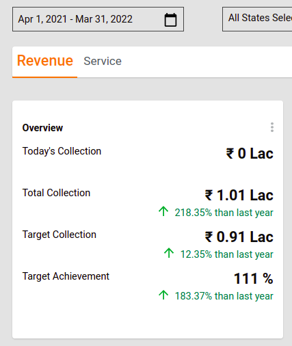

**Total Cumulative Collection**

This graph illustrates the Water and Sewerage collection amount information on a monthly basis. The insights are represented in distinct cumulative line graphs for water and sewerage collections. The graph changes as per the denomination amount filter selection.

**line** - this graph/chart is data representation on date histograms or date groupings.


**Top State By Performance**

This graph represents the States performance based on the % of target achieved in the form of bar charts in descending order.


On the click of the Show More button the system displays the information of all the states as seen in the screenshot below:


#### **Bottom State by Performance** <a href="#bottom-state-by-performance" id="bottom-state-by-performance"></a>

This graph represents the States performance based on the % of target achieved in the form of bar charts in ascending order.


On the click of the Show More button, the system displays the information of all the states as seen in the screenshot below:


**W\&S Collection by Usage Type**

This graph shows the collection amount based on the usage/property type and this amount changes as per the selected denomination filter.


**W\&S Collection by Channel Type**

This graph shows the collection amount based on the collection channel type (eg-online, counter, etc) and this amount changes as per the selected denomination filter.


**W\&S Key Financial Indicators**

This tabular chart representation graph shows multiple W\&S information like Target Collection, Total Collection, Total Transactions, Total Connections and Target Achievement (in %). The table shows the data at the district level and provides a drill-down chart for each district to the ULB level and from the ULB level to the ward level.

_**xtable**_ type adds multiple computed fields with the aggregated dynamic fields.

To add multiple computed columns -&#x20;

* provide the actionName in the following format - actionNameComputedField\<T> interface
* provide the fields \[] names as it exists in the query key
* provide the newField as a name to reflect the computed details

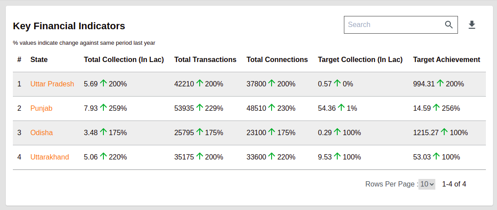

Clicking on any district name provides the drill-down charts, that represent data at the district level.

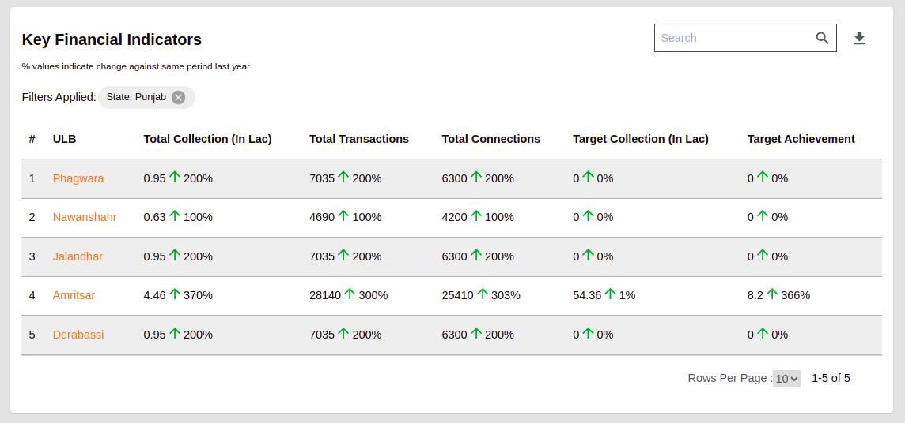

Clicking on the ULB offers a drill-down view of the data at the ward level.

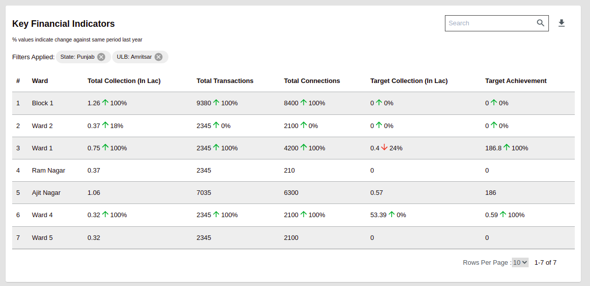

**W\&S Tax Heads**

The tabular chart representation graph shows multiple W\&S information like Total Collection, Penalty, Interest and Target Collection. The table provides the view of data at the district level. Drill-down charts are available for each district to ULB level and for each ULB to ward level. &#x20;

_**table**_ type allows the addition of multiple aggregated fields.

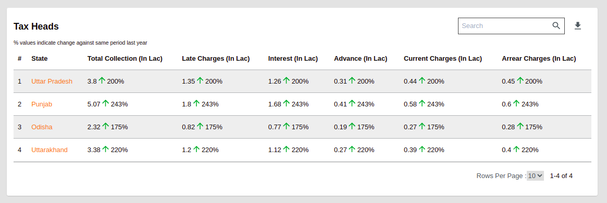

Clicking on the distinct name provides a drill-down view of data at the ULB level.

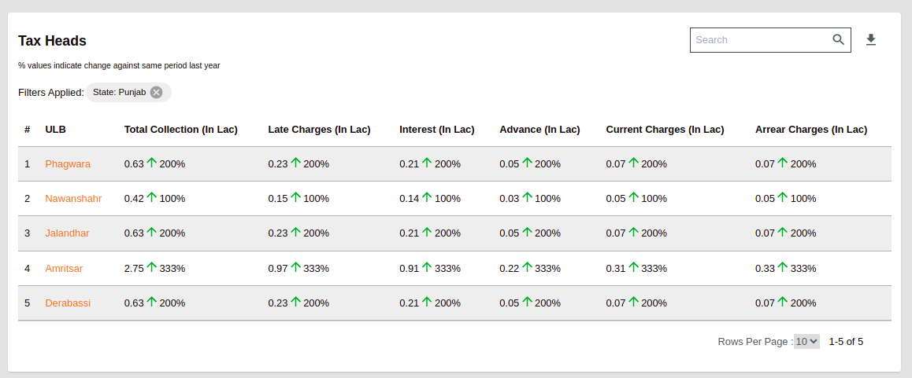

Clicking on the ULB name provides a drill-down view of data at the ward level.

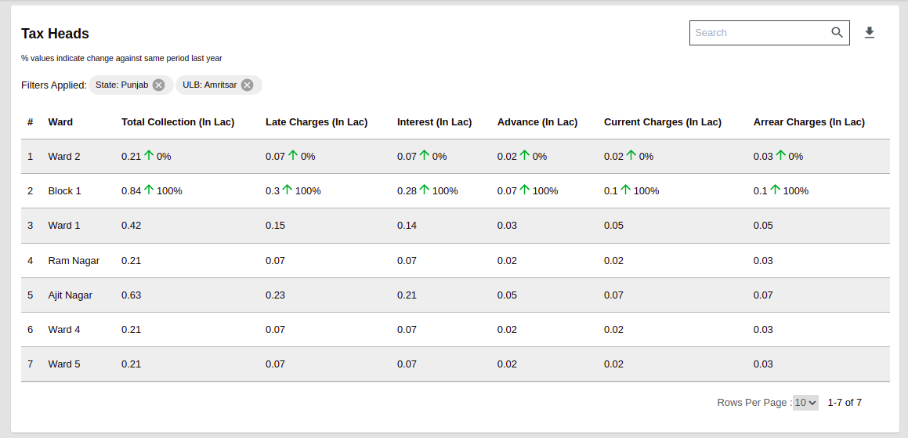

### **Service Tab**

**Overview -** The overview graph offers insights on multiple data items listed below for a selected time period.

* **Total Applications:** the total number of applications submitted for new, modify, and disconnection requests
* **SLA Compliance:** the total SLA observed in percentage
* **Total Active Connections:** the total active water and sewerage connections
* **Water-Metered Connections:** the total active metered water connections
* **Water-Non-MeteredInformation Connections:** the total active non-metered water connections
* **Sewerage Connections:** the total active sewerage connections

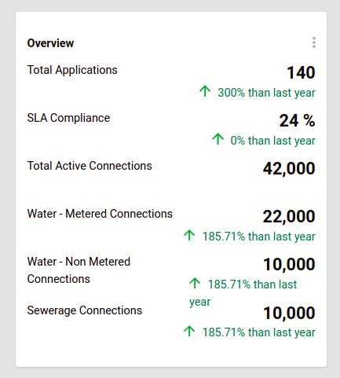

**Cumulative Connections**

This graph provides insights into the Water and Sewerage connections on a monthly basis in the form of a cumulative line graph. Distinct line graphs are illustrated for water and sewerage connections.&#x20;

**line** - this graph/chart is data representation on date histograms or date groupings.

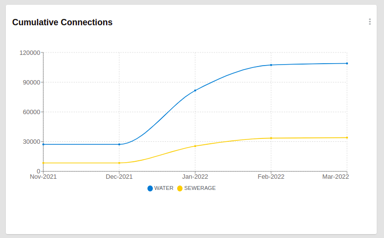

**Water Connections by Usage Type**

This graph provides the active water connection insights based on the usage/property type.


**Sewerage Connections by Usage Type**

This graph offers the active Sewerage connection details based on the usage/property type.


**W\&S Connections by Channel Type**

This graph provides the active water and sewerage connection details by channel type (eg-online, counter, etc).


**W\&S Connection Ageing**

This tabular chart graph provides insights on the submitted W\&S applications that are pending to be worked on. Information like Pending from 0 to 3 days, Pending from 3 to 7 days, Pending from 7 to 15 days, Pending for more than 15 days, and Total Pending Applications are shown in the chart. The data is visible at the district level with the drill-down facility down to the State level to the ULB level and finally to the Ward level.

_**xtable**_ type allows adding multiple computed fields with the aggregated fields dynamically added.

To add multiple computed columns -&#x20;

* provide the actionName in the following format - actionNameComputedField\<T> interface
* provide the fields \[] names as it exists in the query key
* provide the newField as a name to reflect the computed details

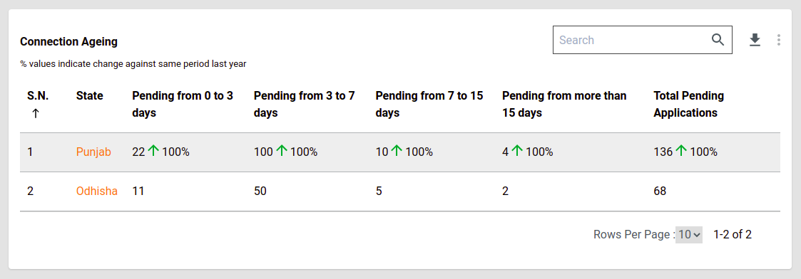

Clicking on the district or State name provides a drill-down view of the data at the ULB level.

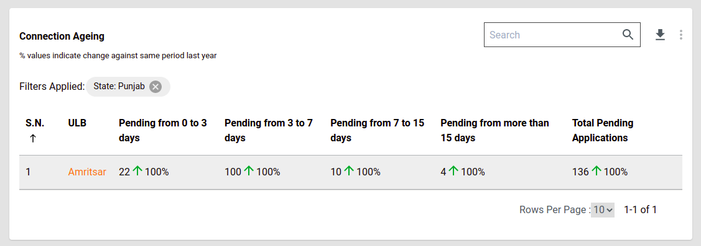

Clicking on the ULB name provides a drill-down view of the data at the ward level.

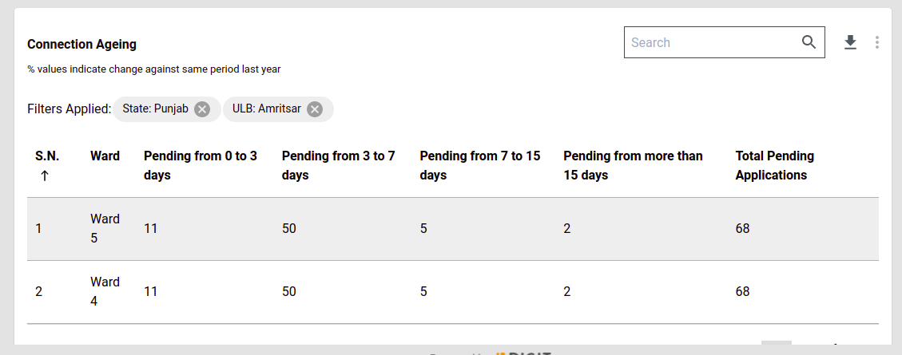

### **Newly Introduced Property Configuration**

**isRoundOff**: This property is introduced to round off the decimal values. For example, the value 25.43 is rounded off to 25 using the isRoundOff property configuration. The value 22.56 is rounded off to 23. This configuration property is used for insights configuration and overview graphs.

#### Common Property Configuration  <a href="#common-properties-available" id="common-properties-available"></a>

**Key(eg: fsmTotalrequest):** This is the Visualization Code used to configure visualization details. It allows the client application to identify the visualization for display.

**chartName:** The name of the chart to be used as a label on the dashboard. The name of the chart is the detailed name. In this configuration, the name of the chart is the localization code used by the client side.

**queries:** Some visualizations are derived from specific data sources. While some others are derived from different data sources and are combined together to get a meaningful representation. The queries of aggregation used to fetch out the right data in the right aggregated format are configured here.

**queries.module:** The module/domain level, on which the query is applied on. The Water and Sewerage module is referred to as W\&S.

**queries.indexName:** This property allows the configuration of the name of the index upon which the query is executed.

**queries.aggrQuery:** The aggregation query in itself is added here. Based on the specified module and the index name, the query is attached to the filter part of the complete search request and then executed against that index.

**queries.requestQueryMap:** Client requests carry certain fields that require filtering. The parameters specified in the client request are different from the parameters in each of the indexed documents. This mapping is maintained to map the request parameters to the ElasticSearch Document parameters.

**queries.dateRefField:** Each of the modules have separate indexes. And all of them have their own date fields. When there is a date filter applied against these visualizations, each of them has to apply it against their own date reference fields. This configuration parameter maintains the date field index.

**chartType:** This configuration field identifies the type of chart/visualization data to be used to represent data insights.&#x20;

**Available Chart Types**

**metric** - this presents the aggregated amount/value for records filtered by the query&#x20;

**pie** - this presents grouped data in the form of line graphs, bar graphs, pie charts or donuts

**line** - this graph/chart is data representation using dated histograms or grouped data

**perform** - this chart groups data performance-wise

**table** - presents data grouped into rows and columns with distinct headers &#x20;

**xtable -** represents an advanced feature of the table with dynamic capabilities for adding header values.&#x20;

**valueType:** In any case of data, the values sent for plotting, might be in percentage, sometimes an amount or sometimes just a count. This field allows the configuration of the type of value represented by the data in the visualization - that is whether it reflects a number, a percentage or an amount. &#x20;

**action:** Some of the visualizations are not just aggregation of the data source. There might be some cases where we have to do a post aggregation computation. For Example, in the case of Top 3 Performing ULBs, the Target and Total Collection is obtained and then the percentage is calculated. This parameter defines the action that has to be performed on the data obtained.&#x20;

**documentType:** This parameter defines the type of document upon which the query has to be executed.&#x20;

**drillChart:** This field adds the drill-down code for the visualization in case the chart offers drill-down. This is used by the client service to manage drill-downs.

**aggregationPaths:** All the queries have Aggregation names in them. In order to fetch the value out of each Aggregation Responses, the name of the aggregation in the query is an easy bet. These aggregation paths will have the names of Aggregation in it.

**insights:** This field shows the data in comparison to last year with arrow symbols that indicate the %  increase or decrease.&#x20;

**comment:** In order to display information on the “i” symbol of each visualization. This field captures any additional information linked to visualization.&#x20;

### **National W\&S-DSS - Index Properties** <a href="#index-properties-of-national-w-and-s-dss" id="index-properties-of-national-w-and-s-dss"></a>

The index that contains data for National-W\&S is- _ws-national-dashboard_

The mapping for this index is:


```
{
  "properties": {
    "ulb": {
      "type": "text",
      "fields": {
        "keyword": {
          "type": "keyword",
          "ignore_above": 256
        }
      }
    },
    "state": {
      "type": "text",
      "fields": {
        "keyword": {
          "type": "keyword",
          "ignore_above": 256
        }
      }
    },
    "ward": {
      "type": "text",
      "fields": {
        "keyword": {
          "type": "keyword",
          "ignore_above": 256
        }
      }
    },
    "region": {
      "type": "text",
      "fields": {
        "keyword": {
          "type": "keyword",
          "ignore_above": 256
        }
      }
    },
    "tenantId": {
      "type": "text",
      "fields": {
        "keyword": {
          "type": "keyword",
          "ignore_above": 256
        }
      }
    },
    "module": {
      "type": "text",
      "fields": {
        "keyword": {
          "type": "keyword",
          "ignore_above": 256
        }
      }
    },
    "date": {
      "type": "date",
      "format": "dd-MM-yyyy HH:mm:ss||dd-MM-yyyy||epoch_millis||dd-MM-yyyy'T'HH:mm:ss.SSSZ"
    },
    "transactions": {
      "type": "long"
    },
    "connectionType": {
      "type": "text",
      "fields": {
        "keyword": {
          "type": "keyword",
          "ignore_above": 256
        }
      }
    },
    "connectionsCreatedForConnectionType": {
      "type": "long"
    },
    "channelType": {
      "type": "text",
      "fields": {
        "keyword": {
          "type": "keyword",
          "ignore_above": 256
        }
      }
    },
    "connectionsCreatedForChannelType": {
      "type": "long"
    },
    "sewerageConnectionsForChannelType": {
      "type": "long"
    },
    "waterConnectionsForChannelType": {
      "type": "long"
    },
    "usageType": {
      "type": "text",
      "fields": {
        "keyword": {
          "type": "keyword",
          "ignore_above": 256
        }
      }
    },
    "todaysCollectionForUsageType": {
      "type": "long"
    },
    "sewerageConnectionsForUsageType": {
      "type": "long"
    },
    "waterConnectionsForUsageType": {
      "type": "long"
    },
    "paymentChannelType": {
      "type": "text",
      "fields": {
        "keyword": {
          "type": "keyword",
          "ignore_above": 256
        }
      }
    },
    "todaysCollectionForChannelType": {
      "type": "long"
    },
    "todaysCollectionForConnectionType": {
      "type": "long"
    },
    "taxHeads": {
      "type": "text",
      "fields": {
        "keyword": {
          "type": "keyword",
          "ignore_above": 256
        }
      }
    },
    "todaysCollectionForTaxHeads": {
      "type": "long"
    },
    "meterType": {
      "type": "text",
      "fields": {
        "keyword": {
          "type": "keyword",
          "ignore_above": 256
        }
      }
    },
    "waterConnectionsForMeterType": {
      "type": "long"
    },
    "duration": {
      "type": "text",
      "fields": {
        "keyword": {
          "type": "keyword",
          "ignore_above": 256
        }
      }
    },
    "pendingConnectionsForDuration": {
      "type": "long"
    },
    "todaysTotalApplications": {
      "type": "long"
    },
    "todaysClosedApplications": {
      "type": "long"
    },
    "todaysCompletedApplicationsWithinSLA": {
      "type": "long"
    },
    "slaCompliance": {
      "type": "long"
    }
  }
}
```


The following table describes the properties mentioned above:

| **Attributes**                       | **Definition**                                                             | **Breakup**                                                                                                                                                                                                                                                                                                                                                                                                                                                                                                                                                                                                                                                                                                                |
| ------------------------------------ | -------------------------------------------------------------------------- | -------------------------------------------------------------------------------------------------------------------------------------------------------------------------------------------------------------------------------------------------------------------------------------------------------------------------------------------------------------------------------------------------------------------------------------------------------------------------------------------------------------------------------------------------------------------------------------------------------------------------------------------------------------------------------------------------------------------------- |
| ulb                                  | The district or region for which the data is ingested.                     | Nil                                                                                                                                                                                                                                                                                                                                                                                                                                                                                                                                                                                                                                                                                                                        |
| state                                | The ULB name for which the data is ingested.                               | Nil                                                                                                                                                                                                                                                                                                                                                                                                                                                                                                                                                                                                                                                                                                                        |
| ward                                 | The ward for which the data is ingested.                                   | Nil                                                                                                                                                                                                                                                                                                                                                                                                                                                                                                                                                                                                                                                                                                                        |
| transactions                         | Number of transactions related to WS/SW module on a given date             | Nil                                                                                                                                                                                                                                                                                                                                                                                                                                                                                                                                                                                                                                                                                                                        |
| connectionsCreated                   | Number of connections related to WS/SW module on a given date.             | <p>Breakup by:<br>1.) channel type(<code>Counter</code>, <code>ONLINE</code>, <code>CSC</code>, <code>SYSTEM</code>) and<br>2.) connection type(<code>WATER.METERED</code>, <code>WATER.NONMETERED</code>, <code>SEWERAGE</code>)<br>has to be provided</p>                                                                                                                                                                                                                                                                                                                                                                                                                                                                |
| todaysCollection                     | Total collection related to WS/SW module on a given date                   | <p>Breakup by:<br>1.)usage type(<code>Domestic</code>, <code>Commercial</code>, <code>Institutional</code>, <code>Domestic SLC</code>, <code>Domestic Exempted</code>,<code>Commercial Motor</code>,etc), 2.)payment channel type(<code>System</code>, <code>Paytm</code>, <code>Field</code>, <code>RazorPay</code>, <code>PayU</code>, <code>BBPS</code>, <code>POS</code>, <code>Sewakendra</code>, <code>Freecharge</code>),<br>3.) tax head(<code>INTEREST</code>,<code>LATE.CHARGES</code>, <code>ADVANCE</code>, <code>CURRENT.CHARGES</code>, <code>ARREAR.CHARGES</code>), and<br>4.) connection type(<code>WATER.METERED</code>, <code>WATER.NONMETERED</code>, <code>SEWERAGE</code>)<br>has to be provided</p> |
| waterConnections                     | new connections created on the given date                                  | <p>Breakup by:<br>1.) meter type(<code>METERED</code>, <code>NON.METERED</code>), 2.) usage(<code>Domestic</code>, <code>Commercial</code>, <code>Residential</code>, <code>Institutional</code>, <code>Domestic Exempted</code>) and<br>3.) channel(<code>Counter</code>, <code>ONLINE</code>, <code>CSC</code>, <code>SYSTEM</code>)</p>                                                                                                                                                                                                                                                                                                                                                                                 |
| sewerageConnections                  | new sewreage connections created on the given date                         | <p>Breakup by:<br>1.) usage(<code>Domestic</code>, <code>Commercial</code>, <code>Residential</code>, <code>Institutional</code>, <code>Domestic Exempted</code>) and<br>2.) channel(<code>ONLINE</code>, <code>CSC</code>, <code>SYSTEM</code>)</p>                                                                                                                                                                                                                                                                                                                                                                                                                                                                       |
| pendingConnections                   | pending connections on the given date                                      | <p>Breakup by:</p><p>duration(<code>0to3Days</code>, <code>3to7Days</code>, <code>7to15Days</code>, <code>MoreThan15Days</code>)</p>                                                                                                                                                                                                                                                                                                                                                                                                                                                                                                                                                                                       |
| slaCompliance                        | Percentage of complaints that are resolved within SLA till the given date. | Nil                                                                                                                                                                                                                                                                                                                                                                                                                                                                                                                                                                                                                                                                                                                        |
| todaysTotalApplications              | # of Applications created on the given date                                | Nil                                                                                                                                                                                                                                                                                                                                                                                                                                                                                                                                                                                                                                                                                                                        |
| todaysClosedApplications             | # of Applications closed on the given date                                 | Nil                                                                                                                                                                                                                                                                                                                                                                                                                                                                                                                                                                                                                                                                                                                        |
| todaysCompletedApplicationsWithinSLA | # of Applications closed on the given date within SLA                      | Nil                                                                                                                                                                                                                                                                                                                                                                                                                                                                                                                                                                                                                                                                                                                        |

### **Postman Collection - National W\&S-DSS**

[https://www.getpostman.com/collections/5d3bb33f27dc4528c103](https://www.getpostman.com/collections/5d3bb33f27dc4528c103)\
\
\
