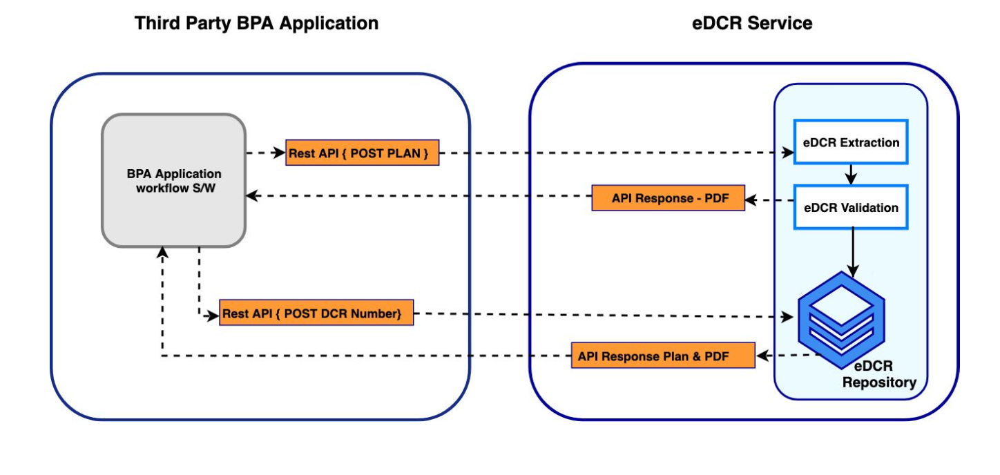
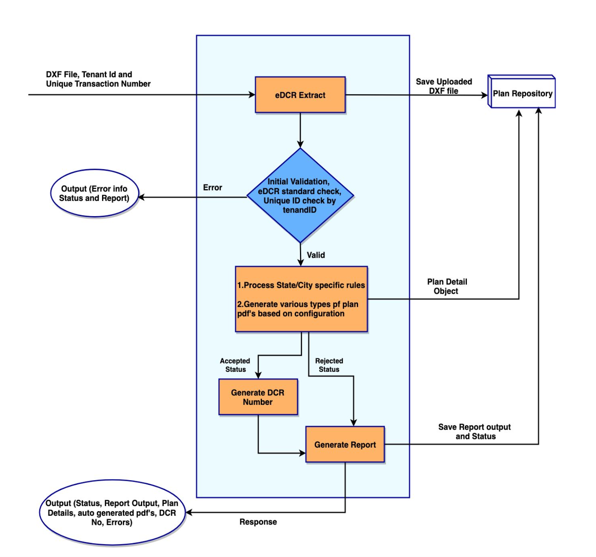
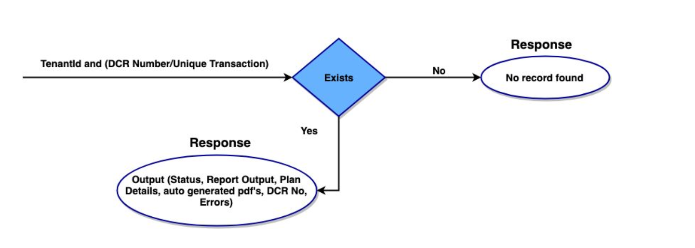

# eDCR Integration

## Overview

Building plan approval (BPA) is one of the key activities performed by Urban Local Bodies and Planning Authorities. The Online Building Plan Application Software (OBPAS) automates the various steps in the plan approval process. The core intelligence of OBPAS resides in the automatic scrutiny of building plans with reference to the Development Control Regulations of the state. This functionality is called eDCR (eGov-DCR). It involves extracting the key plan parameters from the CADD drawing and evaluating the parameters against the defined rules in the State Development Control Regulations. Once the Plan Scrutiny is completed the application will be processed for other workflow stages like Document Verification, Field Verification, NOC Certificates, Fee Computation, and Permit Generation.

DIGIT offers the complete OBPAS as an open-source application and eDCR is an integral part of it. The automatic scrutiny capability provided by eDCR can be leveraged by States which already have existing BPA software through simple integration. This enables the States to reduce the manual and time-consuming process of evaluation of rules and ensures uniformity of evaluation.

This doc helps in understanding the integration process of eDCR Service with an existing Building Plan Application software. At a broad level, competencies in the below technical and functional areas are necessary for integrating eDCR system,

* Integration expertise is backed by a sound understanding of the architecture of the existing ecosystem, its uniqueness, features, flaws, and a complete understanding of the challenges involved in making them successfully work together.
* Subject matter expertise on Building Plans and DCR Rules to interpret DCR Rule Validation algorithm from the DCR Rules.&#x20;
* A good understanding of the configuration of the DCR Rule Validations in the Validation Engine of the eDCR Service


**Note:** The detailed training prerequisites for integrating eDCR into any legacy BPA system are listed in​ ​[Training Prerequisites for eDCR Integration​ ](edcr-integration.md#training-pre-requisites-for-edcr-integration)​section.


### eDCR Task Flow Overview

The eDCR process typically involves the below sequence of steps,

1. Capture drawing files in DXF format along with city identifier
2. Submit DXF format drawing file to eDCR system for scrutiny
3. Collect generated reports from eDCR system with status as accepted or rejected. The\
   eDCR system will generate additional information like floor-wise area details,\
   compound wall length, number of wells, etc
4. The DXF file can be resubmitted any number of times into the system, irrespective of\
   the acceptance or rejection status
5. An accepted status of the drawing indicates that it is validated and approved against\
   all the bylaws configured in the system. The integrating system can use this for\
   further processing
6. The eDCR status report and associated details can be retrieved at a later point also by\
   sending the unique Transaction Number to eDCR system

## eDCR Architecture

The eDCR service has ​Extraction​, ​Validation, and ​Repository as the key components. The architecture depicted here covers integration aspects and API requirements.

<figure><figcaption></figcaption></figure>

### Process Flow Diagrams

The diagram below clearly illustrates the process flow in the eDCR system. There are two major stages in the process:

* Upload and Scrutinize Plan
* Get Details (To check plan scrutiny status)

<figure><figcaption>
Upload &#x26; Scrutinise Plan
</figcaption></figure>

<figure><figcaption>
Get Details - eDCR Flows
</figcaption></figure>

## API Specifications

eDCR system will provide REST APIs to push drawing files (DXF format) along with a unique ID. The Integrating system will provide a unique Transaction Number. The same will be used by both systems to track applications.

eGov will publish two REST APIs.

* Upload And Scrutinize Plan: The integrating system should call this API with the required parameters explained in the API structure. The system will scrutinize the plan and reply with a response as explained in the API structure. The Status "Accepted" indicates the plan is ready to use for further process. "Rejected" will indicate that either plan violates the rule or is missing basic information. Both rejected and accepted plans can be resubmitted. But eDCR system will consider each request as a new one.
* Get Details:​ The integrating system will call this API with parameters specified in the API structure. The eDCR system will search for the details in the eDCR repository and respond with a) Status - accepted/rejected b) Scrutiny report c) Plan details (details present in Dxf) d) DXF file e) Generated Plan pdfs. If the transaction number or Autodcr number does not exist in the system, an appropriate message is published.


**Note:​** The REST API reference information with Request/Response Structures, Request Urls, Methods, Status Messages, and Samples will be shared in subsequent documents.


## Training Pre-requisites For eDCR Integration

For integrating eDCR the below knowledge and infrastructure requirements need to be addressed

* State building by-laws with the latest amendments (hard or soft copy)
* Subject matter expert (SME) from the ULB side, who understands the by-laws and\
  building plan domain
* An architect who can draw diagrams for the team to test – He or She should be able to understand the by-laws given by the SME and create diagrams to validate those by-laws in the diagram scrutiny
* The technical team should have resources with 5+ years of experience in J2EE technology - Java, Spring, Hibernate, Postgress, Jboss/Wildfly, and GIT
* The technical team should be equipped with LINUX machines preferably UBUNTU and the following
  * Maven v3.2.x
  * PostgreSQL v9.6
  * Elastic Search v2.3.5
  * Git 2.8.3
  * JDK 8 update 112 or higher
  * Eclipse or any IDE
* Cloud instance for deployment (Azure / AWS)

