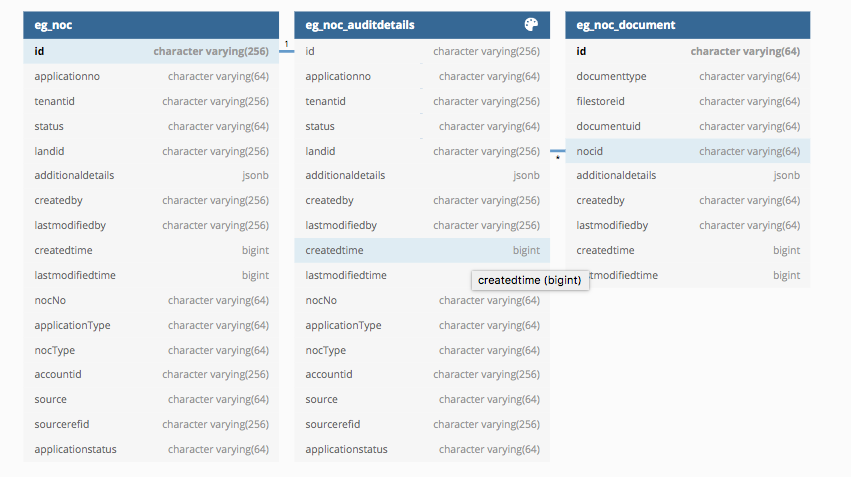

# Noc Services

### Description

For every building plan application, there is a need to get the No objection certificate from the concerned departments. Based on the configuration we have for the NOCs, for every application, there will be a set of NOCs required. There should be a provision to allow the NOC department user to login to our system and upload the required NOC. We are providing a user to one NOC department. Based on the workflow mode(online/offline) of each NOC type, the NOC department user can perform the action.

Online mode – NOC department user can log in to the system and approve/reject the application.

Offline mode – NOC application will be auto-approved.

### **System Requirements** <a href="#system-requirements" id="system-requirements"></a>

* Knowledge of Java/J2EE(preferably Java 8 version)
* Knowledge of Spring Boot and spring-boot microservices.
* Knowledge of Git or any version control system.
* Knowledge of RESTful Web services.
* Knowledge of the Lombok library will helpful.
* knowledge of eGov-mdms service, eGov-persister, eGov-idgen, eGov-user, eGov-localization will be helpful.

### **External API References** <a href="#external-api-references" id="external-api-references"></a>

* egov-user (Manage user)
* egov-idgen (To generate the application No)
* egov-localization (To use the localized messages)
* egov-location (To store the address locality)
* egov-mdms (Configurations/master data used in the application is served by MDMS)
* egov-notification-sms (Service to send SMS to the users involved in the application)
* egov-persister (Helps to persist the data)
* egov-workflow-v2 (Workflow configuration for different BPA application is configured)

### **API Information** <a href="#api-information" id="api-information"></a>

* Please refer to Swagger API for YAML file details. Link - [API Specs](https://github.com/egovernments/municipal-services/blob/Noc-Contract/docs/noc/noc-v-1.0.0.yaml).

### Workflow Configuration

#### **Fire Noc: Off-Line configuration** <a href="#fire-noc-off-line-configuration" id="fire-noc-off-line-configuration"></a>

```
{
            
            "businessService": "FIRE_NOC_OFFLINE",
            "business": "noc-services",
            "businessServiceSla": 5184000000,
            "tenantId": "pb",
            "states": [
                {
                   
                    "sla": null,
                    "state": null,
                    "tenantId": "pb",
                    "applicationStatus": "INITIATED",
                    "docUploadRequired": false,
                    "isStartState": true,
                    "isTerminateState": false,
                    "isStateUpdatable": true,
                    "actions": [
                        {
                            
                            "currentState": "null",
                            "action": "INITIATE",
                            "tenantId": "pb",
                            "nextState": "INITIATED",
                            "roles": [
                                "CITIZEN",
                                "BPA_ARCHITECT",
                                "BPA_ENGINEER",
                                "BPA_BUILDER",
                                "BPA_STRUCTURALENGINEER",
                                "BPA_TOWNPLANNER",
                                "BPA_SUPERVISOR"
                            ]
                        }
                    ]
                },
                {
                    
                    "sla": null,
                    "state": "INITIATED",
                    "applicationStatus": "INPROGRESS",
                    "docUploadRequired": false,
                    "tenantId": "pb",
                    "isStartState": false,
                    "isTerminateState": false,
                    "isStateUpdatable": false,
                    "actions": [
                        {
                           
                            "currentState": "INITIATED",
                            "action": "AUTO_APPROVE",
                            "tenantId": "pb",
                            "nextState": "AUTO_APPROVED",
                            "roles": [
                                "BPA_VERIFIER",
                                "BPA_FIELD_INSPECTOR",
                                "BPA_NOC_VERIFIER",
                                "BPA_APPROVER"
                            ]
                        },
                        {
                            
                            "currentState": "INITIATED",
                            "action": "VOID",
                            "tenantId": "pb",
                            "nextState": "VOIDED",
                            "roles": [
                                "BPA_VERIFIER",
                                "BPA_FIELD_INSPECTOR",
                                "BPA_NOC_VERIFIER",
                                "BPA_APPROVER"
                            ]
                        }
                    ]
                },
                {
                   
                    "sla": null,
                    "state": "VOIDED",
                    "applicationStatus": "VOIDED",
                    "docUploadRequired": false,
                    "tenantId": "pb",
                    "isStartState": false,
                    "isTerminateState": true,
                    "isStateUpdatable": false,
                    "actions": null
                },
                {
                    
                    "sla": null,
                    "state": "AUTO_APPROVED",
                    "applicationStatus": "AUTO_APPROVED",
                    "docUploadRequired": false,
                    "tenantId": "pb",
                    "isStartState": false,
                    "isTerminateState": true,
                    "isStateUpdatable": false,
                    "actions": null
                }
            ]
        }
```

#### **Airport Authority Noc: Off-Line configuration** <a href="#airport-authority-noc-off-line-configuration" id="airport-authority-noc-off-line-configuration"></a>

```
{
            
            "businessService": "AIRPORT_NOC_OFFLINE",
            "business": "noc-services",
            "tenantId": "pb",
            "businessServiceSla": 5184000000,
            "states": [
                {
                   
                    "sla": null,
                    "state": null,
                    "applicationStatus": "INITIATED",
                    "docUploadRequired": false,
                    "tenantId": "pb",
                    "isStartState": true,
                    "isTerminateState": false,
                    "isStateUpdatable": true,
                    "actions": [
                        {
                            
                            "currentState": "null",
                            "action": "INITIATE",
                            "tenantId": "pb",
                            "nextState": "INITIATED",
                            "roles": [
                                "CITIZEN",
                                "BPA_ARCHITECT",
                                "BPA_ENGINEER",
                                "BPA_BUILDER",
                                "BPA_STRUCTURALENGINEER",
                                "BPA_TOWNPLANNER",
                                "BPA_SUPERVISOR"
                            ]
                        }
                    ]
                },
                {
                    
                    "sla": null,
                    "state": "INITIATED",
                    "tenantId": "pb",
                    "applicationStatus": "INPROGRESS",
                    "docUploadRequired": false,
                    "isStartState": false,
                    "isTerminateState": false,
                    "isStateUpdatable": false,
                    "actions": [
                        {
                           
                            "currentState": "INITIATED",
                            "action": "AUTO_APPROVE",
                            "tenantId": "pb",
                            "nextState": "AUTO_APPROVED",
                            "roles": [
                                "BPA_VERIFIER",
                                "BPA_FIELD_INSPECTOR",
                                "BPA_NOC_VERIFIER",
                                "BPA_APPROVER"
                            ]
                        },
                        {
                            
                            "currentState": "INITIATED",
                            "action": "VOID",
                            "tenantId": "pb",
                            "nextState": "VOIDED",
                            "roles": [
                                "BPA_VERIFIER",
                                "BPA_FIELD_INSPECTOR",
                                "BPA_NOC_VERIFIER",
                                "BPA_APPROVER"
                            ]
                        }
                    ]
                },
                {
                   
                    "sla": null,
                    "state": "VOIDED",
                    "tenantId": "pb",
                    "applicationStatus": "VOIDED",
                    "docUploadRequired": false,
                    "isStartState": false,
                    "isTerminateState": true,
                    "isStateUpdatable": false,
                    "actions": null
                },
                {
                    
                    "sla": null,
                    "state": "AUTO_APPROVED",
                    "tenantId": "pb",
                    "applicationStatus": "AUTO_APPROVED",
                    "docUploadRequired": false,
                    "isStartState": false,
                    "isTerminateState": true,
                    "isStateUpdatable": false,
                    "actions": null
                }
            ]
        }
```

Fire Noc: online configuration

```
 {
            
            "businessService": "FIRE_NOC_SRV",
            "business": "noc-services",
            "tenantId": "pb",
            "businessServiceSla": 5184000000,
            "states": [
               {
                    "sla": null,
                    "state": null,
                    "applicationStatus": "INITIATED",
                    "docUploadRequired": false,
                    "isStartState": true,
                    "tenantId": "pb",
                    "isTerminateState": false,
                    "isStateUpdatable": true,
                    "actions": [
                        {
                            
                            "currentState": "null",
                            "action": "INITIATE",
                            "tenantId": "pb",
                            "nextState": "INITIATED",
                            "roles": [
                                "CITIZEN",
                                "BPA_ARCHITECT",
                                "BPA_ENGINEER",
                                "BPA_BUILDER",
                                "BPA_STRUCTURALENGINEER",
                                "BPA_TOWNPLANNER",
                                "BPA_SUPERVISOR"
                            ]
                        }
                    ]
                },
                {
                    
                    "sla": null,
                    "state": "INITIATED",
                    "applicationStatus": "INPROGRESS",
                    "docUploadRequired": false,
                    "tenantId": "pb",
                    "isStartState": false,
                    "isTerminateState": false,
                    "isStateUpdatable": false,
                    "actions": [
                        {
                            
                            "currentState": "INITIATED",
                            "tenantId": "pb",
                            "action": "REJECT",
                            "nextState": "REJECTED",
                            "roles": [
                                "FIRE_NOC_APPROVER"
                            ]
                        },
                        {
                            
                            "currentState": "INITIATED",
                            "tenantId": "pb",
                            "action": "APPROVE",
                            "nextState": "APPROVED",
                            "roles": [
                                "FIRE_NOC_APPROVER"
                            ]
                        },
                        {
                      
                            "currentState": "INITIATED",
                            "action": "VOID",
                            "tenantId": "pb",
                            "nextState": "VOIDED",
                            "roles": [
                                "BPA_VERIFIER",
                                "BPA_FIELD_INSPECTOR",
                                "BPA_NOC_VERIFIER"
                            ]
                        }
                    ]
                },
                {
                    
                    "sla": null,
                    "state": "REJECTED",
                    "tenantId": "pb",
                    "applicationStatus": "REJECTED",
                    "docUploadRequired": false,
                    "isStartState": false,
                    "isTerminateState": true,
                    "isStateUpdatable": false,
                    "actions": null
                },
                {
                  
                    "sla": null,
                    "state": "APPROVED",
                    "tenantId": "pb",
                    "applicationStatus": "APPROVED",
                    "docUploadRequired": false,
                    "isStartState": false,
                    "isTerminateState": true,
                    "isStateUpdatable": false,
                    "actions": null
                },
                {
                    
                    "sla": null,
                    "state": "VOIDED",
                    "tenantId": "pb",
                    "applicationStatus": "VOIDED",
                    "docUploadRequired": false,
                    "isStartState": false,
                    "isTerminateState": true,
                    "isStateUpdatable": false,
                    "actions": null
                }
            ]
        }
```

Airport Authority: online configuration

```
 {
            
            "businessService": "AIRPORT_NOC_SRV",
            "business": "noc-services",
            "tenantId": "pb",
            "businessServiceSla": 5184000000,
            "states": [
               {
                    "sla": null,
                    "state": null,
                    "applicationStatus": "INITIATED",
                    "docUploadRequired": false,
                    "isStartState": true,
                    "tenantId": "pb",
                    "isTerminateState": false,
                    "isStateUpdatable": true,
                    "actions": [
                        {
                            
                            "currentState": "null",
                            "action": "INITIATE",
                            "tenantId": "pb",
                            "nextState": "INITIATED",
                            "roles": [
                                "CITIZEN",
                                "BPA_ARCHITECT",
                                "BPA_ENGINEER",
                                "BPA_BUILDER",
                                "BPA_STRUCTURALENGINEER",
                                "BPA_TOWNPLANNER",
                                "BPA_SUPERVISOR"
                            ]
                        }
                    ]
                },
                {
                    
                    "sla": null,
                    "state": "INITIATED",
                    "applicationStatus": "INPROGRESS",
                    "docUploadRequired": false,
                    "isStartState": false,
                    "isTerminateState": false,
                    "tenantId": "pb",
                    "isStateUpdatable": false,
                    "actions": [
                        {
                            
                            "currentState": "INITIATED",
                            "action": "REJECT",
                            "tenantId": "pb",
                            "nextState": "REJECTED",
                            "roles": [
                                "AIRPORT_AUTHORITY_APPROVER"
                            ]
                        },
                        {
                            
                            "currentState": "INITIATED",
                            "action": "APPROVE",
                            "tenantId": "pb",
                            "nextState": "APPROVED",
                            "roles": [
                                "AIRPORT_AUTHORITY_APPROVER"
                            ]
                        },
                        {
                      
                            "currentState": "INITIATED",
                            "action": "VOID",
                            "tenantId": "pb",
                            "nextState": "VOIDED",
                            "roles": [
                                "BPA_VERIFIER",
                                "BPA_FIELD_INSPECTOR",
                                "BPA_NOC_VERIFIER"
                            ]
                        }
                    ]
                },
                {
                    
                    "sla": null,
                    "state": "REJECTED",
                    "tenantId": "pb",
                    "applicationStatus": "REJECTED",
                    "docUploadRequired": false,
                    "isStartState": false,
                    "isTerminateState": true,
                    "isStateUpdatable": false,
                    "actions": null
                },
                {
                  
                    "sla": null,
                    "state": "APPROVED",
                    "applicationStatus": "APPROVED",
                    "docUploadRequired": false,
                    "tenantId": "pb",
                    "isStartState": false,
                    "isTerminateState": true,
                    "isStateUpdatable": false,
                    "actions": null
                },
                {
                    
                    "sla": null,
                    "state": "VOIDED",
                    "applicationStatus": "VOIDED",
                    "tenantId": "pb",
                    "docUploadRequired": false,
                    "isStartState": false,
                    "isTerminateState": true,
                    "isStateUpdatable": false,
                    "actions": null
                }
            ]
        }
```

### Database Schema



### Notifications

NA

### PDF’s Used

NA

[](http://creativecommons.org/licenses/by/4.0/)All content on this page by [eGov Foundation ](https://egov.org.in/)is licensed under a [Creative Commons Attribution 4.0 International License](http://creativecommons.org/licenses/by/4.0/).
