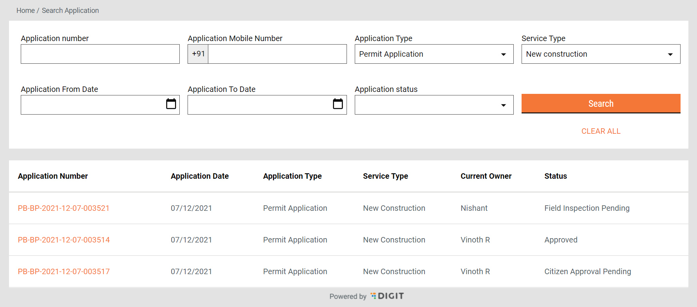
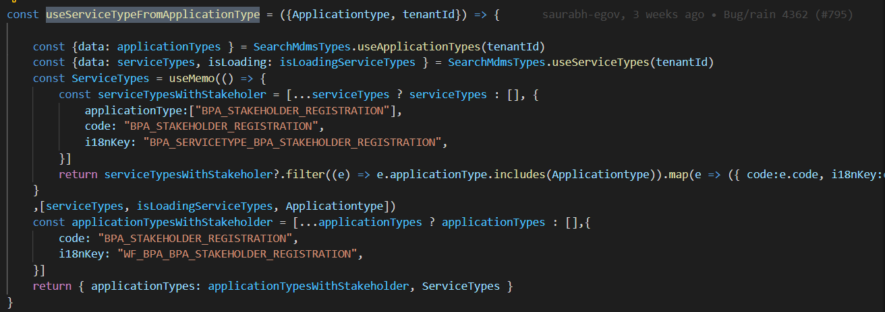

# OBPS Search Application

## Overview

The search application feature provides a filter-based search tool to employees.

## Workflow Details

OBPS search application is used to search all the applications independent from the workflow/process instance data, which eliminates the presence of valid roles to search for an application from any business service.

## MDMS Data

Make use of the already documented applicationType and serviceType MDMS. Create a couple of hooks to coordinate and easily use the available filters.

