# OBPS BPA / OCBPA Citizen

## Overview

To provide the facility for the citizen user to view the application details, update the BPA application state and make the payment.

## Workflow Details

Users can review the list of applications and their status registered using their mobile number on the My Applications page. Each Application initially displays the Application Number, Application Type, Service Type, status, and SLA with the View Details option.

### **View Application By Citizen**

Click on the View Applications by Citizen link routes users to the My Applications screen.\
The screen provides BPA, OC-BPA and stakeholder registration applications and details.\
The BPA search API and the Stakeholder Registration search APIs are called and the application cards are visible after getting the response from the APIs.

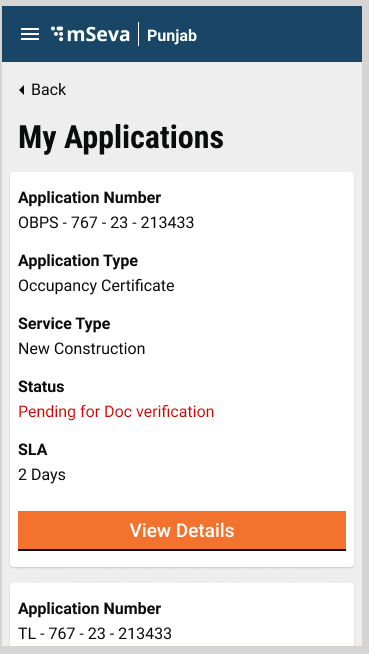

&#x20;File Path



Click on the View Details button. It routes users to the application details screen.\
\
**1. BPA Application Details**

Clicking on the BPA/OC BPA application card routes users to the BPA application details page. The application details page displays the details of the application and also showcases all the actions that can be taken on the application.

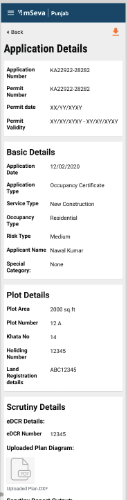

 

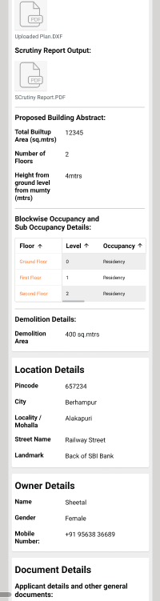

 

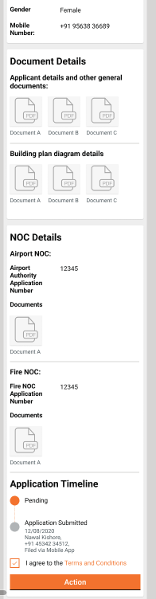

&#x20;

Clicking on the Action button provides the citizen users with the actions list. Clicking on any one of the options opens a popup window. Users can enter comments and upload documents. Clicking on the Submit or Forward button triggers the Update API call.

File Path



### **Send Back To Citizen**

When employees click on the Send Back to Citizen button, the applications are routed back to the My Applications list of the citizen. The Application Details screen allows users to make the required changes. The forward action button routes the citizen to the Summary screen. Users can attach the documents and submit the application.&#x20;

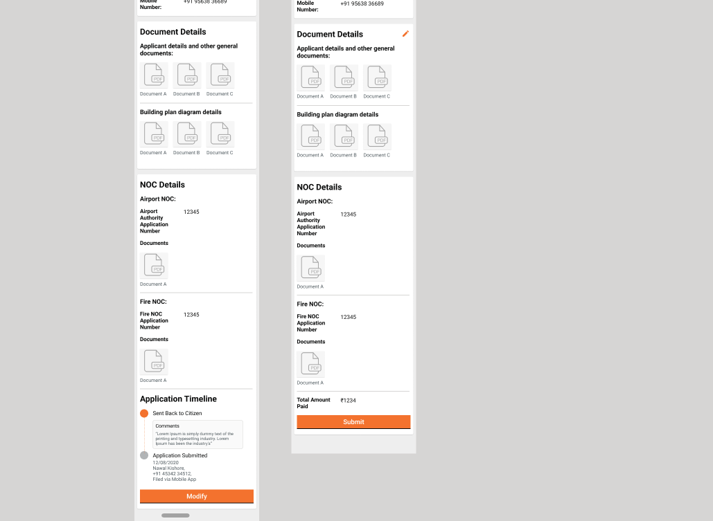

File Path



### **Download**&#x20;

Citizens can download the receipts which include Application Fee, Sanction Fee, Permit order, Revocation pdf, Comparison report etc based on the conditions.&#x20;

File Path



### **Stakeholder Registration Application Details**

Clicking on the Stakeholder Application card routes the user to the stakeholder application details. The application details page displays the details of the application and also showcases all the actions that can be taken on the application.

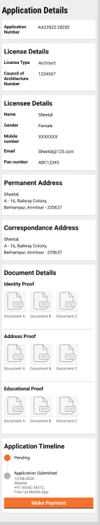

File Path



### **Timeline Component**

The Timeline component is present at the end of the application details and provides information on the current status.

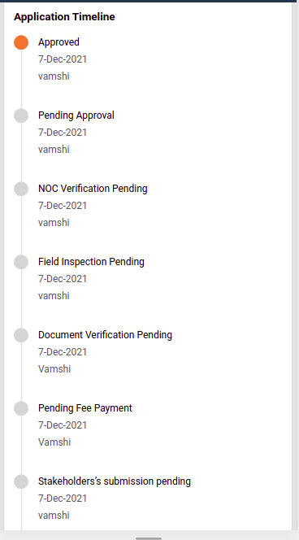

## **Technical Implementation**&#x20;

All the screens have been developed using the new-UI structure followed previously in FSM, PGR, PT and TL.\

**OBPS Hooks Details**

File Path&#x20;



OBPS Search API Hook

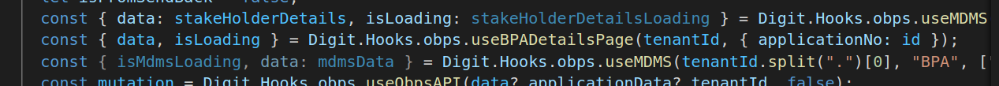

OBPS Update API Hook

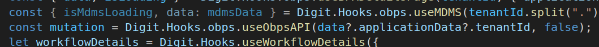

OBPS WorkFlow API Hook

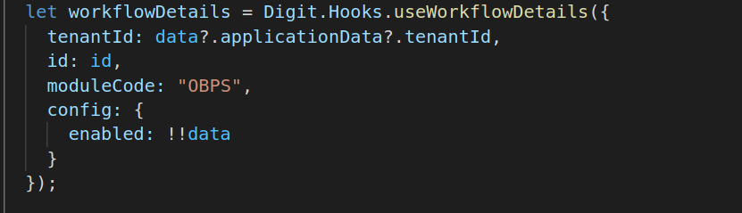

OBPS MDMS Hooks

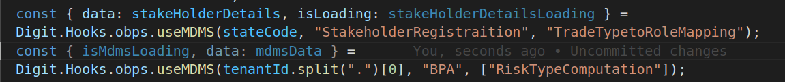

Collection Services Hooks(For Receipts and Amount display)

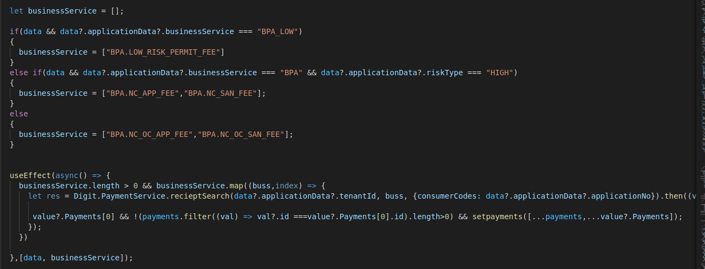

**Stakeholder Hooks**\

File Path



Search Hook

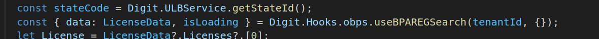

MDMS Hook

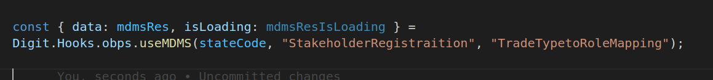

Collection Service Hook(For Receipts and Amount display)

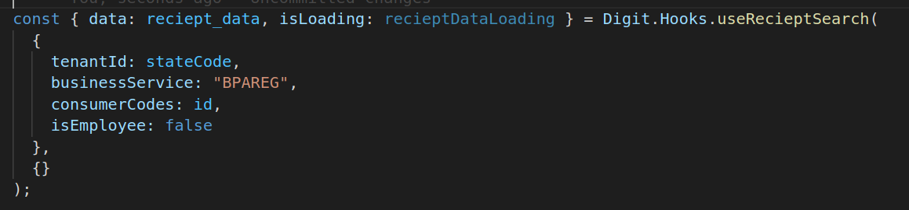

## **Localisation**

Localisation keys are added under the ‘_rainmaker-bpa_’ and ‘rainmaker-bpareg’ locale modules. In future, if any new labels are implemented in the OBPS - Architect (Citizen) they should also be pushed to the locale DB under '_rainmaker-bpa'_ locale module. Below is an example of a few locale labels.&#x20;

## **API Call Role Action Mapping**

<table data-header-hidden><thead><tr><th width="150"></th><th width="274"></th><th width="150"></th><th></th></tr></thead><tbody><tr><td><a href="http://s.no/"><strong>S.No</strong></a><strong>.</strong></td><td>
<strong>API</strong>

 
</td><td><strong>Action id</strong></td><td><strong>Roles</strong></td></tr><tr><td>1</td><td><code>/egov-mdms-service/v1/_search</code></td><td><code>954</code></td><td><code>CITIZEN</code></td></tr><tr><td>2</td><td><code>/edcr/rest/dcr/scrutinydetails</code></td><td> </td><td><code>CITIZEN</code></td></tr><tr><td>3</td><td><code>/filestore/v1/files/url</code></td><td><code>1528</code></td><td><code>CITIZEN</code></td></tr><tr><td>4</td><td><code>/billing-service/bill/v2/_fetchbill</code></td><td><code>1862</code></td><td><code>CITIZEN</code></td></tr><tr><td>5</td><td><code>collection-services/payments/{businessService}/_search/</code></td><td><code>1864</code></td><td><code>CITIZEN</code></td></tr><tr><td>6</td><td><code>/noc-services/v1/noc/_search</code></td><td> </td><td><code>CITIZEN</code></td></tr><tr><td>7</td><td><code>/localization/messages/v1/_search</code></td><td><code>1531</code></td><td><code>CITIZEN</code></td></tr><tr><td>8</td><td><code>/noc-services/v1/noc/_update</code></td><td> </td><td><code>CITIZEN</code></td></tr><tr><td>9</td><td><code>/bpa-services/v1/bpa/_update</code></td><td> </td><td><code>CITIZEN</code></td></tr><tr><td>10</td><td><code>/bpa-services/v1/bpa/_search</code></td><td> </td><td><code>CITIZEN</code></td></tr><tr><td>11</td><td><code>/egov-workflow-v2/egov-wf/process/_search</code></td><td> </td><td><code>CITIZEN</code></td></tr><tr><td>12</td><td><code>/egov-workflow-v2/egov-wf/businessservice/_search</code></td><td> </td><td><code>CITIZEN</code></td></tr><tr><td>13</td><td><code>/tl-services/v1/BPAREG/_search</code></td><td> </td><td><code>CITIZEN</code></td></tr></tbody></table>

\

> [_​_](http://creativecommons.org/licenses/by/4.0/)_All content on this page by_ [_eGov Foundation_](https://egov.org.in/) _is licensed under a_ [_Creative Commons Attribution 4.0 International License_](http://creativecommons.org/licenses/by/4.0/)_._
