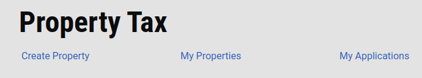
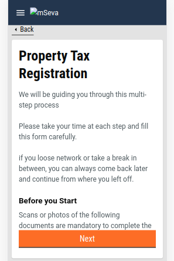
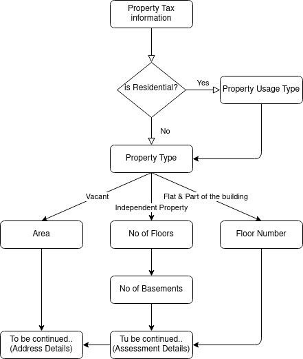
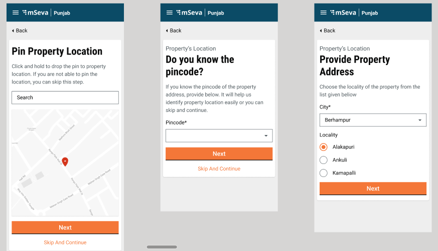
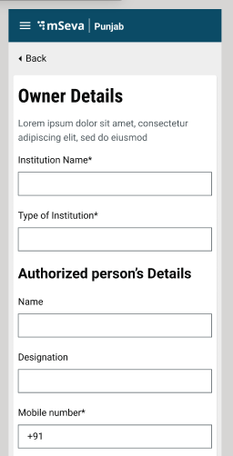
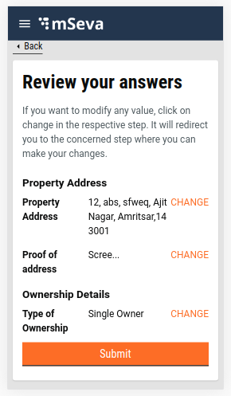
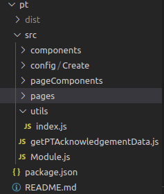
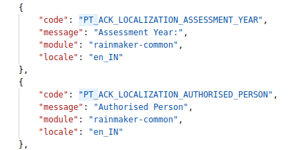

# PT - Create Property UI Details

**Objective:** To provide user facilities to add a new property, view the property details and the application currently on their number. The feature allows users to update the property or edit the application.



## **Create Property**

Users can add new property using the Create Property button. The workflow captures user inputs through multiple questions and information gathering screens. At the end of the flow, a check page is displayed that enables the user to cross verify the information entered. The application is created on clicking the submit button.&#x20;

### **Create Property Flow**

Property tax registration information screen is displayed after login. This helps the user identify the required documents to complete the new registration for the property.



### **Property Details Flow**

The users are prompted to enter the details about the property first. The flow chart below illustrates the property details flow.




### **Assessment Details Flow**

The user is next asked to provide the assessment details. This flow captures information related to each floor and the basement.


### UI/UX Unit Revamp

**I**nstead of capturing unit data in separate pages the system captures data in one page only. Users can add multiple units by clicking on the Add One More Unit button. The respective unit page loads for each floor and users can add the corresponding units as required.


### **Address Details Flow**

After entering property details, the user is prompted to provide the address of the property. The flow is straightforward, without any conditional routing.

Users can pinpoint the location in the Geo-location map, according to which pin code and city, as well as locality, is auto-populated.




### **Owner Details Flow**

Finally, the user is prompted to enter the property owner details. Ownership can be institutional - either Government or Private. Ownership can also be Single or Multiple owners. The system prompts the user to fill in the details accordingly.&#x20;

In the case of Institutional, the following data is asked in the first screen. The subsequent screen does not change.



In the case of single or multiple owners the following screen is displayed. The rest of the flow remains the same.


### **Check Page and Acknowledgement Screen**

The check page allows users to cross-verify the information furnished across the flows. Users can click on the change button available adjacent to the relevant data to make any change or update the input data. The user is redirected to the relevant page for updates. The subsequent flows are repeated till the user submits the application.

The Create API is called for registration of property. Following is the snippet of the Create API used: `1create: "/property-services/property/_create"`

If the API response is successful, then the acknowledgement screen is displayed, else the failed acknowledgement screen is displayed.




## **Technical Implementation Details**

All the screens have been developed using the new-UI structure followed previously in the FSM and PGR module.

The link for the Create Property main index is given below. This provides a better understanding of the starting point of the flow:

[https://github.com/egovernments/digit-ui-internals/blob/development/packages/modules/pt/src/pages/citizen/Create/index.js](https://github.com/egovernments/digit-ui-internals/blob/development/packages/modules/pt/src/pages/citizen/Create/index.js)

PT (Property Tax) Module has been segregated into a specified structure. All the screens configuration is available inside the PageComponent Folder. The configuration for routing the pages are mentioned in the config folder common for both citizens and employees. The snippet for the folder structure and routing configuration is given below.




The high-level configuration for controlling the whole flow for citizens and employees is available in the Pages folder. Citizen flows include Create, Edit, My Properties, My Application and Search Property. The search property flow carries the index (the main starting point of the whole flow).

After completing the flow users can download the acknowledgement details of the property created in pdf format. Click [here to find](https://github.com/egovernments/digit-ui-internals/blob/development/packages/modules/pt/src/getPTAcknowledgementData.js) the config for the PDF generation.


The Utils folder basically contains all the methods used across the PT module. In case there is a common method that needs to be added, it can be imported into other files.

For creating an application the Create API from Property Tax is called using the React hooks. This hook is declared under hooks or elements of PT as PTService.

## **MDMS Data**

Data across some of the pages are imported from MDMS throughout the flows. The table below lists the pages using MDMS data. In these pages the .js files are found under page components.

| PageComponent            | MDMS Detail                                                                                                       | Module Detail Name | Master Detail Name  |
| ------------------------ | ----------------------------------------------------------------------------------------------------------------- | ------------------ | ------------------- |
| PropertyTax              | List of documents required for each category                                                                      | `PropertyTax`      | `Documents`         |
| PropertyUsageType        | Four category imported - (Commercial, industrial, institutional & others)                                         | `PropertyTax`      | `UsageCategory`     |
| PropertyType             | three major categories - (Independent, Flat & Part of the building & Vacant)                                      | `PropertyTax`      | `PropertyType`      |
| SubUsageType             | List of sub-usage category according to the property usage selected before                                        | `PropertyTax`      | `UsageCategory`     |
| SubUsageTypeOfRentedArea | List of sub-usage category according to the property usage category selected before, same as sub-usage type       | `PropertyTax`      | `UsageCategory`     |
| PTSelectAddress          | List of Cities (Amritsar, Jalandhar and Nawanshahr) and List of localities according to the city selected         | `PropertyTax`      | `tenants`           |
| OwnershipDetails         | Four categories imported - (Institutional - private, Institutional - Government, Single Owner and multiple Owner) | `PropertyTax`      | `OwnerShipCategory` |
| SpecialOwnerCategory     | List of special category imported eg Freedomfighter, handicap etc                                                 | `PropertyTax`      | `OwnerType`         |
| PTGeolocation            | Default value for location i.e Pratap Nagar Latitude and longitude                                                | `PropertyTax`      | `MapConfig`         |
| RentalDetails            | Rentaldetails information regarding tax percentage is taken from MDMS                                             | `PropertyTax`      | `RentalDetails`     |

Data React hooks are used to call MDMS and these are shared across the module. The code snippet below contains the call used for MDMS.

```
const { data: OwnerShipCategoryOb } = Digit.Hooks.pt.usePropertyMDMS(stateId, "PropertyTax", "OwnerShipCategory");
```

## **Localization**

Localization keys are added to the ‘_rainmaker-pt_’ locale module. In future, if any new labels are implemented in the Property Tax (Citizen) they should also be pushed to the locale DB under _rainmaker-pt_ locale module. Below is an example of few locale labels.



## **Role Action Mapping**

|                                        |               |           |
| -------------------------------------- | ------------- | --------- |
| **API**                                | **Action Id** | **Roles** |
| /access/v1/actions/mdms/\_get          | 870           | CITIZEN   |
| /egov-mdms-service/v1/\_search         | 954           | CITIZEN   |
| /localization/messages/v1/\_search     | 1531          | CITIZEN   |
| /property-services/property/\_create   | 1895          | CITIZEN   |
| /property-services/property/\_search   | 1897          | CITIZEN   |
| /property-services/property/\_update   | 1896          | CITIZEN   |
| /property-services/assessment/\_search |               | CITIZEN   |
| /billing-service/bill/v2/\_fetchbill   |               | CITIZEN   |

## Documents and Resource Links

| Link                                                                    | Description                             |
| ----------------------------------------------------------------------- | --------------------------------------- |
| [My Applications](property-tax-my-applications.md)                      | Property applications                   |
| [My Properties](property-tax-my-properties.md)                          | Registered properties                   |
| [Application Details](property-tax-my-applications.md)                  | Application details                     |
| [Property Information](../property-mutation-and-mutation-calculator.md) | Property information                    |
| [Edit/Update Property](edit-update-property.md)                         | Edit or update property details         |
| [Quick Pay and Search Property](property-tax-quick-pay-for-citizen.md)  | Make payment or search property details |

> [](http://creativecommons.org/licenses/by/4.0/)_All content on this page by_ [_eGov Foundation_ ](https://egov.org.in/)_is licensed under a_ [_Creative Commons Attribution 4.0 International License_](http://creativecommons.org/licenses/by/4.0/)_._
