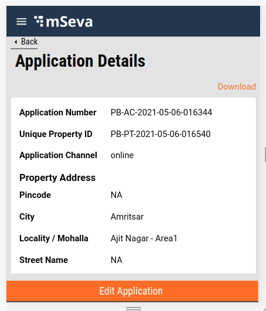

# Edit-Update Property

**Objective:** The feature allows users to edit the application already created or update the property already registered to their mobile number. After verification, employees can send the application back to the citizen with remarks on required changes. The edit and update feature allows the users to make these changes. It also allows the user to update the details of the property details online as required.

## Edit A**pplication**

&#x20;If the property is marked as Send Back to Citizen, the application details page for employees displays the edit option at the bottom of the page.&#x20;

## Update Property

If the property is marked as Verify → Forward → Approved, the Property Details page for the employees displays the Update option at the bottom of the page.

Clicking on the Update button allows users to edit or update property details. The Create Property flow is revisited. The only exception here is the values are pre-populated from the Property object received from Property Search API. On completing the flow the Update API is called and the property is updated successfully.

## **Technical Implementation Details**

[Click here ](https://github.com/egovernments/digit-ui-internals/blob/development/packages/modules/pt/src/pages/citizen/EditProperty/index.js)to access the Edit/Update property main index.

The main code contains the functions that transform the property object received in Search API. This includes primarily the Assessment flow units contextualized as per the Create flow since users have to revisit the Create flow with pre-populated details. The data values are updated accordingly. It also contains the routing details for the pages in the Create flow.

Update Util function: this function does the exact opposite of the Create util function (refer to [Property Tax - My Applications](property-tax-my-applications.md)). The property object received from the Property Search API is converted to the Create Flow relevant structure to pre-populate the values for user convenience. The application is updated on completing the flow. The link for the same [is available here](https://github.com/egovernments/digit-ui-internals/tree/development/packages/modules/pt/src/utils).

## **MDMS**

MDMS data used here is the same as the Create flow since the flow structure used for edit/update property is the same as the create property flow. Please refer to the [link here for detailed MDMS information](./).

## **Localization**

The Localization keys for Edit or Update Property are added to the ‘_rainmaker-pt_’ locale module. Changing, updating, or adding any new localization key is done in the same locale module.

## Role Action Mapping

| **API**                                | **Roles** | **Action Id** |
| -------------------------------------- | --------- | ------------- |
| /access/v1/actions/mdms/\_get          | CITIZEN   | 870           |
| /egov-mdms-service/v1/\_search         | CITIZEN   | 954           |
| /localization/messages/v1/\_search     | CITIZEN   | 1531          |
| /property-services/property/\_create   | CITIZEN   | 1895          |
| /property-services/property/\_search   | CITIZEN   | 1897          |
| /property-services/property/\_update   | CITIZEN   | 1896          |
| /property-services/assessment/\_search | CITIZEN   |               |
| /billing-service/bill/v2/\_fetchbill   | CITIZEN   |               |

> _All content on this page by_ [_eGov Foundation_ ](https://egov.org.in/)_is licensed under a_ [_Creative Commons Attribution 4.0 International License_](http://creativecommons.org/licenses/by/4.0/)_._
