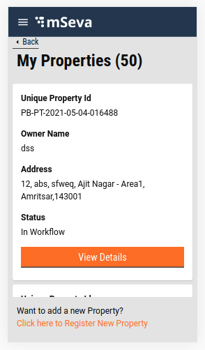
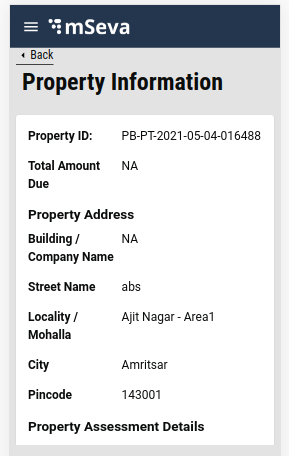

# Property Tax - My Properties

**Objective:** Users can look for the list of the properties registered for their mobile number in My Properties tab.&#x20;

The initial view for each property offers the Property Id, Owner Name, Address and status, along with the View Details button. Users can click on this button to look up more details about the registered property. In case the users do not find the property they are looking for, they can click on the Click here to Register New Property option to register the property.



Clicking on the View Details button displays the Property Information page containing the necessary information about the property.



## **Technical Implementation Details**

[Click here to fetch the working code](https://github.com/egovernments/digit-ui-internals/blob/development/packages/modules/pt/src/pages/citizen/MyProperties/index.js) for the My Properties and Property Details common Index.

The template for My properties and Property Information page is present inside pt/pages/citizen/MyProperties. The list of properties is retrieved by calling the search API `/property-services/property/_search`.

This API is called using the React hook present inside the index of My Properties and Property information page. A single property is loaded, bypassing the unique Property Id in the search API.

If the search API result is successful, Assessment Search API is called to know the assessment status. Assessment Search API - `/property-services/assessment/_search`.

If the assessment object returned fetches assessment array details then the fetch bill API is called to retrieve the payment details for the particular property.&#x20;

Fetch bill API - `/billing-service/bill/v2/_fetchbill`

Following is the hook used for the property search API, assessment search and fetch bill.

```
const { isLoading, isError, error, data } = Digit.Hooks.pt.usePropertySearch(tenantId);
const assessmentData = await Digit.PTService.assessmentSearch({ tenantId, filters: { propertyIds } });
billData = await Digit.PaymentService.fetchBill(tenantId, {
     businessService: "PT",
     consumerCode: propertyIds,
   });
```

## **MDMS**

No MDMS data is used here. All data is loaded from the Search API.

## **Localization**

The localization keys for My Properties are added to the ‘_rainmaker-pt_’ locale module. Any changes, updates or addition of a new localization key are done in the same locale module.

## Role Action Mapping

| **Url**                                             | **Roles**               | **Action Id** |
| --------------------------------------------------- | ----------------------- | ------------- |
| `/egov-mdms-service/v1/_search?`                    | `PTCEMP,FI,APPROVER,DV` |               |
| `/egov-workflow-v2/egov-wf/businessservice/_search` | `PTCEMP,FI,APPROVER,DV` | `1743`        |
| `/filestore/v1/files/url`                           | `PTCEMP,FI,APPROVER,DV` | `1528`        |
| `/property-services/property/_search`               | `PTCEMP,FI,APPROVER,DV` | `1897`        |
| `egov-workflow-v2/egov-wf/process/_search`          | `PTCEMP,FI,APPROVER,DV` | `1730`        |

> [\_\_](http://creativecommons.org/licenses/by/4.0/)_All content on this page by_ [_eGov Foundation_ ](https://egov.org.in/)_is licensed under a_ [_Creative Commons Attribution 4.0 International License_](http://creativecommons.org/licenses/by/4.0/)
