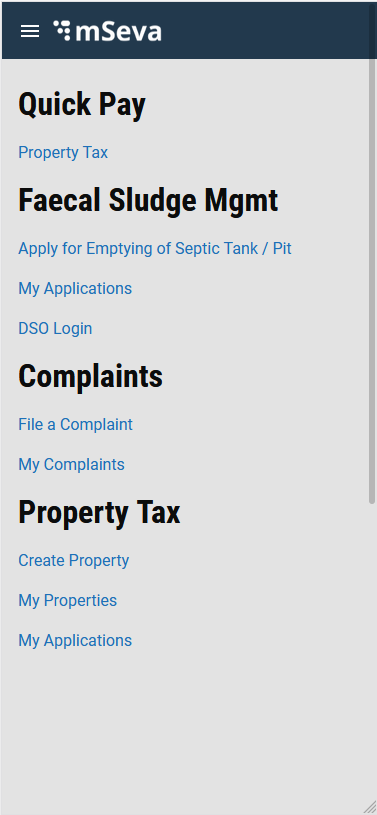
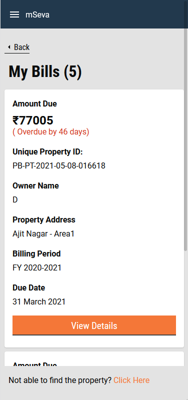
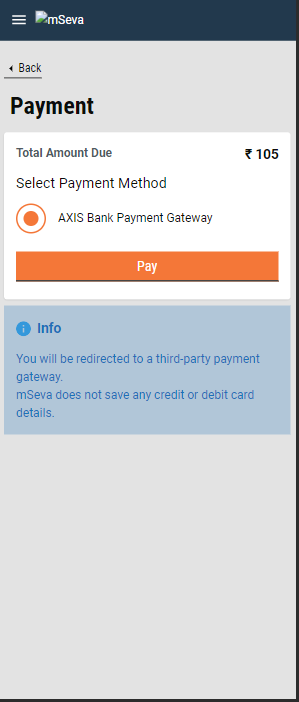
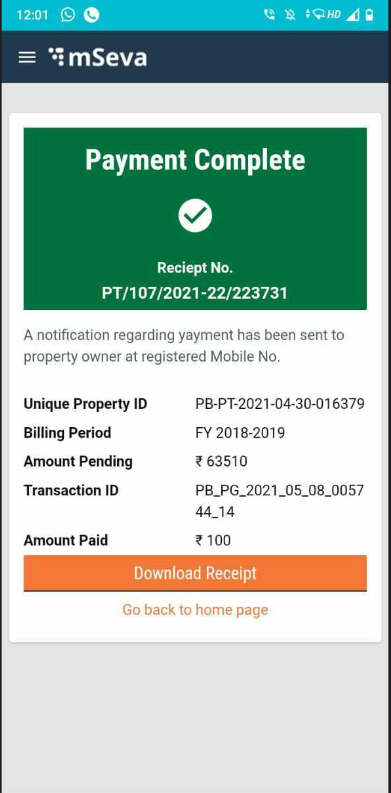
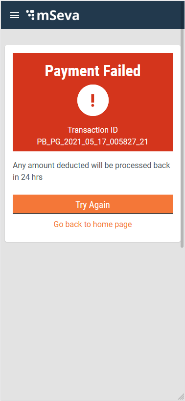
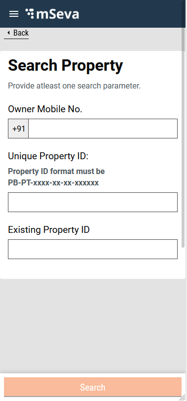
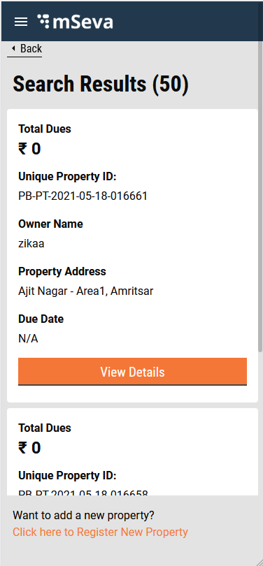
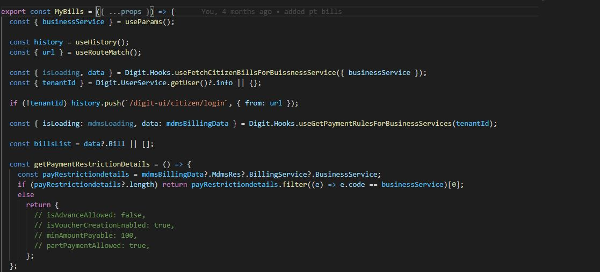

# Property Tax - Quick Pay for Citizen

**Objective:** The Quick Pay feature allows a citizen to quickly view or pay all his pending bills for Property Tax (or any other supported business Service) by clicking links directly from the Digit-UI home screen.



Clicking on the Property Tax link in the Quick Pay section, a user is redirected to the My Bills screen. Else, the user has to log in using his mobile number and the OTP is sent to the number. The user is then redirected to the My Bills screen.

On the My Bills screen, the user finds his pending property tax bills (displayed as cards) for registered properties. The user can click on the View Details button of the corresponding card to check the detailed bill summary which takes him to the bill details page. There is also a link for the case when the user is unable to find the property tax bills.



The Bill Details screen shows a list of various categories of applicable taxes. After checking the user can select to pay either the full amount or the custom amount, which cannot be less than ₹100 and not more than the total tax. These restrictions, however, are customizable as per ULB requirement and can be changed in the MDMS.

&#x20;

Clicking on the Proceed To Pay button redirects the user to the Pay screen. The user is asked to select the payment gateway using the radio buttons. On clicking pay, the user is redirected to the bank payment gateway.&#x20;



After making a successful payment through the bank gateway, the user is redirected to the response screen which shows the details of the payment and other bill details.



In case the payment fails for any reason the response screen shows the message, that the payment transaction has failed.



**Use Case: when user wants to pay for property registered to a different mobile number**

My Bills page only displays the properties with pending taxes linked to the mobile number used to log in. To search and pay for any other property, users can click on the link below the My Bills screen that redirects the user to the search screen.



On the Search screen, the user can search a property by mobile number, a unique property ID, or an existing property ID. The search parameters redirects the user to the search results screen. Here users can see all the properties with the matching criteria, whether or not they have pending taxes.



Clicking on the View Details buttons redirects  the user to the bill details screen.

## Technical Details

**My Bills Screen**

[Click here to fetch](https://github.com/egovernments/digit-ui-internals/blob/development/packages/modules/common/src/payments/citizen/bills/index.js) the My Bills screen starting file

An MDMS call is made to this page to fetch details based on the defined restrictions such as partial payment is allowed or not, advance payment allowed or not, minimum payable amount etc. for the particular business service which is supplied into URL.

The MDMS criteria used here for fetching MDMS details are:

```
{
  "MdmsCriteria": {
    "tenantId": "pb",
    "moduleDetails": [
      {
        "moduleName": "BillingService",
        "masterDetails": [
          {
            "name": "BusinessService"
          },
          {
            "name": "TaxHeadMaster"
          },
          {
            "name": "TaxPeriod"
          }
        ]
        }
      ]
    }
  }
```

The pending bills are fetched for the citizen for the specific business service using the custom hook, that fetches bills linked to the logged-in mobile number.



The bill is rendered using a keynoteConfig file which [can be located here](https://github.com/egovernments/digit-ui-internals/blob/development/packages/modules/common/src/payments/citizen/keynotesConfig.js).

On this page, for each business service, there is a configuration stored to define what part of the bill is to be displayed.

The configuration returns an object of structure.

```
{
        "my-bill": [
          {
            keyValue: "CS_COMMON_AMOUNT_DUE",
            keyPath: [
              (d) => {
                const overdueBy = new Date().getTime() - new Date(d.billDetails[0]?.toPeriod).getTime();
                const days = Math.floor(overdueBy / (86400 * 1000));
                return (
                  <React.Fragment>
                    {"₹" + d["totalAmount"]}
                    {days >= 0 ? (
                      <span className={"card-label-error"} style={{ fontSize: "16px", fontWeight: "normal" }}>{` ( ${t(
                        "CS_PAYMENT_OVERDUE"
                      )} ${days} ${t(days === 1 ? "CS_COMMON_DAY" : "CS_COMMON_DAYS")})`}</span>
                    ) : null}
                  </React.Fragment>
                );
              },
            ],
            fallback: "N/A",
            noteStyle: { fontWeight: "bold", fontSize: "24px", paddingTop: "5px" },
          },
          {
            keyValue: "PT_PROPERTY_ID",
            keyPath: ["propertyId"],
            fallback: "",
          }
        ]
}
```

Here my-bill key has config for the my-bills screen. This configuration decides what details to show on the card for each service from the bill object returned by the fetchBill API.

It is an array of objects, where each object puts the bill detail on the My-Bills bill card.

Each object contains 4 properties ie `keyValue, keyPath, fallback, noteStyle`. The keynote config is added into the Digit component Registry as `getBillDetailsConfigWithBusinessService`

The implementation of the config [can be found here](https://github.com/egovernments/digit-ui-internals/blob/development/packages/modules/common/src/payments/citizen/bills/routes/my-bills/my-bills.js).

**Bill Details Screen**

The bill details screen [can be found here](https://github.com/egovernments/digit-ui-internals/blob/development/packages/modules/common/src/payments/citizen/bills/routes/bill-details/bill-details.js).

It checks for various payment restrictions that are fetched from the MDMS on above mentioned My Bills description. The tax heads that are to be displayed in the summary are also fetched from the same MDMS.

The structure for payment rule response from the MDMS are -

```
 {
                   "businessService": "PropertyTax",
                    "code": "PT",
                    "collectionModesNotAllowed": [
                        "DD",
                        "OFFLINE_NEFT",
                        "OFFLINE_RTGS",
                        "POSTAL_ORDER"
                    ],
                    "partPaymentAllowed": true,
                    "minAmountPayable": 100,
                    "isAdvanceAllowed": false,
                    "demandUpdateTime": 86400000,
                    "isVoucherCreationEnabled": true,
                    "billGineiURL": "egov-searcher/bill-genie/billswithaddranduser/_g
}
```

`partPaymentAllowed` key when true allows payment less than bill details to be paid otherwise the user can pay only the bill Amount.

`minAmountPayable` is the minimum bill amount a user can pay.

`isAdvanceAllowed` if the true user can enter the amount more than the specified.

The link for the MDMS [can be found here.](https://github.com/egovernments/egov-mdms-data/blob/DEV/data/pb/BillingService/BusinessService.json)

**Payment Screen**

The payment screen fetches the payment gateways from an MDMS call.

```
{
  "MdmsCriteria": {
    "tenantId": "pb",
    "moduleDetails": [
      {
        "moduleName": "DIGIT-UI",
        "masterDetails": [
          {
            "name": "PaymentGateway"
          }
        ]
      }
    ]
  }
}
```

The code [can be found here](https://github.com/egovernments/digit-ui-internals/blob/development/packages/modules/common/src/payments/citizen/payment-type/index.js).

**Response Screen**

The response page code [can be found here](https://github.com/egovernments/digit-ui-internals/blob/development/packages/modules/common/src/payments/citizen/response/index.js).

**Search Screen**

The search screen is a part of PT module and its code [can be found here.](https://github.com/egovernments/digit-ui-internals/blob/development/packages/modules/pt/src/pages/citizen/SearchProperty/index.js)

**Search Result Screen**

The Search Result screen code [can be referred to here](https://github.com/egovernments/digit-ui-internals/blob/development/packages/modules/pt/src/pages/citizen/SearchResults/index.js).

#### Adding a new bill detail for the business service <a href="#adding-a-new-bill-detail-for-the-business-service" id="adding-a-new-bill-detail-for-the-business-service"></a>

The keynote config is responsible for adding the new bill UI for adding a new bill for a business service.

The whole function is exposed within the component Registry as `getBillDetailsConfigWithBusinessService` and [can be redefined from here](https://github.com/egovernments/digit-ui-internals/blob/development/packages/modules/common/src/payments/citizen/keynotesConfig.js).

## **Role Action Mapping**

|                                          |               |                 |
| ---------------------------------------- | ------------- | --------------- |
| **API**                                  | **Action id** | **Roles**       |
| /access/v1/actions/mdms/\_get            | 870           | CITIZEN         |
| /egov-mdms-service/v1/\_search           | 954           | CITIZEN         |
| /localization/messages/v1/\_search       | 1531          | CITIZEN         |
| /billing-service/bill/v2/\_fetchbill     | 1862          | CITIZEN,        |
| /pg-service/transaction/v1/\_create      | 1571          | CITIZEN         |
| /collection-services/payments/\_search   | 1864          | CITIZEN         |
| /pg-service/transaction/v1/\_update      | 1572          | CITIZEN         |
| collection-services/payments/PT/\_search | 2029          | PTCEMP, CITIZEN |

[_​_](http://creativecommons.org/licenses/by/4.0/)_All content on this page by_ [_eGov Foundation_](https://egov.org.in/) _is licensed under a_ [_Creative Commons Attribution 4.0 International License_](http://creativecommons.org/licenses/by/4.0/)_._
