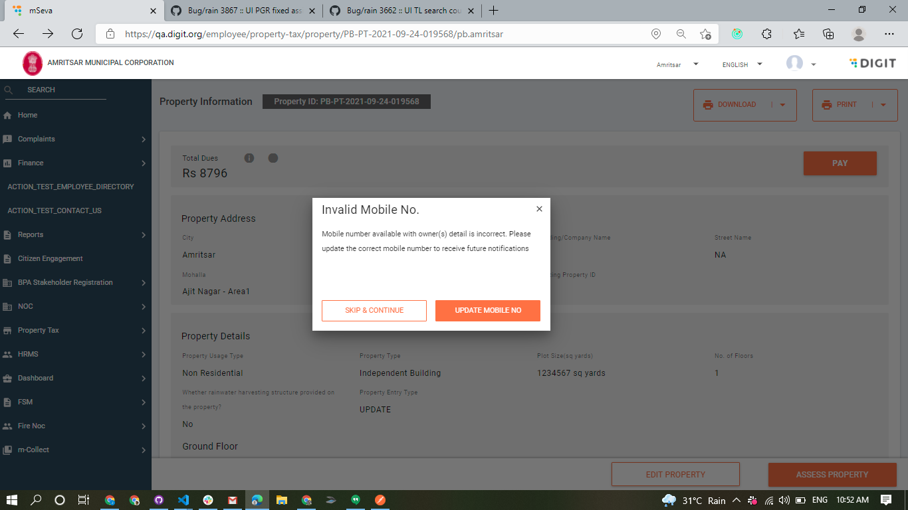
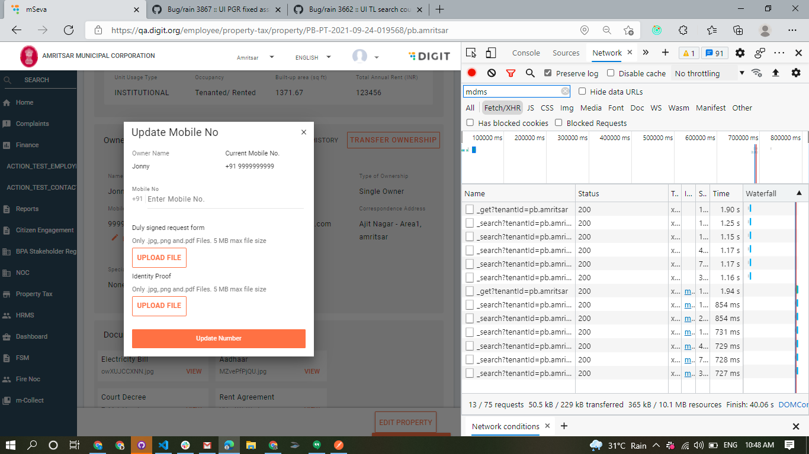
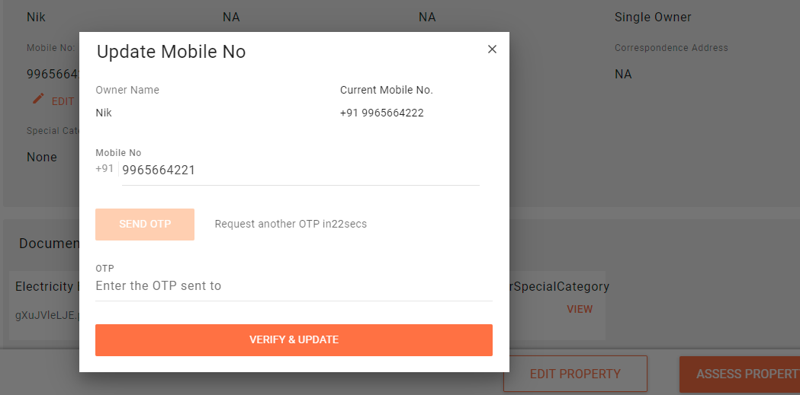
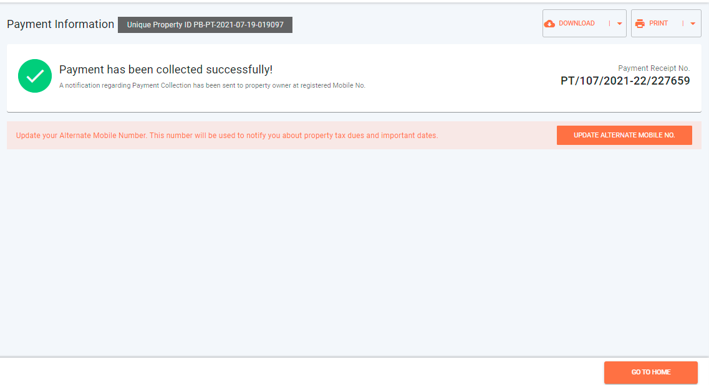
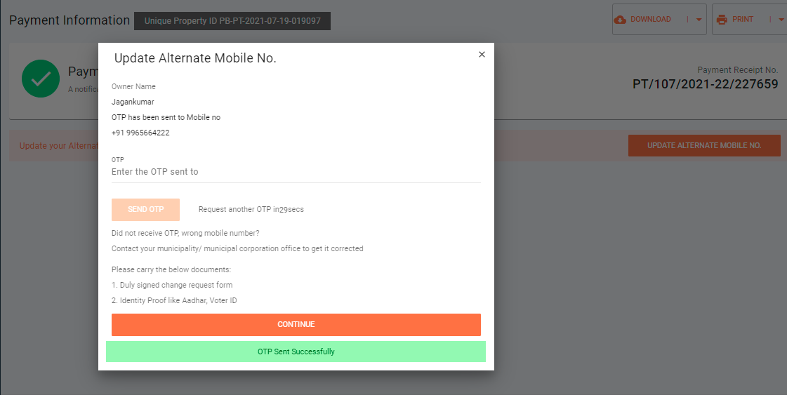

# PT Update Number & Alternate Number

## Update Mobile Number  <a href="#update-mobile-number-feature-provides-following" id="update-mobile-number-feature-provides-following"></a>

The Update Mobile Number feature in PT&#x20;

* Reminds ULB users about any invalid mobile numbers that exist in the owner records and enables them to update these.
* Enables ULB users to update the mobile numbers as per requests from the property owner(s).
* Enables property owner(s) to update the mobile number in their record to log in to the system.

### Technical Implementation Details

If the mobile number is invalid it throws a warning in the property info screen whenever the user tries to pay the dues.



Mobile Number is invalid if it doesn't match the pattern defined in the MDMS config and if the number equals to the invalid number.

### MDMS Config

```
 "MdmsCriteria": {
        "tenantId": "pb",
        "moduleDetails": [
            {
                "moduleName": "PropertyTax",
                "masterDetails": [
                    {
                        "name": "UpdateNumber"
                    }
                ]
            }
        ]
    }
```

### Response

```
invalidNumber: "9999999999"
invalidPattern: "^[6789][0-9]{9}$"
skipEnabled: true
warningEnabled: true
documents:[]
```



The Update number popup for employees requires a few documents to be uploaded. Citizens must provide the OTP received on the new number to update details.

### Citizen view

Citizens must provide the OTP received on the new number to update details.



Update number component related files are present in the egov-ui-kit packages available in the link below.



### API Details

Update API is used to update the property mobile number\
`property-services/property/_update`

To update the number, just update the owner.`mobileNumber`

To update alternate number the API used is

`property-services/property/_addAlternateNumber`

Update owner.`alternatemobilenumber`

### **Steps To Update Number**

1. Click on the Edit Existing Number. A popup appears to update the number.
2. Enter the new number that needs to be added. Click on Send OTP.
3. UI makes an API call to `user-otp/v1/_send` with type as _login_ to send the otp if it is registered.
4. In case the OTP fails then type _register_ in the same API to create a new user.
5. Once the OTP is entered, it verifies and validates the user in both cases (in case of register the citizen gets registered).
6. Once the OTP is validated, the Property Update call is triggered to update the number in the property object.


**Note:** Employee users have to upload supporting documents and the property update API call is triggered directly. Steps 3,4, and 5 are skipped.\



## **PT Alternate Number**

PT Alternate Number feature enables owners to add an alternate number for the property.

We can add an alternate number while creating the property. The system also provides the option to add an alternate number after making a payment.





Alternate Number component details link



**Steps To Add Alternate Number**

1. Click on Add Alternate Number. A popup opens to add the alternate number.
2. The system sends an OTP to the registered number.
3. Once the user enters the OTP, the system validates it.
4. Enter the new number that needs to be added. Click on the Send OTP button.
5. UI makes an API call to `user-otp/v1/_send` with type as _login_ to send the OTP if it is registered.
6. If it fails then type _register_ in the same API to create a new user.
7. Once the OTP is entered, it verifies and validates the user in both cases (in case of register the citizen gets registered).
8. Once the OTP is validated, the Property Update call is triggered to add the alternate number in the property object.

## **API Call Role Action Mapping**

<table data-header-hidden><thead><tr><th width="150"></th><th width="269"></th><th width="150"></th><th></th></tr></thead><tbody><tr><td></td><td><strong>API</strong></td><td><strong>Action Id</strong></td><td><strong>Roles</strong></td></tr><tr><td>1</td><td><code>property-services/property/_addAlternateNumber</code></td><td>870</td><td><code>CITIZEN</code>,<code>PT_CEMP</code></td></tr><tr><td>2</td><td><code>property-services/property/_update</code></td><td>954</td><td><code>CITIZEN,PT_CEMP</code></td></tr><tr><td>3</td><td><code>user-otp/v1/_send</code></td><td>1531</td><td><code>CITIZEN</code></td></tr><tr><td>4</td><td>/property-services/property/_search</td><td>1897</td><td><code>CITIZEN</code> ,<code>PT_CEMP</code></td></tr></tbody></table>


>
