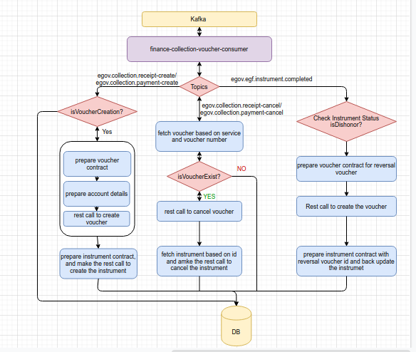

# Finance Collections Voucher Consumer Service

## Overview 

The objective of this service is to listen to the Kafka topics, validate the data based on the configuration, make the voucher API call to create the voucher in finance ERP and update the backend data. It also creates vouchers and instruments for the receipts collected through the collection service.

## Pre-requisites 

* Prior Knowledge of Java/J2EE
* Prior Knowledge of SpringBoot
* Prior Knowledge of REST APIs and related concepts like path parameters, headers, JSON, etc
* Prior Knowledge of Kafka and related concepts like Producer, Consumer, Topic, etc.&#x20;

## Key functionalities 

* Create vouchers and instruments for the receipts collected.
* Listen to Kafka topics and validate the data.
* Update the data in finance ERP.

## Setup Details 

**Step 1:** Start the service [finance-collections-voucher-consumer](https://github.com/egovernments/business-services/tree/master/finance-collections-voucher-consumer) present in the following repo:

[DIGIT-OSS/business-services/finance-collections-voucher-consumer at master · egovernments/DIGIT-OSS](https://github.com/egovernments/DIGIT-OSS/tree/master/business-services/finance-collections-voucher-consumer)

&#x20;**Step 2:** Start the egov-mdms service present in the following repo:

[core-services/egov-mdms-service at master · egovernments/core-services](https://github.com/egovernments/core-services/tree/master/egov-mdms-service)

### MDMS Configurations 

The business service and tax headmaster which are active in [mdms json](https://github.com/egovernments/egov-mdms-data/tree/master/data/pb/BillingService) needs to be mapped with Finance related data.

The business service-related data is mapped with the finance-related data in [git repo](https://github.com/egovernments/egov-mdms-data/tree/master/data/pb/FinanceService).

1. [AccountheadMapping.json](https://github.com/egovernments/egov-mdms-data/blob/master/data/pb/FinanceService/AccountheadMapping.json) : This is used to map the taxhead data to glcodes.  This holds one more property InstrumentGLcodeMapping, which is used to hold the mapping for transaction type i.e Cash/Cheque/DD to glcodes.
2. [BusinessServiceMapping.json](https://github.com/egovernments/egov-mdms-data/blob/master/data/pb/FinanceService/BusinessServiceMapping.json) : This is used to map the business service to finance specific master data like Department, Fund and Function, etc. even it can manage to enable and disable the voucher creation for specific service by setting the property voucherCreationEnabled=true/false.&#x20;
3. [EgfInstrumentStatusMapping](https://github.com/egovernments/egov-mdms-data/blob/master/data/pb/FinanceService/EgfInstrumentStatusMapping.json): This holds the status of Instruments.

## Configuration Details 

Following are the properties in the application.properties file in the egov-user-events service that is configurable.&#x20;

| **Property**                                                                 | **Value**                                                                                                                                                                                                  | **Remarks**                                                                                                                                                                                                                                                                                                                          |
| ---------------------------------------------------------------------------- | ---------------------------------------------------------------------------------------------------------------------------------------------------------------------------------------------------------- | ------------------------------------------------------------------------------------------------------------------------------------------------------------------------------------------------------------------------------------------------------------------------------------------------------------------------------------ |
| egov.collection.receipt.voucher.save.topic                                   | egov.collection.receipt-create                                                                                                                                                                             | The topic which is listened only for **collection version v1** to process further to create the voucher.                                                                                                                                                                                                                             |
| egov.collection.receipt.voucher.cancel.topic                                 | egov.collection.receipt-cancel                                                                                                                                                                             | The topic which is listened only for **collection version v1** to cancel the voucher                                                                                                                                                                                                                                                 |
| kafka.topics.egf.instrument.completed.topic                                  | egov.egf.instrument.completed                                                                                                                                                                              | 
This is listened to trace the activity of instrument updation.

If Instrument gets <strong>dishonor</strong> then it tries to create the <strong>dishonor voucher</strong>.
                                                                                                                                              |
| [kafka.topics.payment.create.name](http://kafka.topics.payment.create.name/) | egov.collection.payment-create                                                                                                                                                                             | The topic which is listened when the data gets published from collection version -2 to create the voucher                                                                                                                                                                                                                            |
| [kafka.topics.payment.cancel.name](http://kafka.topics.payment.cancel.name/) | egov.collection.payment-cancel                                                                                                                                                                             | The topic which is listened when the data gets published from collection version -2 to cancel the voucher                                                                                                                                                                                                                            |
| [kafka.topics.payment.update.name](http://kafka.topics.payment.update.name/) | egov.collection.payment-update                                                                                                                                                                             | The topic which is listened when the data gets published from collection version -2 to cancel the voucher                                                                                                                                                                                                                            |
| [fin.coe.erp.environment.name](http://fin.coe.erp.environment.name/)         | dev/qa/uat                                                                                                                                                                                                 | 
This is used to form the dynamic url for finance erp call.For Dev/QA/UAT env value is dev/qa/uat.

<strong>for production keep it blank.</strong>
                                                                                                                                                                        |
| [fin.coe.erp.domain.name](http://fin.coe.erp.domain.name/)                   | [eGov Foundation \| Urban Governance \| Citizen Centric Service](http://egovernments.org/) | 
Keep the domain name of the running server.

Example : if name is <a href="https://mseva.lgpunjab.gov.in/">mSeva</a>

Then keep the value <a href="http://lgpunjab.gov.in/"><strong>lgpunjab.gov.in</strong></a> 

 
 |
| token.authorizaton.key                                                       | Basic baicAuthKey                                                                                                                                                                                          | Pass the Basic authorization key to generate the Admin Token for SIFINANCE user.                                                                                                                                                                                                                                                     |
| egov.services.egov.user.host                                                 | [https://egov-micro-dev.egovernments.org/](https://egov-micro-dev.egovernments.org/)                                                                                                                       | Pass the host url where egov-user service is running                                                                                                                                                                                                                                                                                 |
| egov.services.mdms.hostname                                                  | [https://egov-micro-dev.egovernments.org/](https://egov-micro-dev.egovernments.org/)                                                                                                                       | 
 

Pass the host url where egov-mdms service is running
                                                                                                                                                                                                                                                                  |
| egov.services.egfinstrument.hostname                                         | [https://egov-micro-dev.egovernments.org/](https://egov-micro-dev.egovernments.org/)                                                                                                                       | 
 

Pass the host url where egf-instrument service is running
                                                                                                                                                                                                                                                             |
| egov.services.collections.hostname                                           | [https://egov-micro-dev.egovernments.org/](https://egov-micro-dev.egovernments.org/)                                                                                                                       | 
 

Pass the host url where collections service is running
                                                                                                                                                                                                                                                                |
| egov.services.businessservice.hostname                                       | [https://egov-micro-dev.egovernments.org/](https://egov-micro-dev.egovernments.org/)                                                                                                                       | Pass the host url where business services are running                                                                                                                                                                                                                                                                                |
| si.microservice.user                                                         | <ul><li>******</li></ul>                                                                                                                                                                                   | Keep the System Finance Username                                                                                                                                                                                                                                                                                                     |
| si.microservice.password                                                     | <ul><li>*******</li></ul>                                                                                                                                                                                  | 
 

Keep System Finance Password
                                                                                                                                                                                                                                                                                          |

#### &#x20;Working

This service is implemented to listen to the specific Kafka topic, fetch the data and perform activities like creating vouchers, cancelling vouchers or reversing vouchers on dishonouring.

**Create Voucher:**

Once the collection-service will generate collection/payment,it will push the data to egov.collection.receipt-create/egov.collection.payment-create topic.

Listener will be listening to the topic egov.collection.receipt-create/egov.collection.payment-create.

Making MDMS calls based on the services to get the configuration data and validate i.e whether voucher creation is enabled for the service or not. If voucher creation is enabled then perform the following

1. Prepare the voucher contract like master data i.e Dept, Fund, Function etc.
2. Prepare the account-specific data i.e glocode, amount etc.
3. Then making a rest call to create a voucher to finance ERP.
4. Once the voucher is created successfully then it will prepare the instrument contract by adding the voucher reference, instrument type, status etc and will make a call to create the instrument.
5. Once the instrument is created later it will make the call to collection receipt update API to back update the receipt by adding the voucher reference in the contract.
6. And finally, it will store the logs i.e fetched data, status, message to log table _**egf\_voucher\_integration\_log.**_
7. If anywhere any exception occurs then errors are handled by the Exception Handler. Exception Handler will store the fetched data and the error cause to log table _**egf\_voucher\_integration\_log**_.

**Cancel Voucher:**

Once collection service cancels the payment/collections, it pushes the data to egov.collection.payment-cancel/egov.collection.receipt-cancel

Listeners are listening to the topicegov.collection.payment-cancel/egov.collection.receipt-cancel.

Making MDMS calls based on the services to get the configuration data and validate i.e whether voucher creation is enabled for the service or not. If voucher creation is enabled then perform the following.

1. Try to fetch the voucher based on the voucher number(which might be present inside the receipt contract) and the business service reference document.
2. If Voucher is present inside the finance ERP then it makes a call to cancel the voucher.
3. Later it cancels the corresponding instrument.
4. And keep the log inside the table _**egf\_voucher\_integration\_log.**_

## Interaction Diagram 

## Deployment details 

1. Add MDMS configs required for Finance Collection Voucher Consumer service and restart MDMS service.
2. Deploy the latest version of the Finance Collection Voucher Consumer service.
3. Add Finance Collection Voucher Consumer service persister yaml path in persister configuration and restart persister service
4. Add Role-Action mapping for APIs.

## Integration 

* Can perform service-specific business logic without impacting the other modules.
* In the future, if we want to expose the application to citizens then it can be done easily.
* The workflows or service-specific workflows can be enabled at the service level at any time without changing the design.

>
