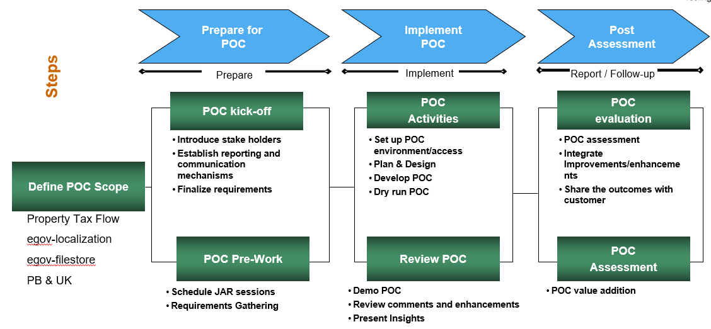
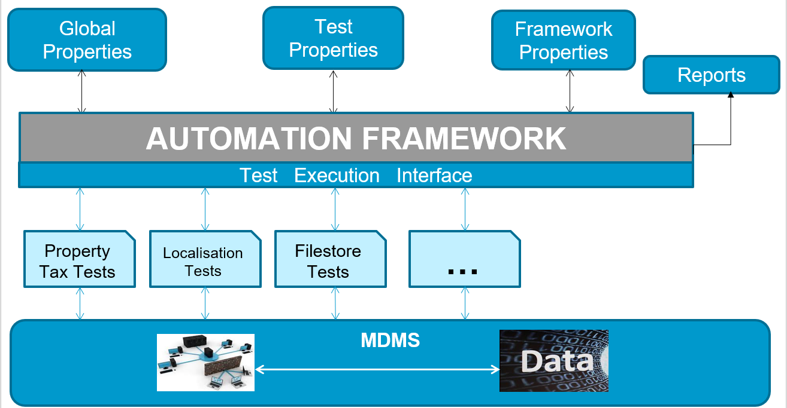

# Automation Framework Knowledge Base

## **Problem Statement**

* Provide an approach on how Consumers and Producer based APIs will be tested
* POC on below core services to showcase all automation principles and guide
* Localisation- Upsert and search call
* FileStore- Search File
* Property Tax- Create Property

## **The Solution**

* Design & Implement Robust Automation Framework
* Build a modular Framework so any future changes don’t have an impact on the entire framework but limited to a specific area

## **The Goal**

* Implement a framework that is robust enough to function with minimal changes
* Framework handles multi tenant with only properties update
* Framework can switch environment with no manual update
* A new environment can be integrated with update to framework properties

## **Plan and Outcomes**

### **Automation Framework: High-Level Architecture**

#### **Description**

Global Properties:

1. Configuration The only rule is that on start-up Karate expects a file called karate-config.js to exist on the classpath and contain a JavaScript function. The function is expected to return a JSON object and all keys and values in that JSON object will be made available as script variables. And that's all there is to Karate configuration! You can easily get the value of the current 'environment' or 'profile', and then set up 'global' variables using some simple JavaScript.
2. Global Variables: Non-JSON values such as Java object references or JS functions are supported only if they are at the "root" of the JSON returned from karate-config.js.
3. Multiple Environment: Karate is flexible, you can easily overwrite config variables within each individual test-script - which is very convenient when in dev-mode or rapid-prototyping and also environment specific Config will be taken care of here. external config file having host name, credentials, stateCode, cityCode, etc.
4. Test Properties: Contains all properties related to Tests cases like Feature file, Http requests, responses, test data etc.
5. Framework Properties: Contains All properties related to Karate framework like pom.xml, YAML files, .md files etc.
6. Reports: We can generate default BDD cucumber reports and we can integrate reporting plugins.
7. Tests: Contains test scenarios feature files with execution tags, Assertions etc.
8. MDMS call: Fetching the test data from MDMS and using in tests.

## **Technologies Used**

* Java
* JavaScript
* Gherkin
* BDD framework - Behavior Driven Development is a software development approach

> [\_\_](http://creativecommons.org/licenses/by/4.0/)_All content on this page by_ [_eGov Foundation_ ](https://egov.org.in/)_is licensed under a_ [_Creative Commons Attribution 4.0 International License_](http://creativecommons.org/licenses/by/4.0/)_._
