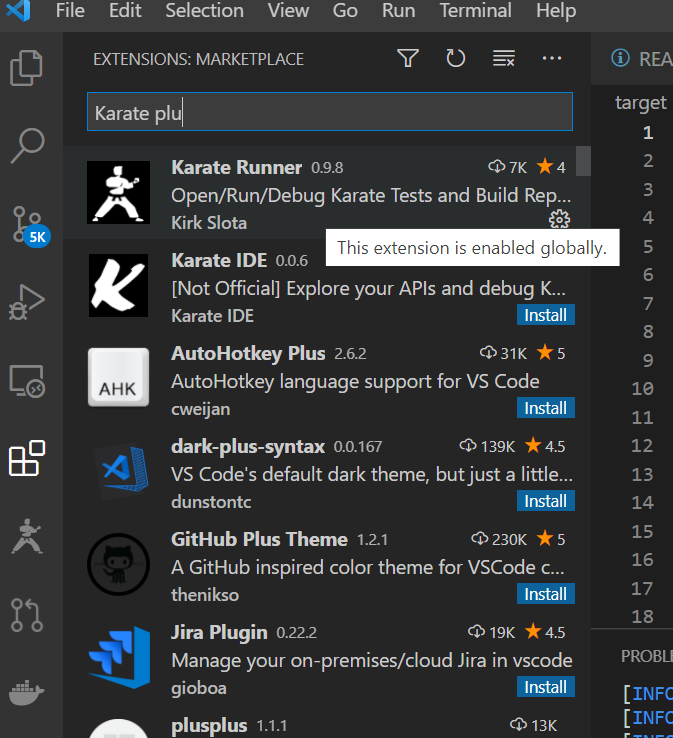
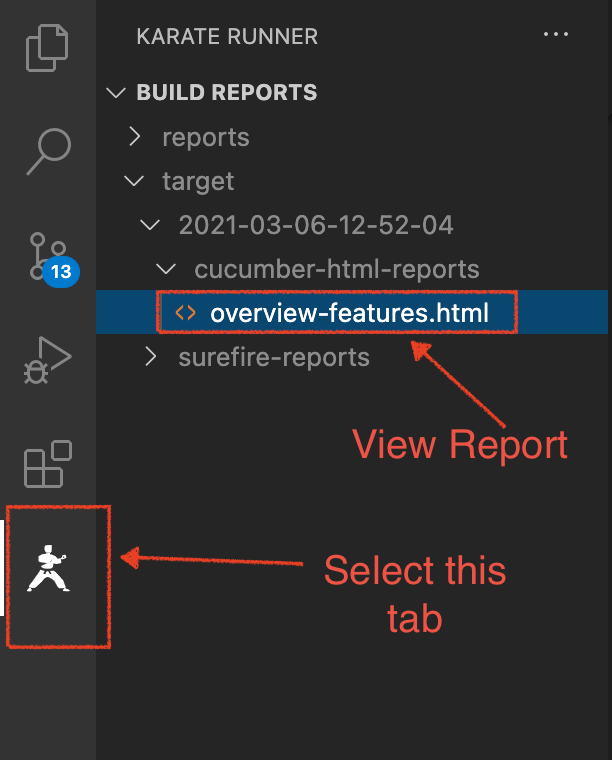
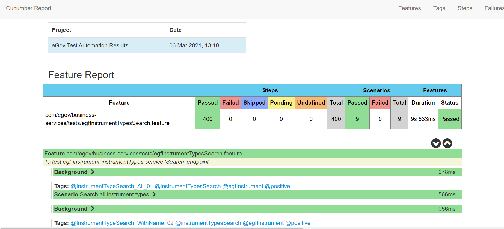
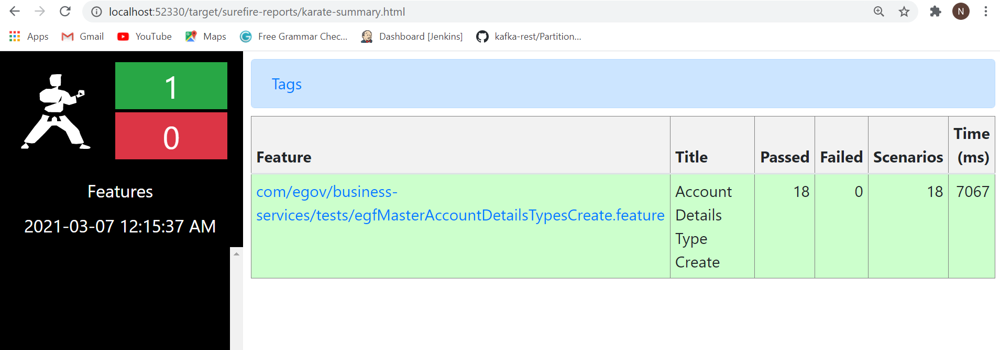

# Automation Test Reporting

Executed test results and reports of all tests can be viewed in the target folder.

**Pre-requisite:** karate Runner plugin installation in VS code editor as specified in [Readme.md](https://github.com/egovernments/test-automation/blob/karate-master/README.md#digit-automation-code-setup)

If not done during setup, then please install karate runner plugin as shown below.

Target folder generates test results folders as per time stamp of test suite runs.

When we run TestRunner file (ex: @regression), all the features under classpath would run and feature wise reports would be generated and placed under target/surefire-reports.

Post execution of test runs, the framework will automatically generate: **surefire-reports**

* **karate-summary.html**


As we are using the **JUnit runner** for the execution of different scenarios that have been mentioned in the different **\*.feature** files, it automatically creates a report for each of the feature files which are stored in the path **target/surefire-reports.**


* **cucumber-html-reports folder**


Pretty Format generates the Cucumber **test report in the HTML format**, i.e. an HTML file. It is the most readable report format. It generates the report in the same way as it is a feature file, so tracing is also made easy. Also, you can specify the location where you want this report to be placed after the test execution.


A folder will automatically create under **./target/** folder along with timestamp which will contain cucumber-html-reports.


1. \<To Integrate cucumber reporting, first we need to add cucumber maven dependency in pom.xml file and save. dependency> \<groupId>net.masterthought\</groupId> \<artifactId>cucumber-reporting\</artifactId> \<version>3.8.0\</version> \</dependency>
2. Test Results target folder: eGov Test Automation Results are composed at cucumber-html-reports with timestamp of test execution reports.


Select the **karate runner** tab and click on **overview-features.html** to view the reports as shown in image.

**Summary of service features and test status can be seen in details with Pass / Fail / run time stamp**

\*\*\*\*

Now, observe below **Feature Report**, you can see lots of verbose logging in the console and the actual output whether the features/scenarios are passed/ failed are skipped.

.png>)

* karate-summary.html:

> [\_\_](http://creativecommons.org/licenses/by/4.0/)_All content on this page by_ [_eGov Foundation_ ](https://egov.org.in/)_is licensed under a_ [_Creative Commons Attribution 4.0 International License_](http://creativecommons.org/licenses/by/4.0/)_._
