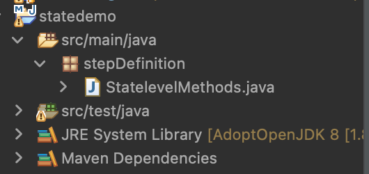

# State-Level UI Customization

## Overview

This page offers step-wise details to test the implementation of state-level UI customization.  &#x20;

## Steps

Create a new maven project for State-level UI automation for the respective state.

Create a new repository in GitHub for the project and push the code to GitHub.

Keep the following settings.xml file under the .m2 folder in your system.\
Update the username and personal access token in the file accordingly.

```
<profiles>
<profile>
<id>github</id>
<repositories>
<repository>
<id>central</id>
<url>https://repo1.maven.org/maven2</url>
</repository>
<repository>
<id>github</id>
<url>https://maven.pkg.github.com/egovernments/ui-statelevel-automation</url>
<snapshots>
<enabled>true</enabled>
</snapshots>
</repository>
</repositories>
</profile>
</profiles>
<servers>
<server>
<id>github</id>
<username>USERNAME</username>
<password>PERSONAL ACCESS TOKEN</password>
</server>
```

Add the dependency of the core UI automation repo in the pom.xml of the newly created maven project. This will download the core UI automation jar from the central maven repository.

```
<dependency>
<groupId>stateeGovernanceUI</groupId>
<artifactId>satateegovui</artifactId>
<version>0.0.1-SNAPSHOT</version>
</dependency>
```


**Note: Version may differ based on the latest version.**


Add the state-level tests in this new maven project and use the already existing step definitions and utilities from the core UI automation repo.

* Add feature files under the package: src/test/java/


* Add step definitions under the package: src/main/java/stepDefinition



* Add test data in the following folder: src/test/java/TestData


* Add testing.xml with the test which is needed to run

.png>)

* To run the tests, execute the following maven command:

**$ mvn test -DdataPath=pathToDataPropertiesFile -DcredsPath=pathToCredentialsPropertiesFile**

Note:: Find below the data.properties and credentials.properties file below for your reference. In the files, replace your applicable creds and data in the placeholder. For example: Replace “password = {Enter password}” with “password = pass@178"

**data.properties**

<details>

<summary>baseUrl={Enter Base Url ex:https://digit.org/}empUrl={Enter employee ex:employee/language-selection}citizenUrl={ Enter Citizen Url ex:digit-ui/citizen}mobile={Enter Mobile Number ex:9869313101}languageEng={Enter langauage ex:ENGLISH}State={Enter State ex:Punjab}location={Enter location ex:Amritsar}PT=Property TaxMy_Application=My ApplicationsmColl=mCollectPT_Property={Enter PT_Sub property ex:Vacant Land}wrongpin={Enter Wrong Pincode ex:400013 }pincode={Enter correct pincode ex:143001}pincode_2={Enter other pincode ex:143003}city={Enter city name ex:Amritsar}locality={Enter Localtiy ex: Ajit Nagar - Area1}googleMap={Enter google map location ex:Ajit Nagar Road, Sultanwind Gate}file={enter file name ex:blankpage.jpeg}ValidMobile={Enter valid number ex:9999999999}InvalidNumber={Enter Invalid number Application number eg:PB-PGR-2021-08-20-002211}InvalidMobile={Enter Invalid mobile number ex:9869313102}CompaintType={Enter complaint type ex:Streetlights}streetlight_subtype={Enter Streetlight Subtype ex:No streetlight}Mohalla={Enter Mohalla name related pin ex:Main Road Abadpura}Mohalla_2={Enter Mohlla name related pin ex:Preet Nagar}Property_Residential=ResidentialResidentialSubType={Enter Residential subtype ex:Independent house}Property_Commercial=CommercialCommercialSubType={Enter commercial subtype ex:Hotel}Property_Institutional=InstitutionalInstitutionalSubType={Enter Institutional Subtype ex:Temple}Slum_Area={Enter Slum Area related to pincode ex:K.K sahi}Slum_Area2={Enter Slum Area related to pincode ex:Gangadhar Sahi}Sanitation_Type1={Sanitattion Type ex:Conventional septic tank}Sanitation_Type2={{Sanitattion Type ex:Septic tank with soak pit}Vehicle_Type={Vehicle Type ex:Mahindra - Bolero Pickup - 1000 Ltrs}Vehicle_Type2={Vehicle Type ex:Tata - 407 - 3000 Ltrs}cardnumber={Enter Credit card number}cardmonth={Enter Credit card month ex:12}cardyear={Enter Credit card year ex:25}dsonumber={Enter DSO Number ex:8919146216}reason1={Enter DSO reason 1 ex: Vehicle is under repair}reason2={Enter DSO reason 2 ex:Inaccessible road}adminReason1={Enter Admin reason 1 ex:Not able to contact applicant}adminReason2={Enter DSO reason 2 ex:Others}adminReason3={Enter DSO reason 3 ex:Duplicate Application }status1={Enter DSO Status 1 ex:Pending for DSO Approval }status2={Enter DSO Status 2 ex:Pending for DSO Assignment}status3={Enter DSO Status 3 ex:DSO Rejected }status4={Enter DSO Status 4 ex:DSO InProgress }serviceCategory={Enter Service Category ex:Advertisement Fee (OMD)}serviceType={Enter Service Type ex:Hoardings}mcollectStatus1={Enter mCollect Status 1 ex:Paid}mcollectStatus2={Enter mCollect Status 2 ex:Active}mcollectStatus3={Enter mCollect Status 3 ex:Cancelled}ownership={Enter Ownershipe Type ex:Single Owner}specialOwner={Enter Specail Owner ex:General ID}Field_Inspectors={Enter Field Inspectors ex:test}Approver={Enter Field Approver ex:test}Financial_Years={Enter Financial Years ex:2020-21}</summary>


</details>

**credentials.properties**

<details>

<summary>GRO={EnterGRO USER NAME }LME={EnterLME USER NAME }CSR={EnterCSR USER NAME }CE={EnterCounter Emp USER NAME }COLL={EnterCollector USER NAME } EE={EnterEmp Editor USER NAME }FSTPO={EnterFSTPO USER NAME }CC={EnterCreator &#x26; Collector USER NAME }CEC={EnterCreator,Editor &#x26; Collector USER NAME }ADMIN={EnterAdmin USER NAME }S1={EnterMcollect CE USER NAME }DV={EnterDocument Verifier USER NAME }FI={Enter Field Inspector USER NAME }AP={Enter Application Approver USER NAME}PTCE={Enter PT Counter EMP USER NAME}pin={Enter Pin ex:12345}password={Enter Employee Password ex:12345}</summary>


</details>

Sample state-wise demo project is in the following Github location for your reference - [https://github.com/egovernments/ui-statelevel-implementation](https://github.com/egovernments/ui-statelevel-implementation)


> [\_\_](http://creativecommons.org/licenses/by/4.0/)_All content on this page by_ [_eGov Foundation_ ](https://egov.org.in/)_is licensed under a_ [_Creative Commons Attribution 4.0 International License_](http://creativecommons.org/licenses/by/4.0/)_._

\
