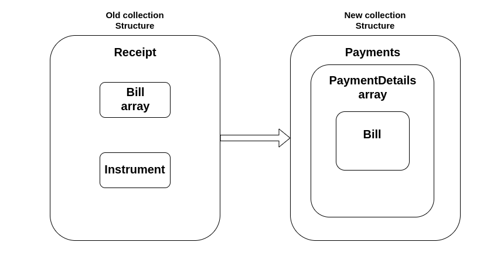

# Collection Service Migration

## Overview

According to the new collection service, which follows the payment structure for storing information about payments and payment details, it is necessary to migrate the old collection structure into the new payment structure.

## Migration Details

In the old collection service, for every transaction, the receipt number is generated on the bill detail level. Since the bill contains multiple bill details each transaction is mapped to multiple receipt numbers. So after payment of a single bill, multiple receipt numbers are generated. The mapping of the transactions to the receipt number changed in the new collection service.

In the new collection service, the receipt number is generated at the bill level. For each bill transaction, one receipt number is generated. So every bill for a consumer code and business service has one receipt number.

The records from tables **egcl\_receiptheader**, **egcl\_receiptdetails**, **egcl\_instrument**, **egcl\_instrumentheader** need to be transferred into tables **egcl\_payment**, **egcl\_paymentdetail**, **egcl\_bill**, **egcl\_billdetial**, **egcl\_billaccountdetail.**

For smooth data transactions, the record from the old receipt is mapped according to the payment structure. The new payment response can be formed with receipt data.

The table below provides the mapping between receipt and payment structure with some remarks.

| Field From Payments                                    | Field from Receipts                              | Remark                                                                                                                                                                                                                                           |
| ------------------------------------------------------ | ------------------------------------------------ | ------------------------------------------------------------------------------------------------------------------------------------------------------------------------------------------------------------------------------------------------ |
| Payments.**Id**                                        | <ul><li>---</li></ul>                            | Set as UUID                                                                                                                                                                                                                                      |
| Payments.**tenantId**                                  | Receipt.**tenantId**                             |                                                                                                                                                                                                                                                  |
| Payments.**totalDue**                                  | <ul><li>---</li></ul>                            | Total due for payment is calculated by subtracting totalAmount from bill and amount from Receipt.instrument                                                                                                                                      |
| Payments.**totalAmountPaid**                           | Receipt.instrument.**amount**                    |                                                                                                                                                                                                                                                  |
| Payments.**transactionNumber**                         | Receipt.instrument.**transactionNumber**         |                                                                                                                                                                                                                                                  |
| Payments.**transactionDate**                           | Receipt.**receiptDate**                          |                                                                                                                                                                                                                                                  |
| Payments.**paymentMode**                               | Receipt.instrument.**instrumnetType**.**name**   |                                                                                                                                                                                                                                                  |
| Payments.**instrumentDate**                            | Receipt.instrument.**instrumentDate**            |                                                                                                                                                                                                                                                  |
| Payments.**instrumentNumber**                          | Receipt.instrument.**instrumentNumber**          |                                                                                                                                                                                                                                                  |
| Payments.**instrumentStatus**                          | Receipt.instrument.**instrumentStatus**          |                                                                                                                                                                                                                                                  |
| Payments.**ifscCode**                                  | Receipt.instrument.**ifscCode**                  |                                                                                                                                                                                                                                                  |
| Payments.**additionalDetails**                         | Receipt.Bill.**additionalDetails**               |                                                                                                                                                                                                                                                  |
| Payments.**paidBy**                                    | Receipt.Bill.**paidBy**                          |                                                                                                                                                                                                                                                  |
| Payments.**mobileNumber**                              | Receipt.Bill.**mobileNumber**                    | 
If mobileNumber from Receipt.bill is null it has to set with some value e.g: <strong>“NA”</strong>

Note: Payments.mobileNumber should not be null
                                                                                   |
| Payments.**payerName**                                 | Receipt.Bill.**payerName**                       |                                                                                                                                                                                                                                                  |
| Payments.**payerAddress**                              | Receipt.Bill.**payerAddress**                    |                                                                                                                                                                                                                                                  |
| Payments.**payerEmail**                                | Receipt.Bill.**payerEmail**                      |                                                                                                                                                                                                                                                  |
| Payments.**payerId**                                   | Receipt.Bill.**payerId**                         |                                                                                                                                                                                                                                                  |
| Payments.**paymentStatus**                             | <ul><li>--</li></ul>                             | 
Based on paymentMode from Payment, the paymentStatus is set.

If paymentMode is <strong>ONLINE</strong> or <strong>CARD</strong> then paymentStatus is set to <strong>DEPOSITED</strong> otherwise it is set to <strong>NEW</strong>
 |
| Payments.auditDetails.**createdBy**                    | Receipt.auditDetails.**createdBy**               |                                                                                                                                                                                                                                                  |
| Payments.auditDetails.**createdTime**                  | Receipt.auditDetails.**createdTime**             |                                                                                                                                                                                                                                                  |
| Payments.auditDetails.**lastModifiedBy**               | Receipt.auditDetails.**lastModifiedBy**          |                                                                                                                                                                                                                                                  |
| Payments.auditDetails.**lastModifiedTime**             | Receipt.auditDetails.**lastModifiedTime**        |                                                                                                                                                                                                                                                  |
| Payments.paymentDetails.**Id**                         | <ul><li>---</li></ul>                            | Set as UUID                                                                                                                                                                                                                                      |
| Payments.paymentDetails.**tenantId**                   | Receipt.**tenantId**                             |                                                                                                                                                                                                                                                  |
| Payments.paymentDetails.**totalDue**                   | <ul><li>---</li></ul>                            | Total due for paymentDetails is calculated by subtracting totalAmount from bill and amount from Receipt.instrument                                                                                                                               |
| Payments.paymentDetails.**totalAmountPaid**            | Receipt.instrument.**amount**                    |                                                                                                                                                                                                                                                  |
| Payments.paymentDetails.**receiptNumber**              | Receipt.**receiptNumber**                        |                                                                                                                                                                                                                                                  |
| Payments.paymentDetails.**manualReceiptNumber**        | Receipt.Bill.billDetails.**manualReceiptNumber** |                                                                                                                                                                                                                                                  |
| Payments.paymentDetails.**manualReceiptDate**          | Receipt.Bill.billDetails.**manualReceiptDate**   |                                                                                                                                                                                                                                                  |
| Payments.paymentDetails.**receiptDate**                | Receipt.**receiptDate**                          |                                                                                                                                                                                                                                                  |
| Payments.paymentDetails.**receiptType**                | Receipt.Bill.billDetails.**receiptType**         |                                                                                                                                                                                                                                                  |
| Payments.paymentDetails.**businessService**            | Receipt.Bill.billDetails.**businessService**     |                                                                                                                                                                                                                                                  |
| Payments.paymentDetails.**additionalDetail**           | Receipt.Bill.**additionalDetail**                |                                                                                                                                                                                                                                                  |
| Payments.paymentDetails.**auditDetail**                | <ul><li>---</li></ul>                            | auditDetail for paymentDetail is same as payment auditDetail                                                                                                                                                                                     |
| Payments.paymentDetails.**billId**                     | <ul><li>---</li></ul>                            | Based on id in **egbs\_billdetail\_v1** table billId is extracted,Where id in **egbs\_billdetail\_v1** is Receipt.Bill.billDetails.billNumber                                                                                                    |
| Payments.paymentDetails.**bill**                       | <ul><li>---</li></ul>                            | Based on the billid, tenantid and service the bill is search by calling the Billing service API and set it to Payments.paymentDetails.bill                                                                                                       |
| Payments.paymentDetails.bil.billDetails.**amountPaid** | Receipt.instrument.**amount**                    | For each amountPaid in billDetails, its value is set from Receipt.instrument.amount                                                                                                                                                              |

After the creation of the payment response with receipt data, it is pushed into the Kafka topic **“egov.collection.migration-batch”.** The persister inserts the payment data into tables - **egcl\_payment**, **egcl\_paymentdetail**, **egcl\_bill**, **egcl\_billdetial**, **egcl\_billaccountdetail.**

Indexer config for the legacy data index and new payments.

[https://github.com/egovernments/configs/blob/master/egov-indexer/payment-indexer.yml](https://github.com/egovernments/configs/blob/master/egov-indexer/payment-indexer.yml)

**persister config -**

[https://raw.githubusercontent.com/egovernments/configs/master/egov-persister/collection-migration-persister.yml?token=AGAOX7TAAE6QPRZBXU3QZV266URNW](https://raw.githubusercontent.com/egovernments/configs/master/egov-persister/collection-migration-persister.yml?token=AGAOX7TAAE6QPRZBXU3QZV266URNW)

These need to get promoted before initiating the migration process. Migration happens through an API call, add role-actions based on your requirement. Otherwise, port-forwarding will work.

## API Details

Endpoint: /collection-services/payments/\_migrate?batchSize=100\&offset=\
Body:\
{\
"RequestInfo": {\
"apiId": "Rainmaker",\
"action": "",\
"did": 1,\
"key": "",\
"msgId": "20170310130900|en\_IN",\
"ts": 0,\
"ver": ".01",\
"authToken": "a6ad2a1b-821c-4688-a70e-4322f6c34e54"\
}

In case of any failure and restarting migration, take the value of _**offset**_ and _**tenantId**_ printed in the logs and resume the migration process.

**/collection-services/payments/\_migrate?batchSize=100\&offset=200\&tenantId='pb.tenantId'**

**Collection-service build:-** collection-services-db:9-COLLECTION\_MIGRATION-e9701c4

> [\_\_](http://creativecommons.org/licenses/by/4.0/)_All content on this page by_ [_eGov Foundation_ ](https://egov.org.in/)_is licensed under a_ [_Creative Commons Attribution 4.0 International License_](http://creativecommons.org/licenses/by/4.0/)_._
