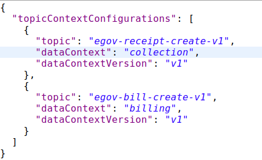
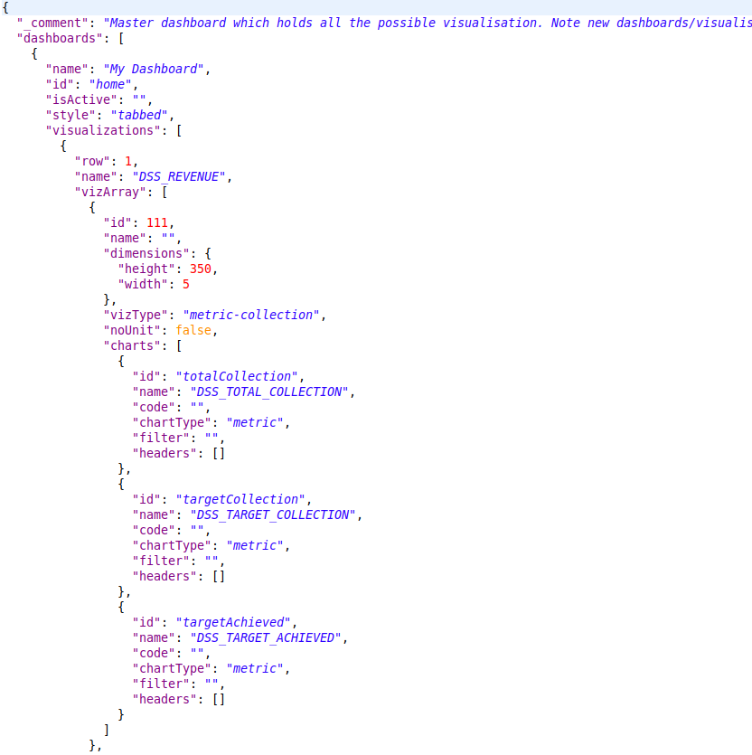

# Dashboard Analytics - Backend

## Overview 

DSS has two sides to it. One is the process in which the data is pooled to ElasticSearch and the other is the way it is fetched, aggregated, computed, transformed and sent across. DSS must be configurable since the entire process involves playing around with a variety of data sets. This ensures easy configuration of data sets in new scenarios.

This document explains the steps on how to define the configurations for both sides of DSS Analytics and Ingest Pipeline Services.

## Commonly Used Terms 

**Ingest:** Micro Service which runs as a pipeline and manages to validate, transform and enrich the incoming data and pushes the same to ElasticSearch Index

**Analytics:** Micro Service which is responsible for building, fetching, aggregating and computing the Data on ElasticSearch to a consumable Data Response. Which shall be later used for visualizations and graphical representations.

**JOLT:** JSON to JSON transformation library written in Java where the "specification" for the transform is itself a JSON document

**Modules / Domain Level:** These are the Services in this context. Each of the services, such as Property Tax, Trade License, Water and Sewerages are considered as Modules / Domains

**Chart:** Each individual graphical representation is considered as a Chart in specific. For example, a Metric of Total Collection is considered as a Chart.

**Visualization:** Group of different Charts is considered as a Visualization. For example, the group of Total Collection, Target Collection and Target Achieved is considered as a Metric Collection of Charts and thus it becomes a Visualization.

## Configuration Details 

Discussed below are the ingest pipeline configuration details -

1. Topic Context Configurations
2. Validator Schema
3. JOLT Transformation Schema
4. Enrichment Domain Configuration
5. JOLT Domain Transformation Schema

### Topic Context Configurations

Topic context configuration is an outline to define which data is received on which Kafka Topic.

Indexer Service and many other services are sending out data on different Kafka Topics. If the Ingest Service receives the data and passes it through the pipeline, the context and the version of the data received have to be set. This configuration is used to identify which Kafka topic consumed the data and the mapping details.

[Click here for the full configuration](https://github.com/egovernments/configs/blob/master/egov-dss-dashboards/dashboard-ingest/TopicContextConfiguration.json)

| Parameter Name     | Description                                                                                                        |
| ------------------ | ------------------------------------------------------------------------------------------------------------------ |
| topic              | Holds the name of the Kafka Topic on which the data is being received                                              |
| dataContext        | Context Name which needs to be set for further actions in the pipeline                                             |
| dataContextVersion | Version of the Data Structure is set here as there might be different structured data at a different point in time |

### Validator Schema

Validator schema is a configuration schema library from **Everit.** By passing the data against this schema, it ensures whether the data abides by the rules and requirements of the schema that has been defined.

[Click here for an example configuration](https://github.com/egovernments/configs/blob/master/egov-dss-dashboards/dashboard-ingest/validator\_transaction\_v1.json)

### JOLT Transformation Schema

JOLT is a JSON to JSON transformation library. In order to change the structure of the data and transform it in a generic way, JOLT has been used.

While the transformation schemas are written for each data context, the data is transformed against the schema to obtain transformed data.

[Follow the slide deck for JOLT Transformations](https://docs.google.com/presentation/d/1sAiuiFC4Lzz4-064sg1p8EQt2ev0o442MfEbvrpD1ls/edit#slide=id.p)

[Click here for an example configuration](https://github.com/egovernments/configs/blob/master/egov-dss-dashboards/dashboard-ingest/transform\_collection\_v1.json)

### Enrichment Domain Configuration

This configuration defines and directs the enrichment process that the data goes through.

For example, if the data which is incoming is belonging to a collection module data, then the collection domain config is picked. And based on the specified business type the right config is picked.

In order to enhance the data of collection, the domain index specified in the configuration is queried with the right arguments and the response data is obtained, transformed and set.

[Click here for an example configuration](https://github.com/egovernments/configs/blob/master/egov-dss-dashboards/dashboard-ingest/DomainConfig.json)

| Parameter Name                                | Description                                                                                                                                                            |
| --------------------------------------------- | ---------------------------------------------------------------------------------------------------------------------------------------------------------------------- |
| id                                            | Unique Identifier for the Configuration within the configuration document                                                                                              |
| businessType                                  | This defines as in which kind of Domain / Service is the data related to. Based on this business type, query and enhancements are decided                              |
| indexName                                     | Based on Business Type, Index Name is defined as to which index has to be queried to get the enhancements done from                                                    |
| query                                         | Query to execute to get the Domain Level Object is defined here.                                                                                                       |
| 
targetReferences

sourceReference
 | Fields which are variables in order to get the domain level objects are defined here. The variables and where all the values has to be picked from are documented here |

### JOLT Domain Transformation Schema

As a part of enhancement, once the domain level object is obtained, we might not need the complete document as is in the end data product.

Only those parameters which should be or can be used for aggregation and representation are to be held and others are to be discarded.

In order to do that, we make use of JOLT again and write schemas to keep the required ones and discard the unwanted ones.

The above configuration is used to transform the data response in the enrichment layer.

[Click here for an example configuration](https://github.com/egovernments/configs/blob/master/egov-dss-dashboards/dashboard-ingest/transform\_tl\_v1.json)

Use case:- JOLT Transformation Schema for collection V2

JOLT transformation schema for payment-v1 has been taken as a use case to explain the context collection and context version v2. The payment records are processed/transformed with the schema. The schema supports splitting the billing records into an independent new record. So if there are 2 bill items in the collection/payment incoming data then this results in 2 collection records in turn.

[Click here for an example configuration](https://github.com/egovernments/configs/blob/master/egov-dss-dashboards/dashboard-ingest/transform\_collection\_v2.json)

Here: **$i**, the variable value that gets incremented for the number of records of paymentDetails

**$j**, the variable value that gets incremented for the number of records of bill details.

**Note:** For Kafka connect to work, Ingest pipeline application properties or in environments direct push must be disabled.

es.push.direct=false

## Analytics Configurations 

Below is the list of configurations

1. Chart API Configuration
2. Master Dashboard Configuration
3. Role Dashboard Mappings Configuration

### Chart API Configuration

Each Visualization has its own properties. Each Visualization comes from different data sources (Sometimes it is a combination of different data sources)

In order to configure each visualization and its properties, we have Chart API Configuration Document.

In this, Visualization Code, which happens to be the key, will be having its properties configured as a part of the configuration and are easily changeable.

[Click here for an example configuration](https://github.com/egovernments/configs/blob/master/egov-dss-dashboards/dashboard-analytics/ChartApiConfig.json)

| Parameter Name              | Description                                                                                                                                                                                                                                                                                                                                                                                                                                                                                                                                                                                                                                                                                                                                                                                                                                                                                                                                                                                     |
| --------------------------- | ----------------------------------------------------------------------------------------------------------------------------------------------------------------------------------------------------------------------------------------------------------------------------------------------------------------------------------------------------------------------------------------------------------------------------------------------------------------------------------------------------------------------------------------------------------------------------------------------------------------------------------------------------------------------------------------------------------------------------------------------------------------------------------------------------------------------------------------------------------------------------------------------------------------------------------------------------------------------------------------------- |
| Key (e.g: totalApplication) | This is the Visualization Code. This key will be referred to in further visualization configurations. This is the key that will be used by the client application to indicate which visualization is needed for display.                                                                                                                                                                                                                                                                                                                                                                                                                                                                                                                                                                                                                                                                                                                                                                        |
| chartName                   | The name of the Chart has to be used as a label on the Dashboard. The name of the Chart will be a detailed name. In this configuration, the Name of the Chart will be the code of Localization which will be used by Client Side                                                                                                                                                                                                                                                                                                                                                                                                                                                                                                                                                                                                                                                                                                                                                                |
| queries                     | Some visualizations are derived from a specific data source. While some others are derived from different data sources and are combined together to get a meaningful representation. The queries of aggregation which are to be used to fetch out the right data in the right aggregated format are configured here.                                                                                                                                                                                                                                                                                                                                                                                                                                                                                                                                                                                                                                                                            |
| queries.module              | The module / domain level, on which the query should be applied on. Property Tax is PT, Trade License is TL. If the query is applied across all modules, the module has to be defined as COMMON                                                                                                                                                                                                                                                                                                                                                                                                                                                                                                                                                                                                                                                                                                                                                                                                 |
| queries.indexName           | The name of the index upon which the query has to be executed is configured here.                                                                                                                                                                                                                                                                                                                                                                                                                                                                                                                                                                                                                                                                                                                                                                                                                                                                                                               |
| queries.aggrQuery           | The aggregation query in itself is added here. Based on the Module and the Index name specified, this query is attached to the filter part of the complete search request and then executed against that index                                                                                                                                                                                                                                                                                                                                                                                                                                                                                                                                                                                                                                                                                                                                                                                  |
| queries.requestQueryMap     | Client Request would carry certain fields which are to be filtered. The parameters specified in the Client Request are different from the parameters in each of these indexed documents. In order to map the parameters of the request to the parameters of the ElasticSearch Document, this mapping is maintained                                                                                                                                                                                                                                                                                                                                                                                                                                                                                                                                                                                                                                                                              |
| queries.dateRefField        | 
Each of these modules has separate indexes. And all of them have their own date fields.

When there is a date filter applied against these visualizations, each of them has to apply it against their own date reference fields. In order to maintain what is the date field in which index, we have this configured in this configuration parameter
                                                                                                                                                                                                                                                                                                                                                                                                                                                                                                                                                                                                                                |
| chartType                   | 
As there are different types of visualizations, this field defines as what is the type of chart / visualization that this data should be used to represent.

<strong>Chart types available are</strong>:

<strong>metric</strong> - this represents the aggregated amount/value for records filter by the aggregate es query

<strong>pie</strong> - this represents the aggregated data on grouping. This is can be used to represent any line graph, bar graph, pie chart or donuts

<strong>line</strong> - this graph/chart is data representation on date histograms or date groupings

<strong>perform</strong> - this chart represents groping data as performance-wise.

<strong>table</strong> - represents a form of plots and value with headers as grouped on and list of its key, values pairs.

<strong>xtable -</strong> represents an advanced feature of the table, it has additional capabilities for dynamic adding header values.
 |
| valueType                   | In any case of data, the values which are sent to plot might be a percentage, sometimes an amount and sometimes it is just a count. In order to represent them and differentiate the numbers from the amount from percentage, this field is used to indicate the type of value that this Visualization will be sending.                                                                                                                                                                                                                                                                                                                                                                                                                                                                                                                                                                                                                                                                         |
| action                      | 
Some of the visualizations are not just aggregating on data source. There might be some cases where we have to do a post aggregation computation. For Example, in the case of Top 3 Performing ULBs, the Target and Total Collection is obtained and then the percentage is calculated.

In these kinds of cases, what is the action that has to be performed on that data obtained, is defined in this parameter.
                                                                                                                                                                                                                                                                                                                                                                                                                                                                                                                                                                  |
| documentType                | The type of document upon which the query has to be executed is defined here.                                                                                                                                                                                                                                                                                                                                                                                                                                                                                                                                                                                                                                                                                                                                                                                                                                                                                                                   |
| drillChart                  | 
If there is a drill down on the visualization, then the code of the Drill Down Visualization is added here.

This will be used by Client Service to manage drill-downs
                                                                                                                                                                                                                                                                                                                                                                                                                                                                                                                                                                                                                                                                                                                                                                                                              |
| aggregationPaths            | All the queries will be having Aggregation names in it. In order to fetch the value out of each Aggregation Responses, the name of the aggregation in the query will be an easy bet. These aggregation paths will have the names of Aggregation in it.                                                                                                                                                                                                                                                                                                                                                                                                                                                                                                                                                                                                                                                                                                                                          |
| \_comment                   | In order to display information on the “i” symbol of each visualization, Visualization Information is maintained in this field.                                                                                                                                                                                                                                                                                                                                                                                                                                                                                                                                                                                                                                                                                                                                                                                                                                                                 |

### Master Dashboard Configuration

Master dashboard configuration defines the dashboards that are to be painted on the screen.

It includes all the visualizations, their groups, the charts and even their dimensions in terms of height and width.

[Click here for an example configuration](https://github.com/egovernments/configs/blob/master/egov-dss-dashboards/dashboard-analytics/MasterDashboardConfig.json)

| Parameter Name                                                                                                      | Description                                                                                                                                                                                                                                                                                                                                                                                                                                                                                                                                                                                                                                                                                                                          |
| ------------------------------------------------------------------------------------------------------------------- | ------------------------------------------------------------------------------------------------------------------------------------------------------------------------------------------------------------------------------------------------------------------------------------------------------------------------------------------------------------------------------------------------------------------------------------------------------------------------------------------------------------------------------------------------------------------------------------------------------------------------------------------------------------------------------------------------------------------------------------ |
| name                                                                                                                | Name of the Dashboard which has to be displayed as Page Heading                                                                                                                                                                                                                                                                                                                                                                                                                                                                                                                                                                                                                                                                      |
| id                                                                                                                  | Unique Identifier of the Dashboard which should be used later for Querying each of these Visualizations                                                                                                                                                                                                                                                                                                                                                                                                                                                                                                                                                                                                                              |
| isActive                                                                                                            | Active Indicator which can be used to quickly disable a dashboard if required.                                                                                                                                                                                                                                                                                                                                                                                                                                                                                                                                                                                                                                                       |
| style                                                                                                               | Style of the Dashboard. Whether it should be a linear one or a tabbed one. This information is maintained in this parameter.                                                                                                                                                                                                                                                                                                                                                                                                                                                                                                                                                                                                         |
| visualizations                                                                                                      | The list of visualizations that are to be displayed in the Dashboard is listed out here.                                                                                                                                                                                                                                                                                                                                                                                                                                                                                                                                                                                                                                             |
| visualizations.row                                                                                                  | The row identifier for each Visualization are mentioned here                                                                                                                                                                                                                                                                                                                                                                                                                                                                                                                                                                                                                                                                         |
| [visualizations.name](http://visualizations.name/)                                                                  | The name of an individual visualization is added here                                                                                                                                                                                                                                                                                                                                                                                                                                                                                                                                                                                                                                                                                |
| visualizations.vizArray                                                                                             | The list of Charts within the Visualization is specified in this list.                                                                                                                                                                                                                                                                                                                                                                                                                                                                                                                                                                                                                                                               |
| [visualizations.vizArray.id](http://visualizations.vizarray.id/)                                                    | Group of Charts is given an ID to have a placement on the Dashboard. This unique identifier is maintained in this field.                                                                                                                                                                                                                                                                                                                                                                                                                                                                                                                                                                                                             |
| [visualizations.vizArray.name](http://visualizations.vizarray.name/)                                                | Group of Charts is given a name that can be displayed on the group on Dashboard in that row.                                                                                                                                                                                                                                                                                                                                                                                                                                                                                                                                                                                                                                         |
| visualizations.vizArray.dimensions                                                                                  | Each of these group of charts is given a dimension based on which they are placed in a specific row in a dashboard                                                                                                                                                                                                                                                                                                                                                                                                                                                                                                                                                                                                                   |
| visualizations.vizArray.vizType                                                                                     | 
As there are multiple charts grouped into one visualization, the type of Visualization needs to be specified in order to indicate to the client application what goes inside each of these visualizations and charts inside them

vizType used for any other dashboards:- metric-collection, chart, performing-metric

metric-collection:- Used to specify the type as single or group of metric chart type

2. performing-metric:- Used perform chart type

3. chart:- Used chart type for pie, donut, table, bar, horizontal bar, line

vizType used for the Home page:- collection, module

collection: used in UI style as full width

2. module: used in UI style for specific width.
 |
| 
visualizations.vizArray.noUnit

visualizations.vizArray.isCollapsible

visualizations.vizArray.ref
 | 
The value types of these charts are different. Some are numbers, some are amounts, some are percentage.

In the case of amounts, there is a requirement to display in Lakhs, Crores and Units. In order to indicate the client application whether to display these units or not, we have this boolean to control that

The value type is for card/visualisation collapsible as boolean values.

This object contains url (as mandatory), logoUrl (optional), type(optional).
                                                                                                                                                                                                                                  |
| visualizations.vizArray.charts                                                                                      | The list of individual charts inside a Visualization Group is maintained in this array list                                                                                                                                                                                                                                                                                                                                                                                                                                                                                                                                                                                                                                          |
| [visualizations.vizArray.charts.id](http://visualizations.vizarray.charts.id/)                                      | Individual Chart Number Identifier to indicate the uniqueness of Charts                                                                                                                                                                                                                                                                                                                                                                                                                                                                                                                                                                                                                                                              |
| [visualizations.vizArray.charts.name](http://visualizations.vizarray.charts.name/)                                  | Name of the Chart which can be a header label for Charts within a Visualization                                                                                                                                                                                                                                                                                                                                                                                                                                                                                                                                                                                                                                                      |
| visualizations.vizArray.charts.code                                                                                 | Code of the Chart is the indicator that has to be sent to Server Side to get the data for representing the Visualization.                                                                                                                                                                                                                                                                                                                                                                                                                                                                                                                                                                                                            |
| visualizations.vizArray.charts.chartType                                                                            | 
Type of Chart which has to represent the data result set that is obtained is specified here

chartType:- bar, horizontalBar, line, donut, pie, metric, table
                                                                                                                                                                                                                                                                                                                                                                                                                                                                                                                                                             |
| visualizations.vizArray.charts.filters                                                                              | Filters that can be applied to the Visualization and what are the fields which are filterable are mentioned here.                                                                                                                                                                                                                                                                                                                                                                                                                                                                                                                                                                                                                    |
| visualizations.vizArray.charts.headers                                                                              | In some cases, there are headers which can be a title or additional information for the Chart Data which gets represented. This field is kept open to accommodate the information which can be sent along with the Chart Data in itself.                                                                                                                                                                                                                                                                                                                                                                                                                                                                                             |

### Role Dashboard Mappings Configuration

Role dashboard mapping ensures that each role is mapped against the dashboards that they are authorized to see.&#x20;

[Click here for an example configuration](https://github.com/egovernments/configs/blob/master/egov-dss-dashboards/dashboard-analytics/RoleDashboardMappingsConf.json)

| Parameter Name                                         | Description                                                                                                                                                     |
| ------------------------------------------------------ | --------------------------------------------------------------------------------------------------------------------------------------------------------------- |
| roles                                                  | List of Roles that are available in the system                                                                                                                  |
| roles.\_comment                                        | Role Description and comment on why does this role has an entry in this configuration and sums up the summary as to what are the things that are to be enabled. |
| roles.roleId                                           | Unique Identifier of the Role for which Access is being given                                                                                                   |
| roles.roleName                                         | Name of the Role for which the access is being given                                                                                                            |
| roles.isSuper                                          | Boolean flag which defines whether the Role is a Super User or not                                                                                              |
| roles.orgId                                            | Organization to which the Role belongs to                                                                                                                       |
| roles.dashboards                                       | List of Dashboards that are enabled for the Role                                                                                                                |
| [roles.dashboards.name](http://roles.dashboards.name/) | Name of the individual Dashboard which has been enabled                                                                                                         |
| [roles.dashboards.id](http://roles.dashboards.id/)     | Identifier of the individual Dashboard which has been enabled                                                                                                   |

## Adding Configurations 

### Adding Roles and Dashboards

To add a new role, modify the RoleDashboardMappingsConf.json (**roles** node) configuration file as given below.


Note: Any number of roles & dashboards can be added


Below as in Figure 9 is a sample to add a new role object, a new dashboard object.

To add a new dashboard, modify the MasterDashboardConfig.json (**dashboards** node) as shown below in Figure 10.


Note: dashboards array add a new dashboard as given below


## Adding Visualizations&#x20;

To add new visualisations, modify the MasterDashboardConfig.json (**vizArray** node) as shown in Figure 11.


**Note:** vizArray is used to hold multiple visualizations.


## Adding Charts&#x20;

To add a new chart, chartApiConf.json has to be modified as shown below. A new chartid has to be added with the chart node object.

**Metric chart Sample as shown in Figure 12.**

**Pie chart Sample as shown in Figure 13.**

**Line chart Sample as shown in Figure 14.**

**Table chart Sample:** This chart is of 2 types - table and xtable.table (as shown in Figure 15.) Type allows the addition of aggregated fields as available in the query keys. To extract the values based on the key, **aggegationPaths** have to be added along with their data type as in **pathDataTypeMapping**.

xtable (as shown in Figure 16) type allows the addition of multiple computed fields with the aggregated fields added dynamically.

To add multiple computed columns, define the following params within **computedFields** \[]&#x20;

* actionName - (IComputedField\<T> interface),&#x20;
* fields - \[] names as existing in the query key,&#x20;
* newField - name to appear for the computation

[https://github.com/egovernments/configs/blob/master/egov-dss-dashboards/dashboard-analytics/ChartApiConfig.json](https://github.com/egovernments/configs/blob/master/egov-dss-dashboards/dashboard-analytics/ChartApiConfig.json) for the full configuration in detail.

Steps to create charts and visualise are:

* Create/Add a chart in chartApiConf.json
* Add a visualization for the existing dashboard in MasterDashboardConfig.json as defined above.
* Or in order to create/add a new dashboard create the dashboard in MasterDashboardConfig.json and create a role in RoleDashboardConfig.json

**Configuration Changes For DrillThroughs:**

Example - drill through in ward table in the property tax dashboard.

wardDrillDown is the visualization code for PT Drill Down. The 'kind' attribute shows the type of visualization code. Apart from two things all the attributes are common.

Example - Drill through in the ComplaintList table in the PGR Dashboard.

complaintDrillDown is the visualization code for PGR Drill Down.

The above complaintDrillDown visualization code is called in the drill chart parameter.

> [\_\_](http://creativecommons.org/licenses/by/4.0/)_All content on this page by_ [_eGov Foundation_ ](https://egov.org.in/)_is licensed under a_ [_Creative Commons Attribution 4.0 International License_](http://creativecommons.org/licenses/by/4.0/)_._
