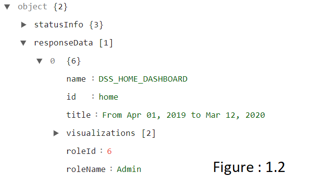
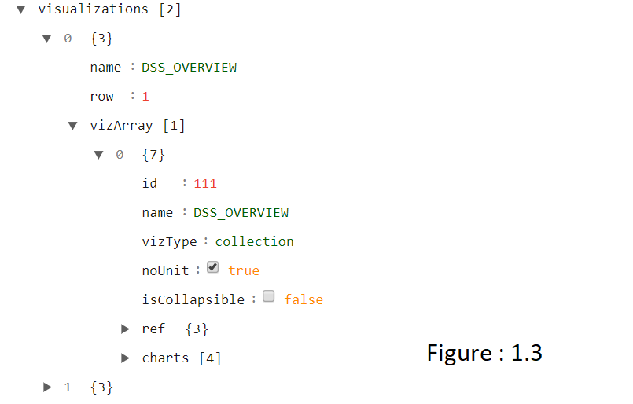
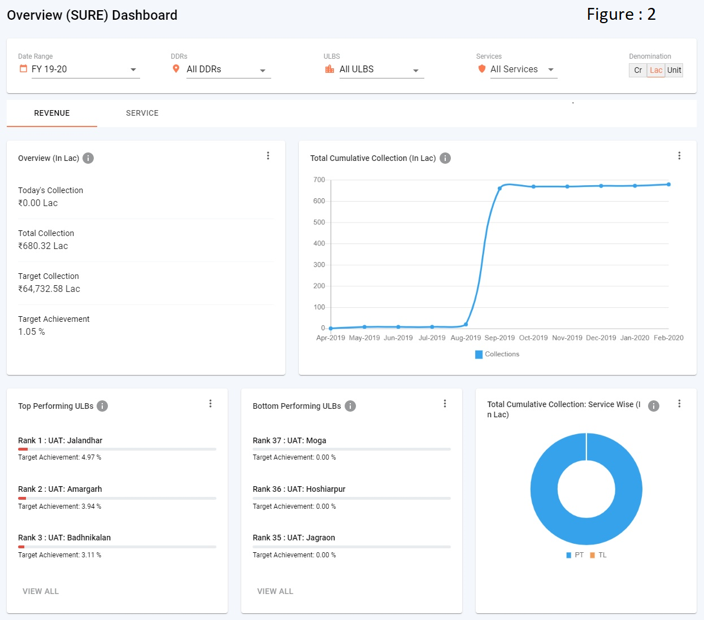
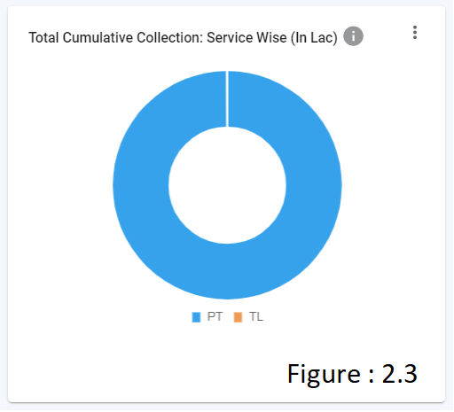
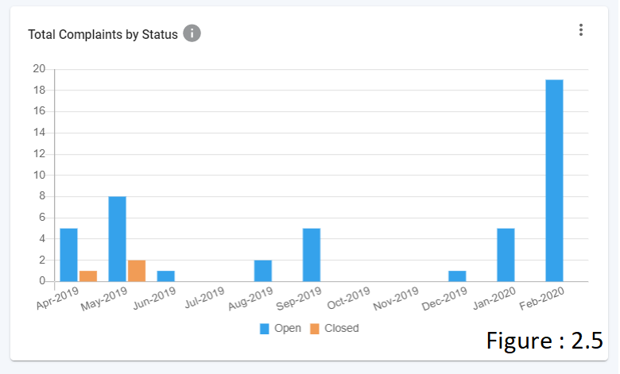
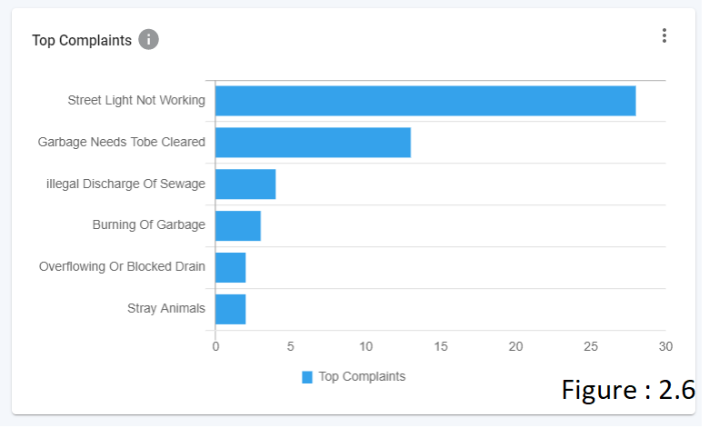
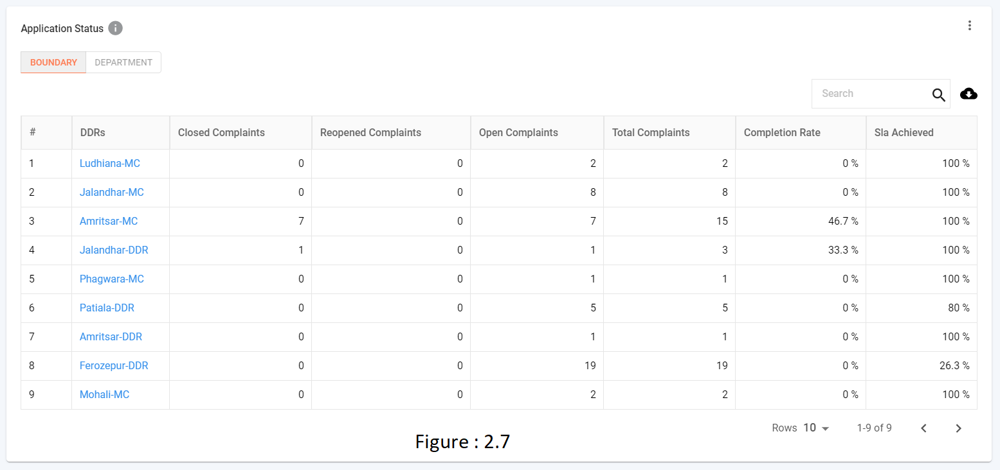
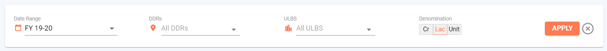
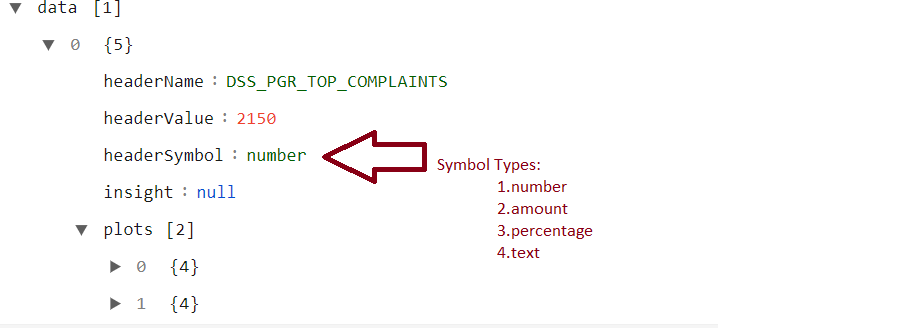
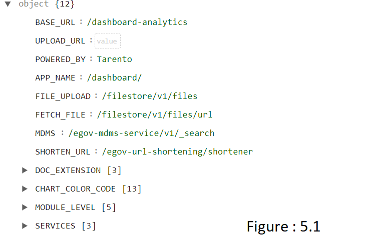

# DSS Dashboard - Technical Document for UI

## **Overview**

A decision support system (DSS) is a composite tool that collects, organizes and analyzes business data to facilitate quality decision-making for management, operations and planning. A well-designed DSS aids decision makers in compiling a variety of data from many sources: raw data, documents, personal knowledge from employees, management, executives and business models. DSS analysis helps organizations identify and solve problems, and make decisions.

Code Git Repos: [https://github.com/egovernments/frontend/tree/master/web/dss-dashboard](https://github.com/egovernments/frontend/tree/master/web/dss-dashboard)

## **Type Of Users**

1. State-Level Admin
2. Commissioner
3. Domain-Level Employee

## **Dashboard List**

There are three types of dashboards -

1. Home page (**refer figure 1**)
2. Overview page (**refer figure 2**)
3. Module level dashboard (**refer figure 3**)

### **1. Home page**

The home page contains multiple cards, each card is clickable.

There are two types of cards, i.e, the overview card and the module-level card.

The overview and the module level cards are differentiated by vizType,

1. Overview card: Clicking on the overview card navigates to the overview page. vizType for overview is a collection.
2. Module Level card: Clicking on the module level card navigates to the module level dashboard. vizType is a module (i.e Property Tax, Trade License etc).

**Request Payload for dashboardConfig**

**auth-token**: authenticate the request and it fetches from a local storage key called **“Employee.token”**

**DashboardConfig API Response**

roleName: the type of user.

Visualisations: The key contains all configurations for displaying the visualisation like rows with charts etc please refer to **figure 1.3**.

In Figure 1.3, **vizType** key will define the module UI like

Collection chart & module chart **refer figure 1**

### **2. Overview Dashboard**

### **3. Module Level Dashboard**

.png>)

## **Visualisation List**

In dashboardConfig response, the **visualisation** key contains all rows & charts details (refer **figure 1.3**). Each row contains the visual details like name, vizType, noUnit, isCollapsible, charts etc (refer **figure 1.3**).

1. name - name of visualisation
2. vizType - type of visualisation like COLLECTION, MODULE, METRIC-COLLECTION, PERFORMING-METRIC, CHART
   * COLLECTION - The home page, contains the collection data (refer **figure 1**).
   * MODULE - The home page, contains the module-level data (refer **figure 1**).
   * METRIC-COLLECTION - In Overview/Module Level Page, contains the collection data (refer **figure 2.1**).
   * PERFORMING-METRIC -In Overview/Module Level Page, contains the top/bottom performing data (refer **figure 2.2).**
   * CHART - In Overview/Module Level Page, contains the below visualisations (refer **figure 2.3 to figure 2.7).**
     * PIE CHART (refer **figure 2.3**)
     * LINE CHART (refer **figure 2.4**)
     * BAR CHART (refer **figure 2.5**)
     * HORIZONTAL BAR CHART (refer **figure 2.6**)
     * TABLE CHART (refer **figure 2.7**)

**Visualisations**

## **ULB Dashboard**

ULB dashboard contain different filters, i.e ULBs and Wards/Blocks. The data to the filters are loaded from MDMS API below - [https://dev.digit.org/egov-mdms-service/v1/\_search](https://dev.digit.org/egov-mdms-service/v1/\_search)

1. Each ULB dashboard, overview dashboard and module-level pages contain different filters and are identified by roleName in configs API.
2. The Wards/Blocks filter is a dependable filter, which gets loaded on ULB selection.
3. In the ULB dashboard, the on-page ULB filter is applied across all the charts and for the performance chart, the default ULB filter is not applied.
4. Overview and all module level pages has a ULB dashboard.

**GLOBAL Filters (refer to figure 2.8)**

Filters are loaded from the MDMS API - [https://dev.digit.org/egov-mdms-service/v1/\_search](https://dev.digit.org/egov-mdms-service/v1/\_search). Filters are loaded on the basis of roleName.&#x20;

Admin role: On the Module level page, Date, DDR and ULB filter are loaded.

On the Overview level page, Date, DDR, ULB and Service filter are loaded.

Commissioner role: On the Module level page, Date, ULB and Wards/Blocks filters are loaded.

On the Overview page, Date, ULB and Service filters are loaded.

Denomination filter: The Denomination filter has three options to display the amount and number in a particular format.

1. Crore
2. Lack
3. Unit

The denomination filter is not applied to the percentage and text (refer to **figure 2.10**). The type of data is identified by a symbol in the plots of charts API.

**Custom Date Filter**

If duration < 15 days, it displays data day-wise

If duration <= 30 days, it displays data week-wise

If duration >30, it displays data month-wise

**Tabs**

Currently, the dashboard contains two types of tabs -

1. Revenue (**refer figure: 4.1**)
2. Service (**refer figure: 4.1**)

Tabs are identified by name in visualisations of config API.

**Table Chart with drill-down**

Table chart visualisations have normal material UI data table features like search, sort etc.

In table response, if filter key & drillDownChartId contain any value users can drill-down the table.

**Cards**

1. Each card header is localised and has an info icon with a tooltip option that displays the header and can display a description.
2. The number of cards in a row and in a page is driven by the backend. The backend provides the row number to each card where it should be displayed.
3. Card contains option icon that enables users to either download images and or share images.&#x20;
4. Image download and share user id from vizArray in order to differentiate each card in a page.

**Download and Share (refer to figure 2.9)**

Download offers two options - to download data as an image or a PDF.

Share: Share creates the Image/PDF and uploads it S3 using below API and returns file id - [https://mseva-uat.lgpunjab.gov.in/filestore/v1/files](https://mseva-uat.lgpunjab.gov.in/filestore/v1/files)

The file Id is fetched using the API - [https://mseva-uat.lgpunjab.gov.in/filestore/v1/files/url](https://mseva-uat.lgpunjab.gov.in/filestore/v1/files/url)

Each S3 image is shortened using the API - [https://mseva-uat.lgpunjab.gov.in/egov-url-shortening/shortener](https://mseva-uat.lgpunjab.gov.in/egov-url-shortening/shortener)

**Configurations**

Github link for config: [https://github.com/egovernments/frontend/blob/master/web/dss-dashboard/src/config/configs.js](https://github.com/egovernments/frontend/blob/master/web/dss-dashboard/src/config/configs.js)

**BASE URL**: End point of REST API for dashboard.

**FILE Upload**: End point of REST API for file upload.

**FETCH FILE**: End point of REST API for file fetch.

**MDMS**: End point of REST API for fetch MDMS Data.

**SHORTEN URL**: End point of REST API for Shorten URL, which is used for share via Email / What's app.

**CHART COLOR CODE**: Color code object for all charts.

**MODULE LEVEL**: for global filters, which contains services name & filter key.

**SERVICES**: for global filter, service filter.

**Upload Localisation Keys**

**code:** pre-defined key for back-end.

**message:** message contains the value for the key.

**module:** rainmaker-dss

**locale:** contains locale data

for more details eGov team to be documented

Module name: rainmaker-dss

**NPM Module Used -** [**https://github.com/egovernments/DIGIT-OSS/blob/master/frontend/mono-ui/web/dss-dashboard/package.json**](https://github.com/egovernments/DIGIT-OSS/blob/master/frontend/mono-ui/web/dss-dashboard/package.json)

**Steps to setup DSS in Local**

Step 1: Run as independent, switch to dss-dashboard folder

Step 2: Get the below details from the environment website and update the localstorage in the browser.

Employee.tenant-id\
Employee.user-info\
Employee.token\
Employee.module\
Employee.locale\
localization\_en\_IN\
locale

Step 3: Run Yarn install and yarn start to start working on dss in local setup.

DSS Features Enhancements V2: [DSS Features Enhancements V2 Technical Document for UI](dss-features-enhancements.md)

> [\_\_](http://creativecommons.org/licenses/by/4.0/)_All content on this page by_ [_eGov Foundation_ ](https://egov.org.in/)_is licensed under a_ [_Creative Commons Attribution 4.0 International License_](http://creativecommons.org/licenses/by/4.0/)_._
