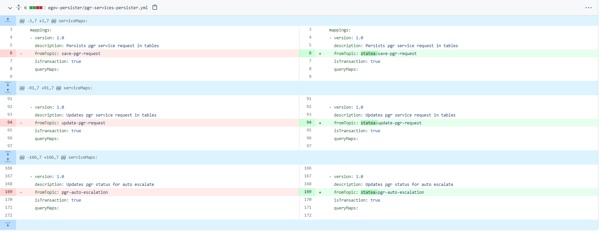

# DIGIT SAAS Guideline - Central Instance

## Overview

The page assumes that the deployment of the central instance will happen in a Kubernetes-based environment independent of whether it’s a cloud-based or a bare metal deployment with a Kubernetes-based orchestrator. This page lists all types of services available in a DIGIT SAAS package and the steps to deploy, implement, and add a new service.

### Useful Terms

**Namespace/deployment-space** - refers to the Kubernetes namespace or the equivalent by establishing access restrictions.

**State/Tenant** - A state is a separate entity whose applications and data are separated from the rest by namespaces and schemas in the database.

## Deployment Setup

1. **Backbone Services** - The backbone services include Kafka, Redis, and Elastic stack. The number of deployments and the namespace where the services will be deployed are taken care of by the deployment manager itself.
2. **State Deployment space - Namespace -** In DIGIT SAAS, the private application/deployment space (namespace in K8s & schema in DB) is provided for different tenants (states) when they onboard, the steps to create and provide the same are mentioned in the following document.
3. **Central/Shared Services** - In DIGIT SAAS, each new tenant is given a separate namespace, but most use some unmodified out-of-box services provided by DIGIT deployed in a shared space known as the central namespace. These sets of services include some of DIGIT’s core services and registries. Among the services mentioned some can never be modified by the state (tenant) actors and some can be modified. In case of any modification, the services should be deployed in their own space.
   * [x] 1.3.1 The unmodifiable core services are listed below:
     * user(egov-user + egov-otp + user-otp )
     * API-Gateway(Zuul + Access Control + nginx-ingress controller)
     * Internal gateway
     * Workflow
     * Persister
     * Indexer
     * Report
     * Searcher
     * HRMS
     * Localisation
     * Location
     * NDSS
     * MDMS

The above-mentioned services cannot be modified by the state actors and should only be deployed in the central/shared namespace.

* [x] The modifiable registries&#x20;
  * Registries of any kind are provided by eGov out of the box and are not customized by the state actors. for  ex property-registry, TradeLicense-registry etc..,
  * These registries should be deployed in the central namespace to improve usage and reduce cost.
  * When there are modifications to the service then the same has to be deployed in the state’s own deployment space.

### 4. State services

The services that are by default deployed and run in the state namespaces whether there are modifications or not. Since they have functionalities that are directly related to the specific requirement of the state.

These services can be divided into multiple categories -

* [x] **User Interface** - The DIGIT UI by default requires customisation related to the state(tenant), hence will always be deployed in state-specific deployment spaces.
* [x] **Core state services** (Unmodifiable) - The DIGIT core services will be deployed in state-specific deployment spaces due to their nature of being dependent on the state(tenant) base configs.
  * MDMS
  * Notification SMS
  * Notification email
  * User event
  * IDgen
  * Payment gateway service
* [x] **Utility services** - The utility services are always state config dependent hence they will be deployed in the state-specific spaces.
  * Pdf
  * Inbox
  * DSS
  * EDCR
  * Finance
* [x] Calculators - The calculation logic requirement will mostly change along with the state-specific configs hence they are by default deployed in state-specific spaces.
  * Property
  * Trade License
  * Water
  * Sewerage etc..

## Configuration Setup

The DIGIT applications require different types of config setup, they are as follows the MDMS data, persister, indexer, pdf, report, searcher and internal gateway.

### 1. MDMS Data

The MDMS data is required for the Master data management service to supply the data required by other modules to perform their basic validation and verify the validity of the data. The prescribed format of the same can be found in the application setup. Since the application is deployed in all the namespaces central and state. Each deployment will need its own GitHub repo.

Central MDMS - central MDMS repo

State 1 MDMS - state1 MDMS repo

### 2. Persister & Indexer

The persister and indexer configuration for all states should be added in a single GitHub repo in the same branch. Since both applications run in a single place. Each state deployment will have to modify their KAFKA topic names with a prefix of their state schema name.

| Persister Topic Name | State 1                | State 2                |
| -------------------- | ---------------------- | ---------------------- |
| save-property        | state1-save-property   | state2-save-property   |
| update-property      | state1-update-property | state2-update-property |

### 3. PDF

The pdf configs have to be added in a separate repository since the format of pdfs printed will change with each different tenant.

### 4. Report & Searcher

The configs of report and searcher have to be added in the same GIT repo and same branches as the persister and indexer. The additional change that needs to be done here is that their URL should be appended with state schema names like the topic names with persister config.&#x20;

|                                              | State 1                                         | State 2                                         |
| -------------------------------------------- | ----------------------------------------------- | ----------------------------------------------- |
| <p>reportName:<br>AssetImmovableRegister</p> | <p>state1_AssetImmovableRegister</p><p><br></p> | <p>state2_AssetImmovableRegister</p><p><br></p> |
| - name: billswithaddranduser                 | state1\_billswithaddranduser                    | state2\_billswithaddranduser                    |

### 5. Internal Gateway

The internal gateway config should be added to the [central git config repo](https://github.com/egovernments/configs/blob/central-instance/internal-gateway.json) since the app is deployed in the central namespace.

## Development Guide

The development of any service in DIGIT should be based on this development guide.&#x20;

### 1. Common Update For All Services

The following library versions are a minimum requirement before any service can be made central instance compatible.

**Changes to pom.xml**

1. Add Tracer 2.1.1 and above


```xml
<dependency>
	<groupId>org.egov.services</groupId>
	<artifactId>tracer</artifactId>
	<version>2.1.1-SNAPSHOT</version>
</dependency>
```


2. Services-common 1.1.0 and above

```xml
<dependency>
	<groupId>org.egov.services</groupId>
	<artifactId>services-common</artifactId>
	<version>1.1.0-SNAPSHOT</version>
</dependency>
```

3. MDMS-Client 0.0.4 and above

```xml
<dependency>
	<groupId>org.egov</groupId>
	<artifactId>mdms-client</artifactId>
	<version>0.0.4-SNAPSHOT</version>
</dependency>
```

4. ENC-Client 2.04 and above

```xml
<dependency>
	<groupId>org.egov</groupId>
	<artifactId>enc-client</artifactId>
	<version>2.0.4-SNAPSHOT</version>
	<exclusions>
		<exclusion>
			<groupId>org.springframework.kafka</groupId>
			<artifactId>spring-kafka</artifactId>
		</exclusion>
		<exclusion>
			<groupId>org.apache.kafka</groupId>
			<artifactId>kafka-clients</artifactId>
		</exclusion>
	</exclusions>
</dependency>
```

### 2. Multi-Schema Services List

The following document helps to make multi-environment applications (**Services which will run in the DIGIT namespace but store their data in state-specific namespaces of DB based on tenant-id**) central instance compatible. These services include the likes of -

1. Billing-service
2. Collection-service
3. workflow-service
4. egov-apportion-service
5. egov-hrms
6. All the municipal registries
7. Property-services
8. TL-services
9. PGR-services
10. bpa-services
11. echallan-services
12. firenoc-services
13. land-services
14. noc-services
15. sw-services
16. ws-services

Any service that needs to share its data among multiple DB schemas can be added to the above category.

### 3. Migration Changes For Multi-Schema Services

Certain services in Central-instance will only be deployed in the central (DIGIT) namespace but their data needs to be stored in different schema belonging to different state namespaces. The migrations of foretold services need to be run in all Required schemas(i e namespaces who want to make use of the centrally deployed services). To enable the above functionality the following changes are required.

1. Migrate.sh

This file is needed for building migration docker image is located in the DB folder of resources. eg: [property-services/src/main/resources/db/**migrate.sh**](https://github.com/egovernments/DIGIT-Dev/blob/central-instance-changes/municipal-services/property-services/src/main/resources/db/migrate.sh)**.** Update the file with the following contents:

```sh
#!/bin/sh
baseurl=$DB_URL
echo "the baseurl : $DB_URL"
schemasetter="?currentSchema="
schemas=$SCHEMA_NAME
echo "the schemas : $schemas"
for schemaname in ${schemas//,/ }
do
    echo "the schema name : ${baseurl}${schemasetter}${schemaname}"
    flyway -url=${baseurl}${schemasetter}${schemaname}  -table=$SCHEMA_TABLE -user=$FLYWAY_USER -password=$FLYWAY_PASSWORD -locations=$FLYWAY_LOCATIONS -baselineOnMigrate=true -outOfOrder=true -ignoreMissingMigrations=true migrate
done
```

2. values.yml

The DB configuration is by default provided in the common[ values.yml](https://github.com/egovernments/DIGIT-DevOps/blob/central-instance/deploy-as-code/helm/charts/common/values.yaml) file in the helm chart and need not be edited in normal scenarios. Since we are injecting the multiple schema list for app-specific purposes all the DB-migration ENV variables should be overridden in the app-specific values.yml file.

\#Values.yml of the specific service **before** multiple schema changes

```yaml
# Init Containers Configs
initContainers:
  dbMigration:
    enabled: true
    schemaTable: "property_services_schema"
    image:
      repository: "property-services-db"
```

\#Values.yml of the specific service after multiple schema changes.

[values.yaml](https://github.com/egovernments/DIGIT-DevOps/blob/central-instance/deploy-as-code/helm/charts/municipal-services/property-services/values.yaml) - the full updated sample file can be found here

<pre class="language-yaml"><code class="lang-yaml"><strong># Init Containers Configs
</strong>initContainers:
  dbMigration:
    enabled: true
    schemaTable: "property_services_schema"
    image:
      repository: "property-services-db"
    env: |
        {{- if index .Values "property-ismultischema-enabled" }}        
        - name: SCHEMA_NAME
          value: {{ index .Values "property-schemas" | quote }}
        {{- end }}
        - name: "DB_URL"
          valueFrom: 
            configMapKeyRef: 
              name: egov-config
              key: db-url
        - name: "SCHEMA_TABLE"
          value: {{ .Values.initContainers.dbMigration.schemaTable | quote }}              
        - name: "FLYWAY_USER"
          valueFrom: 
            secretKeyRef: 
                name: db
                key: flyway-username
        - name: "FLYWAY_PASSWORD"
          valueFrom:
            secretKeyRef: 
                name: db
                key: flyway-password
        - name: "FLYWAY_LOCATIONS"
          valueFrom: 
            configMapKeyRef: 
                name: egov-config
                key: flyway-location
</code></pre>

Only the `- name: SCHEMA_NAME` variable needs to be added and other fields can be copied from the common [values.yml](https://github.com/egovernments/DIGIT-DevOps/blob/central-instance/deploy-as-code/helm/charts/common/values.yaml#L39) as it is without any changes. The above file contains an if-else condition with two new variables

```yaml
{{- if index .Values "property-ismultischema-enabled" }}        
- name: SCHEMA_NAME
  value: {{ index .Values "property-schemas" | quote }}
{{- end }}
```

The `"property-ismultischema-enabled"` Boolean value to check if the feature is enabled and `"property-schemas"` to derive the value from respective environments YAML. This example of two variables should be named differently based on service-name to avoid conflicts.

3. Environments.yml

In the respective environment’s file add the two new variables, one for the if condition and the other field for actual values under the respective service names. Lines 6 and 7 are the sample values provided here.

eg :

```yaml
property-services:
  property-schemas: 'public,statea,stateb'
  property-ismultischema-enabled: 'true'
```

### 4. Code Changes For Multi Schema Services&#x20;

Any services that could potentially be commonly used by all environments in the central instance (refer to [Multi Schema Service List](digit-saas-guideline-central-instance.md#2.-multi-schema-services-list) for details).

**Application.properties** variables to be added.

1. _**state.level.tenantid.length**_=2\
   State-level tenant value will be picked from the full tenant-id separated by the '.' dot. once the tenant-id is separated by a dot the resulting array of sizes given above will be considered state level.
2.  **is.environment.central.instance**=true

    Declares whether the environment in which the service is deployed belongs to a central-instance kind of setup.
3. The both above said variable has to be overridden in the values YAML file of the respective service to pick up the values from the environment.

```yaml
  {{- if index .Values "global" "is-environment-central-instance" }}        
  - name: IS_ENVIRONMENT_CENTRAL_INSTANCE
    valueFrom:
      configMapKeyRef:
        name: egov-config
        key: is-environment-central-instance
  {{- end }}
  {{- if index .Values "global" "is-environment-central-instance" }}        
  - name: STATE_LEVEL_TENANTID_LENGTH
    valueFrom:
      configMapKeyRef:
        name: egov-config
        key: state-level-tenantid-length
  {{- end }}
```

4. The host of the state-specific services referred by this service should be changed to the **internal gateway** host for tenant-based(namespace) redirection.

```yaml
  - name: EGOV_MDMS_HOST
    valueFrom:
      configMapKeyRef:
        name: egov-service-host
        key: internal-gateway
```

[Sample values YAML](https://github.com/egovernments/DIGIT-DevOps/blob/central-instance/deploy-as-code/helm/charts/municipal-services/property-services/values.yaml) file to refer to the above-said changes

5. If this service allows the search of data without tenant-id then the following validation should be added to all the search APIs belonging to the service. searches without state-level tenant-id (as described by this variable - _**state.level.tenantid.length**_) will render the application useless, so the following is mandatory

```java
if(configs.getIsEnvironmentCentralInstance() && criteria.getTenantId() == null) 
  throw new CustomException("EG_PT_INVALID_SEARCH",
                                      " TenantId is mandatory for search ");
                                      
else if(configs.getIsEnvironmentCentralInstance() 
    && criteria.getTenantId().split("\\.").length < configs.getStateLevelTenantIdLength())
 throw new CustomException("EG_PT_INVALID_SEARCH",
       " TenantId should be mandatorily " + configs.getStateLevelTenantIdLength() + " levels for search");
```

6. Update the Kafka producer in the service with the following code to enable the service to post to a tenant(namespace) specific topic based on the tenant-id.

```java
@Service
@Slf4j
public class Producer {

	@Autowired
	private CustomKafkaTemplate<String, Object> kafkaTemplate;
	
	@Autowired
	private PropertyConfiguration configs;

	public void push(String tenantId, String topic, Object value) {

		String updatedTopic = topic;
		if (configs.getIsEnvironmentCentralInstance()) {

			String[] tenants = tenantId.split("\\.");
			if (tenants.length > 1)
				updatedTopic = tenants[1].concat("-").concat(topic);
		}
		log.info("The Kafka topic for the tenantId : " + tenantId + " is : " + updatedTopic);
		kafkaTemplate.send(updatedTopic, value);
	}
} 
```

7. Replace all the table names in the queries present with the {schema} placeholder


```java
private static String PROEPRTY_AUDIT_QUERY = "select property from {schema}.eg_pt_property_audit where propertyid=?";
```


8. Add the following Schema replacer utility method and use the same to replace all queries with the respective schema.

```java
/* * add this variable to your constant class */
public static String SCHEMA_REPLACE_STRING = "{schema}"; /** * Method to fetch the state name from the tenantId * * @param query * @param tenantId * @return */
public String replaceSchemaPlaceholder(String query, String tenantId) {
    String finalQuery = null;
    if (tenantId.contains(".")) {
        String schemaName = tenantId.split("\\.")[1];
        finalQuery = query.replace(Constants.SCHEMA_REPLACE_STRING, schemaName);
    } else {
        finalQuery = query.replace(Constants.SCHEMA_REPLACE_STRING.concat("."), "");
    }
    return finalQuery;
} 

/* * Sample method example to replace query with schema */
public List < String > getPropertyIds(Set < String > ownerIds, String tenantId) {
    List < Object > preparedStmtList = new ArrayList < > ();
    String query = queryBuilder.getQuery(ownerIds, tenantId, preparedStmtList);
    query = util.replaceSchemaPlaceholder(query, tenantId);
    return jdbcTemplate.queryForList(query, preparedStmtList.toArray(), String.class);
}
```

9. Change the persister config to alter the Kafka topic names for the configs belonging to your respective multi-schema service. The Kafka topic name should be appended with the schema name of the respective state schema.

<figure><figcaption><p>persister config</p></figcaption></figure>

### 5. Central Instance Enabled Development&#x20;

Whether a service is going to be deployed in a central instance or not, it should follow and integrate with the central instance util library of common services.

1. Refer to the common update document [3.1 General update for services to be Central-Instance compatible](digit-saas-guideline-central-instance.md#3.1-common-update-for-all-services).
2. Make use of centralInstanceUtil class to perform any tenantId manipulations. Manual manipulation of tenantId is to be avoided for common purposes like getting state-level tenantId, and state-specific Kafka topics. Read the following methods from MultiStateInstanceUtil class found in the common-services package and make use of them as mentioned in the document.



3. New environment variables are to be added mandatorily for environments.

```yaml
is.environment.central.instance=false
state.level.tenantid.length=2
state.schema.index.position.tenantid=1
```

4. The environment should be set to false when the current server is not for multi-state(non-central-instance), disabling and enabling this make the methods in the multiStateUtil class behave as required.
5. The state-level tenant length describes what part of the whole tenantId is representing the state part. for eg: in tenantId “**in.statea.tenantx”.** in.statea represents the state part so the value will be 2.
6. The schema index position points to the substring of the tenantId whose value represents the schema name of the database for the given state.
