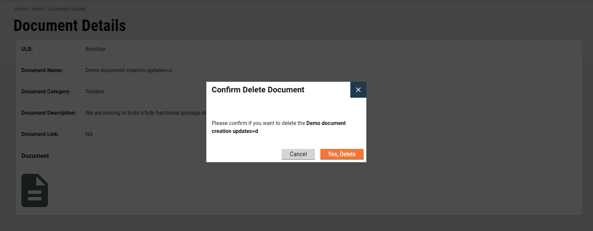

# Documents: Implementation Details

## **Document Inbox**

\- This page lists all created documents in reverse-chronological order with the latest created document appearing on the top and the first created one at the end. This table supports pagination and employees have the option to specify the list size for the page.\
\- Inbox has a search feature that helps employees quickly find documents based on selected **ULB**, **document name** and **posted by** fields.\
\- Inbox also has a filter option where employees can filter the documents based on categories.


### **API**&#x20;

```
curl 'https://qa.digit.org/egov-document-uploader/egov-du/document/_search?tenantIds=pb.amritsar&offset=0&limit=10&_=1636700541350' \
  -H 'authority: qa.digit.org' \
  -H 'sec-ch-ua: "Google Chrome";v="95", "Chromium";v="95", ";Not A Brand";v="99"' \
  -H 'accept: application/json, text/plain, */*' \
  -H 'content-type: application/json;charset=UTF-8' \
  -H 'sec-ch-ua-mobile: ?0' \
  -H 'user-agent: Mozilla/5.0 (Windows NT 10.0; Win64; x64) AppleWebKit/537.36 (KHTML, like Gecko) Chrome/95.0.4638.69 Safari/537.36' \
  -H 'sec-ch-ua-platform: "Windows"' \
  -H 'origin: https://qa.digit.org' \
  -H 'sec-fetch-site: same-origin' \
  -H 'sec-fetch-mode: cors' \
  -H 'sec-fetch-dest: empty' \
  -H 'referer: https://qa.digit.org/digit-ui/employee/engagement/documents/inbox' \
  -H 'accept-language: en-US,en;q=0.9' \
  --data-raw '{"RequestInfo":{"apiId":"Rainmaker","authToken":"d06ff5e6-8929-44f2-8ae7-b67883db1bce"}}' \
  --compressed
```

## **Create Document**

Employees can add new documents using the Add New Document button. A form gets rendered which can be used to fill in necessary details and upload documents if any or add links to document stored somewhere else.


### API

```
curl 'https://qa.digit.org/egov-document-uploader/egov-du/document/_create' \
  -H 'authority: qa.digit.org' \
  -H 'sec-ch-ua: "Google Chrome";v="95", "Chromium";v="95", ";Not A Brand";v="99"' \
  -H 'accept: application/json, text/plain, */*' \
  -H 'content-type: application/json;charset=UTF-8' \
  -H 'sec-ch-ua-mobile: ?0' \
  -H 'user-agent: Mozilla/5.0 (Windows NT 10.0; Win64; x64) AppleWebKit/537.36 (KHTML, like Gecko) Chrome/95.0.4638.69 Safari/537.36' \
  -H 'sec-ch-ua-platform: "Windows"' \
  -H 'origin: https://qa.digit.org' \
  -H 'sec-fetch-site: same-origin' \
  -H 'sec-fetch-mode: cors' \
  -H 'sec-fetch-dest: empty' \
  -H 'referer: https://qa.digit.org/digit-ui/employee/engagement/documents/response' \
  -H 'accept-language: en-US,en;q=0.9' \
  --data-raw '{"DocumentEntity":{"name":"Demo document creation","description":"We are looking to build a fully functional garbage disposal plant","category":"CATEGORY_TENDERS","documentLink":"","filestoreId":"fe264c03-76b3-49b8-ab78-81bfb95aee67","fileSize":460618,"fileType":"application/pdf","tenantIds":["pb.amritsar","pb.jalandhar"]},"RequestInfo":{"apiId":"Rainmaker","authToken":"d06ff5e6-8929-44f2-8ae7-b67883db1bce","userInfo":{"id":18397,"uuid":"cf209669-88e4-4da8-951b-a0173b3edcae","userName":"TRUPTI","name":"Trupti","mobileNumber":"8970064765","emailId":"","locale":null,"type":"EMPLOYEE","roles":[{"name":"HRMS Admin","code":"HRMS_ADMIN","tenantId":"pb.derabassi"},{"name":"NoC counter employee","code":"NOC_CEMP","tenantId":"pb.amritsar"},{"name":"PT Field Inspector","code":"PT_FIELD_INSPECTOR","tenantId":"pb.nawanshahr"},{"name":"State Administrator","code":"STADMIN","tenantId":"pb.jalandhar"},{"name":"TL Field Inspector","code":"TL_FIELD_INSPECTOR","tenantId":"pb.amritsar"},{"name":"FSM Employee Application Creator","code":"FSM_CREATOR_EMP","tenantId":"pb.jalandhar"},{"name":"FSM Administrator","code":"FSM_ADMIN","tenantId":"pb.phagwara"},{"name":"NoC Doc Verifier","code":"NOC_DOC_VERIFIER","tenantId":"pb.nawanshahr"},{"name":"Counter Employee","code":"CEMP","tenantId":"pb.amritsar"},{"name":"WS Counter Employee","code":"WS_CEMP","tenantId":"pb.amritsar"},{"name":"NoC Field Inpector","code":"NOC_FIELD_INSPECTOR","tenantId":"pb.jalandhar"},{"name":"WS Field Inspector","code":"WS_FIELD_INSPECTOR","tenantId":"pb.amritsar"},{"name":"PT Doc Verifier","code":"PT_DOC_VERIFIER","tenantId":"pb.jalandhar"},{"name":"FSM Administrator","code":"FSM_ADMIN","tenantId":"pb.amritsar"},{"name":"Employee","code":"EMPLOYEE","tenantId":"pb.jalandhar"},{"name":"WS Field Inspector","code":"WS_FIELD_INSPECTOR","tenantId":"pb.jalandhar"},{"name":"WS Clerk","code":"WS_CLERK","tenantId":"pb.jalandhar"},{"name":"PT Doc Verifier","code":"PT_DOC_VERIFIER","tenantId":"pb.nawanshahr"},{"name":"PT Counter Approver","code":"PT_APPROVER","tenantId":"pb.jalandhar"},{"name":"TL Admin","code":"TL_ADMIN","tenantId":"pb.nawanshahr"},{"name":"TL Creator","code":"TL_CREATOR","tenantId":"pb.amritsar"},{"name":"TL Counter Employee","code":"TL_CEMP","tenantId":"pb.jalandhar"},{"name":"TL Approver","code":"TL_APPROVER","tenantId":"pb.nawanshahr"},{"name":"PT Counter Employee","code":"PT_CEMP","tenantId":"pb.jalandhar"},{"name":"FSM Employee Dashboard Viewer","code":"FSM_DASHBOARD_VIEWER","tenantId":"pb"},{"name":"Collection Operator","code":"COLL_OPERATOR","tenantId":"pb.jalandhar"},{"name":"NoC Field Inpector","code":"NOC_FIELD_INSPECTOR","tenantId":"pb.amritsar"},{"name":"SW Counter Employee","code":"SW_CEMP","tenantId":"pb.amritsar"},{"name":"Grievance Officer","code":"GO","tenantId":"pb.amritsar"},{"name":"SW Clerk","code":"SW_CLERK","tenantId":"pb.amritsar"},{"name":"FSM Employee Application Creator","code":"FSM_CREATOR_EMP","tenantId":"pb.amritsar"},{"name":"FSM Employee Report Viewer","code":"FSM_REPORT_VIEWER","tenantId":"pb.amritsar"},{"name":"FSM Employee Report Viewer","code":"FSM_REPORT_VIEWER","tenantId":"pb"},{"name":"SW Document Verifier","code":"SW_DOC_VERIFIER","tenantId":"pb.amritsar"},{"name":"WS Approver","code":"WS_APPROVER","tenantId":"pb.jalandhar"},{"name":"TL Approver","code":"TL_APPROVER","tenantId":"pb.amritsar"},{"name":"NoC Doc Verifier","code":"NOC_DOC_VERIFIER","tenantId":"pb.jalandhar"},{"name":"Employee","code":"EMPLOYEE","tenantId":"pb.nawanshahr"},{"name":"HRMS Admin","code":"HRMS_ADMIN","tenantId":"pb.jalandhar"},{"name":"SW Field Inspector","code":"SW_FIELD_INSPECTOR","tenantId":"pb.amritsar"},{"name":"FSM Employee Application Creator","code":"FSM_CREATOR_EMP","tenantId":"pb.phagwara"},{"name":"Customer Support Representative","code":"CSR","tenantId":"pb.amritsar"},{"name":"HRMS Admin","code":"HRMS_ADMIN","tenantId":"pb.amritsar"},{"name":"TL Approver","code":"TL_APPROVER","tenantId":"pb.jalandhar"},{"name":"WS Approver","code":"WS_APPROVER","tenantId":"pb.amritsar"},{"name":"PT Counter Employee","code":"PT_CEMP","tenantId":"pb.nawanshahr"},{"name":"NoC counter employee","code":"NOC_CEMP","tenantId":"pb.nawanshahr"},{"name":"WS Document Verifier","code":"WS_DOC_VERIFIER","tenantId":"pb.jalandhar"},{"name":"TL Field Inspector","code":"TL_FIELD_INSPECTOR","tenantId":"pb.nawanshahr"},{"name":"Counter Employee","code":"CEMP","tenantId":"pb.nawanshahr"},{"name":"PT Counter Employee","code":"PT_CEMP","tenantId":"pb.amritsar"},{"name":"PT Field Inspector","code":"PT_FIELD_INSPECTOR","tenantId":"pb.amritsar"},{"name":"TL Creator","code":"TL_CREATOR","tenantId":"pb.nawanshahr"},{"name":"Customer Support Representative","code":"CSR","tenantId":"pb"},{"name":"Grievance Officer","code":"GO","tenantId":"pb.nawanshahr"},{"name":"PT Doc Verifier","code":"PT_DOC_VERIFIER","tenantId":"pb.amritsar"},{"name":"Employee","code":"EMPLOYEE","tenantId":"pb.amritsar"},{"name":"TL Counter Employee","code":"TL_CEMP","tenantId":"pb.amritsar"},{"name":"HRMS Admin","code":"HRMS_ADMIN","tenantId":"pb"},{"name":"FSM Administrator","code":"FSM_ADMIN","tenantId":"pb.nawanshahr"},{"name":"WS Counter Employee","code":"WS_CEMP","tenantId":"pb.jalandhar"},{"name":"TL Creator","code":"TL_CREATOR","tenantId":"pb.jalandhar"},{"name":"Super User","code":"SUPERUSER","tenantId":"pb"},{"name":"Universal Collection Employee","code":"UC_EMP","tenantId":"pb.amritsar"},{"name":"PT Field Inspector","code":"PT_FIELD_INSPECTOR","tenantId":"pb.jalandhar"},{"name":"State Administrator","code":"STADMIN","tenantId":"pb.amritsar"},{"name":"PT Counter Approver","code":"PT_APPROVER","tenantId":"pb.amritsar"},{"name":"TL Field Inspector","code":"TL_FIELD_INSPECTOR","tenantId":"pb.jalandhar"},{"name":"TL doc verifier","code":"TL_DOC_VERIFIER","tenantId":"pb.nawanshahr"},{"name":"WS Clerk","code":"WS_CLERK","tenantId":"pb.amritsar"},{"name":"Counter Employee","code":"CEMP","tenantId":"pb.jalandhar"},{"name":"NoC Doc Verifier","code":"NOC_DOC_VERIFIER","tenantId":"pb.amritsar"},{"name":"NoC counter employee","code":"NOC_CEMP","tenantId":"pb.jalandhar"},{"name":"WS Document Verifier","code":"WS_DOC_VERIFIER","tenantId":"pb.amritsar"},{"name":"Grievance Officer","code":"GO","tenantId":"pb.jalandhar"},{"name":"NoC Field Inpector","code":"NOC_FIELD_INSPECTOR","tenantId":"pb.nawanshahr"},{"name":"FSM Administrator","code":"FSM_ADMIN","tenantId":"pb.derabassi"},{"name":"Super User","code":"SUPERUSER","tenantId":"pb.nawanshahr"},{"name":"FSM Employee Application Creator","code":"FSM_CREATOR_EMP","tenantId":"pb.nawanshahr"},{"name":"FSM Administrator","code":"FSM_ADMIN","tenantId":"pb"},{"name":"State Administrator","code":"STADMIN","tenantId":"pb.nawanshahr"},{"name":"PT Counter Approver","code":"PT_APPROVER","tenantId":"pb.nawanshahr"},{"name":"Collection Operator","code":"COLL_OPERATOR","tenantId":"pb.amritsar"},{"name":"TL doc verifier","code":"TL_DOC_VERIFIER","tenantId":"pb.amritsar"},{"name":"FSM Administrator","code":"FSM_ADMIN","tenantId":"pb.jalandhar"},{"name":"TL Counter Employee","code":"TL_CEMP","tenantId":"pb.nawanshahr"},{"name":"TL Admin","code":"TL_ADMIN","tenantId":"pb.amritsar"},{"name":"Super User","code":"SUPERUSER","tenantId":"pb.jalandhar"},{"name":"Property Tax Collection Employee","code":"PT_COLLECTION_EMP","tenantId":"pb.amritsar"},{"name":"NoC counter Approver","code":"NOC_APPROVER","tenantId":"pb.amritsar"},{"name":"TL doc verifier","code":"TL_DOC_VERIFIER","tenantId":"pb.jalandhar"},{"name":"Collection Operator","code":"COLL_OPERATOR","tenantId":"pb.nawanshahr"},{"name":"Super User","code":"SUPERUSER","tenantId":"pb.amritsar"},{"name":"FSM Employee Dashboard Viewer","code":"FSM_DASHBOARD_VIEWER","tenantId":"pb.amritsar"},{"name":"Super User","code":"SUPERUSER","tenantId":"pb.derabassi"},{"name":"SW Approver","code":"SW_APPROVER","tenantId":"pb.amritsar"},{"name":"TL Admin","code":"TL_ADMIN","tenantId":"pb.jalandhar"}],"active":true,"tenantId":"pb.amritsar","permanentCity":null},"msgId":"string|en_IN"}}' \
  --compressed
```


## **Document Details Page**

This page provides complete information about the created document. By clicking on the name of any document employee gets navigated to the details page.

Here, employees can take action to edit or delete the document.


## **Edit Documents**

To make some changes in the listed document employees have to navigate to the Details page and then click on the Take Action button → Edit Document Details button. This redirects the user to the edit form where fields are pre-populated with previously entered details. Employees can edit and update the details accordingly.


### **API**&#x20;

```
curl 'https://qa.digit.org/egov-document-uploader/egov-du/document/_update' \
  -H 'authority: qa.digit.org' \
  -H 'sec-ch-ua: "Google Chrome";v="95", "Chromium";v="95", ";Not A Brand";v="99"' \
  -H 'accept: application/json, text/plain, */*' \
  -H 'content-type: application/json;charset=UTF-8' \
  -H 'sec-ch-ua-mobile: ?0' \
  -H 'user-agent: Mozilla/5.0 (Windows NT 10.0; Win64; x64) AppleWebKit/537.36 (KHTML, like Gecko) Chrome/95.0.4638.69 Safari/537.36' \
  -H 'sec-ch-ua-platform: "Windows"' \
  -H 'origin: https://qa.digit.org' \
  -H 'sec-fetch-site: same-origin' \
  -H 'sec-fetch-mode: cors' \
  -H 'sec-fetch-dest: empty' \
  -H 'referer: https://qa.digit.org/digit-ui/employee/engagement/documents/update-response' \
  -H 'accept-language: en-US,en;q=0.9' \
  --data-raw '{"DocumentEntity":{"tenantIds":null,"document":{"filestoreId":{"fileStoreId":"fe264c03-76b3-49b8-ab78-81bfb95aee67"},"documentLink":""},"postedBy":"Trupti","uuid":"DOC-2021-11-12-000194","name":"Demo document creation updates=d","category":"CATEGORY_TENDERS","description":"We are looking to build a fully functional garbage disposal plant. We are looking to get it done in next 3 years with aggressive pricing and 10 years warranty and maintenance.","filestoreId":"fe264c03-76b3-49b8-ab78-81bfb95aee67","documentLink":"","active":true,"auditDetails":{"createdBy":"cf209669-88e4-4da8-951b-a0173b3edcae","lastModifiedBy":"cf209669-88e4-4da8-951b-a0173b3edcae","createdTime":1636701323373,"lastModifiedTime":1636701323373},"tenantId":"pb.amritsar","fileType":"application/pdf","fileSize":460618},"RequestInfo":{"apiId":"Rainmaker","authToken":"d06ff5e6-8929-44f2-8ae7-b67883db1bce","userInfo":{"id":18397,"uuid":"cf209669-88e4-4da8-951b-a0173b3edcae","userName":"TRUPTI","name":"Trupti","mobileNumber":"8970064765","emailId":"","locale":null,"type":"EMPLOYEE","roles":[{"name":"HRMS Admin","code":"HRMS_ADMIN","tenantId":"pb.derabassi"},{"name":"NoC counter employee","code":"NOC_CEMP","tenantId":"pb.amritsar"},{"name":"PT Field Inspector","code":"PT_FIELD_INSPECTOR","tenantId":"pb.nawanshahr"},{"name":"State Administrator","code":"STADMIN","tenantId":"pb.jalandhar"},{"name":"TL Field Inspector","code":"TL_FIELD_INSPECTOR","tenantId":"pb.amritsar"},{"name":"FSM Employee Application Creator","code":"FSM_CREATOR_EMP","tenantId":"pb.jalandhar"},{"name":"FSM Administrator","code":"FSM_ADMIN","tenantId":"pb.phagwara"},{"name":"NoC Doc Verifier","code":"NOC_DOC_VERIFIER","tenantId":"pb.nawanshahr"},{"name":"Counter Employee","code":"CEMP","tenantId":"pb.amritsar"},{"name":"WS Counter Employee","code":"WS_CEMP","tenantId":"pb.amritsar"},{"name":"NoC Field Inpector","code":"NOC_FIELD_INSPECTOR","tenantId":"pb.jalandhar"},{"name":"WS Field Inspector","code":"WS_FIELD_INSPECTOR","tenantId":"pb.amritsar"},{"name":"PT Doc Verifier","code":"PT_DOC_VERIFIER","tenantId":"pb.jalandhar"},{"name":"FSM Administrator","code":"FSM_ADMIN","tenantId":"pb.amritsar"},{"name":"Employee","code":"EMPLOYEE","tenantId":"pb.jalandhar"},{"name":"WS Field Inspector","code":"WS_FIELD_INSPECTOR","tenantId":"pb.jalandhar"},{"name":"WS Clerk","code":"WS_CLERK","tenantId":"pb.jalandhar"},{"name":"PT Doc Verifier","code":"PT_DOC_VERIFIER","tenantId":"pb.nawanshahr"},{"name":"PT Counter Approver","code":"PT_APPROVER","tenantId":"pb.jalandhar"},{"name":"TL Admin","code":"TL_ADMIN","tenantId":"pb.nawanshahr"},{"name":"TL Creator","code":"TL_CREATOR","tenantId":"pb.amritsar"},{"name":"TL Counter Employee","code":"TL_CEMP","tenantId":"pb.jalandhar"},{"name":"TL Approver","code":"TL_APPROVER","tenantId":"pb.nawanshahr"},{"name":"PT Counter Employee","code":"PT_CEMP","tenantId":"pb.jalandhar"},{"name":"FSM Employee Dashboard Viewer","code":"FSM_DASHBOARD_VIEWER","tenantId":"pb"},{"name":"Collection Operator","code":"COLL_OPERATOR","tenantId":"pb.jalandhar"},{"name":"NoC Field Inpector","code":"NOC_FIELD_INSPECTOR","tenantId":"pb.amritsar"},{"name":"SW Counter Employee","code":"SW_CEMP","tenantId":"pb.amritsar"},{"name":"Grievance Officer","code":"GO","tenantId":"pb.amritsar"},{"name":"SW Clerk","code":"SW_CLERK","tenantId":"pb.amritsar"},{"name":"FSM Employee Application Creator","code":"FSM_CREATOR_EMP","tenantId":"pb.amritsar"},{"name":"FSM Employee Report Viewer","code":"FSM_REPORT_VIEWER","tenantId":"pb.amritsar"},{"name":"FSM Employee Report Viewer","code":"FSM_REPORT_VIEWER","tenantId":"pb"},{"name":"SW Document Verifier","code":"SW_DOC_VERIFIER","tenantId":"pb.amritsar"},{"name":"WS Approver","code":"WS_APPROVER","tenantId":"pb.jalandhar"},{"name":"TL Approver","code":"TL_APPROVER","tenantId":"pb.amritsar"},{"name":"NoC Doc Verifier","code":"NOC_DOC_VERIFIER","tenantId":"pb.jalandhar"},{"name":"Employee","code":"EMPLOYEE","tenantId":"pb.nawanshahr"},{"name":"HRMS Admin","code":"HRMS_ADMIN","tenantId":"pb.jalandhar"},{"name":"SW Field Inspector","code":"SW_FIELD_INSPECTOR","tenantId":"pb.amritsar"},{"name":"FSM Employee Application Creator","code":"FSM_CREATOR_EMP","tenantId":"pb.phagwara"},{"name":"Customer Support Representative","code":"CSR","tenantId":"pb.amritsar"},{"name":"HRMS Admin","code":"HRMS_ADMIN","tenantId":"pb.amritsar"},{"name":"TL Approver","code":"TL_APPROVER","tenantId":"pb.jalandhar"},{"name":"WS Approver","code":"WS_APPROVER","tenantId":"pb.amritsar"},{"name":"PT Counter Employee","code":"PT_CEMP","tenantId":"pb.nawanshahr"},{"name":"NoC counter employee","code":"NOC_CEMP","tenantId":"pb.nawanshahr"},{"name":"WS Document Verifier","code":"WS_DOC_VERIFIER","tenantId":"pb.jalandhar"},{"name":"TL Field Inspector","code":"TL_FIELD_INSPECTOR","tenantId":"pb.nawanshahr"},{"name":"Counter Employee","code":"CEMP","tenantId":"pb.nawanshahr"},{"name":"PT Counter Employee","code":"PT_CEMP","tenantId":"pb.amritsar"},{"name":"PT Field Inspector","code":"PT_FIELD_INSPECTOR","tenantId":"pb.amritsar"},{"name":"TL Creator","code":"TL_CREATOR","tenantId":"pb.nawanshahr"},{"name":"Customer Support Representative","code":"CSR","tenantId":"pb"},{"name":"Grievance Officer","code":"GO","tenantId":"pb.nawanshahr"},{"name":"PT Doc Verifier","code":"PT_DOC_VERIFIER","tenantId":"pb.amritsar"},{"name":"Employee","code":"EMPLOYEE","tenantId":"pb.amritsar"},{"name":"TL Counter Employee","code":"TL_CEMP","tenantId":"pb.amritsar"},{"name":"HRMS Admin","code":"HRMS_ADMIN","tenantId":"pb"},{"name":"FSM Administrator","code":"FSM_ADMIN","tenantId":"pb.nawanshahr"},{"name":"WS Counter Employee","code":"WS_CEMP","tenantId":"pb.jalandhar"},{"name":"TL Creator","code":"TL_CREATOR","tenantId":"pb.jalandhar"},{"name":"Super User","code":"SUPERUSER","tenantId":"pb"},{"name":"Universal Collection Employee","code":"UC_EMP","tenantId":"pb.amritsar"},{"name":"PT Field Inspector","code":"PT_FIELD_INSPECTOR","tenantId":"pb.jalandhar"},{"name":"State Administrator","code":"STADMIN","tenantId":"pb.amritsar"},{"name":"PT Counter Approver","code":"PT_APPROVER","tenantId":"pb.amritsar"},{"name":"TL Field Inspector","code":"TL_FIELD_INSPECTOR","tenantId":"pb.jalandhar"},{"name":"TL doc verifier","code":"TL_DOC_VERIFIER","tenantId":"pb.nawanshahr"},{"name":"WS Clerk","code":"WS_CLERK","tenantId":"pb.amritsar"},{"name":"Counter Employee","code":"CEMP","tenantId":"pb.jalandhar"},{"name":"NoC Doc Verifier","code":"NOC_DOC_VERIFIER","tenantId":"pb.amritsar"},{"name":"NoC counter employee","code":"NOC_CEMP","tenantId":"pb.jalandhar"},{"name":"WS Document Verifier","code":"WS_DOC_VERIFIER","tenantId":"pb.amritsar"},{"name":"Grievance Officer","code":"GO","tenantId":"pb.jalandhar"},{"name":"NoC Field Inpector","code":"NOC_FIELD_INSPECTOR","tenantId":"pb.nawanshahr"},{"name":"FSM Administrator","code":"FSM_ADMIN","tenantId":"pb.derabassi"},{"name":"Super User","code":"SUPERUSER","tenantId":"pb.nawanshahr"},{"name":"FSM Employee Application Creator","code":"FSM_CREATOR_EMP","tenantId":"pb.nawanshahr"},{"name":"FSM Administrator","code":"FSM_ADMIN","tenantId":"pb"},{"name":"State Administrator","code":"STADMIN","tenantId":"pb.nawanshahr"},{"name":"PT Counter Approver","code":"PT_APPROVER","tenantId":"pb.nawanshahr"},{"name":"Collection Operator","code":"COLL_OPERATOR","tenantId":"pb.amritsar"},{"name":"TL doc verifier","code":"TL_DOC_VERIFIER","tenantId":"pb.amritsar"},{"name":"FSM Administrator","code":"FSM_ADMIN","tenantId":"pb.jalandhar"},{"name":"TL Counter Employee","code":"TL_CEMP","tenantId":"pb.nawanshahr"},{"name":"TL Admin","code":"TL_ADMIN","tenantId":"pb.amritsar"},{"name":"Super User","code":"SUPERUSER","tenantId":"pb.jalandhar"},{"name":"Property Tax Collection Employee","code":"PT_COLLECTION_EMP","tenantId":"pb.amritsar"},{"name":"NoC counter Approver","code":"NOC_APPROVER","tenantId":"pb.amritsar"},{"name":"TL doc verifier","code":"TL_DOC_VERIFIER","tenantId":"pb.jalandhar"},{"name":"Collection Operator","code":"COLL_OPERATOR","tenantId":"pb.nawanshahr"},{"name":"Super User","code":"SUPERUSER","tenantId":"pb.amritsar"},{"name":"FSM Employee Dashboard Viewer","code":"FSM_DASHBOARD_VIEWER","tenantId":"pb.amritsar"},{"name":"Super User","code":"SUPERUSER","tenantId":"pb.derabassi"},{"name":"SW Approver","code":"SW_APPROVER","tenantId":"pb.amritsar"},{"name":"TL Admin","code":"TL_ADMIN","tenantId":"pb.jalandhar"}],"active":true,"tenantId":"pb.amritsar","permanentCity":null}}}' \
  --compressed


```


## **Delete Documents**

Employees can remove documents from the listing by navigating to the inbox → selecting the document → moving to the document details page → clicking on the take action button and then the Delete option. A prompt screen asks for confirmation of the action and on selecting Yes Delete the selected document is deleted.\





## **Citizen Screens**

Citizens can view all uploaded documents in the `information & updated section` of the Home Page. Here, all the categories are listed and also enables search by document title. Selecting any category fetches all the documents for the selected category.


Citizens can view, open or download the uploaded documents or the link.

### API

```
curl 'https://qa.digit.org/egov-document-uploader/egov-du/document/_search?category=CATEGORY_CITIZEN_CHARTER&tenantIds=pb.amritsar&limit=20&_=1636703966939' \
  -H 'authority: qa.digit.org' \
  -H 'sec-ch-ua: "Google Chrome";v="95", "Chromium";v="95", ";Not A Brand";v="99"' \
  -H 'accept: application/json, text/plain, */*' \
  -H 'content-type: application/json;charset=UTF-8' \
  -H 'sec-ch-ua-mobile: ?0' \
  -H 'user-agent: Mozilla/5.0 (Windows NT 10.0; Win64; x64) AppleWebKit/537.36 (KHTML, like Gecko) Chrome/95.0.4638.69 Safari/537.36' \
  -H 'sec-ch-ua-platform: "Windows"' \
  -H 'origin: https://qa.digit.org' \
  -H 'sec-fetch-site: same-origin' \
  -H 'sec-fetch-mode: cors' \
  -H 'sec-fetch-dest: empty' \
  -H 'referer: https://qa.digit.org/digit-ui/citizen/engagement/documents/list/CATEGORY_CITIZEN_CHARTER/27' \
  -H 'accept-language: en-US,en;q=0.9' \
  --data-raw '{"RequestInfo":{"apiId":"Rainmaker","authToken":"d35fb020-9e4a-43ce-81ef-45a8803b5b88"}}' \
  --compressed
```

## **MDMS Data**

MDMS contains and fetches the static data like forms config and Document Categories.\
MDMS KEYS: API + `"DocumentUploader", ["UlbLevelCategories"]`


## **Localization**

Localization keys are added under the ‘_rainmaker-common_’ locale module. In future, if any new labels are implemented in the Trade License (Citizen) these should also be pushed to the locale DB under _rainmaker-tl_ locale module. Below is an example of a few locale labels.


## **API Call Role Action Mapping**

| [**S.No**](http://s.no/)**.** | <p><strong>API</strong></p><p> </p> | **Action id** | **Roles**             |
| ----------------------------- | ----------------------------------- | ------------- | --------------------- |
| 1                             | `/egov-mdms-service/v1/_search`     | `954`         | `CITIZEN`             |
| 2                             | `/egov-document-uploader`           | `1685`        | `EMPLOYEE`            |
| 3                             | `/filestore/v1/files/url`           | `1528`        | `CITIZEN`, `EMPLOYEE` |
| 7                             | `/localization/messages/v1/_search` | `1531`        | `CITIZEN`, `EMPLOYEE` |

\


> [_​_](http://creativecommons.org/licenses/by/4.0/)_All content on this page by_ [_eGov Foundation_](https://egov.org.in/) _is licensed under a_ [_Creative Commons Attribution 4.0 International License_](http://creativecommons.org/licenses/by/4.0/)_._
