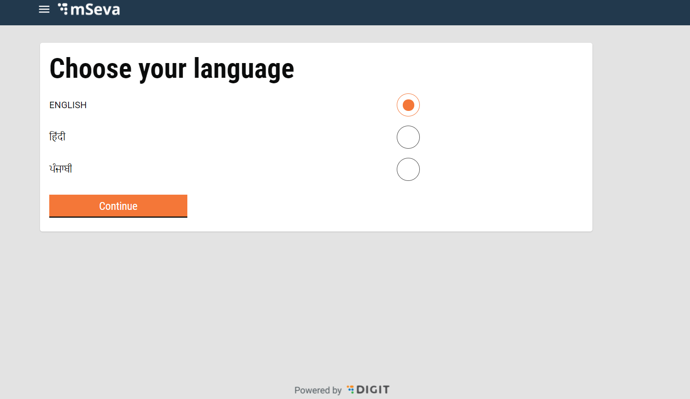
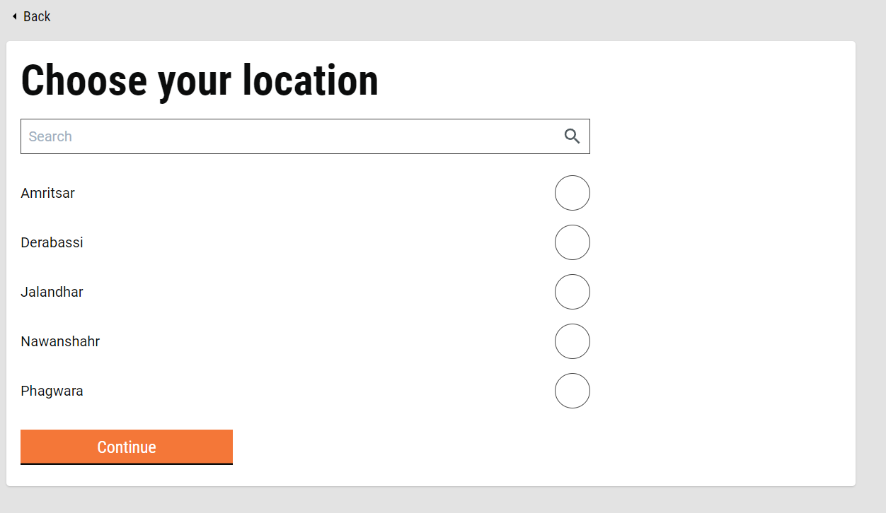
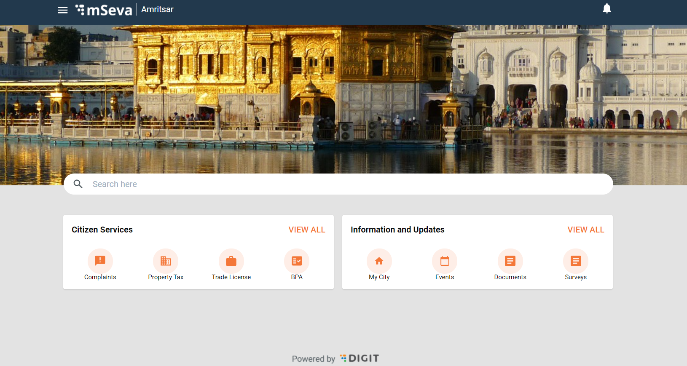
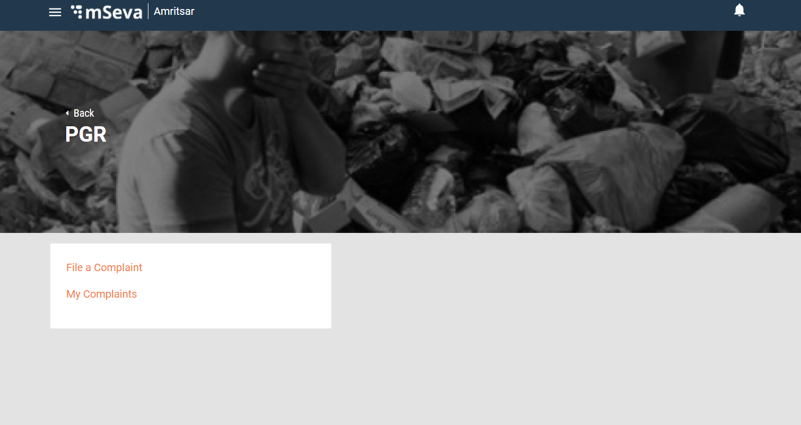
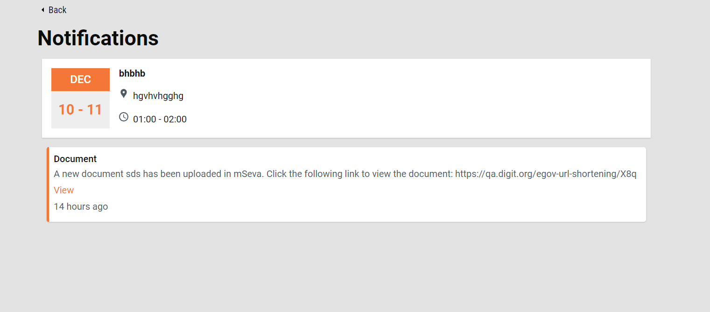
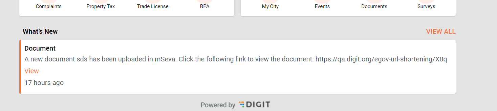
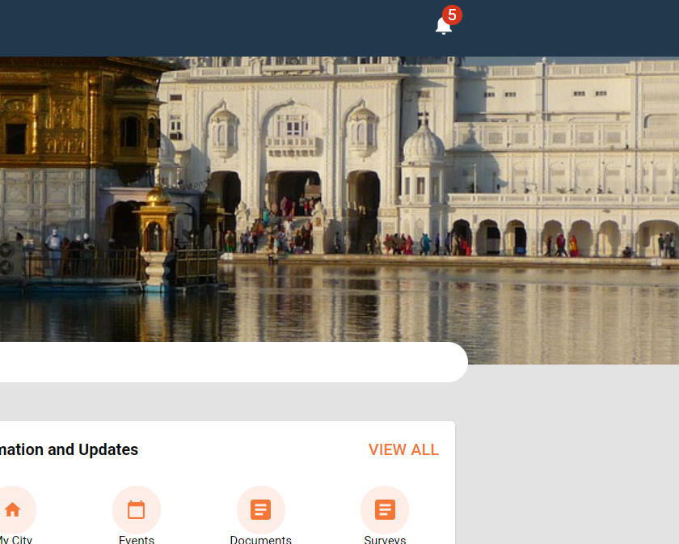

# Citizen Flow

Notifications and Citizen Home Screen are part of the core module.

Screen Flow for the Citizen Home









## Notifications <a href="#notifications" id="notifications"></a>

The Notifications screen is a part of the user engagement module and shows all the active events, messages and broadcast messages.



* For Event notifications, we are using `OnGroundEventCard` component
* For What's new notification, we are using `WhatsNewCard` component
* For Broadcast messages, we are using `BroadcastWhatsNewCard` component

All these screens are accessible without logging in.

cURL for notification API -

```
curl 'https://qa.digit.org/egov-user-event/v1/events/_search?tenantId=pb.amritsar&_=1639123598630' \
  -H 'Connection: keep-alive' \
  -H 'sec-ch-ua: " Not A;Brand";v="99", "Chromium";v="96", "Google Chrome";v="96"' \
  -H 'Accept: application/json, text/plain, */*' \
  -H 'DNT: 1' \
  -H 'Content-Type: application/json;charset=UTF-8' \
  -H 'sec-ch-ua-mobile: ?0' \
  -H 'User-Agent: Mozilla/5.0 (Windows NT 10.0; Win64; x64) AppleWebKit/537.36 (KHTML, like Gecko) Chrome/96.0.4664.93 Safari/537.36' \
  -H 'sec-ch-ua-platform: "Windows"' \
  -H 'Origin: https://qa.digit.org' \
  -H 'Sec-Fetch-Site: same-origin' \
  -H 'Sec-Fetch-Mode: cors' \
  -H 'Sec-Fetch-Dest: empty' \
  -H 'Referer: https://qa.digit.org/digit-ui/citizen/engagement/notifications' \
  -H 'Accept-Language: en-US,en;q=0.9,hi;q=0.8' \
  --data-raw '{"RequestInfo":{"apiId":"Rainmaker","authToken":null}}' \
  --compressed

```

However, after logging in notification count becomes available to use and the system displays the unread notification count as a ticker on the notification icon.





Notification count cURL -

```
curl 'https://qa.digit.org/egov-user-event/v1/events/notifications/_count?tenantId=pb.amritsar&_=1639124556487' \
  -H 'Connection: keep-alive' \
  -H 'sec-ch-ua: " Not A;Brand";v="99", "Chromium";v="96", "Google Chrome";v="96"' \
  -H 'Accept: application/json, text/plain, */*' \
  -H 'DNT: 1' \
  -H 'Content-Type: application/json;charset=UTF-8' \
  -H 'sec-ch-ua-mobile: ?0' \
  -H 'User-Agent: Mozilla/5.0 (Windows NT 10.0; Win64; x64) AppleWebKit/537.36 (KHTML, like Gecko) Chrome/96.0.4664.93 Safari/537.36' \
  -H 'sec-ch-ua-platform: "Windows"' \
  -H 'Origin: https://qa.digit.org' \
  -H 'Sec-Fetch-Site: same-origin' \
  -H 'Sec-Fetch-Mode: cors' \
  -H 'Sec-Fetch-Dest: empty' \
  -H 'Referer: https://qa.digit.org/digit-ui/citizen' \
  -H 'Accept-Language: en-US,en;q=0.9,hi;q=0.8' \
  --data-raw '{"RequestInfo":{"apiId":"Rainmaker","authToken":"307ae48a-d684-4bf3-b109-9d2d2926e81b"}}' \
  --compressed

```

Notification count update cURL -

```
curl 'https://qa.digit.org/egov-user-event/v1/events/lat/_update?tenantId=pb.amritsar&_=1639124605545' \
  -H 'Connection: keep-alive' \
  -H 'sec-ch-ua: " Not A;Brand";v="99", "Chromium";v="96", "Google Chrome";v="96"' \
  -H 'Accept: application/json, text/plain, */*' \
  -H 'DNT: 1' \
  -H 'Content-Type: application/json;charset=UTF-8' \
  -H 'sec-ch-ua-mobile: ?0' \
  -H 'User-Agent: Mozilla/5.0 (Windows NT 10.0; Win64; x64) AppleWebKit/537.36 (KHTML, like Gecko) Chrome/96.0.4664.93 Safari/537.36' \
  -H 'sec-ch-ua-platform: "Windows"' \
  -H 'Origin: https://qa.digit.org' \
  -H 'Sec-Fetch-Site: same-origin' \
  -H 'Sec-Fetch-Mode: cors' \
  -H 'Sec-Fetch-Dest: empty' \
  -H 'Referer: https://qa.digit.org/digit-ui/citizen/engagement/notifications' \
  -H 'Accept-Language: en-US,en;q=0.9,hi;q=0.8' \
  --data-raw '{"RequestInfo":{"apiId":"Rainmaker","authToken":"307ae48a-d684-4bf3-b109-9d2d2926e81b"}}' \
  --compressed

```

## Events <a href="#events" id="events"></a>

Events are also a part of the Engagement module. Only active events are displayed on the events list page.

Events API cURL -

```
curl 'https://qa.digit.org/egov-user-event/v1/events/_search?tenantId=pb.amritsar&eventTypes=EVENTSONGROUND&_=1639134376115' \
  -H 'Connection: keep-alive' \
  -H 'sec-ch-ua: " Not A;Brand";v="99", "Chromium";v="96", "Google Chrome";v="96"' \
  -H 'Accept: application/json, text/plain, */*' \
  -H 'DNT: 1' \
  -H 'Content-Type: application/json;charset=UTF-8' \
  -H 'sec-ch-ua-mobile: ?0' \
  -H 'User-Agent: Mozilla/5.0 (Windows NT 10.0; Win64; x64) AppleWebKit/537.36 (KHTML, like Gecko) Chrome/96.0.4664.93 Safari/537.36' \
  -H 'sec-ch-ua-platform: "Windows"' \
  -H 'Origin: https://qa.digit.org' \
  -H 'Sec-Fetch-Site: same-origin' \
  -H 'Sec-Fetch-Mode: cors' \
  -H 'Sec-Fetch-Dest: empty' \
  -H 'Referer: https://qa.digit.org/digit-ui/citizen/engagement/events/details/b29e70c7-284f-489e-982e-67806245779c' \
  -H 'Accept-Language: en-US,en;q=0.9,hi;q=0.8' \
  --data-raw '{"RequestInfo":{"apiId":"Rainmaker","authToken":"307ae48a-d684-4bf3-b109-9d2d2926e81b"}}' \
  --compressed

```

&#x20;

> [_​_](http://creativecommons.org/licenses/by/4.0/)_All content on this page by_ [_eGov Foundation_](https://egov.org.in/) _is licensed under a_ [_Creative Commons Attribution 4.0 International License_](http://creativecommons.org/licenses/by/4.0/)_._
