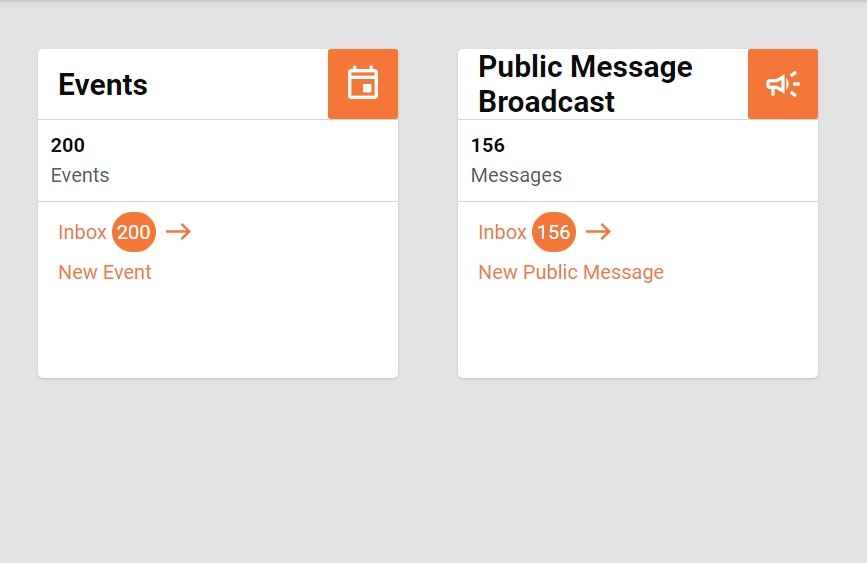
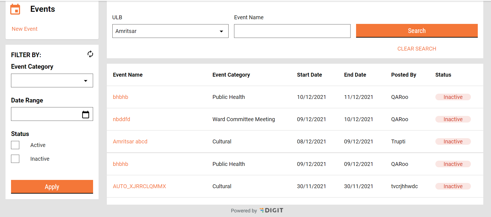
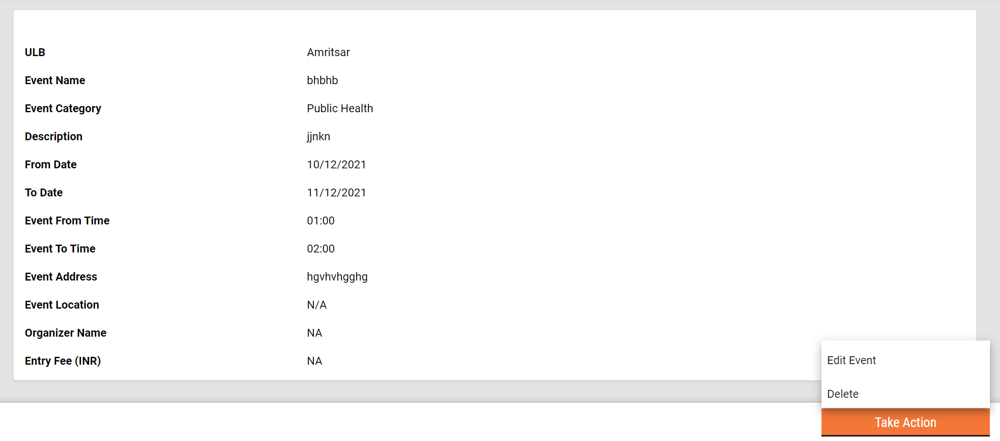
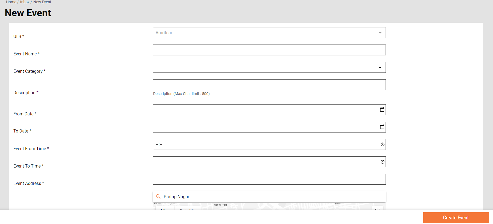
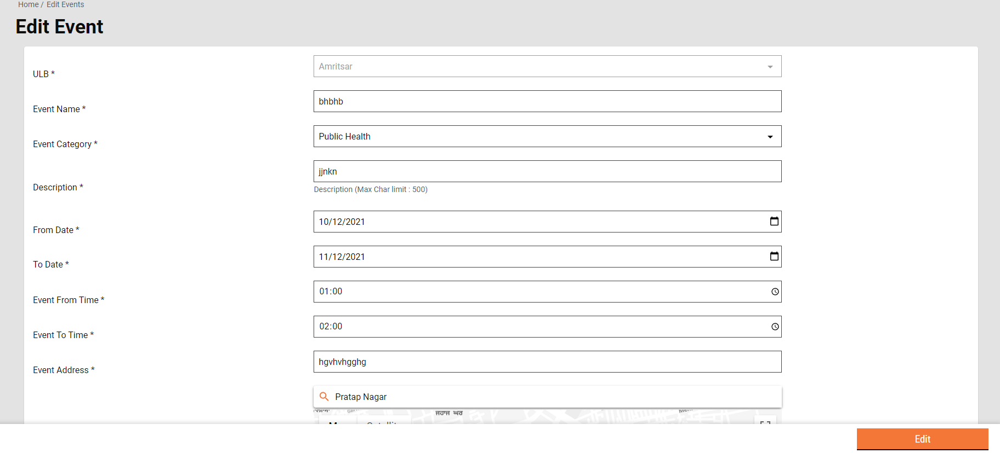

# Employee Flow - Events

## Screen Flow











## User Permissions <a href="#user-permissions" id="user-permissions"></a>

Employee users with user roles including “`EMPLOYEE ADMIN`" or “`EMPLOYEE`" have access to the event actions.

## Event CRUD API cURLS  <a href="#event-crud-api-curls" id="event-crud-api-curls"></a>

### Search / Inbox API

```
curl 'https://qa.digit.org/egov-user-event/v1/events/_search?tenantId=pb.amritsar&eventTypes=EVENTSONGROUND&limit=10&offset=0&_=1639367436102' \
  -H 'Connection: keep-alive' \
  -H 'sec-ch-ua: " Not A;Brand";v="99", "Chromium";v="96", "Google Chrome";v="96"' \
  -H 'Accept: application/json, text/plain, */*' \
  -H 'DNT: 1' \
  -H 'Content-Type: application/json;charset=UTF-8' \
  -H 'sec-ch-ua-mobile: ?0' \
  -H 'User-Agent: Mozilla/5.0 (Windows NT 10.0; Win64; x64) AppleWebKit/537.36 (KHTML, like Gecko) Chrome/96.0.4664.93 Safari/537.36' \
  -H 'sec-ch-ua-platform: "Windows"' \
  -H 'Origin: https://qa.digit.org' \
  -H 'Sec-Fetch-Site: same-origin' \
  -H 'Sec-Fetch-Mode: cors' \
  -H 'Sec-Fetch-Dest: empty' \
  -H 'Referer: https://qa.digit.org/digit-ui/employee/engagement/event/inbox' \
  -H 'Accept-Language: en-US,en;q=0.9,hi;q=0.8' \
  --data-raw '{"RequestInfo":{"apiId":"Rainmaker"}}' \
  --compressed

```

### Create API

```
curl 'https://qa.digit.org/egov-user-event/v1/events/_create?_=1639367625957' \
  -H 'Connection: keep-alive' \
  -H 'sec-ch-ua: " Not A;Brand";v="99", "Chromium";v="96", "Google Chrome";v="96"' \
  -H 'Accept: application/json, text/plain, */*' \
  -H 'DNT: 1' \
  -H 'Content-Type: application/json;charset=UTF-8' \
  -H 'sec-ch-ua-mobile: ?0' \
  -H 'User-Agent: Mozilla/5.0 (Windows NT 10.0; Win64; x64) AppleWebKit/537.36 (KHTML, like Gecko) Chrome/96.0.4664.93 Safari/537.36' \
  -H 'sec-ch-ua-platform: "Windows"' \
  -H 'Origin: https://qa.digit.org' \
  -H 'Sec-Fetch-Site: same-origin' \
  -H 'Sec-Fetch-Mode: cors' \
  -H 'Sec-Fetch-Dest: empty' \
  -H 'Referer: https://qa.digit.org/digit-ui/employee/engagement/event/response' \
  -H 'Accept-Language: en-US,en;q=0.9,hi;q=0.8' \
  --data-raw '{"events":[{"source":"WEBAPP","eventType":"EVENTSONGROUND","tenantId":"pb.amritsar","description":"Be safe bro","name":"HEY","eventcategory":"PUBLICHEALTH","eventDetails":{"fromDate":1639453920000,"toDate":1640505480000,"fromTime":"09:22","toTime":"13:28","address":"moon ","organizer":"SOMEONE","fees":"1000","longitude":74.8978579,"latitude":31.6160638}}],"RequestInfo":{"apiId":"Rainmaker","authToken":"df875063-9b4e-4fc7-bad6-f80844a6b4ed"}}' \
  --compressed
```

### Update API

```
curl 'https://qa.digit.org/egov-user-event/v1/events/_update?_=1639367667570' \
  -H 'Connection: keep-alive' \
  -H 'sec-ch-ua: " Not A;Brand";v="99", "Chromium";v="96", "Google Chrome";v="96"' \
  -H 'Accept: application/json, text/plain, */*' \
  -H 'DNT: 1' \
  -H 'Content-Type: application/json;charset=UTF-8' \
  -H 'sec-ch-ua-mobile: ?0' \
  -H 'User-Agent: Mozilla/5.0 (Windows NT 10.0; Win64; x64) AppleWebKit/537.36 (KHTML, like Gecko) Chrome/96.0.4664.93 Safari/537.36' \
  -H 'sec-ch-ua-platform: "Windows"' \
  -H 'Origin: https://qa.digit.org' \
  -H 'Sec-Fetch-Site: same-origin' \
  -H 'Sec-Fetch-Mode: cors' \
  -H 'Sec-Fetch-Dest: empty' \
  -H 'Referer: https://qa.digit.org/digit-ui/employee/engagement/event/response?update=true' \
  -H 'Accept-Language: en-US,en;q=0.9,hi;q=0.8' \
  --data-raw '{"events":[{"tenantId":"pb.amritsar","id":"671036f4-671e-41be-b04d-ed330e545747","referenceId":null,"eventType":"EVENTSONGROUND","eventCategory":"PUBLICHEALTH","name":"HEY","description":"Be safe bro","status":"ACTIVE","source":"WEBAPP","postedBy":"d0710c4c-728a-446d-bc7e-d4614efe1463","recepient":null,"actions":null,"eventDetails":{"id":"ce296daf-0409-4f6d-a24c-406eeafcbbd9","eventId":"671036f4-671e-41be-b04d-ed330e545747","organizer":"SOMEONE","fromDate":1639453920000,"toDate":1640505480000,"latitude":31.6160638,"longitude":74.8978579,"address":"moon ","documents":null,"fees":"200","fromTime":"09:22","toTime":"13:28"},"auditDetails":{"createdBy":"d0710c4c-728a-446d-bc7e-d4614efe1463","createdTime":1639367627529,"lastModifiedBy":"d0710c4c-728a-446d-bc7e-d4614efe1463","lastModifiedTime":1639367627529},"recepientEventMap":null,"generateCounterEvent":null,"internallyUpdted":null,"user":{"id":12074,"userName":"QAADMIN","salutation":null,"name":"FSM Admin","gender":"MALE","mobileNumber":"9966999999","emailId":null,"altContactNumber":null,"pan":null,"aadhaarNumber":null,"permanentAddress":null,"permanentCity":null,"permanentPinCode":null,"correspondenceAddress":null,"correspondenceCity":null,"correspondencePinCode":null,"alternatemobilenumber":null,"active":true,"locale":null,"type":"EMPLOYEE","accountLocked":false,"accountLockedDate":0,"fatherOrHusbandName":"Test","relationship":"FATHER","signature":null,"bloodGroup":null,"photo":null,"identificationMark":null,"createdBy":12011,"lastModifiedBy":1,"tenantId":"pb.amritsar","roles":[{"code":"FSM_VIEW_EMP","name":"FSM Employee Application Viewer","tenantId":"pb.amritsar"},{"code":"FSM_ADMIN","name":"FSM Administrator","tenantId":"pb.amritsar"},{"code":"EMPLOYEE","name":"Employee","tenantId":"pb.amritsar"},{"code":"FSM_REPORT_VIEWER","name":"FSM Employee Report Viewer","tenantId":"pb.amritsar"},{"code":"STADMIN","name":"State Administrator","tenantId":"pb.amritsar"},{"code":"EMPLOYEE ADMIN","name":null,"tenantId":"pb.amritsar"},{"code":"FSM_DASHBOARD_VIEWER","name":"FSM Employee Dashboard Viewer","tenantId":"pb.amritsar"}],"uuid":"d0710c4c-728a-446d-bc7e-d4614efe1463","createdDate":"15-02-2021 14:41:32","lastModifiedDate":"06-04-2021 14:58:43","dob":"1990-09-09","pwdExpiryDate":"16-05-2021 14:41:32"},"eventcategory":"PUBLICHEALTH"}],"RequestInfo":{"apiId":"Rainmaker","authToken":"df875063-9b4e-4fc7-bad6-f80844a6b4ed"}}' \
  --compressed
```


> [_​_](http://creativecommons.org/licenses/by/4.0/)_All content on this page by_ [_eGov Foundation_](https://egov.org.in/) _is licensed under a_ [_Creative Commons Attribution 4.0 International License_](http://creativecommons.org/licenses/by/4.0/)_._
