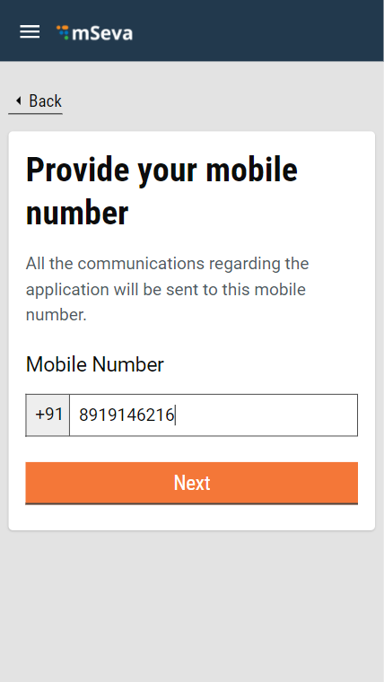
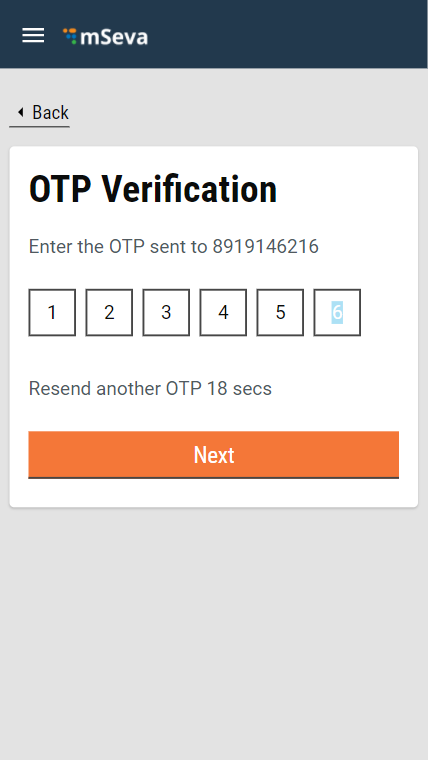
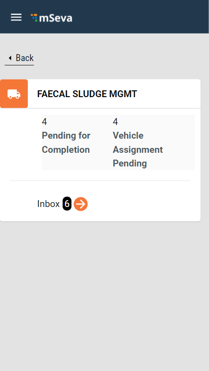
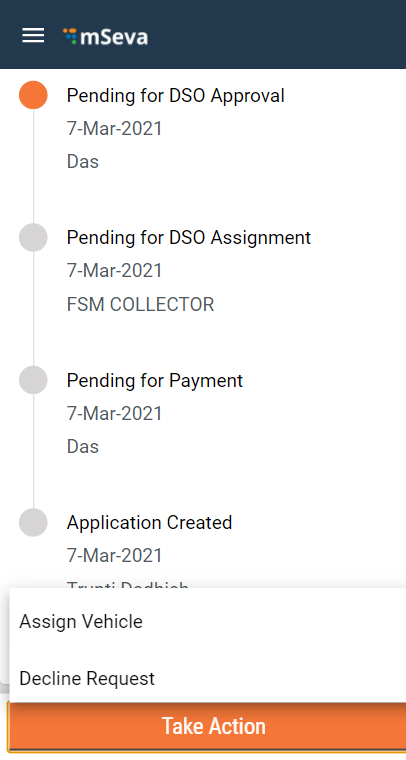
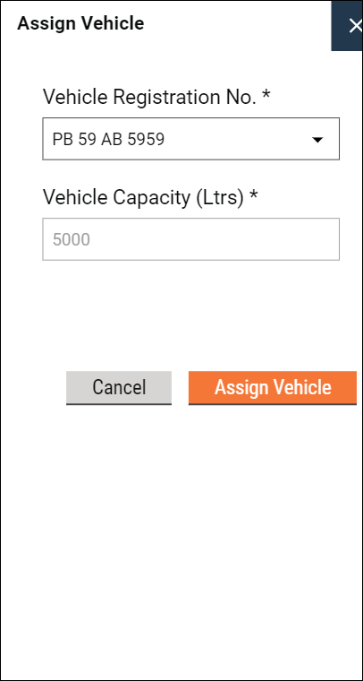
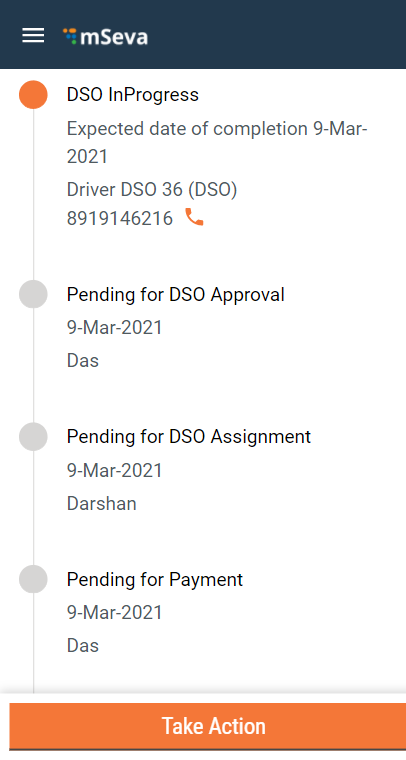
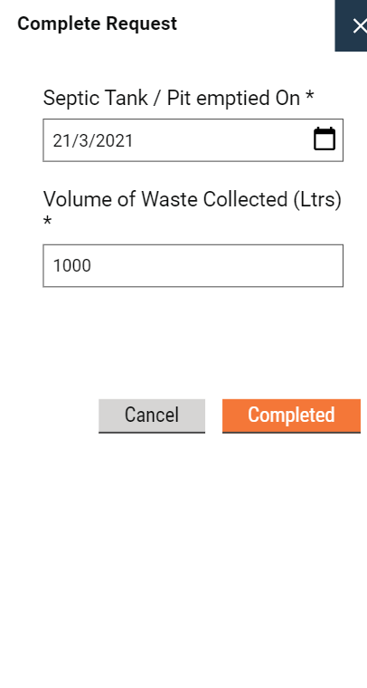
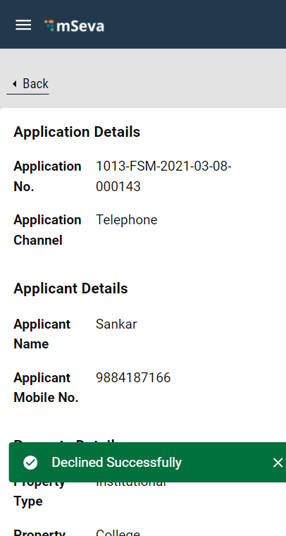

# DSO User Manual

The Desludging Operators or DSOs are responsible for initiating and completing action on the citizen requests for desludging services. The requests are routed to the respective DSOs by the ULB officials. The DSOs update the application status once the services are delivered and payments collected.

DSOs can -

* Assign vehicles for desludging services
* Decline service requests
* Complete service requests

### Assign Vehicles

.png>)

Click on **DSO Login**.

Enter the registered **Mobile Number**.

Enter the **OTP** received on the registered mobile number.

The DSO Inbox displays the list of applications pending for action. Click on the arrow icon to view the applications.

.png>)

Applications with **Status as Pending DSO Approval** requires the DSO to initiate action. DSOs can either **Assign Vehicle** to complete the service request or **Decline Request** in case the service request cannot be fulfilled for some reason.

Scroll down the application page and click on **Take Action** button. Click on **Assign Vehicle**.

Select and enter the **Vehicle Registration No.** The **Vehicle Capacity (Ltrs)** field is auto populated depending on the selected vehicle. Click on **Assign Vehicle.** The vehicle is assigned successfully to the listed service request.

The application status changes to **DSO InProgress**.

### Complete Request

.png>)

Click on the **Take Action** button and click on **Complete Request**.

The **Septic Tank / Pit emptied On** field assumes the current date by default. Change the date if required.

The **Volume of Waste Collected (Ltrs)** field displays the vehicle capacity value by default. Change if required.

.png>)

The request is completed successfully.

### Decline Request

.png>)

Click on the **Take Action** button and then click on **Decline Request**.

.png>)

Select and enter the applicable **Reason for Declining.** Enter any **Comments** to validate the request decline. Click on **Decline Request** button.

The service request is Declined Successfully.

All content on this page by [eGov Foundation ](https://egov.org.in/)is licensed under a [Creative Commons Attribution 4.0 International License](http://creativecommons.org/licenses/by/4.0/).
